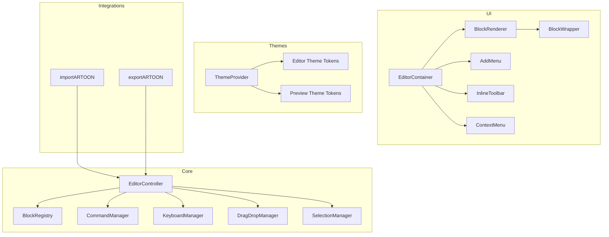
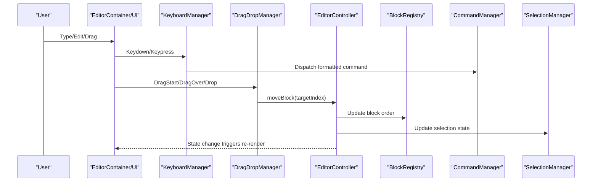
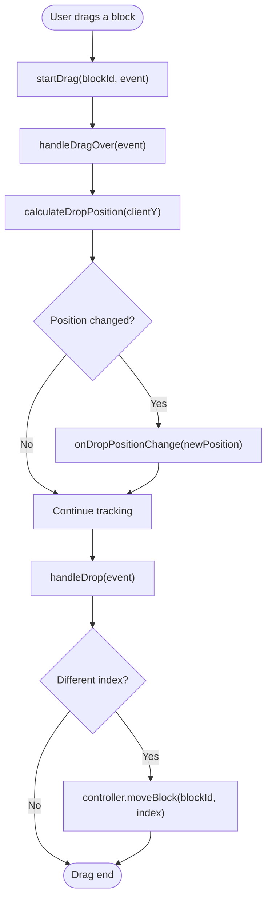
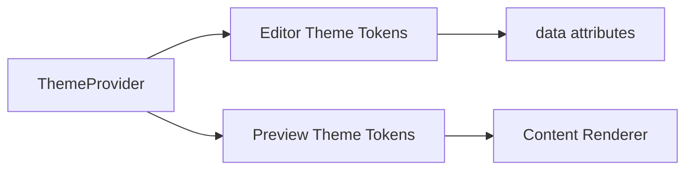
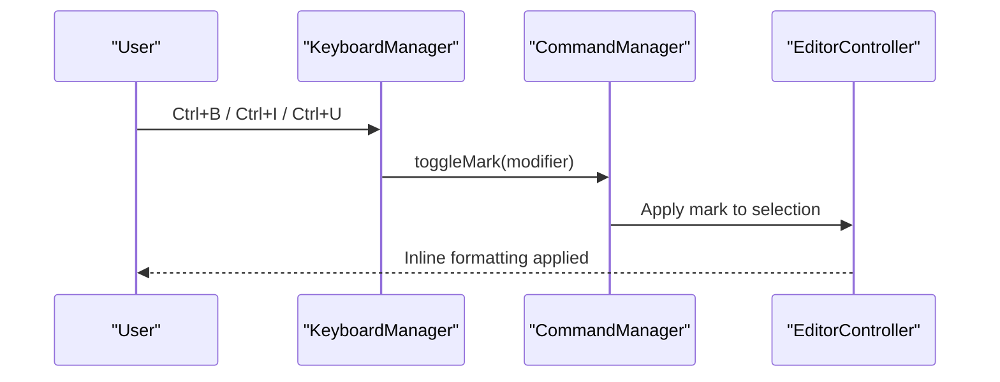
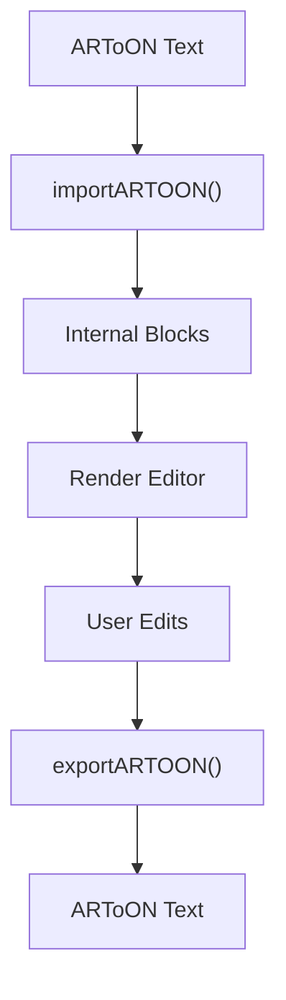
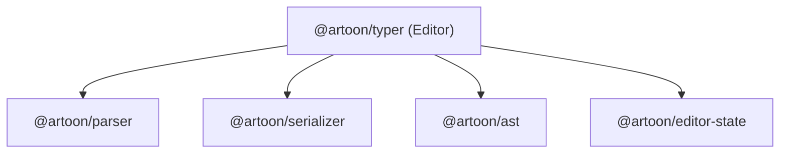

# Editor User Guide

<cite>
**Referenced Files in This Document**
- [README.md](file://artoon-typer/README.md)
- [00-INDEX.md](file://docs/00-INDEX.md)
- [01-OVERVIEW.md](file://docs/01-OVERVIEW.md)
- [02-QUICKSTART.md](file://docs/02-QUICKSTART.md)
- [03-SYNTAX-REFERENCE.md](file://docs/03-SYNTAX-REFERENCE.md)
- [05-DEVELOPER-GUIDE.md](file://docs/05-DEVELOPER-GUIDE.md)
- [definitions.ts](file://artoon-typer/src/blocks/definitions.ts)
- [index.ts](file://artoon-typer/src/core/index.ts)
- [KeyboardManager.ts](file://artoon-typer/src/core/KeyboardManager.ts)
- [DragDropManager.ts](file://artoon-typer/src/core/DragDropManager.ts)
- [SelectionManager.ts](file://artoon-typer/src/core/SelectionManager.ts)
- [index.ts](file://artoon-typer/src/ui/components/index.ts)
- [ThemeProvider.tsx](file://artoon-typer/src/themes/ThemeProvider.tsx)
- [index.ts](file://artoon-typer/src/themes/index.ts)
- [01-EDITOR-CAPABILITIES.md](file://EDITOR-UI-DEVELOPMENT-PLAN/dev-docs/01-EDITOR-CAPABILITIES.md)
- [02-SYSTEM-DATA-FLOW.md](file://EDITOR-UI-DEVELOPMENT-PLAN/dev-docs/02-SYSTEM-DATA-FLOW.md)
- [03-EDITOR-CAPABILITIES.md](file://EDITOR-UI-DEVELOPMENT-PLAN/dev-docs/03-EDITOR-CAPABILITIES.md)
- [04-ERROR-HANDLING-VALIDATION.md](file://EDITOR-UI-DEVELOPMENT-PLAN/dev-docs/04-ERROR-HANDLING-VALIDATION.md)
- [05-BLOCK-CONVERSION-MATRIX.md](file://EDITOR-UI-DEVELOPMENT-PLAN/dev-docs/05-BLOCK-CONVERSION-MATRIX.md)
- [06-KEYBOARD-COMMANDS.md](file://EDITOR-UI-DEVELOPMENT-PLAN/dev-docs/06-KEYBOARD-COMMANDS.md)
- [07-TESTING-PATTERNS.md](file://EDITOR-UI-DEVELOPMENT-PLAN/dev-docs/07-TESTING-PATTERNS.md)
- [README.md](file://artoon-typer/docs/PREVIEW-GUIDE.md)
- [00-INDEX.md](file://PROFESSIONAL-EDITOR-PLAN/00-INDEX.md)
- [DUAL-THEME-IMPLEMENTATION.md](file://PROFESSIONAL-EDITOR-PLAN/DUAL-THEME-IMPLEMENTATION.md)
- [README.md](file://artoon-typer/vanilla/index.html)
- [sample.artoon](file://artoon-typer/vanilla/demo/sample.artoon)
- [README.md](file://artoon-typer/README.md)
- [00-INDEX.md](file://docs/00-INDEX.md)
- [01-OVERVIEW.md](file://docs/01-OVERVIEW.md)
- [02-QUICKSTART.md](file://docs/02-QUICKSTART.md)
- [03-SYNTAX-REFERENCE.md](file://docs/03-SYNTAX-REFERENCE.md)
- [05-DEVELOPER-GUIDE.md](file://docs/05-DEVELOPER-GUIDE.md)
- [00-INDEX.md](file://docs/00-INDEX.md)
- [01-OVERVIEW.md](file://docs/01-OVERVIEW.md)
- [02-QUICKSTART.md](file://docs/02-QUICKSTART.md)
- [03-SYNTAX-REFERENCE.md](file://docs/03-SYNTAX-REFERENCE.md)
- [05-DEVELOPER-GUIDE.md](file://docs/05-DEVELOPER-GUIDE.md)
</cite>

## Table of Contents
1. [Introduction](#introduction)
2. [Project Structure](#project-structure)
3. [Core Components](#core-components)
4. [Architecture Overview](#architecture-overview)
5. [Detailed Component Analysis](#detailed-component-analysis)
6. [Dependency Analysis](#dependency-analysis)
7. [Performance Considerations](#performance-considerations)
8. [Troubleshooting Guide](#troubleshooting-guide)
9. [Conclusion](#conclusion)
10. [Appendices](#appendices)

## Introduction
AROON Typer is a block-based visual editor for the ARTOON markup language. It provides a WYSIWYG-like editing experience with native RTL support, a rich block palette, drag-and-drop reordering, live preview, and a dual-theme system (editor and preview). This guide explains the block types, inline formatting, keyboard shortcuts, navigation patterns, dual themes, and practical workflows for importing/exporting documents and collaborating with others.

## Project Structure
The editor is organized into cohesive modules:
- Core editing logic: EditorController, BlockRegistry, CommandManager, KeyboardManager, DragDropManager, SelectionManager
- UI components: EditorContainer, BlockRenderer, BlockWrapper, AddMenu, InlineToolbar, ContextMenu
- Themes: Dual theme system with editor themes (light/dark) and preview themes (minimal/blog/documentation/academic)
- Integrations: Import/Export APIs for ARTOON documents
- Developer docs: Capabilities, data flow, keyboard commands, testing patterns

**Diagram sources**
- [index.ts:12-31](file://artoon-typer/src/core/index.ts#L12-L31)
- [index.ts:7-23](file://artoon-typer/src/ui/components/index.ts#L7-L23)
- [ThemeProvider.tsx:106-250](file://artoon-typer/src/themes/ThemeProvider.tsx#L106-L250)
- [README.md:47-57](file://artoon-typer/README.md#L47-L57)

**Section sources**
- [README.md:1-219](file://artoon-typer/README.md#L1-L219)
- [00-INDEX.md:1-236](file://docs/00-INDEX.md#L1-L236)

## Core Components
- Block definitions: Built-in blocks (text, lists, media, advanced, compound) with categories, icons, and conversion rules
- Keyboard shortcuts: Formatting, navigation, block operations, and history
- Drag-and-drop: Reorder blocks via mouse/touch with visual feedback
- Selection manager: Accurate caret positioning and selection tracking
- Theme provider: Dual theme system for editor UI and preview content
- Import/Export: ARTOON parsing and serialization

**Section sources**
- [definitions.ts:35-589](file://artoon-typer/src/blocks/definitions.ts#L35-L589)
- [KeyboardManager.ts:167-341](file://artoon-typer/src/core/KeyboardManager.ts#L167-L341)
- [DragDropManager.ts:53-327](file://artoon-typer/src/core/DragDropManager.ts#L53-L327)
- [SelectionManager.ts:15-322](file://artoon-typer/src/core/SelectionManager.ts#L15-L322)
- [ThemeProvider.tsx:106-250](file://artoon-typer/src/themes/ThemeProvider.tsx#L106-L250)
- [README.md:47-57](file://artoon-typer/README.md#L47-L57)

## Architecture Overview
The editor’s runtime integrates core logic with UI components and theme management. The data flow moves from user actions (keyboard, drag, clicks) to commands, which update the editor state and trigger re-renders. Preview themes are applied independently for content rendering.

**Diagram sources**
- [KeyboardManager.ts:133-162](file://artoon-typer/src/core/KeyboardManager.ts#L133-L162)
- [DragDropManager.ts:101-194](file://artoon-typer/src/core/DragDropManager.ts#L101-L194)
- [index.ts:13-26](file://artoon-typer/src/core/index.ts#L13-L26)

**Section sources**
- [02-SYSTEM-DATA-FLOW.md](file://EDITOR-UI-DEVELOPMENT-PLAN/dev-docs/02-SYSTEM-DATA-FLOW.md)
- [03-EDITOR-CAPABILITIES.md](file://EDITOR-UI-DEVELOPMENT-PLAN/dev-docs/03-EDITOR-CAPABILITIES.md)

## Detailed Component Analysis

### Block-Based Editing Interface
- Block categories: Text (paragraphs, headings, quotes, preformatted, line break, word break), Lists (bullet, numbered, definition), Media (image, video, audio, file, link-block), Advanced (code, table, divider, details, time, abbreviation, meta), and Compound (figure).
- Block creation and conversion: Each block definition includes a factory, category, icon, and supported conversions to other block types.
- Directionality: Most blocks default to RTL; code blocks default to LTR.

```mermaid
classDiagram
class BlockDefinition {
+string type
+string name
+string nameAr
+string description
+string icon
+string category
+create() Block
+string[] canConvertTo
}
class TextBlock {
+string id
+string type
+string direction
+InlineContent[] content
}
class ListBlock {
+string id
+string type
+string direction
+ListItem[] items
}
class MediaBlock {
+string id
+string type
+string direction
+string src
+string alt
}
class CodeBlock {
+string id
+string type
+string direction
+string language
+string code
}
class TableBlock {
+string id
+string type
+string direction
+TableRow[] rows
+boolean hasHeader
}
class DividerBlock {
+string id
+string type
+string direction
}
class PreformattedBlock {
+string id
+string type
+string direction
+string content
}
class LineBreakBlock {
+string id
+string type
+string direction
}
class DefinitionListBlock {
+string id
+string type
+string direction
+DefinitionItem[] items
}
class FigureBlock {
+string id
+string type
+string direction
+string mediaType
+string src
+string alt
+InlineContent[] caption
}
class FileBlock {
+string id
+string type
+string direction
+string src
+string label
}
class DetailsBlock {
+string id
+string type
+string direction
+InlineContent[] summary
+InlineContent[] content
+boolean isOpen
}
class TimeBlock {
+string id
+string type
+string direction
+string datetime
+string displayText
}
class AbbrBlock {
+string id
+string type
+string direction
+string abbr
+string title
}
class MetaBlock {
+string id
+string type
+string direction
+MetaField[] fields
}
class LinkBlock {
+string id
+string type
+string direction
+string url
+string text
+Modifier[] modifiers
}
class CustomBlock {
+string id
+string type
+string direction
+string name
+Block[] children
+Record~string,string~ fields
}
class WordBreakBlock {
+string id
+string type
+string direction
}
BlockDefinition --> TextBlock : "creates"
BlockDefinition --> ListBlock : "creates"
BlockDefinition --> MediaBlock : "creates"
BlockDefinition --> CodeBlock : "creates"
BlockDefinition --> TableBlock : "creates"
BlockDefinition --> DividerBlock : "creates"
BlockDefinition --> PreformattedBlock : "creates"
BlockDefinition --> LineBreakBlock : "creates"
BlockDefinition --> DefinitionListBlock : "creates"
BlockDefinition --> FigureBlock : "creates"
BlockDefinition --> FileBlock : "creates"
BlockDefinition --> DetailsBlock : "creates"
BlockDefinition --> TimeBlock : "creates"
BlockDefinition --> AbbrBlock : "creates"
BlockDefinition --> MetaBlock : "creates"
BlockDefinition --> LinkBlock : "creates"
BlockDefinition --> CustomBlock : "creates"
BlockDefinition --> WordBreakBlock : "creates"
```

**Diagram sources**
- [definitions.ts:35-589](file://artoon-typer/src/blocks/definitions.ts#L35-L589)

**Section sources**
- [definitions.ts:35-589](file://artoon-typer/src/blocks/definitions.ts#L35-L589)
- [03-SYNTAX-REFERENCE.md:20-310](file://docs/03-SYNTAX-REFERENCE.md#L20-L310)

### Drag-and-Drop Reordering
- Initiates on block drag gestures (mouse/touch), calculates drop position based on pointer location, and moves blocks to the computed index.
- Provides visual feedback during drag and applies the move upon drop.

**Diagram sources**
- [DragDropManager.ts:101-194](file://artoon-typer/src/core/DragDropManager.ts#L101-L194)
- [DragDropManager.ts:221-242](file://artoon-typer/src/core/DragDropManager.ts#L221-L242)

**Section sources**
- [DragDropManager.ts:53-327](file://artoon-typer/src/core/DragDropManager.ts#L53-L327)

### Real-Time Preview and Dual Theme System
- Editor theme: Light/dark modes for the editor UI, with system preference detection and persistence.
- Preview theme: Separate content presentation themes (minimal, blog, documentation, academic) applied to rendered content.
- Theme provider exposes hooks to toggle editor theme and select preview theme.

**Diagram sources**
- [ThemeProvider.tsx:106-250](file://artoon-typer/src/themes/ThemeProvider.tsx#L106-L250)
- [index.ts:9-39](file://artoon-typer/src/themes/index.ts#L9-L39)

**Section sources**
- [ThemeProvider.tsx:106-250](file://artoon-typer/src/themes/ThemeProvider.tsx#L106-L250)
- [index.ts:9-39](file://artoon-typer/src/themes/index.ts#L9-L39)
- [DUAL-THEME-IMPLEMENTATION.md](file://PROFESSIONAL-EDITOR-PLAN/DUAL-THEME-IMPLEMENTATION.md)

### Inline Formatting and Block Operations
- Inline marks: Bold, italic, underline, strikethrough, highlight, subscript, superscript.
- Block operations: Split/merge blocks, duplicate, move up/down, convert block types, undo/redo.
- Selection management: Accurate caret placement and selection tracking across nested content.

**Diagram sources**
- [KeyboardManager.ts:167-341](file://artoon-typer/src/core/KeyboardManager.ts#L167-L341)
- [SelectionManager.ts:21-64](file://artoon-typer/src/core/SelectionManager.ts#L21-L64)

**Section sources**
- [KeyboardManager.ts:167-341](file://artoon-typer/src/core/KeyboardManager.ts#L167-L341)
- [SelectionManager.ts:15-322](file://artoon-typer/src/core/SelectionManager.ts#L15-L322)

### Import/Export Workflows
- Import ARTOON: Parse ARTOON text into internal blocks.
- Export ARTOON: Serialize internal blocks back to ARTOON text.
- Example usage and quickstart steps are documented in the project docs.

**Diagram sources**
- [README.md:47-57](file://artoon-typer/README.md#L47-L57)
- [02-QUICKSTART.md:44-74](file://docs/02-QUICKSTART.md#L44-L74)

**Section sources**
- [README.md:47-57](file://artoon-typer/README.md#L47-L57)
- [02-QUICKSTART.md:44-74](file://docs/02-QUICKSTART.md#L44-L74)

### Collaborative Editing Patterns
- Undo/redo stack supports collaborative sessions.
- Use shared state adapters and transactional updates to synchronize edits across clients.
- Version control friendly due to structured ARTOON format.

**Section sources**
- [README.md:9-11](file://artoon-typer/README.md#L9-L11)
- [04-ERROR-HANDLING-VALIDATION.md](file://EDITOR-UI-DEVELOPMENT-PLAN/dev-docs/04-ERROR-HANDLING-VALIDATION.md)

## Dependency Analysis
- Editor depends on parser, serializer, AST, and editor-state packages for robust round-tripping and state management.
- UI components depend on theme provider and core managers for behavior and styling.

**Diagram sources**
- [README.md:209-215](file://artoon-typer/README.md#L209-L215)

**Section sources**
- [README.md:209-215](file://artoon-typer/README.md#L209-L215)

## Performance Considerations
- Prefer incremental updates and shallow comparisons to minimize re-renders.
- Debounce heavy operations (e.g., live previews) to avoid excessive recomputation.
- Use virtualization for long documents to limit DOM nodes.
- Persist user preferences (themes, storage keys) to reduce initialization overhead.

[No sources needed since this section provides general guidance]

## Troubleshooting Guide
- Keyboard shortcuts not working:
  - Verify KeyboardManager is enabled and shortcuts are not disabled.
  - Confirm context checks match current selection/block state.
- Drag-and-drop not triggering:
  - Ensure container element exists and block elements have proper data attributes.
  - Check that drop position calculation finds block elements.
- Selection issues:
  - Use SelectionManager to query/set selections; confirm block boundaries and nested content.
- Theme not applying:
  - Confirm ThemeProvider wraps the editor and CSS variables are injected.
  - Check system preference listener and local storage keys.

**Section sources**
- [KeyboardManager.ts:133-162](file://artoon-typer/src/core/KeyboardManager.ts#L133-L162)
- [DragDropManager.ts:221-242](file://artoon-typer/src/core/DragDropManager.ts#L221-L242)
- [SelectionManager.ts:21-64](file://artoon-typer/src/core/SelectionManager.ts#L21-L64)
- [ThemeProvider.tsx:207-216](file://artoon-typer/src/themes/ThemeProvider.tsx#L207-L216)

## Conclusion
AROON Typer delivers a powerful, extensible block-based editor with native RTL support, rich block types, inline formatting, and a dual-theme system. Its modular architecture enables easy integration, testing, and customization for diverse content authoring needs.

[No sources needed since this section summarizes without analyzing specific files]

## Appendices

### Quick Start and Syntax Reference
- Start quickly with installation, building, and running the editor locally.
- Learn the ARTOON syntax for text, separators, lists, tables, media, compound blocks, and inline semantics.

**Section sources**
- [02-QUICKSTART.md:1-136](file://docs/02-QUICKSTART.md#L1-L136)
- [03-SYNTAX-REFERENCE.md:1-310](file://docs/03-SYNTAX-REFERENCE.md#L1-L310)

### Keyboard Shortcuts Reference
- Formatting: Ctrl+B/I/U and more
- Navigation: Enter, Backspace, Escape
- Block operations: Ctrl+D, Ctrl+Shift+↑/↓, Ctrl+Alt+1..3/0
- History: Ctrl+Z/Y

**Section sources**
- [06-KEYBOARD-COMMANDS.md](file://EDITOR-UI-DEVELOPMENT-PLAN/dev-docs/06-KEYBOARD-COMMANDS.md)
- [README.md:146-157](file://artoon-typer/README.md#L146-L157)

### UI Components Index
- EditorContainer, BlockRenderer, BlockWrapper, AddMenu, InlineToolbar, ContextMenu

**Section sources**
- [index.ts:7-23](file://artoon-typer/src/ui/components/index.ts#L7-L23)

### Vanilla Demo and Samples
- Explore the vanilla demo and sample ARTOON files to see the editor in action.

**Section sources**
- [README.md](file://artoon-typer/vanilla/index.html)
- [sample.artoon](file://artoon-typer/vanilla/demo/sample.artoon)