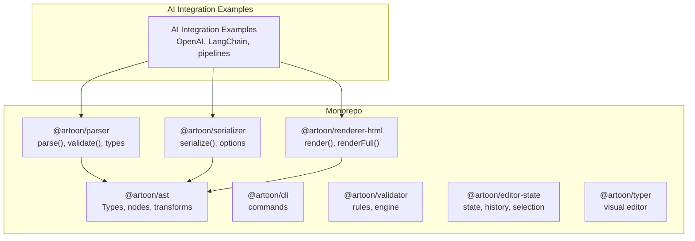
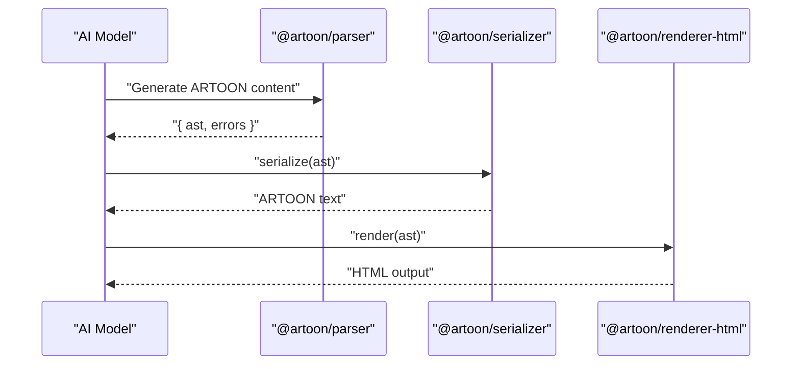
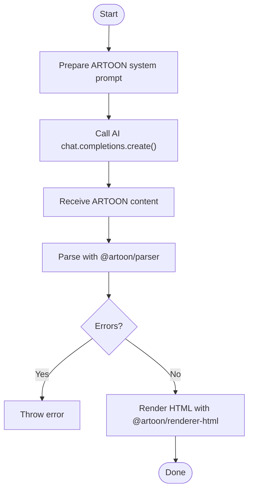
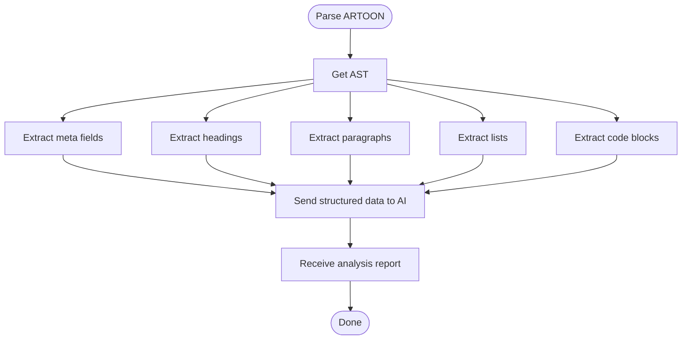
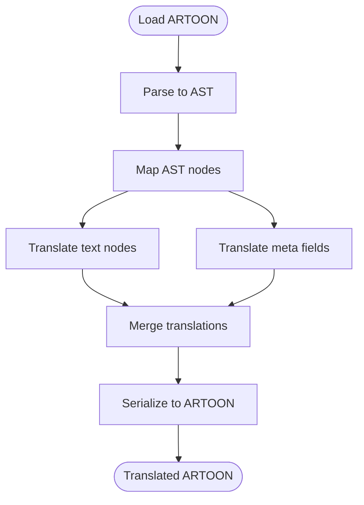
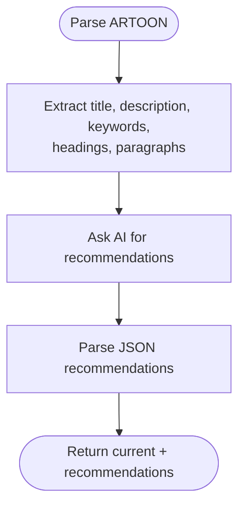
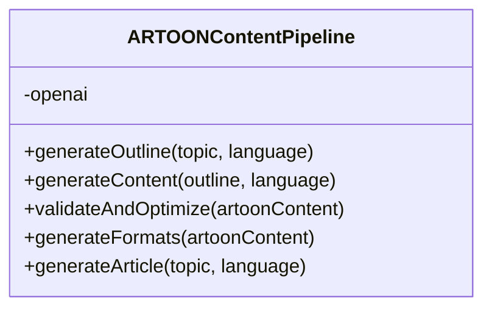
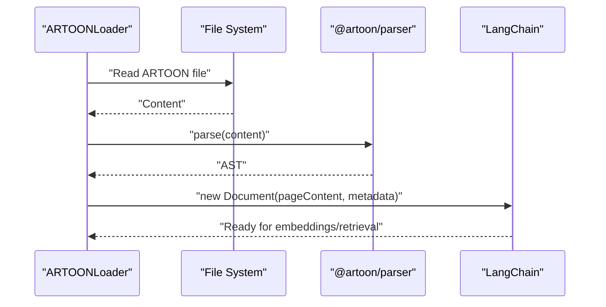
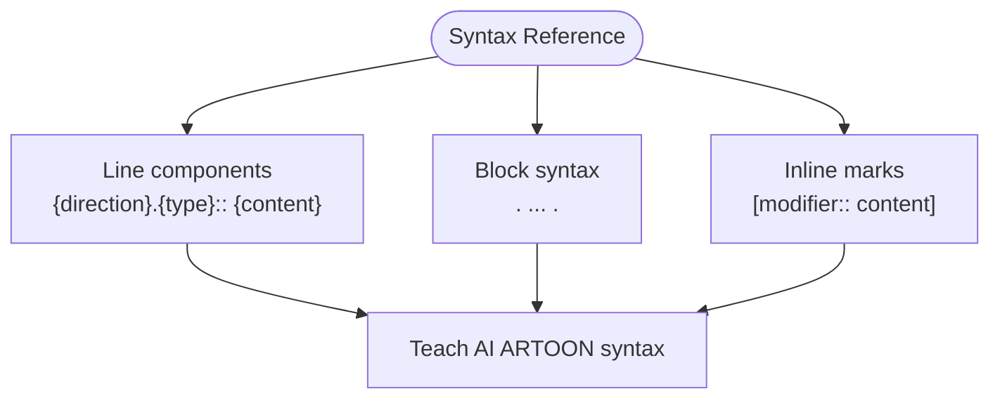
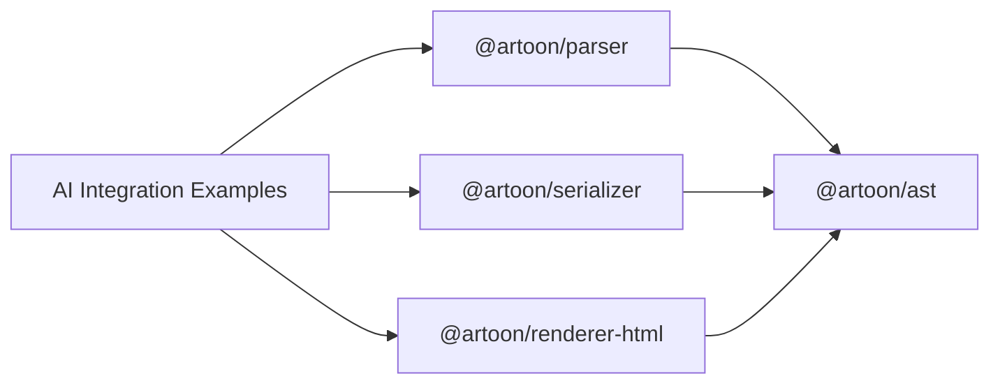

# AI Integration Examples

<cite>
**Referenced Files in This Document**
- [README.md](file://README.md)
- [AI-INTEGRATION-EXAMPLES.md](file://AI-INTEGRATION-EXAMPLES.md)
- [package.json](file://package.json)
- [artoon-ast/src/index.ts](file://artoon-ast/src/index.ts)
- [artoon-ast/src/types.ts](file://artoon-ast/src/types.ts)
- [artoon-parser/src/index.ts](file://artoon-parser/src/index.ts)
- [artoon-parser/src/types.ts](file://artoon-parser/src/types.ts)
- [artoon-serializer/src/index.ts](file://artoon-serializer/src/index.ts)
- [artoon-renderer-html/src/index.ts](file://artoon-renderer-html/src/index.ts)
- [Core Invariants/SYNTAX-REFERENCE.md](file://Core%20Invariants/SYNTAX-REFERENCE.md)
- [artoon-examples/README.md](file://artoon-examples/README.md)
- [artoon-examples/complete-syntax-showcase.artoon](file://artoon-examples/complete-syntax-showcase.artoon)
</cite>

## Table of Contents
1. [Introduction](#introduction)
2. [Project Structure](#project-structure)
3. [Core Components](#core-components)
4. [Architecture Overview](#architecture-overview)
5. [Detailed Component Analysis](#detailed-component-analysis)
6. [Dependency Analysis](#dependency-analysis)
7. [Performance Considerations](#performance-considerations)
8. [Troubleshooting Guide](#troubleshooting-guide)
9. [Conclusion](#conclusion)
10. [Appendices](#appendices)

## Introduction
This document presents practical, working examples of integrating ARTOON 2.0 with AI systems, focusing on real-world workflows for content generation, analysis, translation, SEO optimization, and multi-format export. It demonstrates how ARTOON’s structured, unambiguous syntax enables reliable AI generation and robust post-processing pipelines. The examples show integration patterns with leading AI platforms and orchestrate ARTOON’s core packages to parse, validate, transform, and render content.

## Project Structure
The ARTOON monorepo organizes functionality into focused packages:
- Parser: converts ARTOON text into a canonical AST and validates syntax.
- Serializer: converts AST back to ARTOON text with configurable options.
- Renderer (HTML): renders AST to HTML for previews and web delivery.
- AST: shared types and utilities for nodes, transforms, and migration.
- CLI, Validator, Editor-State, Typer: complementary tooling for development and integration.

**Diagram sources**
- [package.json:6-15](file://package.json#L6-L15)
- [README.md:77-88](file://README.md#L77-L88)

**Section sources**
- [README.md:19-24](file://README.md#L19-L24)
- [package.json:6-15](file://package.json#L6-L15)

## Core Components
- Parser: Provides parse(), parseStrict(), validate(), and isValid(). It tokenizes input and builds a typed AST, returning errors alongside the AST for diagnostics.
- Serializer: Converts AST documents to ARTOON text with options for blank-line separation, comment preservation, and line endings.
- Renderer (HTML): Renders AST to HTML with optional full-document mode and a factory for preset renderers.
- AST: Defines canonical node types (text, separator, list, compound, inline, media), directionality, and modifier sets. Includes utilities for traversal and transformation.

Key capabilities leveraged by AI integrations:
- Reliable parsing with explicit error reporting.
- Structured extraction of metadata, headings, paragraphs, lists, and code blocks.
- Round-trip serialization to maintain validity and preserve intent.
- Multi-format rendering for previews and distribution.

**Section sources**
- [artoon-parser/src/index.ts:39-100](file://artoon-parser/src/index.ts#L39-L100)
- [artoon-serializer/src/index.ts:10-59](file://artoon-serializer/src/index.ts#L10-L59)
- [artoon-renderer-html/src/index.ts:16-51](file://artoon-renderer-html/src/index.ts#L16-L51)
- [artoon-ast/src/index.ts:1-51](file://artoon-ast/src/index.ts#L1-L51)
- [artoon-ast/src/types.ts:1-123](file://artoon-ast/src/types.ts#L1-L123)

## Architecture Overview
The AI integration architecture centers on a content pipeline that:
1. Generates ARTOON via AI with a system prompt teaching ARTOON syntax.
2. Parses and validates the output to ensure structural correctness.
3. Optionally analyzes structure and content semantics for quality and SEO.
4. Translates or optimizes content while preserving structure.
5. Serializes and renders to multiple formats for distribution.

**Diagram sources**
- [AI-INTEGRATION-EXAMPLES.md:65-156](file://AI-INTEGRATION-EXAMPLES.md#L65-L156)
- [artoon-parser/src/index.ts:39-100](file://artoon-parser/src/index.ts#L39-L100)
- [artoon-serializer/src/index.ts:10-59](file://artoon-serializer/src/index.ts#L10-L59)
- [artoon-renderer-html/src/index.ts:16-51](file://artoon-renderer-html/src/index.ts#L16-L51)

## Detailed Component Analysis

### OpenAI Content Generation (ChatGPT)
This example demonstrates generating ARTOON content with a system prompt that defines ARTOON syntax and requirements, then parsing and rendering the result.

**Diagram sources**
- [AI-INTEGRATION-EXAMPLES.md:65-156](file://AI-INTEGRATION-EXAMPLES.md#L65-L156)
- [artoon-parser/src/index.ts:39-100](file://artoon-parser/src/index.ts#L39-L100)
- [artoon-renderer-html/src/index.ts:16-51](file://artoon-renderer-html/src/index.ts#L16-L51)

**Section sources**
- [AI-INTEGRATION-EXAMPLES.md:65-156](file://AI-INTEGRATION-EXAMPLES.md#L65-L156)

### Content Analysis and Extraction
This example parses ARTOON and extracts metadata, headings, paragraphs, lists, and code blocks to feed into AI for quality and SEO analysis.

**Diagram sources**
- [AI-INTEGRATION-EXAMPLES.md:189-276](file://AI-INTEGRATION-EXAMPLES.md#L189-L276)

**Section sources**
- [AI-INTEGRATION-EXAMPLES.md:189-276](file://AI-INTEGRATION-EXAMPLES.md#L189-L276)

### AI-Powered Translation
This example translates ARTOON content while preserving structure and directionality, translating text nodes and meta fields independently.

**Diagram sources**
- [AI-INTEGRATION-EXAMPLES.md:280-370](file://AI-INTEGRATION-EXAMPLES.md#L280-L370)
- [artoon-serializer/src/index.ts:10-59](file://artoon-serializer/src/index.ts#L10-L59)

**Section sources**
- [AI-INTEGRATION-EXAMPLES.md:280-370](file://AI-INTEGRATION-EXAMPLES.md#L280-L370)

### SEO Optimization Pipeline
This example extracts SEO-relevant signals from ARTOON and asks AI to produce actionable recommendations, returning current metrics and suggested improvements.

**Diagram sources**
- [AI-INTEGRATION-EXAMPLES.md:373-445](file://AI-INTEGRATION-EXAMPLES.md#L373-L445)

**Section sources**
- [AI-INTEGRATION-EXAMPLES.md:373-445](file://AI-INTEGRATION-EXAMPLES.md#L373-L445)

### Complete AI Content Pipeline
This example composes a full workflow: outline generation, content creation, validation, and multi-format export.

**Diagram sources**
- [AI-INTEGRATION-EXAMPLES.md:449-581](file://AI-INTEGRATION-EXAMPLES.md#L449-L581)

**Section sources**
- [AI-INTEGRATION-EXAMPLES.md:449-581](file://AI-INTEGRATION-EXAMPLES.md#L449-L581)

### LangChain Integration
This example shows how to build a LangChain document loader that parses ARTOON and exposes metadata and text content for retrieval and QA.

**Diagram sources**
- [AI-INTEGRATION-EXAMPLES.md:585-656](file://AI-INTEGRATION-EXAMPLES.md#L585-L656)

**Section sources**
- [AI-INTEGRATION-EXAMPLES.md:585-656](file://AI-INTEGRATION-EXAMPLES.md#L585-L656)

### ARTOON Syntax Reference
The authoritative syntax reference documents line components, block syntax, inline marks, and reserved constructs. It is the source of truth for AI prompts and validation.

**Diagram sources**
- [Core Invariants/SYNTAX-REFERENCE.md:45-200](file://Core%20Invariants/SYNTAX-REFERENCE.md#L45-L200)

**Section sources**
- [Core Invariants/SYNTAX-REFERENCE.md:1-200](file://Core%20Invariants/SYNTAX-REFERENCE.md#L1-L200)

### Example Documents and Syntax Showcase
The examples directory contains a comprehensive showcase demonstrating all supported blocks, inline components, and advanced features. It serves as a reference for AI prompts and testing.

**Section sources**
- [artoon-examples/README.md:1-36](file://artoon-examples/README.md#L1-L36)
- [artoon-examples/complete-syntax-showcase.artoon:1-200](file://artoon-examples/complete-syntax-showcase.artoon#L1-L200)

## Dependency Analysis
The AI integration examples depend on ARTOON’s core packages. The monorepo’s package.json enumerates workspaces for all packages, enabling coordinated builds and tests.

**Diagram sources**
- [package.json:6-15](file://package.json#L6-L15)
- [AI-INTEGRATION-EXAMPLES.md:65-156](file://AI-INTEGRATION-EXAMPLES.md#L65-L156)

**Section sources**
- [package.json:6-15](file://package.json#L6-L15)

## Performance Considerations
- Parsing reliability: ARTOON’s explicit syntax reduces ambiguity and improves AI generation success rates compared to Markdown.
- Validation-first: Use parse() to receive structured errors alongside the AST for quick diagnostics.
- Incremental processing: For translation and optimization, operate on specific node types to minimize overhead.
- Rendering options: Configure blank-line separation and comment preservation to balance readability and compactness.

[No sources needed since this section provides general guidance]

## Troubleshooting Guide
Common issues and remedies:
- Invalid ARTOON generation: Use parseStrict() to throw on errors, or check validate() for a list of issues.
- Missing required elements: Verify presence of meta blocks and main headings before rendering or exporting.
- Direction and language mismatches: Ensure direction markers align with content language and that translation respects RTL/LTR expectations.
- Serialization artifacts: Adjust serializer options (blank-lines, line endings) to match downstream consumers.

**Section sources**
- [artoon-parser/src/index.ts:61-100](file://artoon-parser/src/index.ts#L61-L100)
- [AI-INTEGRATION-EXAMPLES.md:512-534](file://AI-INTEGRATION-EXAMPLES.md#L512-L534)

## Conclusion
ARTOON’s structured, machine-readable format is a natural fit for AI-driven content creation. The examples demonstrate end-to-end workflows that combine reliable generation, robust parsing, semantic extraction, translation, and multi-format rendering. By leveraging ARTOON’s canonical AST and standardized packages, teams can build scalable, maintainable AI-assisted content systems.

[No sources needed since this section summarizes without analyzing specific files]

## Appendices

### Prompt Engineering Techniques
- Provide a concise ARTOON syntax primer in the system prompt.
- Specify required structural elements (meta block, headings, lists).
- Enforce direction markers per language.
- Request JSON outputs when extracting structured data for downstream processing.

**Section sources**
- [AI-INTEGRATION-EXAMPLES.md:78-104](file://AI-INTEGRATION-EXAMPLES.md#L78-L104)
- [AI-INTEGRATION-EXAMPLES.md:467-505](file://AI-INTEGRATION-EXAMPLES.md#L467-L505)

### Post-Processing Workflows
- Validate ARTOON after AI generation.
- Extract metadata and content structure for analysis.
- Apply targeted transformations (translation, SEO tweaks).
- Serialize and render to deliverables.

**Section sources**
- [AI-INTEGRATION-EXAMPLES.md:136-149](file://AI-INTEGRATION-EXAMPLES.md#L136-L149)
- [AI-INTEGRATION-EXAMPLES.md:381-439](file://AI-INTEGRATION-EXAMPLES.md#L381-L439)

### Hybrid Content Creation Patterns
- Human authoring with AI assistance: authors write outlines and prompts; AI generates ARTOON content; human reviews and refines.
- Iterative refinement: generate, analyze, optimize, and regenerate until quality targets are met.

[No sources needed since this section provides general guidance]