# Advanced Tutorials

<cite>
**Referenced Files in This Document**
- [README.md](file://README.md)
- [package.json](file://package.json)
- [QUICK-REFERENCE-CARD.md](file://QUICK-REFERENCE-CARD.md)
- [docs/05-DEVELOPER-GUIDE.md](file://docs/05-DEVELOPER-GUIDE.md)
- [docs/03-SYNTAX-REFERENCE.md](file://docs/03-SYNTAX-REFERENCE.md)
- [artoon-ast/package.json](file://artoon-ast/package.json)
- [artoon-parser/package.json](file://artoon-parser/package.json)
- [artoon-serializer/package.json](file://artoon-serializer/package.json)
- [artoon-renderer-html/package.json](file://artoon-renderer-html/package.json)
- [artoon-cli/package.json](file://artoon-cli/package.json)
- [artoon-examples/test-blocks/00-README.md](file://artoon-examples/test-blocks/00-README.md)
- [artoon-examples/test-blocks/01-meta-block.artoon](file://artoon-examples/test-blocks/01-meta-block.artoon)
- [artoon-examples/test-blocks/02-code-block.artoon](file://artoon-examples/test-blocks/02-code-block.artoon)
- [artoon-examples/test-blocks/03-alert-block.artoon](file://artoon-examples/test-blocks/03-alert-block.artoon)
- [artoon-examples/test-blocks/06-success-block.artoon](file://artoon-examples/test-blocks/06-success-block.artoon)
- [artoon-examples/test-blocks/07-error-block.artoon](file://artoon-examples/test-blocks/07-error-block.artoon)
- [artoon-examples/test-blocks/08-warning-block.artoon](file://artoon-examples/test-blocks/08-warning-block.artoon)
- [artoon-examples/test-blocks/09-quote-block.artoon](file://artoon-examples/test-blocks/09-quote-block.artoon)
- [artoon-examples/test-blocks/12-section-block.artoon](file://artoon-examples/test-blocks/12-section-block.artoon)
- [artoon-examples/test-blocks/13-box-block.artoon](file://artoon-examples/test-blocks/13-box-block.artoon)
- [artoon-examples/test-blocks/14-panel-block.artoon](file://artoon-examples/test-blocks/14-panel-block.artoon)
- [artoon-examples/test-blocks/15-container-block.artoon](file://artoon-examples/test-blocks/15-container-block.artoon)
- [artoon-examples/professional-showcase.artoon](file://artoon-examples/professional-showcase.artoon)
- [artoon-examples/complete-syntax-showcase.artoon](file://artoon-examples/complete-syntax-showcase.artoon)
- [samples/11-complete-document.artoon](file://samples/11-complete-document.artoon)
- [samples/english-article.artoon](file://samples/english-article.artoon)
- [AI-INTEGRATION-EXAMPLES.md](file://AI-INTEGRATION-EXAMPLES.md)
- [scripts/diagnose-syntax-errors.js](file://scripts/diagnose-syntax-errors.js)
- [vscode-artoon/syntaxes/artoon.tmLanguage.json](file://vscode-artoon/syntaxes/artoon.tmLanguage.json)
- [vscode-artoon/language-configuration.json](file://vscode-artoon/language-configuration.json)
- [vscode-artoon/package.json](file://vscode-artoon/package.json)
</cite>

## Table of Contents
1. [Introduction](#introduction)
2. [Project Structure](#project-structure)
3. [Core Components](#core-components)
4. [Architecture Overview](#architecture-overview)
5. [Detailed Component Analysis](#detailed-component-analysis)
6. [Dependency Analysis](#dependency-analysis)
7. [Performance Considerations](#performance-considerations)
8. [Troubleshooting Guide](#troubleshooting-guide)
9. [Conclusion](#conclusion)
10. [Appendices](#appendices)

## Introduction
This document provides advanced tutorials for ARTOON 2.0 power users and developers. It covers complex content architectures, custom block development, theme creation, and validation rule extension. It also documents performance optimization techniques for large documents, batch processing workflows, and automation pipelines. Advanced use cases such as multi-document workflows, content aggregation, and export optimization are included. Integration examples with CMS systems, static site generators, and content management platforms are provided, along with debugging techniques, error handling strategies, migration examples, version upgrade procedures, backward compatibility considerations, and advanced editor features and productivity workflows.

## Project Structure
The ARTOON 2.0 monorepo is organized around core packages that implement parsing, serialization, rendering, validation, CLI, editor state, and a visual editor. The structure emphasizes modularity, test coverage, and clear contracts between packages. The developer guide and syntax reference provide authoritative guidance for extending and integrating ARTOON.

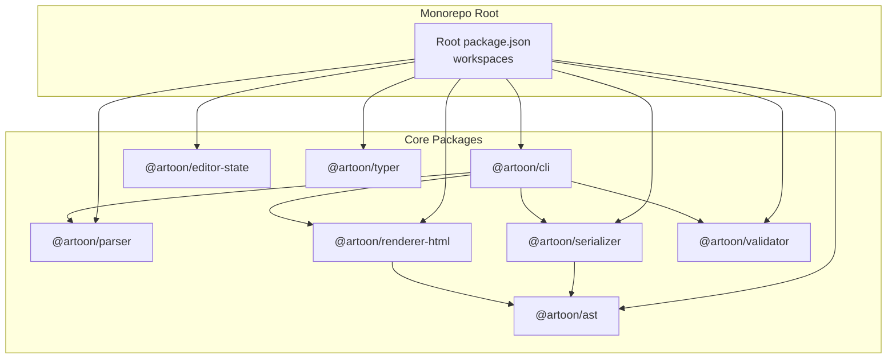

**Diagram sources**
- [package.json:6-15](file://package.json#L6-L15)
- [artoon-ast/package.json:1-25](file://artoon-ast/package.json#L1-L25)
- [artoon-parser/package.json:1-23](file://artoon-parser/package.json#L1-L23)
- [artoon-serializer/package.json:1-26](file://artoon-serializer/package.json#L1-L26)
- [artoon-renderer-html/package.json:1-27](file://artoon-renderer-html/package.json#L1-L27)
- [artoon-cli/package.json:1-34](file://artoon-cli/package.json#L1-L34)

**Section sources**
- [package.json:1-38](file://package.json#L1-L38)
- [README.md:77-88](file://README.md#L77-L88)

## Core Components
- Parser: Converts ARTOON text into a canonical AST and inline content model, supporting bidirectional text and complex structures.
- Serializer: Converts AST back to ARTOON text, preserving semantics and roundtrip fidelity.
- Renderer (HTML): Transforms AST into semantic HTML with extensible node renderers.
- Validator: Enforces content rules and constraints across documents.
- CLI: Provides command-line tools for parse, render, validate, and migrate operations.
- Editor State and Typer: Manage editor state, commands, selection, and a visual editor with themes and keyboard shortcuts.

Key quick-start usage and package statuses are summarized in the project README and quick reference card.

**Section sources**
- [README.md:20-44](file://README.md#L20-L44)
- [README.md:77-88](file://README.md#L77-L88)
- [QUICK-REFERENCE-CARD.md:56-66](file://QUICK-REFERENCE-CARD.md#L56-L66)

## Architecture Overview
The ARTOON pipeline transforms ARTOON text into a canonical AST, then serializes or renders it. The CLI orchestrates operations across packages, while the validator enforces rules. The editor stack manages state and UI interactions.

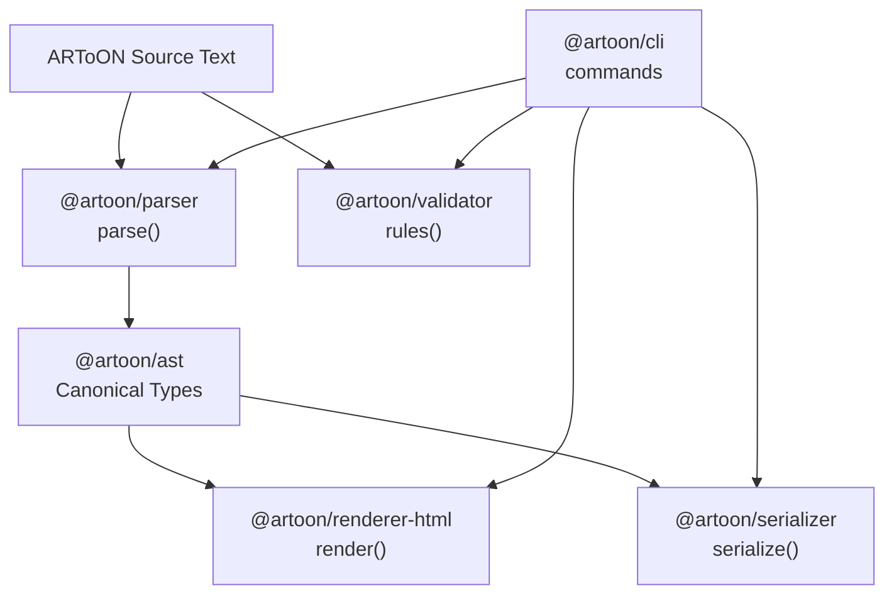

**Diagram sources**
- [README.md:20-44](file://README.md#L20-L44)
- [artoon-cli/package.json:18-25](file://artoon-cli/package.json#L18-L25)
- [artoon-parser/package.json:4-4](file://artoon-parser/package.json#L4-L4)
- [artoon-serializer/package.json:4-4](file://artoon-serializer/package.json#L4-L4)
- [artoon-renderer-html/package.json:4-4](file://artoon-renderer-html/package.json#L4-L4)

## Detailed Component Analysis

### Parser: Extending Syntax and Handling Complex Structures
The parser module exposes parsing APIs and integrates inline parsing, compound components, tables, and lexing. It supports bidirectional text and complex nested constructs. Extensibility is achieved by updating types, lexing rules, AST builders, serializers, and renderers consistently.

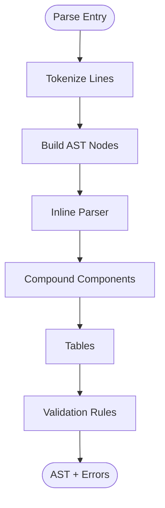

**Diagram sources**
- [docs/05-DEVELOPER-GUIDE.md:174-188](file://docs/05-DEVELOPER-GUIDE.md#L174-L188)
- [docs/03-SYNTAX-REFERENCE.md:101-112](file://docs/03-SYNTAX-REFERENCE.md#L101-L112)

**Section sources**
- [docs/05-DEVELOPER-GUIDE.md:37-93](file://docs/05-DEVELOPER-GUIDE.md#L37-L93)
- [docs/05-DEVELOPER-GUIDE.md:128-155](file://docs/05-DEVELOPER-GUIDE.md#L128-L155)
- [docs/03-SYNTAX-REFERENCE.md:126-147](file://docs/03-SYNTAX-REFERENCE.md#L126-L147)

### Serializer: Roundtrip Fidelity and Customization
The serializer converts AST nodes back to ARTOON text. Roundtrip testing ensures that parsing serialized output yields an equivalent AST. Customization involves updating node serializers and maintaining consistent separators and syntax.

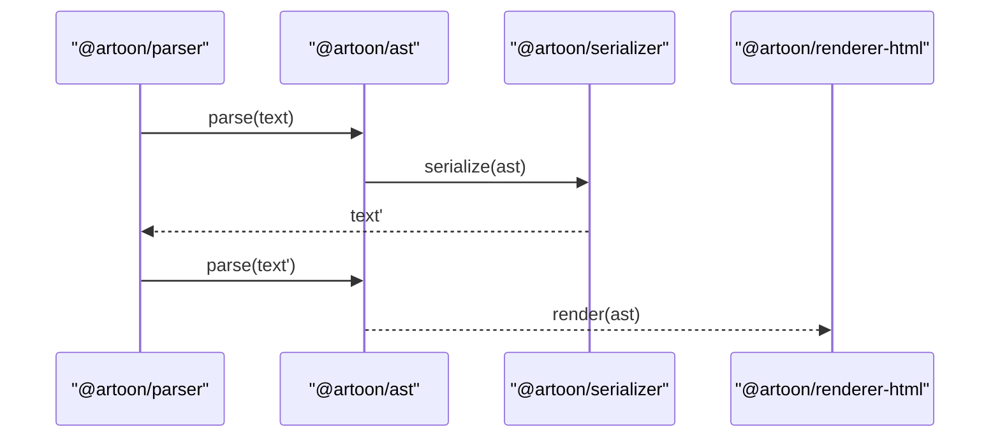

**Diagram sources**
- [docs/05-DEVELOPER-GUIDE.md:190-201](file://docs/05-DEVELOPER-GUIDE.md#L190-L201)
- [artoon-serializer/package.json:4-4](file://artoon-serializer/package.json#L4-L4)

**Section sources**
- [docs/05-DEVELOPER-GUIDE.md:190-201](file://docs/05-DEVELOPER-GUIDE.md#L190-L201)

### Renderer (HTML): Node Renderers and Extensibility
The HTML renderer maps AST nodes to semantic HTML via dedicated node renderers. Extending rendering involves adding new node renderers and ensuring HTML mapping aligns with block and inline semantics.

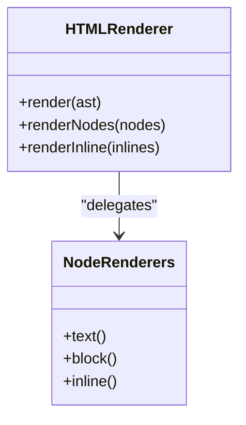

**Diagram sources**
- [artoon-renderer-html/package.json:4-4](file://artoon-renderer-html/package.json#L4-L4)
- [docs/03-SYNTAX-REFERENCE.md:149-179](file://docs/03-SYNTAX-REFERENCE.md#L149-L179)

**Section sources**
- [docs/03-SYNTAX-REFERENCE.md:149-179](file://docs/03-SYNTAX-REFERENCE.md#L149-L179)

### CLI: Commands and Automation
The CLI provides commands for parse, render, validate, and migrate, enabling automation pipelines. It depends on parser, serializer, renderer, and validator.

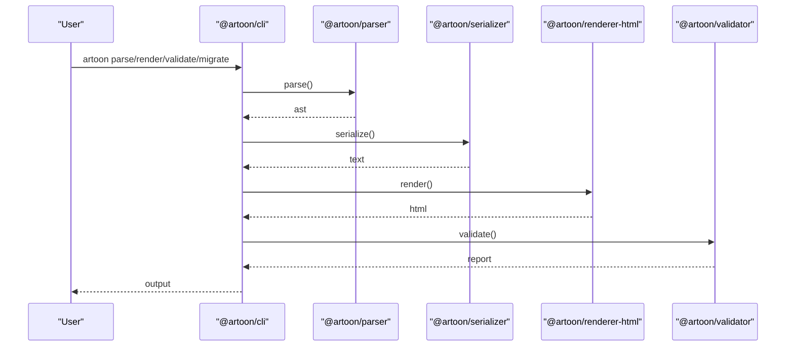

**Diagram sources**
- [artoon-cli/package.json:18-25](file://artoon-cli/package.json#L18-L25)

**Section sources**
- [artoon-cli/package.json:1-34](file://artoon-cli/package.json#L1-L34)

### Custom Block Development
Custom blocks enable domain-specific content composition. The examples showcase meta, code, alert, success, error, warning, quote, section, box, panel, and container blocks. Use these as templates for building new blocks.

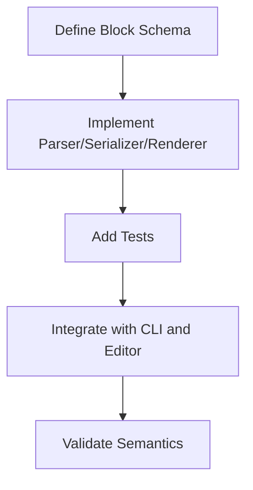

**Diagram sources**
- [docs/05-DEVELOPER-GUIDE.md:37-93](file://docs/05-DEVELOPER-GUIDE.md#L37-L93)
- [artoon-examples/test-blocks/00-README.md](file://artoon-examples/test-blocks/00-README.md)

**Section sources**
- [artoon-examples/test-blocks/01-meta-block.artoon](file://artoon-examples/test-blocks/01-meta-block.artoon)
- [artoon-examples/test-blocks/02-code-block.artoon](file://artoon-examples/test-blocks/02-code-block.artoon)
- [artoon-examples/test-blocks/03-alert-block.artoon](file://artoon-examples/test-blocks/03-alert-block.artoon)
- [artoon-examples/test-blocks/06-success-block.artoon](file://artoon-examples/test-blocks/06-success-block.artoon)
- [artoon-examples/test-blocks/07-error-block.artoon](file://artoon-examples/test-blocks/07-error-block.artoon)
- [artoon-examples/test-blocks/08-warning-block.artoon](file://artoon-examples/test-blocks/08-warning-block.artoon)
- [artoon-examples/test-blocks/09-quote-block.artoon](file://artoon-examples/test-blocks/09-quote-block.artoon)
- [artoon-examples/test-blocks/12-section-block.artoon](file://artoon-examples/test-blocks/12-section-block.artoon)
- [artoon-examples/test-blocks/13-box-block.artoon](file://artoon-examples/test-blocks/13-box-block.artoon)
- [artoon-examples/test-blocks/14-panel-block.artoon](file://artoon-examples/test-blocks/14-panel-block.artoon)
- [artoon-examples/test-blocks/15-container-block.artoon](file://artoon-examples/test-blocks/15-container-block.artoon)

### Validation Rule Extension
Validation enforces content rules and constraints. Extend rules by adding new rule categories, error codes, and validation levels. The validator’s documentation and inventory provide authoritative guidance.

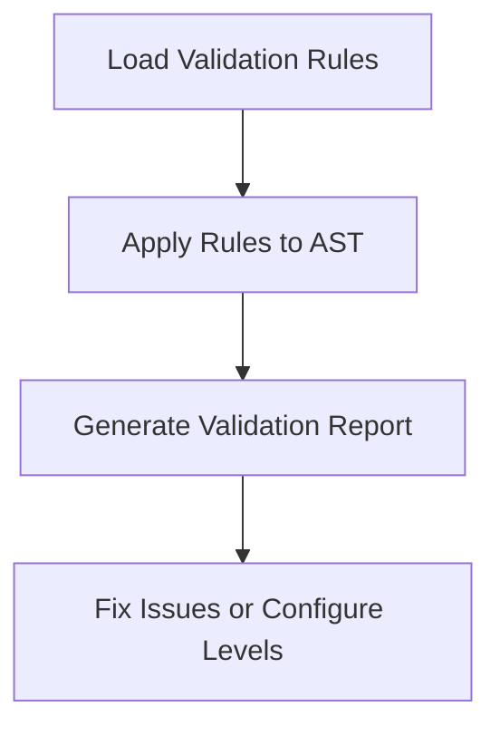

**Diagram sources**
- [artoon-validator/package.json:1-20](file://artoon-validator/package.json#L1-L20)

**Section sources**
- [artoon-validator/package.json:1-20](file://artoon-validator/package.json#L1-L20)

### Theme Creation and Editor Features
The visual editor (Typer) supports themes, keyboard shortcuts, and UI components. Use the design system and theme provider to customize appearance and behavior.

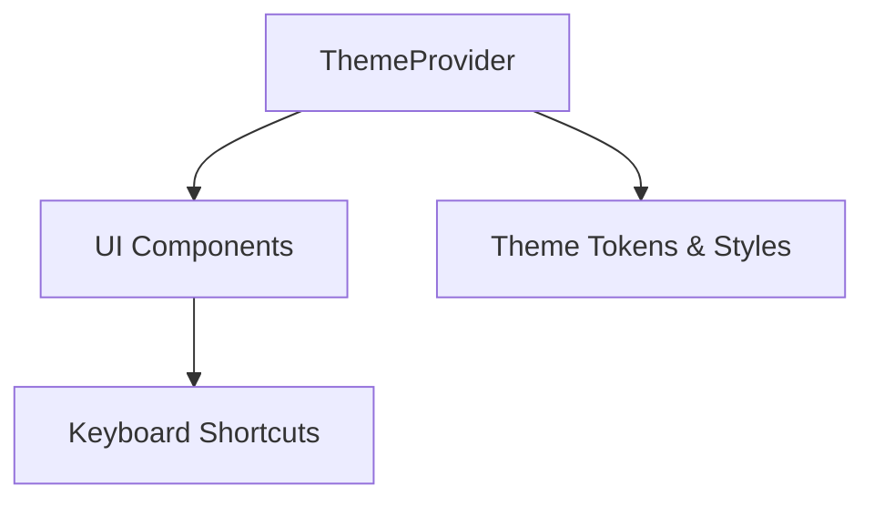

**Diagram sources**
- [artoon-typer/package.json:1-20](file://artoon-typer/package.json#L1-L20)

**Section sources**
- [artoon-typer/package.json:1-20](file://artoon-typer/package.json#L1-L20)

### Advanced Use Cases: Multi-Document Workflows and Aggregation
Multi-document workflows and content aggregation can be implemented using the CLI and programmatic APIs. Batch processing can leverage the CLI’s commands and automation scripts.

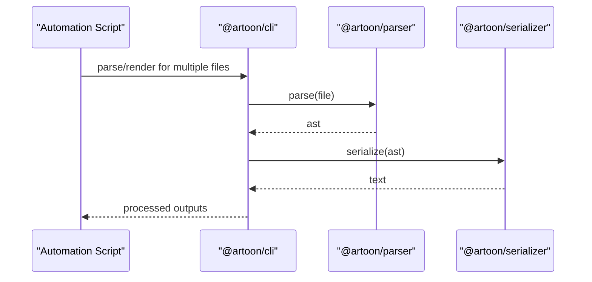

**Diagram sources**
- [artoon-cli/package.json:18-25](file://artoon-cli/package.json#L18-L25)

**Section sources**
- [artoon-cli/package.json:1-34](file://artoon-cli/package.json#L1-L34)

### Export Optimization
Export optimization focuses on minimizing redundant processing and leveraging caching. Use roundtrip testing and consistent serializers to maintain fidelity while optimizing throughput.

**Section sources**
- [docs/05-DEVELOPER-GUIDE.md:190-201](file://docs/05-DEVELOPER-GUIDE.md#L190-L201)

### Integration with CMS, Static Site Generators, and Content Platforms
Integrations involve parsing ARTOON content, validating it, and rendering to HTML for CMS ingestion or static site generation. The CLI and renderer facilitate automated pipelines.

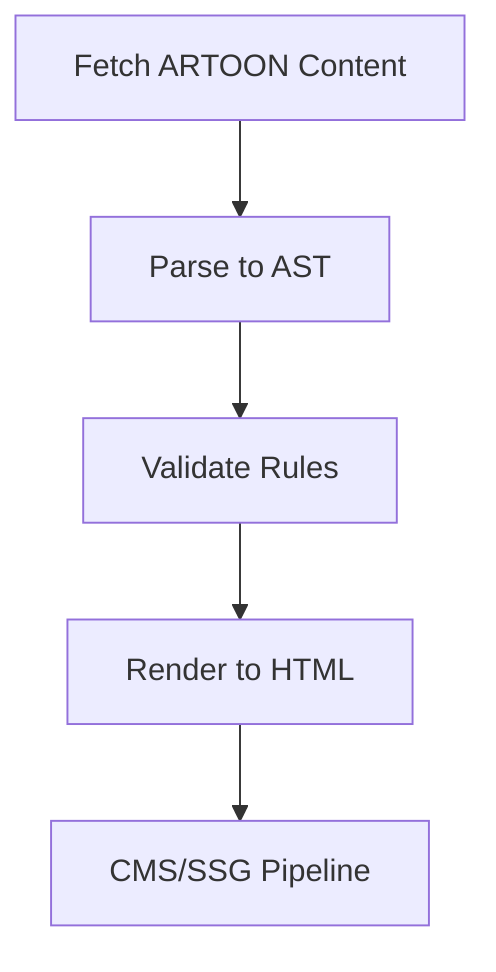

**Diagram sources**
- [README.md:136-166](file://README.md#L136-L166)
- [artoon-cli/package.json:18-25](file://artoon-cli/package.json#L18-L25)

**Section sources**
- [README.md:136-166](file://README.md#L136-L166)

### Migration and Version Upgrade Procedures
Migration guidance and backward compatibility considerations are documented in the AST inventory and migration tools. Follow the migration steps and update dependencies accordingly.

**Section sources**
- [artoon-ast/inventory_artoon_ast/MIGRATION-GUIDE-V2.md](file://artoon-ast/inventory_artoon_ast/MIGRATION-GUIDE-V2.md)

### Debugging Techniques and Error Handling
Debugging techniques include printing ASTs and tokens, using VS Code extensions, and leveraging diagnostic scripts. Error handling strategies involve validation reports and graceful degradation.

**Section sources**
- [docs/05-DEVELOPER-GUIDE.md:242-254](file://docs/05-DEVELOPER-GUIDE.md#L242-L254)
- [scripts/diagnose-syntax-errors.js](file://scripts/diagnose-syntax-errors.js)

### Productivity Workflows and Advanced Editor Features
Productivity workflows benefit from keyboard shortcuts, themes, and editor state management. The editor’s design system and UI components support efficient authoring.

**Section sources**
- [artoon-typer/package.json:1-20](file://artoon-typer/package.json#L1-L20)

## Dependency Analysis
The monorepo uses workspaces to manage interdependent packages. Core dependencies include parser, serializer, renderer, and validator. The CLI aggregates these packages for end-to-end operations.

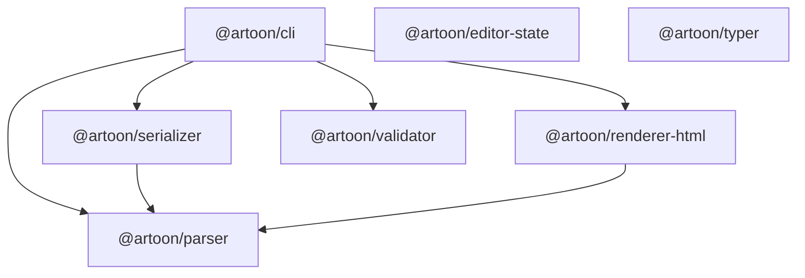

**Diagram sources**
- [package.json:6-15](file://package.json#L6-L15)
- [artoon-cli/package.json:18-25](file://artoon-cli/package.json#L18-L25)
- [artoon-serializer/package.json:14-16](file://artoon-serializer/package.json#L14-L16)
- [artoon-renderer-html/package.json:15-17](file://artoon-renderer-html/package.json#L15-L17)

**Section sources**
- [package.json:1-38](file://package.json#L1-L38)
- [artoon-cli/package.json:1-34](file://artoon-cli/package.json#L1-L34)

## Performance Considerations
- Prefer reusable parsed inline content to avoid repeated computation.
- Use batch operations via CLI for large document sets.
- Leverage roundtrip testing to detect regressions early.
- Keep syntax changes minimal to preserve compatibility and reduce reprocessing costs.

**Section sources**
- [docs/05-DEVELOPER-GUIDE.md:229-239](file://docs/05-DEVELOPER-GUIDE.md#L229-L239)

## Troubleshooting Guide
Common issues and resolutions:
- Syntax errors: Use diagnostic scripts and print AST/tokens for inspection.
- Validation failures: Review validation reports and adjust rule configurations.
- Rendering inconsistencies: Verify node renderers and HTML mapping.
- Editor display issues: Confirm theme provider and component updates.

**Section sources**
- [docs/05-DEVELOPER-GUIDE.md:242-254](file://docs/05-DEVELOPER-GUIDE.md#L242-L254)
- [scripts/diagnose-syntax-errors.js](file://scripts/diagnose-syntax-errors.js)

## Conclusion
ARTOON 2.0 offers a robust, extensible framework for AI-native structured content. By following the developer guide, leveraging the CLI, and extending parsers, serializers, validators, and renderers, advanced users can build sophisticated content systems, integrate with CMS and static site generators, and optimize performance for large-scale workflows.

## Appendices

### Quick Start and Examples
- Quick start example and package installation are provided in the project README and quick reference card.
- Professional showcases and complete syntax examples demonstrate advanced usage.

**Section sources**
- [README.md:20-44](file://README.md#L20-L44)
- [QUICK-REFERENCE-CARD.md:69-88](file://QUICK-REFERENCE-CARD.md#L69-L88)
- [artoon-examples/professional-showcase.artoon](file://artoon-examples/professional-showcase.artoon)
- [artoon-examples/complete-syntax-showcase.artoon](file://artoon-examples/complete-syntax-showcase.artoon)

### AI Integration Examples
- AI integration examples provide working code demonstrating reliable generation and downstream processing.

**Section sources**
- [AI-INTEGRATION-EXAMPLES.md](file://AI-INTEGRATION-EXAMPLES.md)

### Editor and IDE Support
- VS Code extension configuration and syntax highlighting enhance authoring experience.

**Section sources**
- [vscode-artoon/syntaxes/artoon.tmLanguage.json](file://vscode-artoon/syntaxes/artoon.tmLanguage.json)
- [vscode-artoon/language-configuration.json](file://vscode-artoon/language-configuration.json)
- [vscode-artoon/package.json](file://vscode-artoon/package.json)