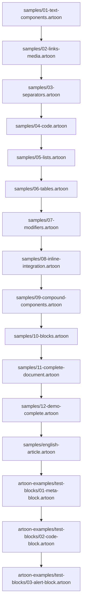
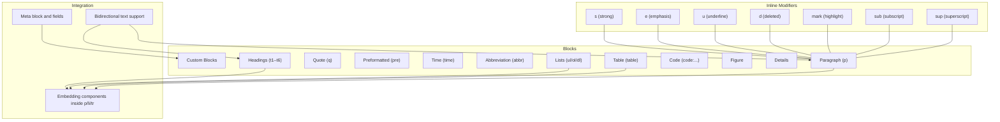
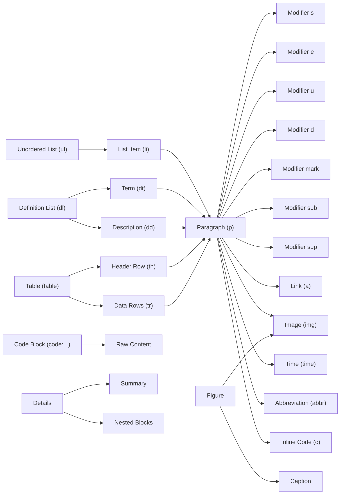

# Basic Examples

<cite>
**Referenced Files in This Document**
- [samples/01-text-components.artoon](file://samples/01-text-components.artoon)
- [samples/02-links-media.artoon](file://samples/02-links-media.artoon)
- [samples/03-separators.artoon](file://samples/03-separators.artoon)
- [samples/04-code.artoon](file://samples/04-code.artoon)
- [samples/05-lists.artoon](file://samples/05-lists.artoon)
- [samples/06-tables.artoon](file://samples/06-tables.artoon)
- [samples/07-modifiers.artoon](file://samples/07-modifiers.artoon)
- [samples/08-inline-integration.artoon](file://samples/08-inline-integration.artoon)
- [samples/09-compound-components.artoon](file://samples/09-compound-components.artoon)
- [samples/10-blocks.artoon](file://samples/10-blocks.artoon)
- [samples/11-complete-document.artoon](file://samples/11-complete-document.artoon)
- [samples/12-demo-complete.artoon](file://samples/12-demo-complete.artoon)
- [samples/english-article.artoon](file://samples/english-article.artoon)
- [artoon-examples/test-blocks/01-meta-block.artoon](file://artoon-examples/test-blocks/01-meta-block.artoon)
- [artoon-examples/test-blocks/02-code-block.artoon](file://artoon-examples/test-blocks/02-code-block.artoon)
- [artoon-examples/test-blocks/03-alert-block.artoon](file://artoon-examples/test-blocks/03-alert-block.artoon)
</cite>

## Table of Contents
1. [Introduction](#introduction)
2. [Project Structure](#project-structure)
3. [Core Components](#core-components)
4. [Architecture Overview](#architecture-overview)
5. [Detailed Component Analysis](#detailed-component-analysis)
6. [Dependency Analysis](#dependency-analysis)
7. [Performance Considerations](#performance-considerations)
8. [Troubleshooting Guide](#troubleshooting-guide)
9. [Conclusion](#conclusion)
10. [Appendices](#appendices)

## Introduction
This document provides a practical, step-by-step guide to creating basic content in ARTOON 2.0 using real, working examples from the repository. You will learn how to compose text components, apply inline formatting, use basic block constructs, and integrate mixed-language content. We also cover meta blocks, bidirectional text support, comments, and common beginner pitfalls with clear solutions.

## Project Structure
The examples in this guide are drawn from the repository’s sample files located under the samples directory and additional test-blocks demonstrations. These files demonstrate ARTOON syntax in a clear, incremental manner, progressing from simple paragraphs to complex mixed-language documents.

**Diagram sources**
- [samples/01-text-components.artoon:1-85](file://samples/01-text-components.artoon#L1-L85)
- [samples/02-links-media.artoon:1-65](file://samples/02-links-media.artoon#L1-L65)
- [samples/03-separators.artoon:1-43](file://samples/03-separators.artoon#L1-L43)
- [samples/04-code.artoon:1-120](file://samples/04-code.artoon#L1-L120)
- [samples/05-lists.artoon:1-117](file://samples/05-lists.artoon#L1-L117)
- [samples/06-tables.artoon:1-61](file://samples/06-tables.artoon#L1-L61)
- [samples/07-modifiers.artoon:1-81](file://samples/07-modifiers.artoon#L1-L81)
- [samples/08-inline-integration.artoon:1-55](file://samples/08-inline-integration.artoon#L1-L55)
- [samples/09-compound-components.artoon:1-100](file://samples/09-compound-components.artoon#L1-L100)
- [samples/10-blocks.artoon:1-86](file://samples/10-blocks.artoon#L1-L86)
- [samples/11-complete-document.artoon:1-87](file://samples/11-complete-document.artoon#L1-L87)
- [samples/12-demo-complete.artoon:1-119](file://samples/12-demo-complete.artoon#L1-L119)
- [samples/english-article.artoon:1-57](file://samples/english-article.artoon#L1-L57)
- [artoon-examples/test-blocks/01-meta-block.artoon:1-61](file://artoon-examples/test-blocks/01-meta-block.artoon#L1-L61)
- [artoon-examples/test-blocks/02-code-block.artoon:1-100](file://artoon-examples/test-blocks/02-code-block.artoon#L1-L100)
- [artoon-examples/test-blocks/03-alert-block.artoon:1-56](file://artoon-examples/test-blocks/03-alert-block.artoon#L1-L56)

**Section sources**
- [samples/01-text-components.artoon:1-85](file://samples/01-text-components.artoon#L1-L85)
- [samples/02-links-media.artoon:1-65](file://samples/02-links-media.artoon#L1-L65)
- [samples/03-separators.artoon:1-43](file://samples/03-separators.artoon#L1-L43)
- [samples/04-code.artoon:1-120](file://samples/04-code.artoon#L1-L120)
- [samples/05-lists.artoon:1-117](file://samples/05-lists.artoon#L1-L117)
- [samples/06-tables.artoon:1-61](file://samples/06-tables.artoon#L1-L61)
- [samples/07-modifiers.artoon:1-81](file://samples/07-modifiers.artoon#L1-L81)
- [samples/08-inline-integration.artoon:1-55](file://samples/08-inline-integration.artoon#L1-L55)
- [samples/09-compound-components.artoon:1-100](file://samples/09-compound-components.artoon#L1-L100)
- [samples/10-blocks.artoon:1-86](file://samples/10-blocks.artoon#L1-L86)
- [samples/11-complete-document.artoon:1-87](file://samples/11-complete-document.artoon#L1-L87)
- [samples/12-demo-complete.artoon:1-119](file://samples/12-demo-complete.artoon#L1-L119)
- [samples/english-article.artoon:1-57](file://samples/english-article.artoon#L1-L57)
- [artoon-examples/test-blocks/01-meta-block.artoon:1-61](file://artoon-examples/test-blocks/01-meta-block.artoon#L1-L61)
- [artoon-examples/test-blocks/02-code-block.artoon:1-100](file://artoon-examples/test-blocks/02-code-block.artoon#L1-L100)
- [artoon-examples/test-blocks/03-alert-block.artoon:1-56](file://artoon-examples/test-blocks/03-alert-block.artoon#L1-L56)

## Core Components
Below are the fundamental building blocks demonstrated across the sample files. Each entry links to the exact location in the repository for reference.

- Text components
  - Headings (t1–t6), paragraphs (p), quotes (q), preformatted text (pre), time (time), abbreviations (abbr)
  - Reference: [samples/01-text-components.artoon:11-85](file://samples/01-text-components.artoon#L11-L85)

- Links and media
  - Generic link (a), image (img), video (video), audio (audio), file (file)
  - Reference: [samples/02-links-media.artoon:13-65](file://samples/02-links-media.artoon#L13-L65)

- Separators
  - Line break (br), horizontal rule (hr), word break opportunity (wbr)
  - Reference: [samples/03-separators.artoon:13-43](file://samples/03-separators.artoon#L13-L43)

- Code
  - Inline code (c) and fenced code blocks (<code:...>)
  - Reference: [samples/04-code.artoon:13-120](file://samples/04-code.artoon#L13-L120)

- Lists
  - Unordered (ul), ordered (ol), definition (dl), nesting, mixed content
  - Reference: [samples/05-lists.artoon:13-117](file://samples/05-lists.artoon#L13-L117)

- Tables
  - Basic table, header rows, technical data tables, embedded content
  - Reference: [samples/06-tables.artoon:13-61](file://samples/06-tables.artoon#L13-L61)

- Modifiers
  - Seven base modifiers (s, e, u, d, mark, sub, sup); scientific notation; combinations; inline integrations
  - Reference: [samples/07-modifiers.artoon:13-81](file://samples/07-modifiers.artoon#L13-L81)

- Inline integration
  - Embedding a wide range of components inside paragraphs, lists, and tables
  - Reference: [samples/08-inline-integration.artoon:13-55](file://samples/08-inline-integration.artoon#L13-L55)

- Compound components
  - Figure with image/video/audio and captions; Details with summary and nested content
  - Reference: [samples/09-compound-components.artoon:13-100](file://samples/09-compound-components.artoon#L13-L100)

- Blocks
  - Reserved fenced blocks (code), custom blocks (e.g., alert)
  - Reference: [samples/10-blocks.artoon:13-86](file://samples/10-blocks.artoon#L13-L86)

- Complete document
  - Full-fledged document combining all major components and meta fields
  - Reference: [samples/11-complete-document.artoon:14-87](file://samples/11-complete-document.artoon#L14-L87)

- Demo document
  - Comprehensive showcase in Arabic with many block types and inline integrations
  - Reference: [samples/12-demo-complete.artoon:9-119](file://samples/12-demo-complete.artoon#L9-L119)

- English article
  - English-only demonstration of blocks and composition
  - Reference: [samples/english-article.artoon:11-57](file://samples/english-article.artoon#L11-L57)

**Section sources**
- [samples/01-text-components.artoon:11-85](file://samples/01-text-components.artoon#L11-L85)
- [samples/02-links-media.artoon:13-65](file://samples/02-links-media.artoon#L13-L65)
- [samples/03-separators.artoon:13-43](file://samples/03-separators.artoon#L13-L43)
- [samples/04-code.artoon:13-120](file://samples/04-code.artoon#L13-L120)
- [samples/05-lists.artoon:13-117](file://samples/05-lists.artoon#L13-L117)
- [samples/06-tables.artoon:13-61](file://samples/06-tables.artoon#L13-L61)
- [samples/07-modifiers.artoon:13-81](file://samples/07-modifiers.artoon#L13-L81)
- [samples/08-inline-integration.artoon:13-55](file://samples/08-inline-integration.artoon#L13-L55)
- [samples/09-compound-components.artoon:13-100](file://samples/09-compound-components.artoon#L13-L100)
- [samples/10-blocks.artoon:13-86](file://samples/10-blocks.artoon#L13-L86)
- [samples/11-complete-document.artoon:14-87](file://samples/11-complete-document.artoon#L14-L87)
- [samples/12-demo-complete.artoon:9-119](file://samples/12-demo-complete.artoon#L9-L119)
- [samples/english-article.artoon:11-57](file://samples/english-article.artoon#L11-L57)

## Architecture Overview
The ARTOON syntax organizes content into atomic blocks and inline modifiers. Blocks define structural units (headings, paragraphs, lists, tables, figures, details, code), while inline modifiers enrich text within blocks. Mixed-language documents are supported by directional and language metadata, and reserved blocks encapsulate raw content without ARTOON parsing.

**Diagram sources**
- [samples/01-text-components.artoon:11-85](file://samples/01-text-components.artoon#L11-L85)
- [samples/05-lists.artoon:13-117](file://samples/05-lists.artoon#L13-L117)
- [samples/06-tables.artoon:13-61](file://samples/06-tables.artoon#L13-L61)
- [samples/07-modifiers.artoon:13-81](file://samples/07-modifiers.artoon#L13-L81)
- [samples/08-inline-integration.artoon:13-55](file://samples/08-inline-integration.artoon#L13-L55)
- [samples/09-compound-components.artoon:13-100](file://samples/09-compound-components.artoon#L13-L100)
- [samples/10-blocks.artoon:13-86](file://samples/10-blocks.artoon#L13-L86)
- [samples/11-complete-document.artoon:14-87](file://samples/11-complete-document.artoon#L14-L87)

## Detailed Component Analysis

### Text Components
- Learn headings, paragraphs, quotes, preformatted text, time, and abbreviations.
- Practice mixed-direction content with Arabic and English.
- References:
  - [samples/01-text-components.artoon:11-85](file://samples/01-text-components.artoon#L11-L85)

**Section sources**
- [samples/01-text-components.artoon:11-85](file://samples/01-text-components.artoon#L11-L85)

### Links and Media
- Explore generic links, images, videos, audio, and files with optional captions and descriptions.
- References:
  - [samples/02-links-media.artoon:13-65](file://samples/02-links-media.artoon#L13-L65)

**Section sources**
- [samples/02-links-media.artoon:13-65](file://samples/02-links-media.artoon#L13-L65)

### Separators
- Use line breaks, horizontal rules, and word-break opportunities to control layout.
- References:
  - [samples/03-separators.artoon:13-43](file://samples/03-separators.artoon#L13-L43)

**Section sources**
- [samples/03-separators.artoon:13-43](file://samples/03-separators.artoon#L13-L43)

### Code
- Inline code and fenced code blocks with language hints.
- References:
  - [samples/04-code.artoon:13-120](file://samples/04-code.artoon#L13-L120)

**Section sources**
- [samples/04-code.artoon:13-120](file://samples/04-code.artoon#L13-L120)

### Lists
- Unordered, ordered, and definition lists; nesting and mixed content.
- References:
  - [samples/05-lists.artoon:13-117](file://samples/05-lists.artoon#L13-L117)

**Section sources**
- [samples/05-lists.artoon:13-117](file://samples/05-lists.artoon#L13-L117)

### Tables
- Basic tables, headers, and embedded content.
- References:
  - [samples/06-tables.artoon:13-61](file://samples/06-tables.artoon#L13-L61)

**Section sources**
- [samples/06-tables.artoon:13-61](file://samples/06-tables.artoon#L13-L61)

### Modifiers
- Base modifiers and scientific notation; combine modifiers; embed in time and abbr.
- References:
  - [samples/07-modifiers.artoon:13-81](file://samples/07-modifiers.artoon#L13-L81)

**Section sources**
- [samples/07-modifiers.artoon:13-81](file://samples/07-modifiers.artoon#L13-L81)

### Inline Integration
- Embed links, media, abbreviations, time, code, and files inside paragraphs, lists, and tables.
- References:
  - [samples/08-inline-integration.artoon:13-55](file://samples/08-inline-integration.artoon#L13-L55)

**Section sources**
- [samples/08-inline-integration.artoon:13-55](file://samples/08-inline-integration.artoon#L13-L55)

### Compound Components
- Figures with images/videos/audio and captions; Details with summaries and nested content.
- References:
  - [samples/09-compound-components.artoon:13-100](file://samples/09-compound-components.artoon#L13-L100)

**Section sources**
- [samples/09-compound-components.artoon:13-100](file://samples/09-compound-components.artoon#L13-L100)

### Blocks
- Reserved fenced code blocks and custom blocks; raw content isolation.
- References:
  - [samples/10-blocks.artoon:13-86](file://samples/10-blocks.artoon#L13-L86)

**Section sources**
- [samples/10-blocks.artoon:13-86](file://samples/10-blocks.artoon#L13-L86)

### Complete Documents
- Full document combining all components and meta fields; mixed-language example.
- References:
  - [samples/11-complete-document.artoon:14-87](file://samples/11-complete-document.artoon#L14-L87)
  - [samples/12-demo-complete.artoon:9-119](file://samples/12-demo-complete.artoon#L9-L119)
  - [samples/english-article.artoon:11-57](file://samples/english-article.artoon#L11-L57)

**Section sources**
- [samples/11-complete-document.artoon:14-87](file://samples/11-complete-document.artoon#L14-L87)
- [samples/12-demo-complete.artoon:9-119](file://samples/12-demo-complete.artoon#L9-L119)
- [samples/english-article.artoon:11-57](file://samples/english-article.artoon#L11-L57)

### Meta Block Usage
- Define metadata at the top of a document; hidden in preview; export/importable.
- References:
  - [artoon-examples/test-blocks/01-meta-block.artoon:1-61](file://artoon-examples/test-blocks/01-meta-block.artoon#L1-L61)

**Section sources**
- [artoon-examples/test-blocks/01-meta-block.artoon:1-61](file://artoon-examples/test-blocks/01-meta-block.artoon#L1-L61)

### Bidirectional Text Support
- Direction and language metadata enable RTL/LTR handling; see meta examples.
- References:
  - [samples/11-complete-document.artoon:4-12](file://samples/11-complete-document.artoon#L4-L12)
  - [samples/01-text-components.artoon:2-8](file://samples/01-text-components.artoon#L2-L8)

**Section sources**
- [samples/11-complete-document.artoon:4-12](file://samples/11-complete-document.artoon#L4-L12)
- [samples/01-text-components.artoon:2-8](file://samples/01-text-components.artoon#L2-L8)

### Comment Integration
- Comments are supported in the renderer pipeline; see dedicated test coverage.
- References:
  - [artoon-examples/test-blocks/01-meta-block.artoon:15-22](file://artoon-examples/test-blocks/01-meta-block.artoon#L15-L22)

**Section sources**
- [artoon-examples/test-blocks/01-meta-block.artoon:15-22](file://artoon-examples/test-blocks/01-meta-block.artoon#L15-L22)

### Practical Exercises for Beginners
- Build a simple paragraph with inline modifiers and links.
  - Reference: [samples/08-inline-integration.artoon:15-25](file://samples/08-inline-integration.artoon#L15-L25)
- Create a mixed-language document with headings, lists, and tables.
  - Reference: [samples/12-demo-complete.artoon:9-119](file://samples/12-demo-complete.artoon#L9-L119)
- Add a meta block with language and direction fields.
  - Reference: [artoon-examples/test-blocks/01-meta-block.artoon:24-55](file://artoon-examples/test-blocks/01-meta-block.artoon#L24-L55)
- Insert a fenced code block with a language hint.
  - Reference: [samples/04-code.artoon:36-47](file://samples/04-code.artoon#L36-L47)
- Combine modifiers with time and abbreviation.
  - Reference: [samples/07-modifiers.artoon:54-67](file://samples/07-modifiers.artoon#L54-L67)

**Section sources**
- [samples/08-inline-integration.artoon:15-25](file://samples/08-inline-integration.artoon#L15-L25)
- [samples/12-demo-complete.artoon:9-119](file://samples/12-demo-complete.artoon#L9-L119)
- [artoon-examples/test-blocks/01-meta-block.artoon:24-55](file://artoon-examples/test-blocks/01-meta-block.artoon#L24-L55)
- [samples/04-code.artoon:36-47](file://samples/04-code.artoon#L36-L47)
- [samples/07-modifiers.artoon:54-67](file://samples/07-modifiers.artoon#L54-L67)

## Dependency Analysis
The examples demonstrate a layered dependency model:
- Inline modifiers depend on block contexts (e.g., modifiers inside paragraphs).
- Compound components depend on block-level structures (e.g., figure and details).
- Meta and direction fields influence rendering but do not alter internal ARTOON parsing.

**Diagram sources**
- [samples/05-lists.artoon:13-117](file://samples/05-lists.artoon#L13-L117)
- [samples/06-tables.artoon:13-61](file://samples/06-tables.artoon#L13-L61)
- [samples/07-modifiers.artoon:13-81](file://samples/07-modifiers.artoon#L13-L81)
- [samples/08-inline-integration.artoon:13-55](file://samples/08-inline-integration.artoon#L13-L55)
- [samples/09-compound-components.artoon:13-100](file://samples/09-compound-components.artoon#L13-L100)
- [samples/10-blocks.artoon:13-86](file://samples/10-blocks.artoon#L13-L86)

**Section sources**
- [samples/05-lists.artoon:13-117](file://samples/05-lists.artoon#L13-L117)
- [samples/06-tables.artoon:13-61](file://samples/06-tables.artoon#L13-L61)
- [samples/07-modifiers.artoon:13-81](file://samples/07-modifiers.artoon#L13-L81)
- [samples/08-inline-integration.artoon:13-55](file://samples/08-inline-integration.artoon#L13-L55)
- [samples/09-compound-components.artoon:13-100](file://samples/09-compound-components.artoon#L13-L100)
- [samples/10-blocks.artoon:13-86](file://samples/10-blocks.artoon#L13-L86)

## Performance Considerations
- Prefer inline modifiers over deeply nested structures for readability and rendering efficiency.
- Keep code blocks fenced with language hints to enable syntax highlighting without extra processing.
- Use tables for structured data to improve scanning and accessibility.

## Troubleshooting Guide
Common beginner mistakes and solutions:

- Mistake: Forgetting to close inline constructs or mixing ARTOON syntax inside fenced code blocks.
  - Solution: Fenced code blocks preserve raw content; avoid ARTOON syntax inside them.
  - Reference: [samples/10-blocks.artoon:13-16](file://samples/10-blocks.artoon#L13-L16)

- Mistake: Incorrect nesting in lists or missing indentation markers.
  - Solution: Use proper indentation prefixes (-li for children) and keep levels consistent.
  - Reference: [samples/05-lists.artoon:72-81](file://samples/05-lists.artoon#L72-L81)

- Mistake: Misusing modifiers inside unsupported contexts.
  - Solution: Modifiers apply to text within blocks; ensure they are placed inside paragraphs or compatible inline contexts.
  - Reference: [samples/07-modifiers.artoon:13-29](file://samples/07-modifiers.artoon#L13-L29)

- Mistake: Overusing compound components without clear semantic purpose.
  - Solution: Reserve figures and details for content that benefits from captions or collapsible sections.
  - Reference: [samples/09-compound-components.artoon:49-71](file://samples/09-compound-components.artoon#L49-L71)

- Mistake: Confusing meta block visibility and export behavior.
  - Solution: Meta blocks are hidden in preview but parsed for metadata export/import.
  - Reference: [artoon-examples/test-blocks/01-meta-block.artoon:17-22](file://artoon-examples/test-blocks/01-meta-block.artoon#L17-L22)

**Section sources**
- [samples/10-blocks.artoon:13-16](file://samples/10-blocks.artoon#L13-L16)
- [samples/05-lists.artoon:72-81](file://samples/05-lists.artoon#L72-L81)
- [samples/07-modifiers.artoon:13-29](file://samples/07-modifiers.artoon#L13-L29)
- [samples/09-compound-components.artoon:49-71](file://samples/09-compound-components.artoon#L49-L71)
- [artoon-examples/test-blocks/01-meta-block.artoon:17-22](file://artoon-examples/test-blocks/01-meta-block.artoon#L17-L22)

## Conclusion
By working through the examples in this guide—from simple paragraphs to complex mixed-language documents—you gain hands-on familiarity with ARTOON’s block and inline systems, meta blocks, bidirectional text support, and comment integration. Use the referenced files as templates to build your own documents incrementally.

## Appendices

### Downloadable Sample Files
- Text components: [samples/01-text-components.artoon](file://samples/01-text-components.artoon)
- Links and media: [samples/02-links-media.artoon](file://samples/02-links-media.artoon)
- Separators: [samples/03-separators.artoon](file://samples/03-separators.artoon)
- Code: [samples/04-code.artoon](file://samples/04-code.artoon)
- Lists: [samples/05-lists.artoon](file://samples/05-lists.artoon)
- Tables: [samples/06-tables.artoon](file://samples/06-tables.artoon)
- Modifiers: [samples/07-modifiers.artoon](file://samples/07-modifiers.artoon)
- Inline integration: [samples/08-inline-integration.artoon](file://samples/08-inline-integration.artoon)
- Compound components: [samples/09-compound-components.artoon](file://samples/09-compound-components.artoon)
- Blocks: [samples/10-blocks.artoon](file://samples/10-blocks.artoon)
- Complete document: [samples/11-complete-document.artoon](file://samples/11-complete-document.artoon)
- Demo complete: [samples/12-demo-complete.artoon](file://samples/12-demo-complete.artoon)
- English article: [samples/english-article.artoon](file://samples/english-article.artoon)
- Meta block test: [artoon-examples/test-blocks/01-meta-block.artoon](file://artoon-examples/test-blocks/01-meta-block.artoon)
- Code block test: [artoon-examples/test-blocks/02-code-block.artoon](file://artoon-examples/test-blocks/02-code-block.artoon)
- Alert block test: [artoon-examples/test-blocks/03-alert-block.artoon](file://artoon-examples/test-blocks/03-alert-block.artoon)