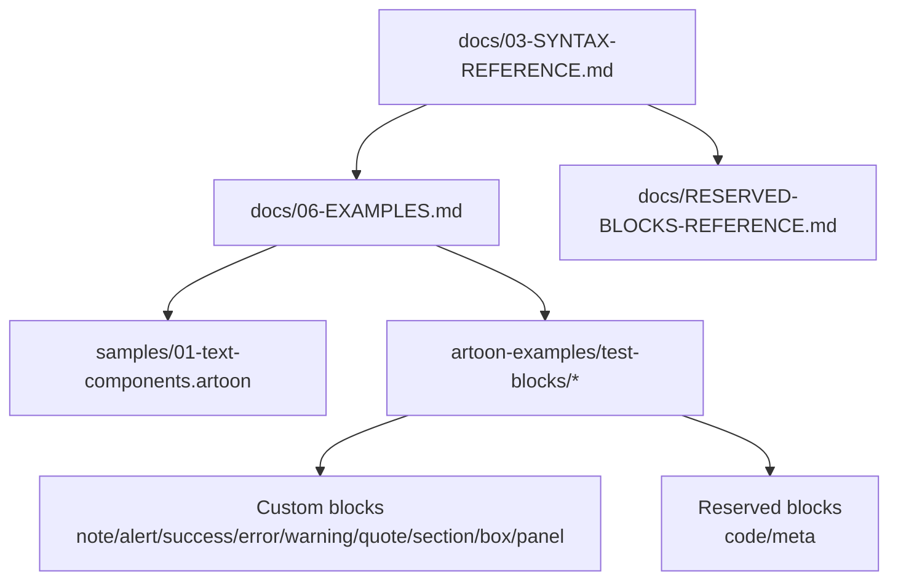
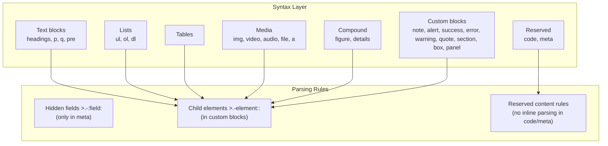
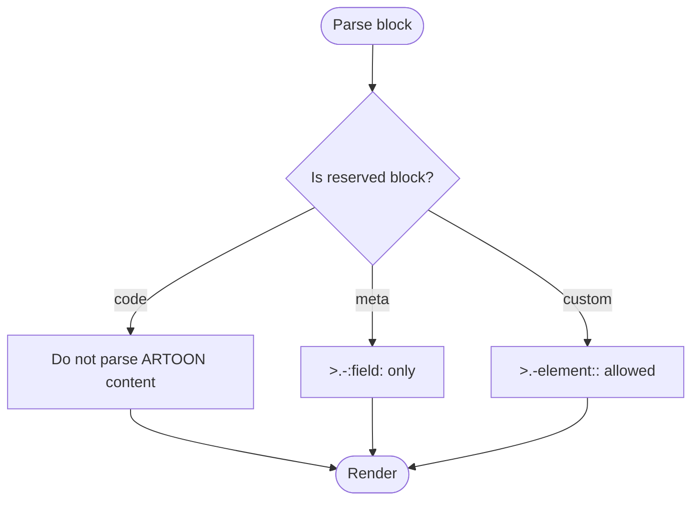
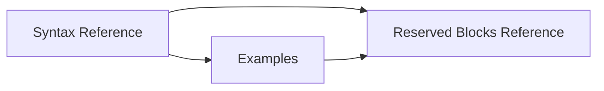

# Block Usage Examples

<cite>
**Referenced Files in This Document**
- [docs/03-SYNTAX-REFERENCE.md](file://docs/03-SYNTAX-REFERENCE.md)
- [docs/06-EXAMPLES.md](file://docs/06-EXAMPLES.md)
- [docs/RESERVED-BLOCKS-REFERENCE.md](file://docs/RESERVED-BLOCKS-REFERENCE.md)
- [samples/01-text-components.artoon](file://samples/01-text-components.artoon)
- [artoon-examples/test-blocks/01-meta-block.artoon](file://artoon-examples/test-blocks/01-meta-block.artoon)
- [artoon-examples/test-blocks/02-code-block.artoon](file://artoon-examples/test-blocks/02-code-block.artoon)
- [artoon-examples/test-blocks/03-alert-block.artoon](file://artoon-examples/test-blocks/03-alert-block.artoon)
- [artoon-examples/test-blocks/06-success-block.artoon](file://artoon-examples/test-blocks/06-success-block.artoon)
- [artoon-examples/test-blocks/07-error-block.artoon](file://artoon-examples/test-blocks/07-error-block.artoon)
- [artoon-examples/test-blocks/08-warning-block.artoon](file://artoon-examples/test-blocks/08-warning-block.artoon)
- [artoon-examples/test-blocks/09-quote-block.artoon](file://artoon-examples/test-blocks/09-quote-block.artoon)
- [artoon-examples/test-blocks/12-section-block.artoon](file://artoon-examples/test-blocks/12-section-block.artoon)
- [artoon-examples/test-blocks/13-box-block.artoon](file://artoon-examples/test-blocks/13-box-block.artoon)
- [artoon-examples/test-blocks/14-panel-block.artoon](file://artoon-examples/test-blocks/14-panel-block.artoon)
</cite>

## Table of Contents
1. [Introduction](#introduction)
2. [Project Structure](#project-structure)
3. [Core Components](#core-components)
4. [Architecture Overview](#architecture-overview)
5. [Detailed Component Analysis](#detailed-component-analysis)
6. [Dependency Analysis](#dependency-analysis)
7. [Performance Considerations](#performance-considerations)
8. [Troubleshooting Guide](#troubleshooting-guide)
9. [Conclusion](#conclusion)
10. [Appendices](#appendices)

## Introduction
This document provides comprehensive block usage examples for ARTOON 2.0. It covers all block categories: text blocks (headings, paragraphs, quotes, preformatted text), list blocks (unordered, ordered, definition lists), media blocks (images, videos, audio, files, links), advanced blocks (code, meta), and custom blocks (note, alert, success, error, warning, quote, section, box, panel, figure, details). It also includes compound and container block patterns, real-world scenarios (blog posts, documentation pages, educational materials), block nesting rules, property inheritance, styling options, troubleshooting tips, and best practices.

## Project Structure
The repository organizes block documentation and examples across:
- Core syntax and reserved blocks reference
- Practical examples for blog posts, documentation, bilingual articles, tasks, media galleries, and custom blocks
- Sample documents demonstrating text components and inline integrations

**Diagram sources**
- [docs/03-SYNTAX-REFERENCE.md:1-310](file://docs/03-SYNTAX-REFERENCE.md#L1-L310)
- [docs/06-EXAMPLES.md:1-257](file://docs/06-EXAMPLES.md#L1-L257)
- [docs/RESERVED-BLOCKS-REFERENCE.md:1-579](file://docs/RESERVED-BLOCKS-REFERENCE.md#L1-L579)
- [samples/01-text-components.artoon:1-85](file://samples/01-text-components.artoon#L1-L85)
- [artoon-examples/test-blocks/01-meta-block.artoon:1-61](file://artoon-examples/test-blocks/01-meta-block.artoon#L1-L61)
- [artoon-examples/test-blocks/02-code-block.artoon:1-100](file://artoon-examples/test-blocks/02-code-block.artoon#L1-L100)
- [artoon-examples/test-blocks/03-alert-block.artoon:1-56](file://artoon-examples/test-blocks/03-alert-block.artoon#L1-L56)
- [artoon-examples/test-blocks/06-success-block.artoon:1-56](file://artoon-examples/test-blocks/06-success-block.artoon#L1-L56)
- [artoon-examples/test-blocks/07-error-block.artoon:1-62](file://artoon-examples/test-blocks/07-error-block.artoon#L1-L62)
- [artoon-examples/test-blocks/08-warning-block.artoon:1-55](file://artoon-examples/test-blocks/08-warning-block.artoon#L1-L55)
- [artoon-examples/test-blocks/09-quote-block.artoon:1-49](file://artoon-examples/test-blocks/09-quote-block.artoon#L1-L49)
- [artoon-examples/test-blocks/12-section-block.artoon:1-58](file://artoon-examples/test-blocks/12-section-block.artoon#L1-L58)
- [artoon-examples/test-blocks/13-box-block.artoon:1-46](file://artoon-examples/test-blocks/13-box-block.artoon#L1-L46)
- [artoon-examples/test-blocks/14-panel-block.artoon:1-50](file://artoon-examples/test-blocks/14-panel-block.artoon#L1-L50)

**Section sources**
- [docs/03-SYNTAX-REFERENCE.md:1-310](file://docs/03-SYNTAX-REFERENCE.md#L1-L310)
- [docs/06-EXAMPLES.md:1-257](file://docs/06-EXAMPLES.md#L1-L257)
- [docs/RESERVED-BLOCKS-REFERENCE.md:1-579](file://docs/RESERVED-BLOCKS-REFERENCE.md#L1-L579)
- [samples/01-text-components.artoon:1-85](file://samples/01-text-components.artoon#L1-L85)

## Core Components
- Text blocks: headings (t1–t6), paragraphs (p), quotes (q), preformatted text (pre)
- Separators: horizontal rule (hr), line break (br), word break (wbr)
- Lists: unordered (ul), ordered (ol), definition (dl) with nested items
- Tables: table with header and rows
- Media: image (img), video (video), audio (audio), file (file), link (a)
- Compound blocks: figure, details
- Reserved blocks: code, meta
- Custom blocks: note, alert, success, error, warning, quote, section, box, panel, and others

**Section sources**
- [docs/03-SYNTAX-REFERENCE.md:20-123](file://docs/03-SYNTAX-REFERENCE.md#L20-L123)
- [docs/03-SYNTAX-REFERENCE.md:126-146](file://docs/03-SYNTAX-REFERENCE.md#L126-L146)
- [docs/RESERVED-BLOCKS-REFERENCE.md:9-24](file://docs/RESERVED-BLOCKS-REFERENCE.md#L9-L24)

## Architecture Overview
The ARTOON block system supports:
- Inline semantics and modifiers integrated within text
- Nested child elements via dedicated child syntax
- Hidden fields exclusive to meta blocks
- Reserved blocks (code, meta) with strict parsing rules
- Custom blocks that parse ARTOON content and support child elements

**Diagram sources**
- [docs/03-SYNTAX-REFERENCE.md:180-211](file://docs/03-SYNTAX-REFERENCE.md#L180-L211)
- [docs/RESERVED-BLOCKS-REFERENCE.md:135-161](file://docs/RESERVED-BLOCKS-REFERENCE.md#L135-L161)

## Detailed Component Analysis

### Text Blocks
- Headings (t1–t6): Use directional markers and type suffix with content separator.
- Paragraphs (p): Simple content blocks suitable for body text.
- Quotes (q): Short citations or testimonials.
- Preformatted (pre): Preserves whitespace and formatting.

Practical examples:
- Headings and paragraphs with bidirectional content
- Quotes and preformatted text usage

**Section sources**
- [docs/03-SYNTAX-REFERENCE.md:20-52](file://docs/03-SYNTAX-REFERENCE.md#L20-L52)
- [samples/01-text-components.artoon:11-85](file://samples/01-text-components.artoon#L11-L85)

### List Blocks
- Unordered (ul): Top-level and nested items with indentation markers.
- Ordered (ol): Numbered steps.
- Definition (dl): Terms and definitions.

Practical examples:
- Mixed lists for tasks and tutorials
- Nested lists for hierarchical steps

**Section sources**
- [docs/03-SYNTAX-REFERENCE.md:67-98](file://docs/03-SYNTAX-REFERENCE.md#L67-L98)
- [docs/06-EXAMPLES.md:179-201](file://docs/06-EXAMPLES.md#L179-L201)

### Media Blocks
- Image (img): Path, alt text, optional title.
- Video (video): Path, title.
- Audio (audio): Path, title.
- File (file): Path, download label.
- Link (a): URL, link text.

Practical examples:
- Media gallery with captions and embedded resources

**Section sources**
- [docs/03-SYNTAX-REFERENCE.md:114-122](file://docs/03-SYNTAX-REFERENCE.md#L114-L122)
- [docs/06-EXAMPLES.md:228-250](file://docs/06-EXAMPLES.md#L228-L250)

### Advanced Blocks
- Code (reserved): Non-parsed content with optional language for syntax highlighting.
- Meta (reserved): Hidden metadata fields; no visible children.

Practical examples:
- Code blocks for multiple languages
- Comprehensive meta blocks for document metadata

**Section sources**
- [docs/RESERVED-BLOCKS-REFERENCE.md:28-108](file://docs/RESERVED-BLOCKS-REFERENCE.md#L28-L108)
- [docs/RESERVED-BLOCKS-REFERENCE.md:111-266](file://docs/RESERVED-BLOCKS-REFERENCE.md#L111-L266)
- [artoon-examples/test-blocks/02-code-block.artoon:1-100](file://artoon-examples/test-blocks/02-code-block.artoon#L1-L100)
- [artoon-examples/test-blocks/01-meta-block.artoon:1-61](file://artoon-examples/test-blocks/01-meta-block.artoon#L1-L61)

### Custom Blocks
- General pattern: <name>. ... .<name> with child elements >.-element::.
- Hidden fields >.-:field: are not allowed in custom blocks.
- Examples include: note, alert, success, error, warning, quote, section, box, panel.

Practical examples:
- Alert, success, error, warning blocks with nested content
- Quote block with attribution
- Section, box, and panel blocks for structured layouts

**Section sources**
- [docs/RESERVED-BLOCKS-REFERENCE.md:269-346](file://docs/RESERVED-BLOCKS-REFERENCE.md#L269-L346)
- [artoon-examples/test-blocks/03-alert-block.artoon:1-56](file://artoon-examples/test-blocks/03-alert-block.artoon#L1-L56)
- [artoon-examples/test-blocks/06-success-block.artoon:1-56](file://artoon-examples/test-blocks/06-success-block.artoon#L1-L56)
- [artoon-examples/test-blocks/07-error-block.artoon:1-62](file://artoon-examples/test-blocks/07-error-block.artoon#L1-L62)
- [artoon-examples/test-blocks/08-warning-block.artoon:1-55](file://artoon-examples/test-blocks/08-warning-block.artoon#L1-L55)
- [artoon-examples/test-blocks/09-quote-block.artoon:1-49](file://artoon-examples/test-blocks/09-quote-block.artoon#L1-L49)
- [artoon-examples/test-blocks/12-section-block.artoon:1-58](file://artoon-examples/test-blocks/12-section-block.artoon#L1-L58)
- [artoon-examples/test-blocks/13-box-block.artoon:1-46](file://artoon-examples/test-blocks/13-box-block.artoon#L1-L46)
- [artoon-examples/test-blocks/14-panel-block.artoon:1-50](file://artoon-examples/test-blocks/14-panel-block.artoon#L1-L50)

### Compound and Container Blocks
- Figure: Contains >.-img:: and >.-caption::.
- Details: Collapsible summary/details with nested content.

Practical examples:
- Figure with image and caption
- Details with summary and hidden content

**Section sources**
- [docs/03-SYNTAX-REFERENCE.md:126-146](file://docs/03-SYNTAX-REFERENCE.md#L126-L146)
- [docs/06-EXAMPLES.md:157-176](file://docs/06-EXAMPLES.md#L157-L176)

### Real-World Scenarios
- Blog post: Title, intro, sections, lists, code, quote, conclusion
- Technical documentation: Installation, usage, API examples, error handling, types table
- Bilingual article: Mixed RTL/LTR content with lists and tables
- Educational material: Tasks, figures, media, and summaries

**Section sources**
- [docs/06-EXAMPLES.md:3-46](file://docs/06-EXAMPLES.md#L3-L46)
- [docs/06-EXAMPLES.md:50-108](file://docs/06-EXAMPLES.md#L50-L108)
- [docs/06-EXAMPLES.md:112-154](file://docs/06-EXAMPLES.md#L112-L154)
- [docs/06-EXAMPLES.md:157-201](file://docs/06-EXAMPLES.md#L157-L201)
- [docs/06-EXAMPLES.md:205-224](file://docs/06-EXAMPLES.md#L205-L224)
- [docs/06-EXAMPLES.md:228-250](file://docs/06-EXAMPLES.md#L228-L250)

### Block Nesting Rules and Property Inheritance
- Child elements: >.-element:: supported in custom blocks; not allowed in code/meta.
- Hidden fields: >.-:field: only in meta blocks.
- Reserved content: code/meta content is not parsed as ARTOON.
- Directionality: Use directional markers for mixed-direction content.

**Diagram sources**
- [docs/RESERVED-BLOCKS-REFERENCE.md:448-477](file://docs/RESERVED-BLOCKS-REFERENCE.md#L448-L477)
- [docs/03-SYNTAX-REFERENCE.md:180-211](file://docs/03-SYNTAX-REFERENCE.md#L180-L211)

**Section sources**
- [docs/RESERVED-BLOCKS-REFERENCE.md:448-477](file://docs/RESERVED-BLOCKS-REFERENCE.md#L448-L477)
- [docs/03-SYNTAX-REFERENCE.md:180-211](file://docs/03-SYNTAX-REFERENCE.md#L180-L211)

### Styling Options
- Code blocks: optional language for syntax highlighting.
- Custom blocks: styled via CSS classes derived from block names.
- Meta blocks: hidden by default; can be exported as HTML meta tags or JSON-LD depending on configuration.

**Section sources**
- [docs/RESERVED-BLOCKS-REFERENCE.md:87-108](file://docs/RESERVED-BLOCKS-REFERENCE.md#L87-L108)
- [docs/RESERVED-BLOCKS-REFERENCE.md:238-266](file://docs/RESERVED-BLOCKS-REFERENCE.md#L238-L266)

## Dependency Analysis
- Syntax reference defines the canonical grammar and semantics.
- Examples demonstrate practical usage and edge cases.
- Reserved blocks reference enforces parsing rules and prevents misuse.

**Diagram sources**
- [docs/03-SYNTAX-REFERENCE.md:1-310](file://docs/03-SYNTAX-REFERENCE.md#L1-L310)
- [docs/06-EXAMPLES.md:1-257](file://docs/06-EXAMPLES.md#L1-L257)
- [docs/RESERVED-BLOCKS-REFERENCE.md:1-579](file://docs/RESERVED-BLOCKS-REFERENCE.md#L1-L579)

**Section sources**
- [docs/03-SYNTAX-REFERENCE.md:1-310](file://docs/03-SYNTAX-REFERENCE.md#L1-L310)
- [docs/06-EXAMPLES.md:1-257](file://docs/06-EXAMPLES.md#L1-L257)
- [docs/RESERVED-BLOCKS-REFERENCE.md:1-579](file://docs/RESERVED-BLOCKS-REFERENCE.md#L1-L579)

## Performance Considerations
- Prefer compact block structures to reduce rendering overhead.
- Limit deeply nested custom blocks for readability and maintainability.
- Use code blocks for large code segments to avoid ARTOON parsing cost within content.

## Troubleshooting Guide
Common issues and resolutions:
- Hidden field outside meta: Move hidden fields into a meta block.
- Using hidden fields in custom blocks: Remove hidden fields; use child elements instead.
- Placing regular content inside meta: Use child elements >.-element:: in custom blocks or remove content from meta.
- Parsing code content: Ensure content remains unparsed and ends with proper closing marker.
- Language highlighting: Verify language identifier is supported.

**Section sources**
- [docs/RESERVED-BLOCKS-REFERENCE.md:480-534](file://docs/RESERVED-BLOCKS-REFERENCE.md#L480-L534)

## Conclusion
ARTOON’s block system offers a flexible, extensible framework for authoring structured content. By adhering to reserved block rules, leveraging child elements for custom blocks, and applying consistent nesting and styling patterns, authors can create rich, maintainable documents ranging from simple blog posts to complex technical guides.

## Appendices

### Quick Syntax Cheatsheet
- Text: >.type:: content
- Separator: >.type
- List: >.ul/.ol/.dl with li/dt/dd
- Table: >.table:: with th/tr
- Media: >.img/.video/.audio/.file/.a::
- Compound: >.figure:: with >.-img:: and >.-caption::
- Block: <name>. ... .<name> with >.-element::
- Inline: [mod:: text], [type:: params]
- Comment: >.:::

**Section sources**
- [docs/03-SYNTAX-REFERENCE.md:277-303](file://docs/03-SYNTAX-REFERENCE.md#L277-L303)