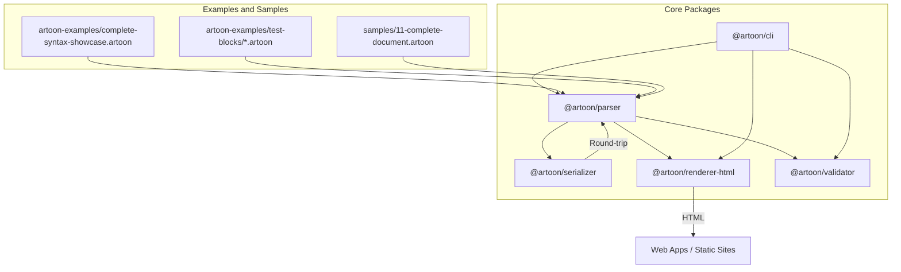
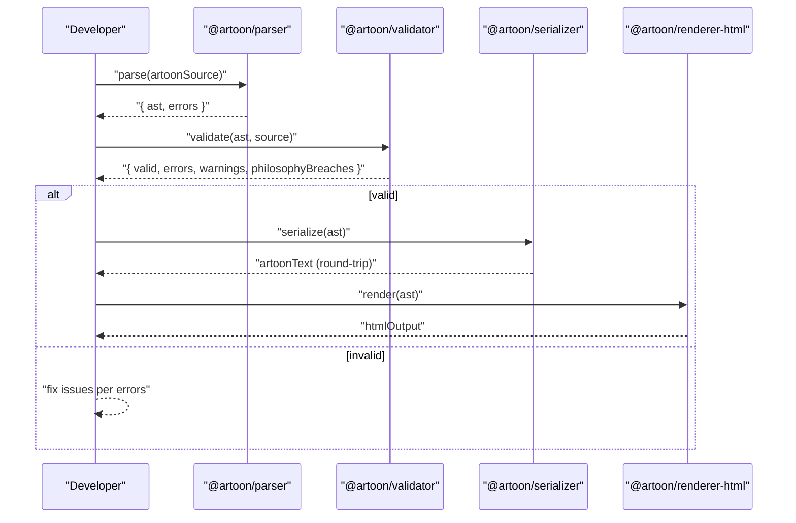
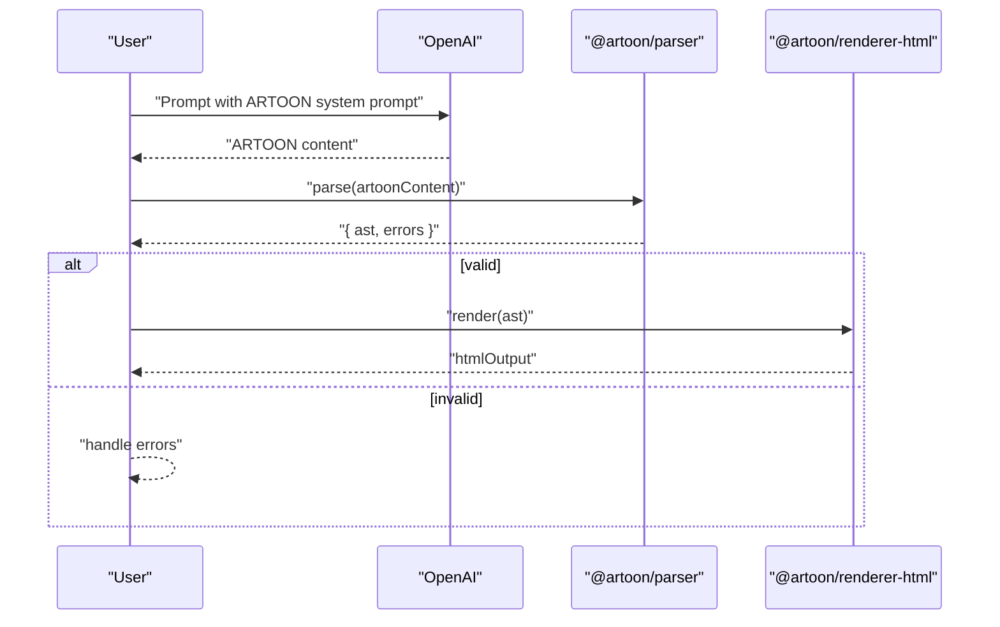
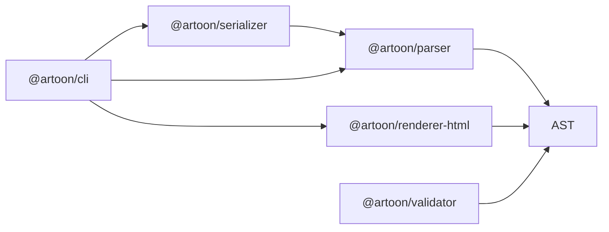

# Examples and Tutorials

<cite>
**Referenced Files in This Document**
- [README.md](file://README.md)
- [AI-INTEGRATION-EXAMPLES.md](file://AI-INTEGRATION-EXAMPLES.md)
- [docs/06-EXAMPLES.md](file://docs/06-EXAMPLES.md)
- [artoon-examples/README.md](file://artoon-examples/README.md)
- [artoon-examples/complete-syntax-showcase.artoon](file://artoon-examples/complete-syntax-showcase.artoon)
- [samples/11-complete-document.artoon](file://samples/11-complete-document.artoon)
- [artoon-examples/test-blocks/01-meta-block.artoon](file://artoon-examples/test-blocks/01-meta-block.artoon)
- [artoon-examples/test-blocks/02-code-block.artoon](file://artoon-examples/test-blocks/02-code-block.artoon)
- [artoon-examples/test-blocks/12-section-block.artoon](file://artoon-examples/test-blocks/12-section-block.artoon)
- [artoon-parser/README.md](file://artoon-parser/README.md)
- [artoon-renderer-html/README.md](file://artoon-renderer-html/README.md)
- [artoon-serializer/README.md](file://artoon-serializer/README.md)
- [artoon-cli/README.md](file://artoon-cli/README.md)
- [artoon-validator/README.md](file://artoon-validator/README.md)
</cite>

## Table of Contents
1. [Introduction](#introduction)
2. [Project Structure](#project-structure)
3. [Core Components](#core-components)
4. [Architecture Overview](#architecture-overview)
5. [Detailed Component Analysis](#detailed-component-analysis)
6. [Dependency Analysis](#dependency-analysis)
7. [Performance Considerations](#performance-considerations)
8. [Troubleshooting Guide](#troubleshooting-guide)
9. [Conclusion](#conclusion)
10. [Appendices](#appendices)

## Introduction
This document provides comprehensive examples and tutorials for ARTOON 2.0. It covers:
- Complete document examples and block usage scenarios
- AI integration workflows with real, working examples
- Step-by-step tutorials for common use cases (blog posts, technical documentation, marketing content, educational materials)
- Advanced topics: custom block development, theme creation, validation rule extension
- Migration patterns from other content formats
- Performance optimization and best practices for large-scale content management
- Downloadable sample files and guidance for building an interactive playground

## Project Structure
The repository organizes ARTOON 2.0 around a set of focused packages and curated examples:
- Parser: converts ARTOON text to AST
- Serializer: converts AST back to ARTOON text
- Renderer (HTML): renders AST to HTML
- CLI: command-line utilities for parse/render/validate/lint
- Validator: semantic and philosophical validation of ARTOON documents
- Examples: complete documents and block showcases
- Samples: ready-to-use ARTOON files for quick testing

**Diagram sources**
- [artoon-parser/README.md:1-225](file://artoon-parser/README.md#L1-L225)
- [artoon-serializer/README.md:1-220](file://artoon-serializer/README.md#L1-L220)
- [artoon-renderer-html/README.md:1-238](file://artoon-renderer-html/README.md#L1-L238)
- [artoon-cli/README.md:1-103](file://artoon-cli/README.md#L1-L103)
- [artoon-validator/README.md:1-137](file://artoon-validator/README.md#L1-L137)
- [artoon-examples/complete-syntax-showcase.artoon:1-200](file://artoon-examples/complete-syntax-showcase.artoon#L1-L200)
- [artoon-examples/test-blocks/01-meta-block.artoon:1-61](file://artoon-examples/test-blocks/01-meta-block.artoon#L1-L61)
- [samples/11-complete-document.artoon:1-87](file://samples/11-complete-document.artoon#L1-L87)

**Section sources**
- [README.md:77-105](file://README.md#L77-L105)

## Core Components
This section introduces the core packages and their roles in ARTOON workflows.

- Parser (@artoon/parser)
  - Parses ARTOON text into a typed AST
  - Enforces reserved blocks (e.g., meta, code) and hidden-field rules
  - Provides strict parsing and validation APIs
  - Reference: [artoon-parser/README.md:1-225](file://artoon-parser/README.md#L1-L225)

- Serializer (@artoon/serializer)
  - Converts AST back to ARTOON text with round-trip fidelity
  - Handles META blocks and direction-aware serialization
  - Reference: [artoon-serializer/README.md:1-220](file://artoon-serializer/README.md#L1-L220)

- Renderer (HTML) (@artoon/renderer-html)
  - Renders AST to HTML with configurable META handling
  - Supports direction-aware rendering and semantic class options
  - Reference: [artoon-renderer-html/README.md:1-238](file://artoon-renderer-html/README.md#L1-L238)

- CLI (@artoon/cli)
  - Command-line tools for parse, render, validate, lint
  - Useful for batch processing and CI pipelines
  - Reference: [artoon-cli/README.md:1-103](file://artoon-cli/README.md#L1-L103)

- Validator (@artoon/validator)
  - Validates syntax, structure, semantics, constraints, and philosophy
  - Provides categorized error codes and severity levels
  - Reference: [artoon-validator/README.md:1-137](file://artoon-validator/README.md#L1-L137)

**Section sources**
- [artoon-parser/README.md:1-225](file://artoon-parser/README.md#L1-L225)
- [artoon-serializer/README.md:1-220](file://artoon-serializer/README.md#L1-L220)
- [artoon-renderer-html/README.md:1-238](file://artoon-renderer-html/README.md#L1-L238)
- [artoon-cli/README.md:1-103](file://artoon-cli/README.md#L1-L103)
- [artoon-validator/README.md:1-137](file://artoon-validator/README.md#L1-L137)

## Architecture Overview
The ARTOON ecosystem follows a pipeline: parse → transform (optional) → validate → render/serialize. The validator can be integrated early to catch philosophy violations and structural issues.

**Diagram sources**
- [artoon-parser/README.md:25-48](file://artoon-parser/README.md#L25-L48)
- [artoon-validator/README.md:11-45](file://artoon-validator/README.md#L11-L45)
- [artoon-serializer/README.md:11-25](file://artoon-serializer/README.md#L11-L25)
- [artoon-renderer-html/README.md:11-32](file://artoon-renderer-html/README.md#L11-L32)

## Detailed Component Analysis

### Complete Document Example
Explore a full ARTOON document that demonstrates metadata, headings, lists, tables, figures, and inline formatting.

- Sample file: [samples/11-complete-document.artoon:1-87](file://samples/11-complete-document.artoon#L1-L87)
- Highlights:
  - Meta block with title, description, language, direction, author, date, version, status, license, tags
  - Hierarchical headings and paragraphs
  - Table and details block
  - Inline modifiers and links
  - Footer with copyright and tags

**Section sources**
- [samples/11-complete-document.artoon:1-87](file://samples/11-complete-document.artoon#L1-L87)

### Complete Syntax Showcase
A comprehensive example showcasing all supported blocks and inline features.

- Example file: [artoon-examples/complete-syntax-showcase.artoon:1-200](file://artoon-examples/complete-syntax-showcase.artoon#L1-L200)
- Topics covered:
  - Text blocks (headings, paragraphs, quotes, preformatted)
  - Inline modifiers (bold, emphasis, underline, strikethrough, mark, subscript, superscript)
  - Media blocks (images, videos, audio, files)
  - Separators (horizontal rule, line break, word break)
  - Lists (unordered, ordered, definition)
  - Tables
  - Compound blocks (figure, details)
  - Hidden fields and nested components
  - Bidirectional direction support

**Section sources**
- [artoon-examples/complete-syntax-showcase.artoon:1-200](file://artoon-examples/complete-syntax-showcase.artoon#L1-L200)

### Block Testing Examples
Focused examples for individual blocks to validate behavior and rendering.

- Meta block test: [artoon-examples/test-blocks/01-meta-block.artoon:1-61](file://artoon-examples/test-blocks/01-meta-block.artoon#L1-L61)
  - Reserved meta block parsing and hidden-field restrictions
  - Expected behavior: meta hidden in preview; export/import of metadata fields
- Code block test: [artoon-examples/test-blocks/02-code-block.artoon:1-100](file://artoon-examples/test-blocks/02-code-block.artoon#L1-L100)
  - Non-parsed content, language-specific code blocks, preserved formatting
- Section block test: [artoon-examples/test-blocks/12-section-block.artoon:1-58](file://artoon-examples/test-blocks/12-section-block.artoon#L1-L58)
  - Custom section block usage, nested content, and table integration

**Section sources**
- [artoon-examples/test-blocks/01-meta-block.artoon:1-61](file://artoon-examples/test-blocks/01-meta-block.artoon#L1-L61)
- [artoon-examples/test-blocks/02-code-block.artoon:1-100](file://artoon-examples/test-blocks/02-code-block.artoon#L1-L100)
- [artoon-examples/test-blocks/12-section-block.artoon:1-58](file://artoon-examples/test-blocks/12-section-block.artoon#L1-L58)

### AI Integration Examples
End-to-end examples showing how to integrate ARTOON with AI platforms for content generation, analysis, translation, SEO optimization, and LangChain pipelines.

- Overview and motivation: [AI-INTEGRATION-EXAMPLES.md:13-62](file://AI-INTEGRATION-EXAMPLES.md#L13-L62)
- OpenAI content generation: [AI-INTEGRATION-EXAMPLES.md:65-156](file://AI-INTEGRATION-EXAMPLES.md#L65-L156)
- Content analysis with AI: [AI-INTEGRATION-EXAMPLES.md:189-276](file://AI-INTEGRATION-EXAMPLES.md#L189-L276)
- AI-powered translation: [AI-INTEGRATION-EXAMPLES.md:280-369](file://AI-INTEGRATION-EXAMPLES.md#L280-L369)
- SEO optimization with AI: [AI-INTEGRATION-EXAMPLES.md:373-445](file://AI-INTEGRATION-EXAMPLES.md#L373-L445)
- Complete AI content pipeline: [AI-INTEGRATION-EXAMPLES.md:449-581](file://AI-INTEGRATION-EXAMPLES.md#L449-L581)
- LangChain integration: [AI-INTEGRATION-EXAMPLES.md:585-656](file://AI-INTEGRATION-EXAMPLES.md#L585-L656)
- Performance comparison: [AI-INTEGRATION-EXAMPLES.md:660-720](file://AI-INTEGRATION-EXAMPLES.md#L660-L720)

**Diagram sources**
- [AI-INTEGRATION-EXAMPLES.md:65-156](file://AI-INTEGRATION-EXAMPLES.md#L65-L156)
- [artoon-parser/README.md:25-48](file://artoon-parser/README.md#L25-L48)
- [artoon-renderer-html/README.md:11-32](file://artoon-renderer-html/README.md#L11-L32)

**Section sources**
- [AI-INTEGRATION-EXAMPLES.md:1-766](file://AI-INTEGRATION-EXAMPLES.md#L1-L766)

### Step-by-Step Tutorials

#### Tutorial 1: Blog Post Creation
Goal: Generate a bilingual blog post with headings, paragraphs, lists, and embedded media.

Steps:
1. Define meta block with title, author, date, and language/direction.
2. Add hierarchical headings and paragraphs.
3. Insert bullet/numbered lists and inline modifiers.
4. Embed images, videos, or audio using media blocks.
5. Validate with the validator and render to HTML for preview.

Reference examples:
- Meta block structure: [artoon-examples/test-blocks/01-meta-block.artoon:1-61](file://artoon-examples/test-blocks/01-meta-block.artoon#L1-L61)
- Bilingual content pattern: [docs/06-EXAMPLES.md:112-154](file://docs/06-EXAMPLES.md#L112-L154)
- Lists and inline formatting: [docs/06-EXAMPLES.md:179-201](file://docs/06-EXAMPLES.md#L179-L201)

**Section sources**
- [docs/06-EXAMPLES.md:112-154](file://docs/06-EXAMPLES.md#L112-L154)
- [docs/06-EXAMPLES.md:179-201](file://docs/06-EXAMPLES.md#L179-L201)
- [artoon-examples/test-blocks/01-meta-block.artoon:1-61](file://artoon-examples/test-blocks/01-meta-block.artoon#L1-L61)

#### Tutorial 2: Technical Documentation
Goal: Produce a canonical technical manual with code blocks, tables, and cross-references.

Steps:
1. Use meta block for versioning and status.
2. Structure chapters with t1–t6 headings.
3. Insert code blocks with language hints.
4. Build tables for API references or feature matrices.
5. Validate and serialize for distribution.

Reference examples:
- Code block usage: [artoon-examples/test-blocks/02-code-block.artoon:1-100](file://artoon-examples/test-blocks/02-code-block.artoon#L1-L100)
- Table example: [docs/06-EXAMPLES.md:157-176](file://docs/06-EXAMPLES.md#L157-L176)
- Serialization and round-trip: [artoon-serializer/README.md:127-149](file://artoon-serializer/README.md#L127-L149)

**Section sources**
- [artoon-examples/test-blocks/02-code-block.artoon:1-100](file://artoon-examples/test-blocks/02-code-block.artoon#L1-L100)
- [docs/06-EXAMPLES.md:157-176](file://docs/06-EXAMPLES.md#L157-L176)
- [artoon-serializer/README.md:127-149](file://artoon-serializer/README.md#L127-L149)

#### Tutorial 3: Marketing Content
Goal: Create a promotional article with quotes, highlights, and call-to-action links.

Steps:
1. Craft compelling meta with keywords and description.
2. Use quotes and highlights to emphasize benefits.
3. Add links and buttons using inline links.
4. Export to HTML for landing pages or CMS ingestion.

Reference examples:
- Quote blocks: [artoon-examples/complete-syntax-showcase.artoon:46-53](file://artoon-examples/complete-syntax-showcase.artoon#L46-L53)
- Links and inline modifiers: [docs/06-EXAMPLES.md:1-46](file://docs/06-EXAMPLES.md#L1-L46)

**Section sources**
- [artoon-examples/complete-syntax-showcase.artoon:46-53](file://artoon-examples/complete-syntax-showcase.artoon#L46-L53)
- [docs/06-EXAMPLES.md:1-46](file://docs/06-EXAMPLES.md#L1-L46)

#### Tutorial 4: Educational Materials
Goal: Build a lesson with headings, lists, figures, and summaries.

Steps:
1. Define course metadata in meta block.
2. Divide content into sections with t2/t3 headings.
3. Use figures with captions for diagrams.
4. Summarize with details or quote blocks.

Reference examples:
- Figure with caption: [artoon-examples/complete-syntax-showcase.artoon:176-185](file://artoon-examples/complete-syntax-showcase.artoon#L176-L185)
- Details block: [artoon-examples/complete-syntax-showcase.artoon:1-200](file://artoon-examples/complete-syntax-showcase.artoon#L1-L200)

**Section sources**
- [artoon-examples/complete-syntax-showcase.artoon:176-185](file://artoon-examples/complete-syntax-showcase.artoon#L176-L185)
- [artoon-examples/complete-syntax-showcase.artoon:1-200](file://artoon-examples/complete-syntax-showcase.artoon#L1-L200)

### Advanced Features

#### Custom Block Development
- Use the reserved meta block for metadata and hidden fields.
- Create custom compound blocks (e.g., section) with nested content.
- Validate custom blocks against philosophy rules to avoid presentation leaks.

References:
- Reserved blocks and meta handling: [artoon-parser/README.md:148-162](file://artoon-parser/README.md#L148-L162)
- Section block example: [artoon-examples/test-blocks/12-section-block.artoon:1-58](file://artoon-examples/test-blocks/12-section-block.artoon#L1-L58)
- Philosophy violations and prohibited terms: [artoon-validator/README.md:85-133](file://artoon-validator/README.md#L85-L133)

**Section sources**
- [artoon-parser/README.md:148-162](file://artoon-parser/README.md#L148-L162)
- [artoon-examples/test-blocks/12-section-block.artoon:1-58](file://artoon-examples/test-blocks/12-section-block.artoon#L1-L58)
- [artoon-validator/README.md:85-133](file://artoon-validator/README.md#L85-L133)

#### Theme Creation and Rendering Options
- Configure HTML renderer options for direction, indentation, class prefixes, and META handling modes.
- Use semantic classes and full document rendering for static site generators.

References:
- Renderer options and META handling: [artoon-renderer-html/README.md:34-95](file://artoon-renderer-html/README.md#L34-L95)
- Direction handling: [artoon-renderer-html/README.md:221-229](file://artoon-renderer-html/README.md#L221-L229)

**Section sources**
- [artoon-renderer-html/README.md:34-95](file://artoon-renderer-html/README.md#L34-L95)
- [artoon-renderer-html/README.md:221-229](file://artoon-renderer-html/README.md#L221-L229)

#### Validation Rule Extension
- Extend validation by adding custom rules for domain-specific constraints.
- Use philosophy checks to enforce content governance.

References:
- Validation categories and error codes: [artoon-validator/README.md:59-89](file://artoon-validator/README.md#L59-L89)
- Philosophy violations and prohibited terms: [artoon-validator/README.md:126-133](file://artoon-validator/README.md#L126-L133)

**Section sources**
- [artoon-validator/README.md:59-89](file://artoon-validator/README.md#L59-L89)
- [artoon-validator/README.md:126-133](file://artoon-validator/README.md#L126-L133)

### Migration Examples
- From Markdown to ARTOON:
  - Replace ambiguous constructs with explicit ARTOON syntax
  - Convert frontmatter to meta block with hidden fields
  - Preserve structure with lists, tables, and code blocks
- Round-trip preservation:
  - Parse → Transform (if needed) → Serialize to ensure fidelity

References:
- Markdown vs ARTOON reliability: [AI-INTEGRATION-EXAMPLES.md:660-720](file://AI-INTEGRATION-EXAMPLES.md#L660-L720)
- Round-trip example: [artoon-serializer/README.md:127-149](file://artoon-serializer/README.md#L127-L149)

**Section sources**
- [AI-INTEGRATION-EXAMPLES.md:660-720](file://AI-INTEGRATION-EXAMPLES.md#L660-L720)
- [artoon-serializer/README.md:127-149](file://artoon-serializer/README.md#L127-L149)

### Performance Optimization and Large-Scale Management
- Prefer ARTOON’s deterministic parsing for AI generation pipelines
- Use CLI for batch validation and conversion
- Cache rendered HTML for frequently accessed documents
- Apply philosophy validation in CI to prevent regressions

References:
- CLI usage for batch tasks: [artoon-cli/README.md:11-66](file://artoon-cli/README.md#L11-L66)
- Validator integration in pipelines: [artoon-validator/README.md:11-45](file://artoon-validator/README.md#L11-L45)

**Section sources**
- [artoon-cli/README.md:11-66](file://artoon-cli/README.md#L11-L66)
- [artoon-validator/README.md:11-45](file://artoon-validator/README.md#L11-L45)

## Dependency Analysis
The ARTOON packages form a cohesive pipeline with clear boundaries and responsibilities.

**Diagram sources**
- [artoon-parser/README.md:1-225](file://artoon-parser/README.md#L1-L225)
- [artoon-serializer/README.md:1-220](file://artoon-serializer/README.md#L1-L220)
- [artoon-renderer-html/README.md:1-238](file://artoon-renderer-html/README.md#L1-L238)
- [artoon-cli/README.md:1-103](file://artoon-cli/README.md#L1-L103)
- [artoon-validator/README.md:1-137](file://artoon-validator/README.md#L1-L137)

**Section sources**
- [artoon-parser/README.md:1-225](file://artoon-parser/README.md#L1-L225)
- [artoon-serializer/README.md:1-220](file://artoon-serializer/README.md#L1-L220)
- [artoon-renderer-html/README.md:1-238](file://artoon-renderer-html/README.md#L1-L238)
- [artoon-cli/README.md:1-103](file://artoon-cli/README.md#L1-L103)
- [artoon-validator/README.md:1-137](file://artoon-validator/README.md#L1-L137)

## Performance Considerations
- AI generation reliability: ARTOON achieves higher success rates compared to Markdown, reducing retries and validation failures.
- Parsing throughput: ARTOON’s unambiguous syntax enables fast, lossless parsing suitable for real-time editing and batch processing.
- Rendering efficiency: HTML renderer supports compact output and semantic class options to minimize payload size.

[No sources needed since this section provides general guidance]

## Troubleshooting Guide
Common issues and resolutions:
- Invalid ARTOON syntax
  - Use CLI validate or parser validate to identify errors
  - Fix missing separators, mismatched block names, or improper inline usage
- Philosophy violations
  - Avoid presentation and behavior keywords; keep content semantic
- Direction and mixed-language rendering
  - Set default direction and include direction attributes appropriately
- META block problems
  - Ensure hidden fields are only inside meta blocks and that meta contains no visible content

References:
- CLI validation and exit codes: [artoon-cli/README.md:67-77](file://artoon-cli/README.md#L67-L77)
- Philosophy and prohibited terms: [artoon-validator/README.md:126-133](file://artoon-validator/README.md#L126-L133)
- Direction handling: [artoon-renderer-html/README.md:221-229](file://artoon-renderer-html/README.md#L221-L229)
- META block rules: [artoon-parser/README.md:84-116](file://artoon-parser/README.md#L84-L116)

**Section sources**
- [artoon-cli/README.md:67-77](file://artoon-cli/README.md#L67-L77)
- [artoon-validator/README.md:126-133](file://artoon-validator/README.md#L126-L133)
- [artoon-renderer-html/README.md:221-229](file://artoon-renderer-html/README.md#L221-L229)
- [artoon-parser/README.md:84-116](file://artoon-parser/README.md#L84-L116)

## Conclusion
ARTOON 2.0 provides a robust, AI-native format for structured content. With comprehensive examples, validated workflows, and powerful tooling, teams can build reliable content pipelines, integrate with AI systems, and scale content management effectively. Explore the examples, adopt the tutorials, and extend the ecosystem with custom blocks and validations tailored to your domain.

[No sources needed since this section summarizes without analyzing specific files]

## Appendices

### Downloadable Sample Files
- Complete document: [samples/11-complete-document.artoon:1-87](file://samples/11-complete-document.artoon#L1-L87)
- Complete syntax showcase: [artoon-examples/complete-syntax-showcase.artoon:1-200](file://artoon-examples/complete-syntax-showcase.artoon#L1-L200)
- Meta block test: [artoon-examples/test-blocks/01-meta-block.artoon:1-61](file://artoon-examples/test-blocks/01-meta-block.artoon#L1-L61)
- Code block test: [artoon-examples/test-blocks/02-code-block.artoon:1-100](file://artoon-examples/test-blocks/02-code-block.artoon#L1-L100)
- Section block test: [artoon-examples/test-blocks/12-section-block.artoon:1-58](file://artoon-examples/test-blocks/12-section-block.artoon#L1-L58)

**Section sources**
- [samples/11-complete-document.artoon:1-87](file://samples/11-complete-document.artoon#L1-L87)
- [artoon-examples/complete-syntax-showcase.artoon:1-200](file://artoon-examples/complete-syntax-showcase.artoon#L1-L200)
- [artoon-examples/test-blocks/01-meta-block.artoon:1-61](file://artoon-examples/test-blocks/01-meta-block.artoon#L1-L61)
- [artoon-examples/test-blocks/02-code-block.artoon:1-100](file://artoon-examples/test-blocks/02-code-block.artoon#L1-L100)
- [artoon-examples/test-blocks/12-section-block.artoon:1-58](file://artoon-examples/test-blocks/12-section-block.artoon#L1-L58)

### Interactive Playground Guidance
- Use the CLI to render ARTOON files to HTML for quick previews
- Integrate the parser and renderer in a small Node app to prototype UIs
- Validate with the validator during development to catch philosophy breaches early

References:
- CLI render usage: [artoon-cli/README.md:29-43](file://artoon-cli/README.md#L29-L43)
- Parser and renderer usage: [artoon-parser/README.md:25-48](file://artoon-parser/README.md#L25-L48), [artoon-renderer-html/README.md:11-32](file://artoon-renderer-html/README.md#L11-L32)

**Section sources**
- [artoon-cli/README.md:29-43](file://artoon-cli/README.md#L29-L43)
- [artoon-parser/README.md:25-48](file://artoon-parser/README.md#L25-L48)
- [artoon-renderer-html/README.md:11-32](file://artoon-renderer-html/README.md#L11-L32)