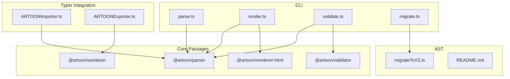
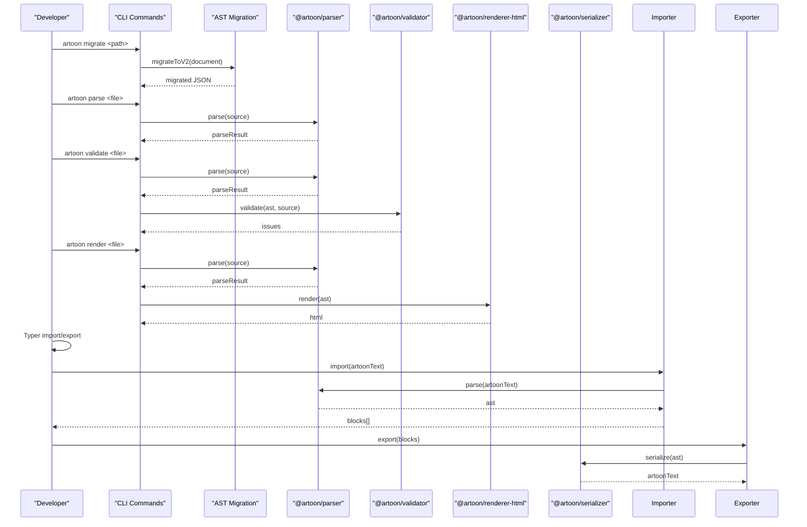
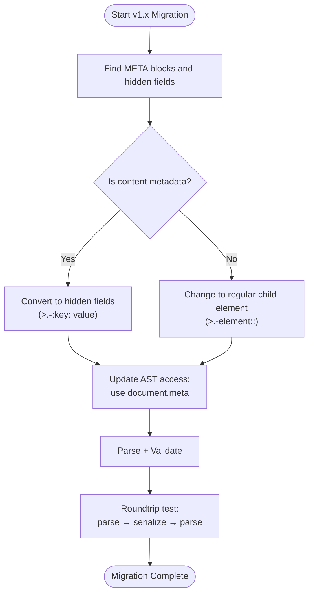
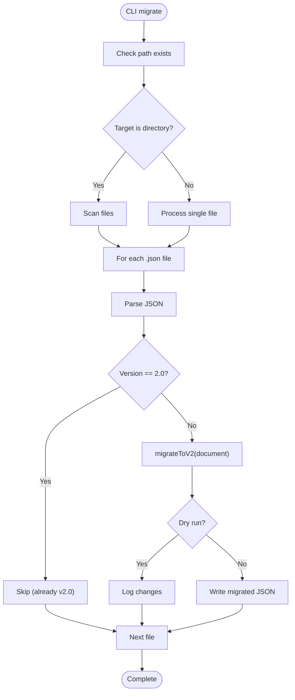
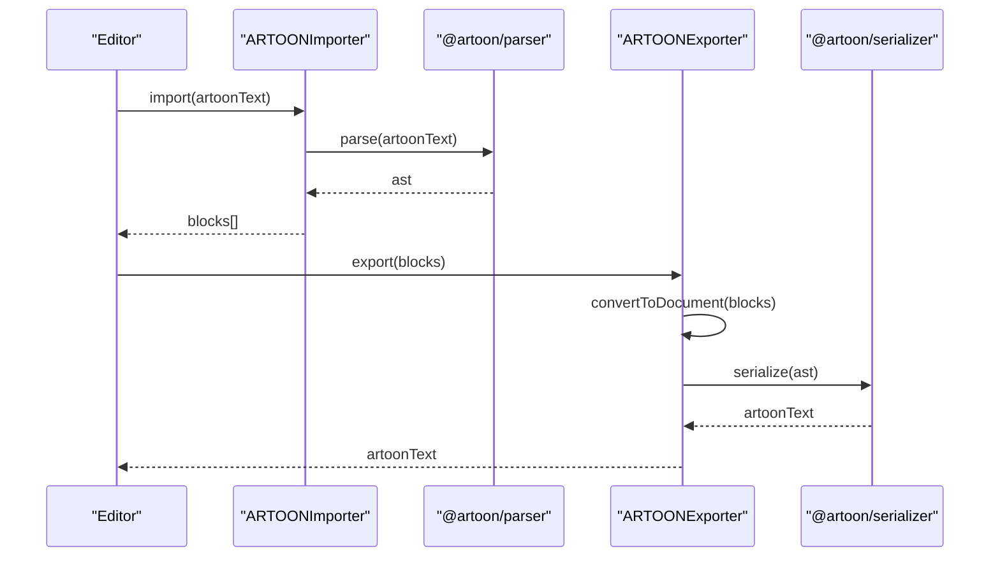
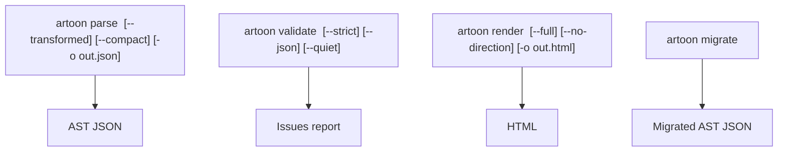
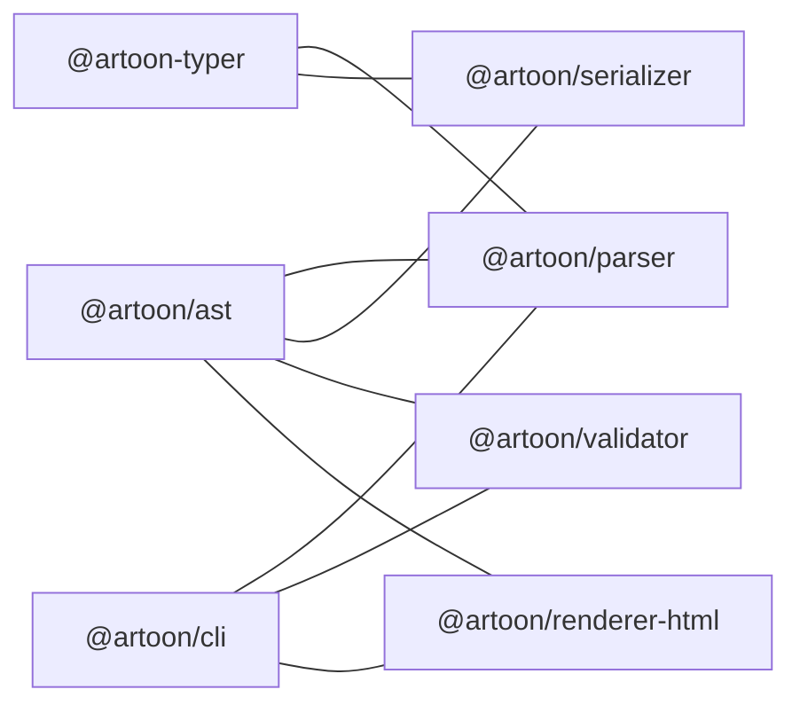

# Migration and Integration Guides

<cite>
**Referenced Files in This Document**
- [MIGRATION-GUIDE.md](file://docs/MIGRATION-GUIDE.md)
- [README.md](file://artoon-ast/README.md)
- [README.md](file://artoon-cli/README.md)
- [migrate.ts](file://artoon-cli/src/commands/migrate.ts)
- [migrateToV2.ts](file://artoon-ast/src/migration/index.ts)
- [parse.ts](file://artoon-cli/src/commands/parse.ts)
- [render.ts](file://artoon-cli/src/commands/render.ts)
- [validate.ts](file://artoon-cli/src/commands/validate.ts)
- [ARTOONImporter.ts](file://artoon-typer/src/integration/ARTOONImporter.ts)
- [ARTOONExporter.ts](file://artoon-typer/src/integration/ARTOONExporter.ts)
- [package.json](file://package.json)
</cite>

## Table of Contents
1. [Introduction](#introduction)
2. [Project Structure](#project-structure)
3. [Core Components](#core-components)
4. [Architecture Overview](#architecture-overview)
5. [Detailed Component Analysis](#detailed-component-analysis)
6. [Dependency Analysis](#dependency-analysis)
7. [Performance Considerations](#performance-considerations)
8. [Troubleshooting Guide](#troubleshooting-guide)
9. [Conclusion](#conclusion)
10. [Appendices](#appendices)

## Introduction
This document provides comprehensive migration and integration guidance for upgrading to ARTOON 2.0 and integrating ARTOON content into modern platforms and systems. It covers:
- Step-by-step migration from ARTOON v1.x and other content formats
- Automated migration tools and manual strategies
- Integration patterns for web applications, mobile apps, and backend services
- Database integration, content import/export workflows, and bulk migration procedures
- Validation strategies, rollback procedures, and quality assurance processes
- Troubleshooting and performance considerations for large-scale migrations

## Project Structure
The monorepo organizes ARTOON tooling into focused packages:
- CLI for parsing, rendering, validating, and migrating ARTOON documents
- AST for canonical schema and migration utilities
- Parser, Serializer, Validator, and Renderer-HTML for content lifecycle
- Typer integration for editor block import/export
- Examples and documentation for migration and integration

**Diagram sources**
- [parse.ts:1-66](file://artoon-cli/src/commands/parse.ts#L1-L66)
- [render.ts:1-63](file://artoon-cli/src/commands/render.ts#L1-L63)
- [validate.ts:1-150](file://artoon-cli/src/commands/validate.ts#L1-L150)
- [migrate.ts:1-56](file://artoon-cli/src/commands/migrate.ts#L1-L56)
- [migrateToV2.ts:1-76](file://artoon-ast/src/migration/index.ts#L1-L76)
- [ARTOONImporter.ts:1-779](file://artoon-typer/src/integration/ARTOONImporter.ts#L1-L779)
- [ARTOONExporter.ts:1-638](file://artoon-typer/src/integration/ARTOONExporter.ts#L1-L638)

**Section sources**
- [package.json:6-15](file://package.json#L6-L15)

## Core Components
- Migration tooling: CLI migrate command and AST migration utility
- Parsing, validation, and rendering pipeline via CLI
- Editor integration via importer/exporter for ARTOON blocks
- Monorepo orchestration for building and testing

Key capabilities:
- Automated migration of AST JSON from v1.x to v2.0
- Roundtrip validation (parse → serialize → parse)
- Editor import/export of ARTOON documents
- CLI-driven workflows for development and CI

**Section sources**
- [migrate.ts:1-56](file://artoon-cli/src/commands/migrate.ts#L1-L56)
- [migrateToV2.ts:1-76](file://artoon-ast/src/migration/index.ts#L1-L76)
- [parse.ts:1-66](file://artoon-cli/src/commands/parse.ts#L1-L66)
- [validate.ts:1-150](file://artoon-cli/src/commands/validate.ts#L1-L150)
- [render.ts:1-63](file://artoon-cli/src/commands/render.ts#L1-L63)
- [ARTOONImporter.ts:1-779](file://artoon-typer/src/integration/ARTOONImporter.ts#L1-L779)
- [ARTOONExporter.ts:1-638](file://artoon-typer/src/integration/ARTOONExporter.ts#L1-L638)

## Architecture Overview
The migration and integration pipeline centers around the CLI and AST migration utilities, with downstream integration through Typer’s importer/exporter.

**Diagram sources**
- [migrate.ts:1-56](file://artoon-cli/src/commands/migrate.ts#L1-L56)
- [migrateToV2.ts:1-76](file://artoon-ast/src/migration/index.ts#L1-L76)
- [parse.ts:1-66](file://artoon-cli/src/commands/parse.ts#L1-L66)
- [validate.ts:1-150](file://artoon-cli/src/commands/validate.ts#L1-L150)
- [render.ts:1-63](file://artoon-cli/src/commands/render.ts#L1-L63)
- [ARTOONImporter.ts:1-779](file://artoon-typer/src/integration/ARTOONImporter.ts#L1-L779)
- [ARTOONExporter.ts:1-638](file://artoon-typer/src/integration/ARTOONExporter.ts#L1-L638)

## Detailed Component Analysis

### Migration from ARTOON v1.x to 2.0
- Breaking change: META block is reserved and must contain only hidden fields; stored under document.meta
- Hidden fields restricted to META blocks; custom blocks must use regular child elements
- AST access updated to document.meta instead of searching children
- New validation rules enforce META restrictions and reserved names

Recommended steps:
- Identify META blocks and hidden fields
- Convert content to hidden fields (e.g., description → title/author)
- Move non-metadata content to custom blocks or regular child elements
- Update AST access code to use document.meta
- Validate with parser and run roundtrip tests

**Diagram sources**
- [MIGRATION-GUIDE.md:11-151](file://docs/MIGRATION-GUIDE.md#L11-L151)

**Section sources**
- [MIGRATION-GUIDE.md:11-151](file://docs/MIGRATION-GUIDE.md#L11-L151)

### Automated Migration Tooling
- CLI migrate command processes .json files, skipping already-v2.0 documents
- AST migrateToV2 utility performs deep cloning and structural updates:
  - nodeType → type
  - List children → items
  - Separators separators[] → separatorType
- Dry-run mode previews changes without writing files

**Diagram sources**
- [migrate.ts:1-56](file://artoon-cli/src/commands/migrate.ts#L1-L56)
- [migrateToV2.ts:1-76](file://artoon-ast/src/migration/index.ts#L1-L76)

**Section sources**
- [migrate.ts:1-56](file://artoon-cli/src/commands/migrate.ts#L1-L56)
- [migrateToV2.ts:1-76](file://artoon-ast/src/migration/index.ts#L1-L76)
- [README.md:61-69](file://artoon-ast/README.md#L61-L69)

### Editor Integration (Typer Import/Export)
- ARTOONImporter converts ARTOON text to editor blocks using @artoon/parser
- Handles META blocks, lists, tables, media, separators, and custom blocks
- ARTOONExporter serializes editor blocks back to ARTOON text using @artoon/serializer
- Both align with unified AST types and simplified structures

**Diagram sources**
- [ARTOONImporter.ts:142-182](file://artoon-typer/src/integration/ARTOONImporter.ts#L142-L182)
- [ARTOONExporter.ts:83-121](file://artoon-typer/src/integration/ARTOONExporter.ts#L83-L121)

**Section sources**
- [ARTOONImporter.ts:1-779](file://artoon-typer/src/integration/ARTOONImporter.ts#L1-L779)
- [ARTOONExporter.ts:1-638](file://artoon-typer/src/integration/ARTOONExporter.ts#L1-L638)

### CLI Workflows for Migration and QA
- Parse: Reads ARTOON, parses to AST, optionally transforms and outputs JSON
- Validate: Parses, transforms, validates with @artoon/validator, reports issues
- Render: Parses, transforms, renders HTML (partial or full document)
- Migrate: Processes AST JSON files to v2.0, supports dry-run and recursive directory processing

**Diagram sources**
- [parse.ts:1-66](file://artoon-cli/src/commands/parse.ts#L1-L66)
- [validate.ts:1-150](file://artoon-cli/src/commands/validate.ts#L1-L150)
- [render.ts:1-63](file://artoon-cli/src/commands/render.ts#L1-L63)
- [migrate.ts:1-56](file://artoon-cli/src/commands/migrate.ts#L1-L56)

**Section sources**
- [README.md:11-66](file://artoon-cli/README.md#L11-L66)
- [parse.ts:1-66](file://artoon-cli/src/commands/parse.ts#L1-L66)
- [validate.ts:1-150](file://artoon-cli/src/commands/validate.ts#L1-L150)
- [render.ts:1-63](file://artoon-cli/src/commands/render.ts#L1-L63)
- [migrate.ts:1-56](file://artoon-cli/src/commands/migrate.ts#L1-L56)

## Dependency Analysis
Monorepo workspaces define inter-package dependencies and shared scripts for building and testing.

**Diagram sources**
- [package.json:6-15](file://package.json#L6-L15)

**Section sources**
- [package.json:6-15](file://package.json#L6-L15)

## Performance Considerations
- Prefer batch processing with CLI migrate --recursive for large directories
- Use compact JSON output (--compact) to reduce I/O overhead during parse/validate
- Leverage dry-run to preview changes and avoid unnecessary writes
- For editor integration, minimize repeated parse/serialize cycles by caching intermediate AST where feasible
- Use roundtrip testing to detect silent regressions early

## Troubleshooting Guide
Common issues and resolutions:
- Hidden field errors: Ensure hidden fields appear only inside META blocks; otherwise convert to regular child elements
- META content errors: META blocks must contain only hidden fields; move non-metadata content to custom blocks
- AST access failures: Switch from searching children to reading document.meta
- Validation failures: Address parse errors first; then run validator with --strict to surface philosophy breaches
- Roundtrip mismatches: Confirm migrated AST matches original after serialize + parse

Rollback procedures:
- Keep backups of original files before migration
- Use dry-run to preview changes; confirm before writing
- For AST JSON, maintain a separate copy of pre-migration files

Quality assurance:
- Run parse + validate + render for representative documents
- Perform roundtrip tests to ensure fidelity
- Integrate CLI commands into CI for continuous validation

**Section sources**
- [MIGRATION-GUIDE.md:164-175](file://docs/MIGRATION-GUIDE.md#L164-L175)
- [validate.ts:22-149](file://artoon-cli/src/commands/validate.ts#L22-L149)
- [parse.ts:13-65](file://artoon-cli/src/commands/parse.ts#L13-L65)
- [render.ts:14-62](file://artoon-cli/src/commands/render.ts#L14-L62)

## Conclusion
ARTOON 2.0 introduces a focused set of breaking changes centered on META block semantics and AST normalization. The provided CLI, AST migration utilities, and Typer integration streamline migration and ongoing integration. By following the documented workflows—automated migration, validation, roundtrip testing, and robust rollback procedures—you can confidently transition existing content and integrate ARTOON into modern platforms.

## Appendices

### Migration Checklist
- Identify META blocks and hidden fields
- Convert content to hidden fields or regular child elements
- Update AST access code to use document.meta
- Validate with parser and run roundtrip tests
- Adjust renderer options if needed
- Integrate editor import/export flows

**Section sources**
- [MIGRATION-GUIDE.md:423-431](file://docs/MIGRATION-GUIDE.md#L423-L431)