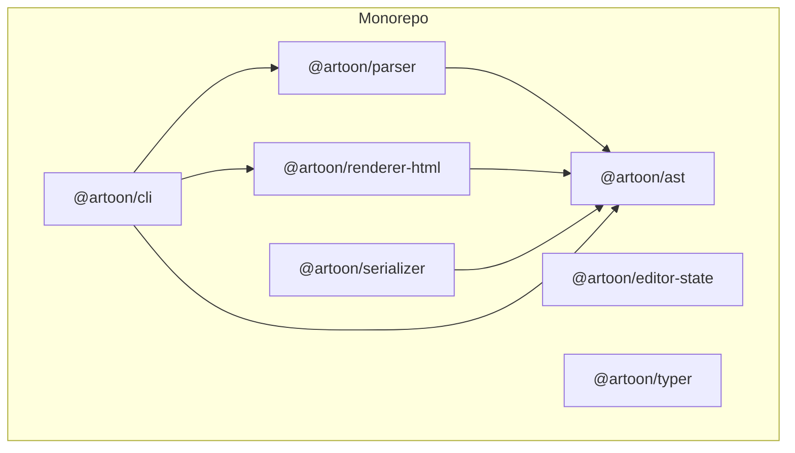
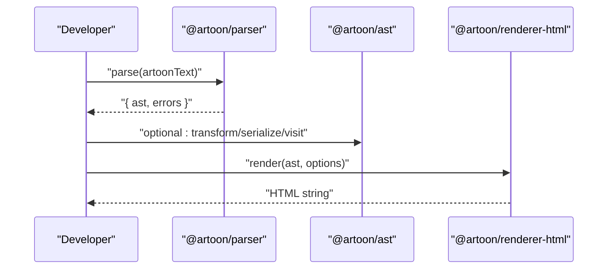
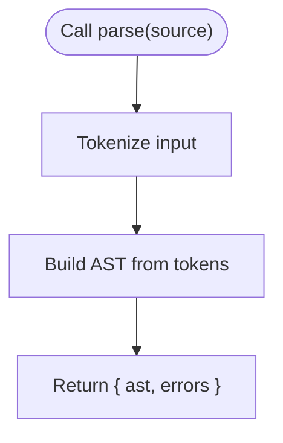
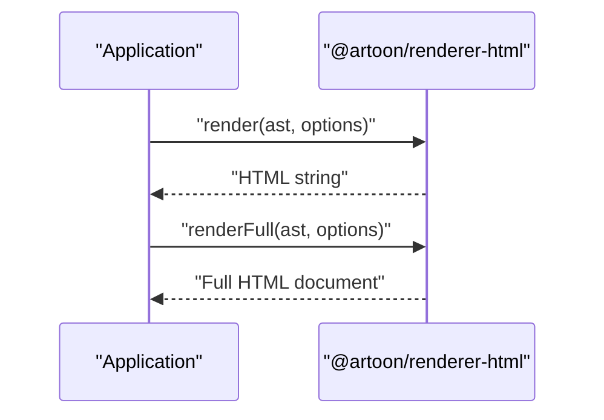
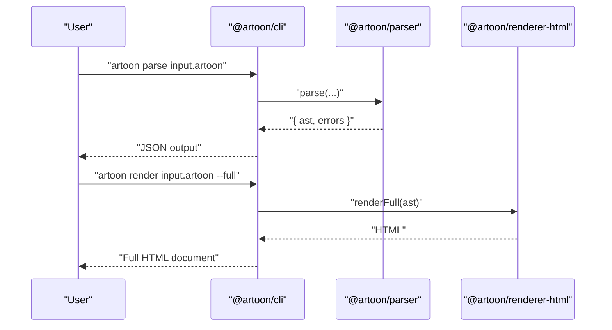
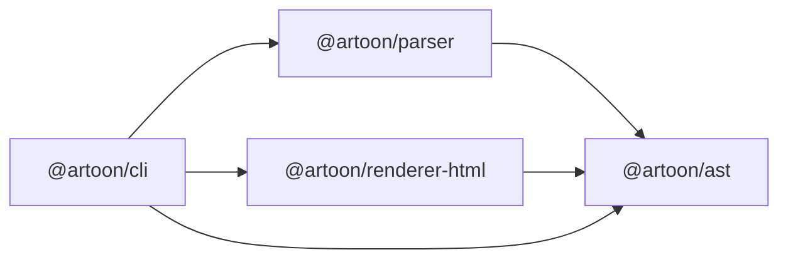

# Getting Started

<cite>
**Referenced Files in This Document**
- [README.md](file://README.md)
- [QUICK-REFERENCE-CARD.md](file://QUICK-REFERENCE-CARD.md)
- [package.json](file://package.json)
- [artoon-parser/package.json](file://artoon-parser/package.json)
- [artoon-renderer-html/package.json](file://artoon-renderer-html/package.json)
- [artoon-ast/package.json](file://artoon-ast/package.json)
- [artoon-cli/package.json](file://artoon-cli/package.json)
- [artoon-parser/src/index.ts](file://artoon-parser/src/index.ts)
- [artoon-renderer-html/src/index.ts](file://artoon-renderer-html/src/index.ts)
- [artoon-ast/src/index.ts](file://artoon-ast/src/index.ts)
- [artoon-cli/src/index.ts](file://artoon-cli/src/index.ts)
- [samples/01-text-components.artoon](file://samples/01-text-components.artoon)
- [samples/02-links-media.artoon](file://samples/02-links-media.artoon)
- [samples/03-separators.artoon](file://samples/03-separators.artoon)
- [samples/04-code.artoon](file://samples/04-code.artoon)
- [artoon-examples/test-blocks/01-meta-block.artoon](file://artoon-examples/test-blocks/01-meta-block.artoon)
- [artoon-examples/test-blocks/02-code-block.artoon](file://artoon-examples/test-blocks/02-code-block.artoon)
</cite>

## Table of Contents
1. [Introduction](#introduction)
2. [Project Structure](#project-structure)
3. [Core Components](#core-components)
4. [Architecture Overview](#architecture-overview)
5. [Detailed Component Analysis](#detailed-component-analysis)
6. [Dependency Analysis](#dependency-analysis)
7. [Performance Considerations](#performance-considerations)
8. [Troubleshooting Guide](#troubleshooting-guide)
9. [Conclusion](#conclusion)
10. [Appendices](#appendices)

## Introduction
ARTOON 2.0 is an AI-native structured content format optimized for reliable machine parsing and human readability. It enables AI systems to generate consistent, semantic-rich documents and powers efficient database storage and transformations. This guide helps you install, configure, and use ARTOON quickly, covering:
- Environment and tooling requirements
- Installing core packages via npm
- Creating your first ARTOON document
- Parsing ARTOON text to AST
- Rendering AST to HTML
- Practical examples for metadata, formatting, and blocks
- Development setup, IDE tips, and debugging

## Project Structure
At a high level, ARTOON 2.0 is a monorepo with focused packages:
- Parser: converts ARTOON text into a canonical AST
- AST: shared types and utilities for ARTOON nodes
- Serializer: transforms AST back into ARTOON text
- Renderer (HTML): renders AST to HTML
- CLI: command-line tools for parse, render, validate, lint, and migrate
- Editor state and Typer: advanced editor integrations (in progress)

**Diagram sources**
- [package.json:6-16](file://package.json#L6-L16)
- [artoon-parser/package.json:1-23](file://artoon-parser/package.json#L1-L23)
- [artoon-ast/package.json:1-25](file://artoon-ast/package.json#L1-L25)
- [artoon-renderer-html/package.json:1-27](file://artoon-renderer-html/package.json#L1-L27)
- [artoon-cli/package.json:1-34](file://artoon-cli/package.json#L1-L34)

**Section sources**
- [package.json:1-39](file://package.json#L1-L39)

## Core Components
- Parser: exposes parse, parseStrict, validate, and isValid to turn ARTOON text into a Document AST and error set.
- AST: provides canonical types, builder utilities, serialization helpers, and transform APIs.
- Renderer (HTML): renders ARTOON AST to HTML or a full HTML document with configurable options.
- CLI: provides commands to parse, render, validate/lint, and migrate ARTOON documents.

Key entry points:
- Parser: [artoon-parser/src/index.ts:56-100](file://artoon-parser/src/index.ts#L56-L100)
- AST: [artoon-ast/src/index.ts:1-51](file://artoon-ast/src/index.ts#L1-L51)
- Renderer: [artoon-renderer-html/src/index.ts:19-57](file://artoon-renderer-html/src/index.ts#L19-L57)
- CLI: [artoon-cli/src/index.ts:10-61](file://artoon-cli/src/index.ts#L10-L61)

**Section sources**
- [artoon-parser/src/index.ts:56-100](file://artoon-parser/src/index.ts#L56-L100)
- [artoon-ast/src/index.ts:1-51](file://artoon-ast/src/index.ts#L1-L51)
- [artoon-renderer-html/src/index.ts:19-57](file://artoon-renderer-html/src/index.ts#L19-L57)
- [artoon-cli/src/index.ts:10-61](file://artoon-cli/src/index.ts#L10-L61)

## Architecture Overview
The typical workflow is:
1. Author ARTOON text
2. Parse to AST using @artoon/parser
3. Optionally transform or serialize AST using @artoon/ast utilities
4. Render to HTML using @artoon/renderer-html
5. Optionally validate or lint using @artoon/cli

**Diagram sources**
- [artoon-parser/src/index.ts:56-100](file://artoon-parser/src/index.ts#L56-L100)
- [artoon-ast/src/index.ts:13-46](file://artoon-ast/src/index.ts#L13-L46)
- [artoon-renderer-html/src/index.ts:19-57](file://artoon-renderer-html/src/index.ts#L19-L57)

## Detailed Component Analysis

### Installation and Setup
- Install core packages:
  - @artoon/parser
  - @artoon/renderer-html
- CLI is available via @artoon/cli for command-line workflows.

Environment requirements:
- Node.js LTS recommended
- npm 8+ (for workspaces and modern package linking)
- TypeScript 5.x for authoring (if extending)

Quick install and minimal usage are demonstrated in the repository’s top-level README and quick reference card.

**Section sources**
- [README.md:20-44](file://README.md#L20-L44)
- [QUICK-REFERENCE-CARD.md:58-87](file://QUICK-REFERENCE-CARD.md#L58-L87)
- [artoon-parser/package.json:1-23](file://artoon-parser/package.json#L1-L23)
- [artoon-renderer-html/package.json:1-27](file://artoon-renderer-html/package.json#L1-L27)
- [artoon-cli/package.json:1-34](file://artoon-cli/package.json#L1-L34)

### Your First ARTOON Document
Create a simple ARTOON document with metadata and basic text components. Example patterns:
- Metadata block: <meta>...<.meta>
- Headings: <.t1>, <.t2>, ...
- Paragraphs: <.p>
- Inline formatting: [s:: bold], [e:: emphasis], etc.

See representative samples:
- Text components: [samples/01-text-components.artoon:1-85](file://samples/01-text-components.artoon#L1-L85)
- Links and media: [samples/02-links-media.artoon:1-65](file://samples/02-links-media.artoon#L1-L65)
- Separators: [samples/03-separators.artoon:1-43](file://samples/03-separators.artoon#L1-L43)
- Code: [samples/04-code.artoon:1-120](file://samples/04-code.artoon#L1-L120)

**Section sources**
- [samples/01-text-components.artoon:1-85](file://samples/01-text-components.artoon#L1-L85)
- [samples/02-links-media.artoon:1-65](file://samples/02-links-media.artoon#L1-L65)
- [samples/03-separators.artoon:1-43](file://samples/03-separators.artoon#L1-L43)
- [samples/04-code.artoon:1-120](file://samples/04-code.artoon#L1-L120)

### Parsing ARTOON Text to AST
- Use parse(source) to get { ast, errors }.
- Use parseStrict(source) to throw on errors.
- Use validate(source) to collect errors without building AST.
- Use isValid(source) to check validity.

**Diagram sources**
- [artoon-parser/src/index.ts:56-100](file://artoon-parser/src/index.ts#L56-L100)

**Section sources**
- [artoon-parser/src/index.ts:56-100](file://artoon-parser/src/index.ts#L56-L100)

### Rendering AST to HTML
- Use render(ast, options?) to produce HTML fragments.
- Use renderFull(ast, options?) to produce a full HTML document.
- Use createRenderer(options) to reuse default options across renders.

**Diagram sources**
- [artoon-renderer-html/src/index.ts:19-57](file://artoon-renderer-html/src/index.ts#L19-L57)

**Section sources**
- [artoon-renderer-html/src/index.ts:19-57](file://artoon-renderer-html/src/index.ts#L19-L57)

### Practical Examples

#### Metadata Handling
- Use the reserved <meta> block to define fields like title, author, date, version, lang, description, keywords, category, type, status, license, copyright, tags, and hidden fields with >.-:key: value.
- Hidden fields are prefixed with >.-: and are not rendered visually.

Example:
- [artoon-examples/test-blocks/01-meta-block.artoon:1-61](file://artoon-examples/test-blocks/01-meta-block.artoon#L1-L61)

**Section sources**
- [artoon-examples/test-blocks/01-meta-block.artoon:1-61](file://artoon-examples/test-blocks/01-meta-block.artoon#L1-L61)

#### Text Formatting
- Bold: [s:: ...]
- Italic: [e:: ...]
- Underline: [u:: ...]
- Strikethrough: [d:: ...]
- Mark/highlight: [mark:: ...]
- Subscript/superscript: [sub:: ...], [sup:: ...]

Examples:
- [samples/01-text-components.artoon:33-38](file://samples/01-text-components.artoon#L33-L38)

**Section sources**
- [samples/01-text-components.artoon:33-38](file://samples/01-text-components.artoon#L33-L38)

#### Basic Block Usage
- Headings: <.t1> through <.t6>
- Paragraphs: <.p>
- Quotes: <.q>
- Preformatted text: <.pre>
- Horizontal rule: <.hr>
- Line break: <.br>
- Word break opportunity: <.wbr>
- Links: <.a:: url> or <.a:: url; label>
- Images: <.img:: path> or <.img:: path; alt>
- Videos: <.video:: path>
- Audio: <.audio:: path>
- Files: <.file:: path>
- Code blocks: <code:lang>. ... .<code> or <code>. ... .<code>

Examples:
- [samples/01-text-components.artoon:11-85](file://samples/01-text-components.artoon#L11-L85)
- [samples/02-links-media.artoon:1-65](file://samples/02-links-media.artoon#L1-L65)
- [samples/03-separators.artoon:1-43](file://samples/03-separators.artoon#L1-L43)
- [samples/04-code.artoon:1-120](file://samples/04-code.artoon#L1-L120)
- [artoon-examples/test-blocks/02-code-block.artoon:1-100](file://artoon-examples/test-blocks/02-code-block.artoon#L1-L100)

**Section sources**
- [samples/01-text-components.artoon:11-85](file://samples/01-text-components.artoon#L11-L85)
- [samples/02-links-media.artoon:1-65](file://samples/02-links-media.artoon#L1-L65)
- [samples/03-separators.artoon:1-43](file://samples/03-separators.artoon#L1-L43)
- [samples/04-code.artoon:1-120](file://samples/04-code.artoon#L1-L120)
- [artoon-examples/test-blocks/02-code-block.artoon:1-100](file://artoon-examples/test-blocks/02-code-block.artoon#L1-L100)

### CLI Workflows
Common commands:
- Parse to JSON AST: artoon parse <file> [-o output] [--compact] [--transformed]
- Render to HTML: artoon render <file> [-o output] [--full] [--no-direction]
- Validate/Lint: artoon validate <file> [-s strict] [-q quiet] [--json]
- Migrate legacy documents: artoon migrate <path> [--dry-run]

**Diagram sources**
- [artoon-cli/src/index.ts:17-58](file://artoon-cli/src/index.ts#L17-L58)
- [artoon-parser/src/index.ts:56-100](file://artoon-parser/src/index.ts#L56-L100)
- [artoon-renderer-html/src/index.ts:29-34](file://artoon-renderer-html/src/index.ts#L29-L34)

**Section sources**
- [artoon-cli/src/index.ts:17-58](file://artoon-cli/src/index.ts#L17-L58)

## Dependency Analysis
Package-level dependencies:
- @artoon/parser depends on internal lexer/ast and exports parse/validation utilities.
- @artoon/ast provides canonical types, builder API, serialization, and transform utilities; it re-exports unified types and compat helpers.
- @artoon/renderer-html depends on @artoon/ast and exposes render/renderFull/createRenderer.
- @artoon/cli depends on @artoon/parser, @artoon/ast, @artoon/renderer-html, and @artoon/validator, and wires up commands.

**Diagram sources**
- [artoon-parser/package.json:1-23](file://artoon-parser/package.json#L1-L23)
- [artoon-ast/package.json:1-25](file://artoon-ast/package.json#L1-L25)
- [artoon-renderer-html/package.json:1-27](file://artoon-renderer-html/package.json#L1-L27)
- [artoon-cli/package.json:18-25](file://artoon-cli/package.json#L18-L25)

**Section sources**
- [artoon-parser/package.json:1-23](file://artoon-parser/package.json#L1-L23)
- [artoon-ast/package.json:1-25](file://artoon-ast/package.json#L1-L25)
- [artoon-renderer-html/package.json:1-27](file://artoon-renderer-html/package.json#L1-L27)
- [artoon-cli/package.json:18-25](file://artoon-cli/package.json#L18-L25)

## Performance Considerations
- Prefer parseStrict when you need fail-fast behavior during development or CI.
- Use compact JSON output for CLI parse operations to reduce I/O overhead.
- For repeated renders, cache or reuse a renderer instance via createRenderer to avoid repeated option merges.
- Keep ARTOON documents modular to minimize large single-file parsing workloads.

## Troubleshooting Guide
- Installation fails due to missing Node or npm versions:
  - Ensure Node.js LTS and npm 8+ are installed.
  - Confirm TypeScript 5.x is available if authoring in TypeScript.
- parseStrict throws errors:
  - Review the returned error messages and fix syntax issues indicated by line numbers.
- Unexpected HTML output:
  - Verify AST correctness by parsing to JSON and inspecting the AST.
  - Check direction attributes and full document options.
- CLI not found:
  - Ensure @artoon/cli is installed globally or invoked via npx.
  - Confirm bin entry exists and PATH includes local binaries.

**Section sources**
- [artoon-parser/src/index.ts:68-79](file://artoon-parser/src/index.ts#L68-L79)
- [artoon-cli/src/index.ts:10-61](file://artoon-cli/src/index.ts#L10-L61)

## Conclusion
You now have the essentials to start building with ARTOON 2.0:
- Install @artoon/parser and @artoon/renderer-html
- Author ARTOON documents with metadata, formatting, and blocks
- Parse to AST and render to HTML
- Use the CLI for validation and conversion
- Explore examples and samples to accelerate your workflow

## Appendices

### Appendix A: Quick Start Commands
- Install core packages:
  - npm install @artoon/parser @artoon/renderer-html
- Minimal TypeScript usage:
  - Import parse from @artoon/parser and render from @artoon/renderer-html
  - Parse ARTOON text and render to HTML

**Section sources**
- [README.md:20-44](file://README.md#L20-L44)
- [QUICK-REFERENCE-CARD.md:58-87](file://QUICK-REFERENCE-CARD.md#L58-L87)

### Appendix B: Representative Samples
- Text components: [samples/01-text-components.artoon:1-85](file://samples/01-text-components.artoon#L1-L85)
- Links and media: [samples/02-links-media.artoon:1-65](file://samples/02-links-media.artoon#L1-L65)
- Separators: [samples/03-separators.artoon:1-43](file://samples/03-separators.artoon#L1-L43)
- Code: [samples/04-code.artoon:1-120](file://samples/04-code.artoon#L1-L120)
- Metadata block: [artoon-examples/test-blocks/01-meta-block.artoon:1-61](file://artoon-examples/test-blocks/01-meta-block.artoon#L1-L61)
- Code block: [artoon-examples/test-blocks/02-code-block.artoon:1-100](file://artoon-examples/test-blocks/02-code-block.artoon#L1-L100)

**Section sources**
- [samples/01-text-components.artoon:1-85](file://samples/01-text-components.artoon#L1-L85)
- [samples/02-links-media.artoon:1-65](file://samples/02-links-media.artoon#L1-L65)
- [samples/03-separators.artoon:1-43](file://samples/03-separators.artoon#L1-L43)
- [samples/04-code.artoon:1-120](file://samples/04-code.artoon#L1-L120)
- [artoon-examples/test-blocks/01-meta-block.artoon:1-61](file://artoon-examples/test-blocks/01-meta-block.artoon#L1-L61)
- [artoon-examples/test-blocks/02-code-block.artoon:1-100](file://artoon-examples/test-blocks/02-code-block.artoon#L1-L100)