# Architecture Overview

<cite>
**Referenced Files in This Document**
- [package.json](file://package.json)
- [artoon-parser/package.json](file://artoon-parser/package.json)
- [artoon-ast/package.json](file://artoon-ast/package.json)
- [artoon-serializer/package.json](file://artoon-serializer/package.json)
- [artoon-renderer-html/package.json](file://artoon-renderer-html/package.json)
- [artoon-cli/package.json](file://artoon-cli/package.json)
- [artoon-validator/package.json](file://artoon-validator/package.json)
- [artoon-editor-state/package.json](file://artoon-editor-state/package.json)
- [artoon-typer/package.json](file://artoon-typer/package.json)
- [artoon-parser/src/index.ts](file://artoon-parser/src/index.ts)
- [artoon-ast/src/index.ts](file://artoon-ast/src/index.ts)
- [artoon-serializer/src/index.ts](file://artoon-serializer/src/index.ts)
- [artoon-renderer-html/src/index.ts](file://artoon-renderer-html/src/index.ts)
- [artoon-cli/src/index.ts](file://artoon-cli/src/index.ts)
- [artoon-validator/src/index.ts](file://artoon-validator/src/index.ts)
- [artoon-editor-state/src/index.ts](file://artoon-editor-state/src/index.ts)
- [artoon-typer/src/index.ts](file://artoon-typer/src/index.ts)
</cite>

## Table of Contents
1. [Introduction](#introduction)
2. [Project Structure](#project-structure)
3. [Core Components](#core-components)
4. [Architecture Overview](#architecture-overview)
5. [Detailed Component Analysis](#detailed-component-analysis)
6. [Dependency Analysis](#dependency-analysis)
7. [Performance Considerations](#performance-considerations)
8. [Troubleshooting Guide](#troubleshooting-guide)
9. [Conclusion](#conclusion)
10. [Appendices](#appendices)

## Introduction
This document describes the ARTOON 2.0 monorepo architecture and the end-to-end processing pipeline that transforms ARTOON text into structured output. The system is organized as nine specialized packages that collaborate around a shared AST and a set of transformation utilities. The pipeline flows from parsing ARTOON text into a canonical AST, validating the AST against semantic and structural rules, serializing the AST back to ARTOON text, and rendering the AST to HTML. Two user-facing integration points exist: a CLI for batch operations and a React-based visual editor (Typer) that manages ARTOON document state and UI.

## Project Structure
The monorepo uses npm workspaces to manage nine packages. The top-level configuration declares the workspaces and provides convenience scripts for building and testing all packages in parallel. Each package defines its own TypeScript build, tests, and internal exports.

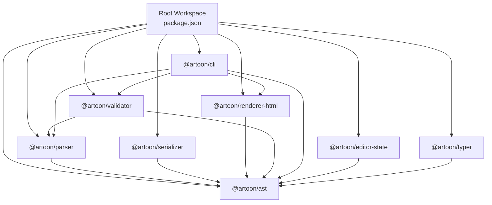

**Diagram sources**
- [package.json:6-15](file://package.json#L6-L15)

**Section sources**
- [package.json:1-38](file://package.json#L1-L38)

## Core Components
This section introduces the nine packages and their roles in the ARTOON 2.0 ecosystem.

- @artoon/parser: Lexical analysis and AST construction from ARTOON text. Provides parse, parseStrict, validate, and isValid APIs, plus tokenization and inline conversion utilities.
- @artoon/ast: Canonical AST types and utilities. Exposes unified types, compatibility helpers, serialization helpers, node utilities, builder API, and migration tools.
- @artoon/serializer: Serializes AST back to ARTOON text, supporting options for blank-line separation, comment preservation, and line endings.
- @artoon-validator: Validates ASTs and raw ARTOON text against categorized rules (syntax, structure, semantics, constraints, philosophy) and formats reports.
- @artoon/renderer-html: Renders AST to HTML, with options for full HTML documents and direction-aware attributes.
- @artoon-cli: Command-line interface exposing parse, render, validate/lint, and migrate commands.
- @artoon-editor-state: Framework-agnostic editor state model inspired by ProseMirror, enabling transactions, selections, plugins, and history.
- @artoon/typer: React-based block editor integrating ARTOON editing with a visual UI, including block views, inline formatting, drag-and-drop, and theme support.

**Section sources**
- [artoon-parser/src/index.ts:1-119](file://artoon-parser/src/index.ts#L1-L119)
- [artoon-ast/src/index.ts:1-51](file://artoon-ast/src/index.ts#L1-L51)
- [artoon-serializer/src/index.ts:1-95](file://artoon-serializer/src/index.ts#L1-L95)
- [artoon-validator/src/index.ts:1-30](file://artoon-validator/src/index.ts#L1-L30)
- [artoon-renderer-html/src/index.ts:1-57](file://artoon-renderer-html/src/index.ts#L1-L57)
- [artoon-cli/src/index.ts:1-61](file://artoon-cli/src/index.ts#L1-L61)
- [artoon-editor-state/src/index.ts:1-192](file://artoon-editor-state/src/index.ts#L1-L192)
- [artoon-typer/src/index.ts:1-270](file://artoon-typer/src/index.ts#L1-L270)

## Architecture Overview
The ARTOON 2.0 pipeline is a staged transformation system:

1. Input: ARTOON text.
2. Parsing: Tokenization and AST construction.
3. Validation: Rule-based checks against AST and/or raw text.
4. Serialization: AST to ARTOON text with configurable options.
5. Rendering: AST to HTML with direction-aware attributes and optional full document wrapper.

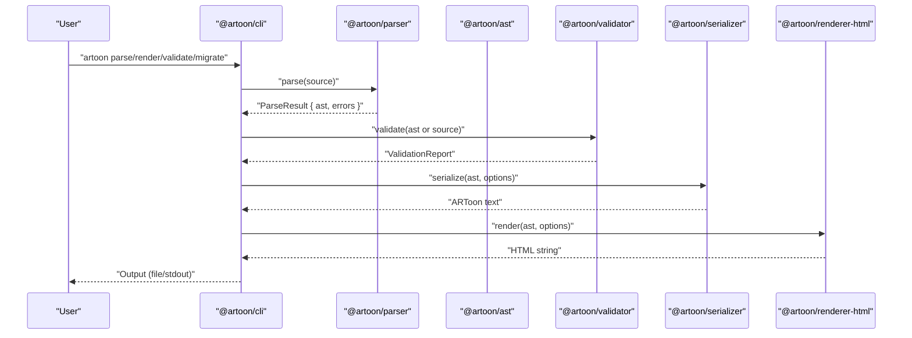

**Diagram sources**
- [artoon-cli/src/index.ts:17-58](file://artoon-cli/src/index.ts#L17-L58)
- [artoon-parser/src/index.ts:56-100](file://artoon-parser/src/index.ts#L56-L100)
- [artoon-validator/src/index.ts:7-12](file://artoon-validator/src/index.ts#L7-L12)
- [artoon-serializer/src/index.ts:17-59](file://artoon-serializer/src/index.ts#L17-L59)
- [artoon-renderer-html/src/index.ts:19-34](file://artoon-renderer-html/src/index.ts#L19-L34)

## Detailed Component Analysis

### Parser Package
The parser converts ARTOON text into a structured AST. It exposes:
- parse(source): Returns a ParseResult containing AST and errors.
- parseStrict(source): Throws on errors.
- validate(source)/isValid(source): Lightweight validation without full AST.
- tokenize/tokenizeLine: Low-level tokenization.
- inline converters and context utilities.

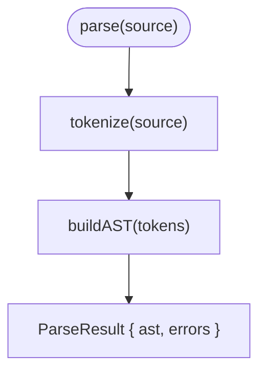

**Diagram sources**
- [artoon-parser/src/index.ts:56-79](file://artoon-parser/src/index.ts#L56-L79)

**Section sources**
- [artoon-parser/src/index.ts:1-119](file://artoon-parser/src/index.ts#L1-L119)

### AST Package
The AST package centralizes canonical types and utilities:
- Unified type exports and compatibility helpers.
- Serialization helpers (toJSON/fromJSON, compact JSON, clone, stats).
- Node utilities (creation, traversal, filtering, text extraction).
- Builder API and migration tools.

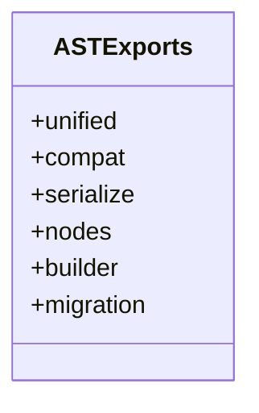

**Diagram sources**
- [artoon-ast/src/index.ts:4-45](file://artoon-ast/src/index.ts#L4-L45)

**Section sources**
- [artoon-ast/src/index.ts:1-51](file://artoon-ast/src/index.ts#L1-L51)

### Serializer Package
Serializes AST to ARTOON text with options:
- Blank-line separation between content nodes.
- Comment preservation toggles.
- Line ending customization.
- Support for META blocks and mixed meta forms.

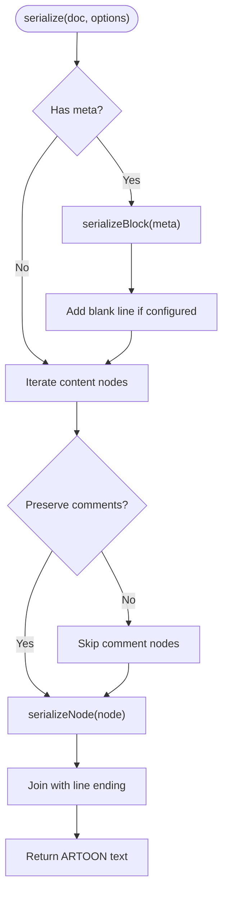

**Diagram sources**
- [artoon-serializer/src/index.ts:17-59](file://artoon-serializer/src/index.ts#L17-L59)

**Section sources**
- [artoon-serializer/src/index.ts:1-95](file://artoon-serializer/src/index.ts#L1-L95)

### Validator Package
Provides validation engines and rule sets:
- validate/isValid/validateStrict/formatReport.
- Categorized rules: syntaxRules, structureRules, semanticRules, constraintRules, philosophyRules.
- Error creation utilities and standardized error codes.

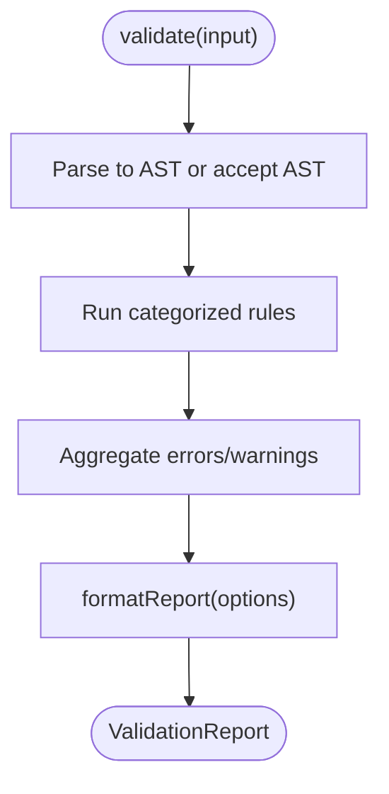

**Diagram sources**
- [artoon-validator/src/index.ts:7-21](file://artoon-validator/src/index.ts#L7-L21)

**Section sources**
- [artoon-validator/src/index.ts:1-30](file://artoon-validator/src/index.ts#L1-L30)

### Renderer-HTML Package
Renders AST to HTML:
- render(doc, options) and renderFull(doc, options).
- Utility helpers for escaping and HTML attribute generation.
- Direction-aware rendering and full document wrappers.

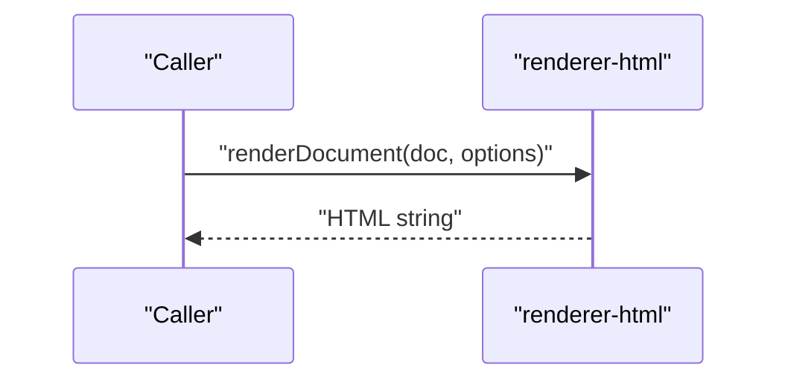

**Diagram sources**
- [artoon-renderer-html/src/index.ts:19-34](file://artoon-renderer-html/src/index.ts#L19-L34)

**Section sources**
- [artoon-renderer-html/src/index.ts:1-57](file://artoon-renderer-html/src/index.ts#L1-L57)

### CLI Package
The CLI orchestrates the pipeline via commands:
- parse: Outputs AST as JSON (with optional canonical transformation).
- render: Outputs HTML (with optional full document).
- validate/lint: Reports validation results (with strict mode and JSON output).
- migrate: Upgrades legacy ARTOON documents to V2.

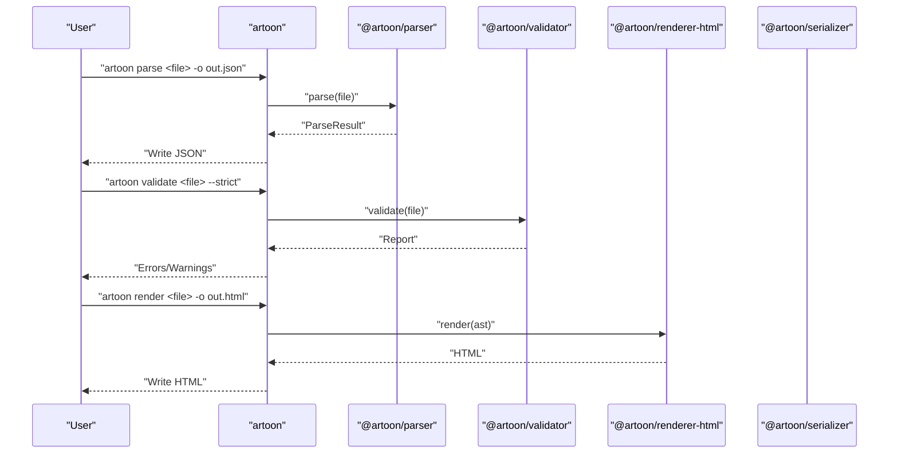

**Diagram sources**
- [artoon-cli/src/index.ts:17-58](file://artoon-cli/src/index.ts#L17-L58)

**Section sources**
- [artoon-cli/src/index.ts:1-61](file://artoon-cli/src/index.ts#L1-L61)

### Editor-State Package
Provides a framework-agnostic state model for ARTOON documents:
- Document, Fragment, Slice, ResolvedPos.
- Selections (text, node, all).
- Transactions and steps (replace, add/remove mark, set attrs).
- History management and plugin system.
- Commands for text and formatting actions.

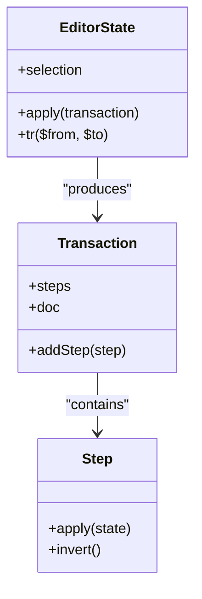

**Diagram sources**
- [artoon-editor-state/src/index.ts:82-120](file://artoon-editor-state/src/index.ts#L82-L120)

**Section sources**
- [artoon-editor-state/src/index.ts:1-192](file://artoon-editor-state/src/index.ts#L1-L192)

### Typer Editor Package
A React-based block editor integrating ARTOON editing:
- Core managers: EditorController, BlockRegistry, CommandManager, KeyboardManager, DragDropManager.
- Integration adapters: StateAdapter, ARTOONImporter, ARTOONExporter.
- Block views: Text, List, Code, Media, Divider, Table, etc.
- Inline formatting: InlineParser, InlineRenderer, MarkManager.
- UI components and hooks for editor container, block renderer, add menu, inline toolbar, context menu.
- Theme provider and preferences.

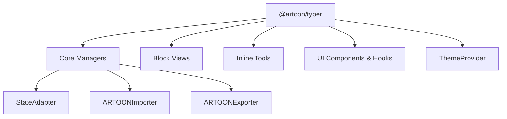

**Diagram sources**
- [artoon-typer/src/index.ts:75-115](file://artoon-typer/src/index.ts#L75-L115)
- [artoon-typer/src/index.ts:121-163](file://artoon-typer/src/index.ts#L121-L163)
- [artoon-typer/src/index.ts:169-186](file://artoon-typer/src/index.ts#L169-L186)
- [artoon-typer/src/index.ts:192-221](file://artoon-typer/src/index.ts#L192-L221)
- [artoon-typer/src/index.ts:226-249](file://artoon-typer/src/index.ts#L226-L249)
- [artoon-typer/src/index.ts:255-263](file://artoon-typer/src/index.ts#L255-L263)

**Section sources**
- [artoon-typer/src/index.ts:1-270](file://artoon-typer/src/index.ts#L1-L270)

## Dependency Analysis
The packages form a directed acyclic graph centered on @artoon/ast. The CLI depends on all major packages to provide end-to-end functionality. The editor-state package declares optional peer dependencies on validator and serializer to enable optional integrations.

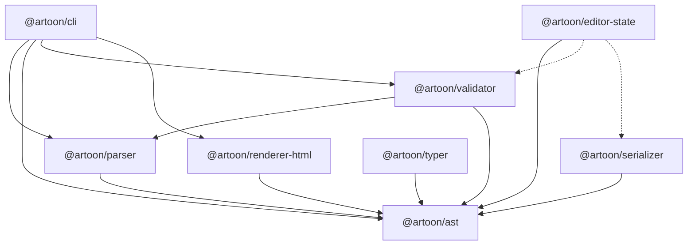

**Diagram sources**
- [artoon-parser/package.json:14-16](file://artoon-parser/package.json#L14-L16)
- [artoon-serializer/package.json:14-16](file://artoon-serializer/package.json#L14-L16)
- [artoon-renderer-html/package.json:15-17](file://artoon-renderer-html/package.json#L15-L17)
- [artoon-validator/package.json:14-16](file://artoon-validator/package.json#L14-L16)
- [artoon-cli/package.json:18-25](file://artoon-cli/package.json#L18-L25)
- [artoon-editor-state/package.json:30-32](file://artoon-editor-state/package.json#L30-L32)
- [artoon-editor-state/package.json:41-52](file://artoon-editor-state/package.json#L41-L52)

**Section sources**
- [artoon-editor-state/package.json:41-52](file://artoon-editor-state/package.json#L41-L52)

## Performance Considerations
- Parsing and AST construction: Keep input sizes reasonable; use parseStrict only when errors must abort processing.
- Validation: Prefer streaming validation for large files; leverage categorization to run only necessary rule sets.
- Serialization: Disable blank-line separation and comment preservation when not needed to reduce output size and processing time.
- Rendering: Cache rendered fragments when repeatedly updating small parts of a document; avoid unnecessary full re-renders.
- CLI usage: Parallelize across files using external orchestration; limit verbose output in CI environments.

## Troubleshooting Guide
- Parse failures: Use parseStrict to surface errors immediately; inspect ParseResult.errors for line-specific messages.
- Validation warnings vs. errors: Use validate with strict mode to treat warnings as errors; formatReport for structured output.
- Round-trip fidelity: Serialize with preserveComments enabled and blankLinesBetween disabled to minimize differences.
- Direction and bidi: Ensure direction attributes are preserved during render; verify inline direction markers are consistent.
- Editor state inconsistencies: Use transactions and steps; check step invertibility and apply history commands carefully.

**Section sources**
- [artoon-parser/src/index.ts:68-79](file://artoon-parser/src/index.ts#L68-L79)
- [artoon-validator/src/index.ts:7-12](file://artoon-validator/src/index.ts#L7-L12)
- [artoon-serializer/src/index.ts:17-59](file://artoon-serializer/src/index.ts#L17-L59)
- [artoon-renderer-html/src/index.ts:19-34](file://artoon-renderer-html/src/index.ts#L19-L34)

## Conclusion
ARTOON 2.0’s monorepo cleanly separates concerns across parsing, AST canonicalization, validation, serialization, and rendering. The CLI and Typer serve complementary integration points—batch processing and interactive editing—while the editor-state package enables framework-agnostic state management. Dependencies are intentionally minimal and unidirectional, anchored by @artoon/ast, ensuring consistency and maintainability across all packages.

## Appendices

### Technology Stack and Build System
- Language: TypeScript 5.x across all packages.
- Build: tsc per package; Vite for @artoon/typer UI builds.
- Testing: Jest for most packages; Vitest for @artoon/typer.
- Workspaces: npm workspaces at the root; scripts to build/test all packages in parallel.

**Section sources**
- [package.json:16-31](file://package.json#L16-L31)
- [artoon-typer/package.json:20-28](file://artoon-typer/package.json#L20-L28)