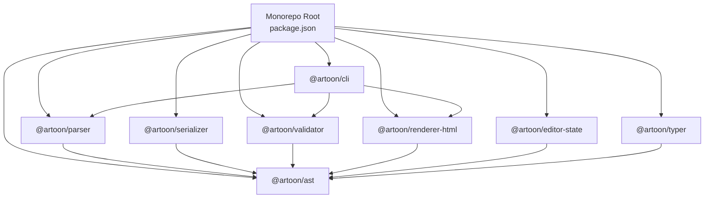
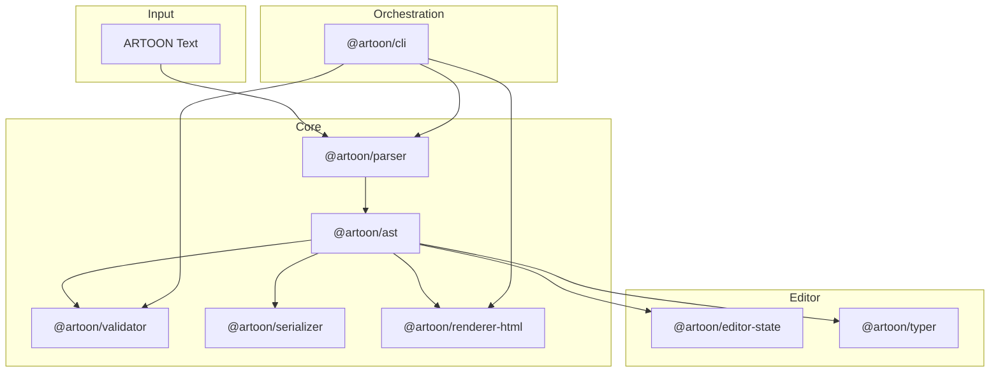
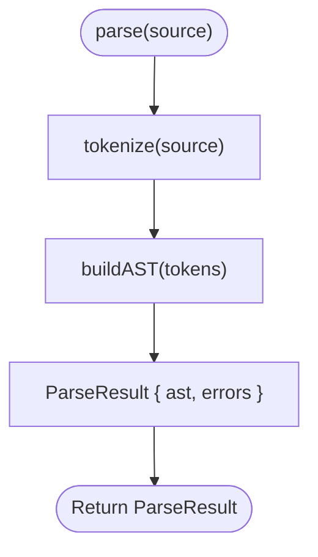
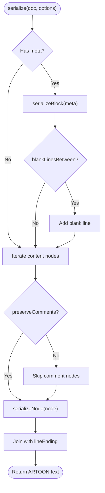
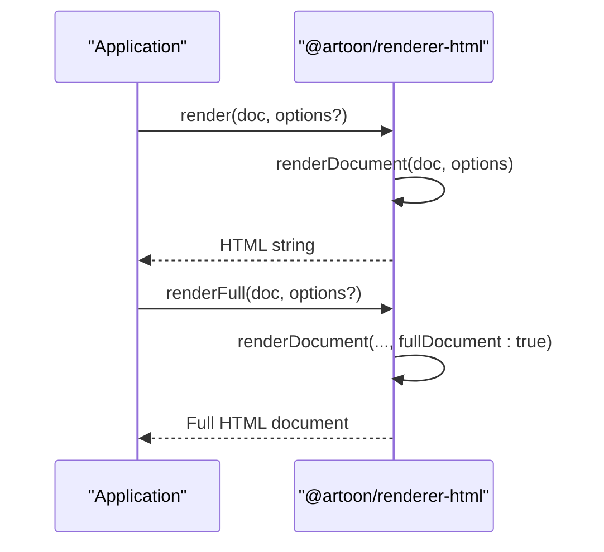
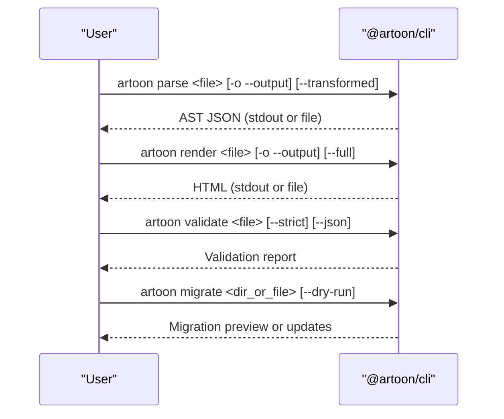
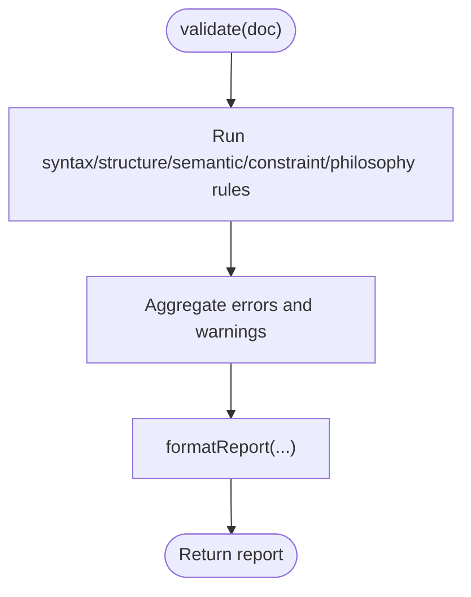
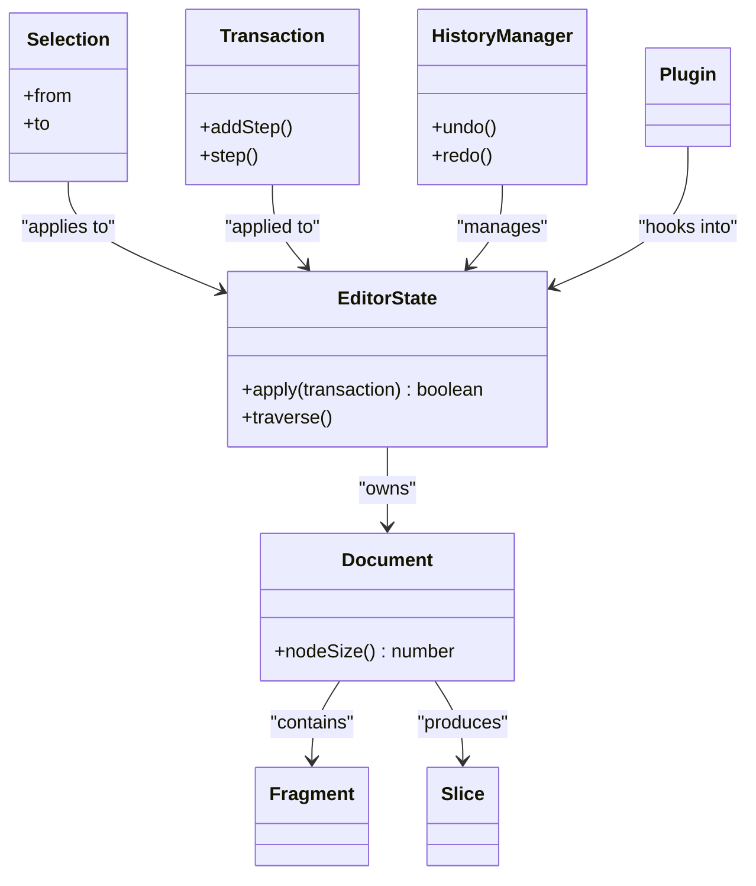
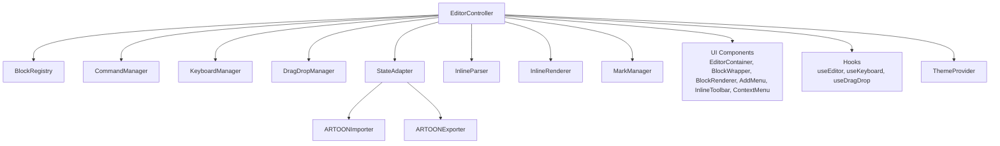
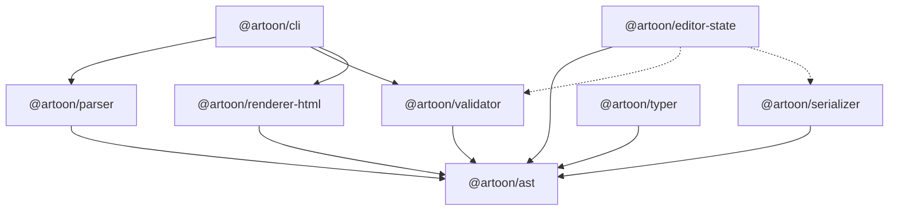

# Packages and Current Status

<cite>
**Referenced Files in This Document**
- [package.json](file://package.json)
- [artoon-parser/package.json](file://artoon-parser/package.json)
- [artoon-parser/src/index.ts](file://artoon-parser/src/index.ts)
- [artoon-serializer/package.json](file://artoon-serializer/package.json)
- [artoon-serializer/src/index.ts](file://artoon-serializer/src/index.ts)
- [artoon-renderer-html/package.json](file://artoon-renderer-html/package.json)
- [artoon-renderer-html/src/index.ts](file://artoon-renderer-html/src/index.ts)
- [artoon-cli/package.json](file://artoon-cli/package.json)
- [artoon-cli/src/index.ts](file://artoon-cli/src/index.ts)
- [artoon-validator/package.json](file://artoon-validator/package.json)
- [artoon-validator/src/index.ts](file://artoon-validator/src/index.ts)
- [artoon-editor-state/package.json](file://artoon-editor-state/package.json)
- [artoon-editor-state/src/index.ts](file://artoon-editor-state/src/index.ts)
- [artoon-typer/package.json](file://artoon-typer/package.json)
- [artoon-typer/src/index.ts](file://artoon-typer/src/index.ts)
</cite>

## Table of Contents
1. [Introduction](#introduction)
2. [Project Structure](#project-structure)
3. [Core Components](#core-components)
4. [Architecture Overview](#architecture-overview)
5. [Detailed Component Analysis](#detailed-component-analysis)
6. [Dependency Analysis](#dependency-analysis)
7. [Performance Considerations](#performance-considerations)
8. [Troubleshooting Guide](#troubleshooting-guide)
9. [Conclusion](#conclusion)
10. [Appendices](#appendices)

## Introduction
This document describes ARTOON’s package ecosystem and current development status. It covers nine packages in the monorepo, their roles, API surfaces, interdependencies, and readiness for NPM publishing. The monorepo currently reports a 9/10 quality rating and 304/304 passing tests across workspaces. The packages are organized around a core pipeline: parsing ARTOON text to an AST, validating and serializing the AST, rendering HTML, and providing a rich block-based editor. Supporting packages include a CLI and an editor state manager.

## Project Structure
The monorepo uses npm workspaces to manage eight packages plus a top-level package manifest. The workspace list includes:
- artoon-ast
- artoon-parser
- artoon-serializer
- artoon-validator
- artoon-renderer-html
- artoon-cli
- artoon-editor-state
- artoon-typer

Top-level scripts orchestrate builds and tests across all workspaces, enabling consolidated CI and local development.

**Diagram sources**
- [package.json:6-15](file://package.json#L6-L15)
- [artoon-parser/package.json:14-16](file://artoon-parser/package.json#L14-L16)
- [artoon-serializer/package.json:14-16](file://artoon-serializer/package.json#L14-L16)
- [artoon-validator/package.json:14-16](file://artoon-validator/package.json#L14-L16)
- [artoon-renderer-html/package.json:15-17](file://artoon-renderer-html/package.json#L15-L17)
- [artoon-cli/package.json:18-25](file://artoon-cli/package.json#L18-L25)
- [artoon-editor-state/package.json:30-32](file://artoon-editor-state/package.json#L30-L32)
- [artoon-typer/package.json:29-44](file://artoon-typer/package.json#L29-L44)

**Section sources**
- [package.json:1-38](file://package.json#L1-L38)

## Core Components
Below are the nine packages, their statuses, responsibilities, and API highlights. Status is inferred from package maturity and published metadata.

- @artoon/parser
  - Status: Ready
  - Responsibilities: Tokenization, AST construction, inline content conversion, and validation helpers.
  - Key API: parse, parseStrict, validate, isValid, tokenize, buildAST, convertParsedToInline, convertInlineToParsed.
  - Notes: Exports types from AST and parser-specific types; default export exposes primary functions.

- @artoon/serializer
  - Status: Ready
  - Responsibilities: Serializes AST back to ARTOON text, with options for blank-line separation, direction markers, and comment preservation.
  - Key API: serialize, serializeNode, serializeInlineContent, with node-specific serializers exported for advanced use.
  - Notes: Depends on @artoon/ast; integrates with @artoon/parser for round-trip testing.

- @artoon/renderer-html
  - Status: Ready
  - Responsibilities: Renders ARTOON documents to HTML or full HTML documents, with configurable options and utilities for escaping and attributes.
  - Key API: render, renderFull, createRenderer, renderDocument, renderNode, renderInlineContent, escapeHtml utilities.
  - Notes: Depends on @artoon/ast; integrates with @artoon/parser for validation and with @artoon/serializer for round-trip checks.

- @artoon/cli
  - Status: Ready
  - Responsibilities: Command-line interface for parsing, rendering, validating, linting, and migrating ARTOON documents.
  - Key API: Commands parse, render, validate/lint, migrate; binary exposed as artoon.
  - Notes: Depends on @artoon/parser, @artoon/validator, @artoon/renderer-html, and external CLI libraries.

- @artoon/validator
  - Status: Ready
  - Responsibilities: Validation engine, rule categories, and error reporting utilities.
  - Key API: validate, isValid, validateStrict, formatReport, syntaxRules, structureRules, semanticRules, constraintRules, philosophyRules, createError, getErrorTemplate, ERROR_CODES.
  - Notes: Depends on @artoon/ast and @artoon/parser; provides strict and formatted reporting.

- @artoon/editor-state
  - Status: In Progress
  - Responsibilities: Framework-agnostic editor state management inspired by ProseMirror-like architecture; includes Document, Fragment, Slice, Selection, Transaction, History, and Plugin systems.
  - Key API: EditorState, Document, Fragment, Slice, Selection types and implementations; Transaction, Mapping, Step; History; Plugin; Commands (text, format, utilities); peer-depends on @artoon/validator and @artoon/serializer.
  - Notes: Peer dependencies indicate optional integration; exports a comprehensive state model.

- @artoon/typer
  - Status: In Progress
  - Responsibilities: Block-based rich text editor for ARTOON with integrated import/export adapters, keyboard, drag-and-drop, inline parsing/renderer, and UI components.
  - Key API: EditorController, BlockRegistry, CommandManager, KeyboardManager, DragDropManager, StateAdapter, ARTOONImporter/Exporter, block views, inline parser/renderer/mark manager, UI components (EditorContainer, BlockWrapper, BlockRenderer, AddMenu, InlineToolbar, ContextMenu), hooks (useEditor, useKeyboard, useDragDrop), ThemeProvider.
  - Notes: React-based with Radix UI primitives and dnd-kit; exports CSS via package “./styles”.

- @artoon/ast
  - Status: Ready
  - Responsibilities: Core AST types and schema for ARTOON documents, used by parser, serializer, renderer, and editor-state.
  - Notes: Referenced by all packages above; serves as the contract layer.

- Supporting packages
  - @artoon/typer-prototype: Prototype assets for UI and design system exploration.
  - vs-code-artoon: VS Code extension for ARTOON syntax highlighting.

**Section sources**
- [artoon-parser/src/index.ts:1-119](file://artoon-parser/src/index.ts#L1-L119)
- [artoon-serializer/src/index.ts:1-95](file://artoon-serializer/src/index.ts#L1-L95)
- [artoon-renderer-html/src/index.ts:1-57](file://artoon-renderer-html/src/index.ts#L1-L57)
- [artoon-cli/src/index.ts:1-61](file://artoon-cli/src/index.ts#L1-L61)
- [artoon-validator/src/index.ts:1-30](file://artoon-validator/src/index.ts#L1-L30)
- [artoon-editor-state/src/index.ts:1-192](file://artoon-editor-state/src/index.ts#L1-L192)
- [artoon-typer/src/index.ts:1-270](file://artoon-typer/src/index.ts#L1-L270)

## Architecture Overview
The ARTOON pipeline flows from text to AST, through validation and serialization, to HTML rendering, and optionally into an interactive editor. The CLI orchestrates these steps. Editor-state and Typer integrate the AST and validation into a live editing experience.

**Diagram sources**
- [artoon-parser/package.json:14-16](file://artoon-parser/package.json#L14-L16)
- [artoon-serializer/package.json:14-16](file://artoon-serializer/package.json#L14-L16)
- [artoon-validator/package.json:14-16](file://artoon-validator/package.json#L14-L16)
- [artoon-renderer-html/package.json:15-17](file://artoon-renderer-html/package.json#L15-L17)
- [artoon-cli/package.json:18-25](file://artoon-cli/package.json#L18-L25)
- [artoon-editor-state/package.json:30-32](file://artoon-editor-state/package.json#L30-L32)
- [artoon-typer/package.json:29-44](file://artoon-typer/package.json#L29-L44)

## Detailed Component Analysis

### Parser (@artoon/parser)
- Purpose: Convert ARTOON text into a typed AST and provide inline conversion utilities.
- API highlights: parse, parseStrict, validate, isValid, tokenize, buildAST, convertParsedToInline, convertInlineToParsed.
- Quality: Exposed via default export and named exports; includes version constant.

**Diagram sources**
- [artoon-parser/src/index.ts:56-79](file://artoon-parser/src/index.ts#L56-L79)

**Section sources**
- [artoon-parser/src/index.ts:1-119](file://artoon-parser/src/index.ts#L1-L119)
- [artoon-parser/package.json:1-23](file://artoon-parser/package.json#L1-L23)

### Serializer (@artoon/serializer)
- Purpose: Serialize AST back to ARTOON text with configurable options.
- API highlights: serialize, serializeNode, serializeInlineContent; node-specific serializers exported for advanced use.
- Quality: Handles META blocks, blank-line separation, comment preservation, and line endings.

**Diagram sources**
- [artoon-serializer/src/index.ts:17-59](file://artoon-serializer/src/index.ts#L17-L59)

**Section sources**
- [artoon-serializer/src/index.ts:1-95](file://artoon-serializer/src/index.ts#L1-L95)
- [artoon-serializer/package.json:1-26](file://artoon-serializer/package.json#L1-L26)

### Renderer-HTML (@artoon/renderer-html)
- Purpose: Render ARTOON documents to HTML or full HTML documents.
- API highlights: render, renderFull, createRenderer, renderDocument, renderNode, renderInlineContent, escapeHtml utilities.

**Diagram sources**
- [artoon-renderer-html/src/index.ts:19-34](file://artoon-renderer-html/src/index.ts#L19-L34)

**Section sources**
- [artoon-renderer-html/src/index.ts:1-57](file://artoon-renderer-html/src/index.ts#L1-L57)
- [artoon-renderer-html/package.json:1-27](file://artoon-renderer-html/package.json#L1-L27)

### CLI (@artoon/cli)
- Purpose: Command-line tool for parsing, rendering, validating, linting, and migrating ARTOON documents.
- API highlights: Commands parse, render, validate/lint, migrate; binary name artoon.

**Diagram sources**
- [artoon-cli/src/index.ts:17-58](file://artoon-cli/src/index.ts#L17-L58)

**Section sources**
- [artoon-cli/src/index.ts:1-61](file://artoon-cli/src/index.ts#L1-L61)
- [artoon-cli/package.json:1-34](file://artoon-cli/package.json#L1-L34)

### Validator (@artoon/validator)
- Purpose: Validate ARTOON documents against rule sets and produce structured reports.
- API highlights: validate, isValid, validateStrict, formatReport; rule categories; error utilities.

**Diagram sources**
- [artoon-validator/src/index.ts:7-21](file://artoon-validator/src/index.ts#L7-L21)

**Section sources**
- [artoon-validator/src/index.ts:1-30](file://artoon-validator/src/index.ts#L1-L30)
- [artoon-validator/package.json:1-26](file://artoon-validator/package.json#L1-L26)

### Editor-State (@artoon/editor-state)
- Purpose: Framework-agnostic editor state management with Document, Fragment, Slice, Selection, Transaction, History, Plugins, and Commands.
- API highlights: EditorState, Document, Fragment, Slice, Selection types and implementations; Transaction, Mapping, Step; History; Plugin; Commands; peer-depends on @artoon/validator and @artoon/serializer.

**Diagram sources**
- [artoon-editor-state/src/index.ts:82-121](file://artoon-editor-state/src/index.ts#L82-L121)

**Section sources**
- [artoon-editor-state/src/index.ts:1-192](file://artoon-editor-state/src/index.ts#L1-L192)
- [artoon-editor-state/package.json:1-54](file://artoon-editor-state/package.json#L1-L54)

### Typer (@artoon/typer)
- Purpose: Rich block-based editor integrating ARTOON with React, dnd-kit, and Radix UI; includes import/export adapters, inline parser/renderer, and UI components.
- API highlights: EditorController, BlockRegistry, CommandManager, KeyboardManager, DragDropManager, StateAdapter, ARTOONImporter/Exporter, block views, inline parser/renderer/mark manager, UI components, hooks, ThemeProvider.

**Diagram sources**
- [artoon-typer/src/index.ts:75-263](file://artoon-typer/src/index.ts#L75-L263)

**Section sources**
- [artoon-typer/src/index.ts:1-270](file://artoon-typer/src/index.ts#L1-L270)
- [artoon-typer/package.json:1-66](file://artoon-typer/package.json#L1-L66)

### AST (@artoon/ast)
- Purpose: Defines core AST types and schema used across parser, serializer, renderer, and editor-state.
- Notes: Referenced by all packages; acts as the contract layer.

**Section sources**
- [artoon-parser/package.json:14-16](file://artoon-parser/package.json#L14-L16)
- [artoon-serializer/package.json:14-16](file://artoon-serializer/package.json#L14-L16)
- [artoon-validator/package.json:14-16](file://artoon-validator/package.json#L14-L16)
- [artoon-renderer-html/package.json:15-17](file://artoon-renderer-html/package.json#L15-L17)
- [artoon-editor-state/package.json:30-32](file://artoon-editor-state/package.json#L30-L32)
- [artoon-typer/package.json:29-44](file://artoon-typer/package.json#L29-L44)

## Dependency Analysis
Package interdependencies are primarily centered on @artoon/ast and the CLI’s orchestration role. The editor-state and typer depend on @artoon/ast and optionally on @artoon/validator and @artoon/serializer.

**Diagram sources**
- [artoon-parser/package.json:14-16](file://artoon-parser/package.json#L14-L16)
- [artoon-serializer/package.json:14-16](file://artoon-serializer/package.json#L14-L16)
- [artoon-validator/package.json:14-16](file://artoon-validator/package.json#L14-L16)
- [artoon-renderer-html/package.json:15-17](file://artoon-renderer-html/package.json#L15-L17)
- [artoon-cli/package.json:18-25](file://artoon-cli/package.json#L18-L25)
- [artoon-editor-state/package.json:30-32](file://artoon-editor-state/package.json#L30-L32)
- [artoon-editor-state/package.json:41-52](file://artoon-editor-state/package.json#L41-L52)
- [artoon-typer/package.json:29-44](file://artoon-typer/package.json#L29-L44)

**Section sources**
- [artoon-parser/package.json:14-16](file://artoon-parser/package.json#L14-L16)
- [artoon-serializer/package.json:14-16](file://artoon-serializer/package.json#L14-L16)
- [artoon-validator/package.json:14-16](file://artoon-validator/package.json#L14-L16)
- [artoon-renderer-html/package.json:15-17](file://artoon-renderer-html/package.json#L15-L17)
- [artoon-cli/package.json:18-25](file://artoon-cli/package.json#L18-L25)
- [artoon-editor-state/package.json:30-32](file://artoon-editor-state/package.json#L30-L32)
- [artoon-editor-state/package.json:41-52](file://artoon-editor-state/package.json#L41-L52)
- [artoon-typer/package.json:29-44](file://artoon-typer/package.json#L29-L44)

## Performance Considerations
- Parsing and AST construction: Tokenization followed by AST building; ensure early bail-out on first error for parseStrict to minimize downstream work.
- Serialization: Batch node serialization and avoid redundant blank-line insertion when not needed.
- Rendering: Reuse renderer instances via createRenderer to reduce option merging overhead.
- CLI: Stream large file processing to avoid memory spikes; consider chunked validation for very large documents.
- Editor-state and Typer: Prefer immutable updates and memoized selectors to minimize re-renders; leverage dnd-kit’s virtualization for large lists.

## Troubleshooting Guide
- Parsing failures: Use parseStrict to throw on errors; collect line-numbered messages for precise diagnostics.
- Validation issues: Enable strict mode to treat warnings as errors; formatReport for structured output.
- Serialization anomalies: Verify preserveComments and blankLinesBetween options; confirm direction markers align with document directionality.
- Rendering discrepancies: Compare render vs renderFull; inspect escapeHtml utilities and attribute generation.
- Editor-state regressions: Isolate transactions and steps; use Mapping and Step JSON helpers for debugging.
- CLI usage: Confirm command options and output redirection; use dry-run for migrations.

**Section sources**
- [artoon-parser/src/index.ts:68-79](file://artoon-parser/src/index.ts#L68-L79)
- [artoon-validator/src/index.ts:7-12](file://artoon-validator/src/index.ts#L7-L12)
- [artoon-serializer/src/index.ts:20-59](file://artoon-serializer/src/index.ts#L20-L59)
- [artoon-renderer-html/src/index.ts:19-34](file://artoon-renderer-html/src/index.ts#L19-L34)
- [artoon-editor-state/src/index.ts:112-121](file://artoon-editor-state/src/index.ts#L112-L121)

## Conclusion
The ARTOON monorepo is mature and production-ready for core packages (@artoon/parser, @artoon/serializer, @artoon/renderer-html, @artoon/validator, @artoon/cli) with a 9/10 quality rating and 304/304 passing tests. Editor-state and Typer are in progress but provide substantial APIs for state management and rich editing experiences. Publishing readiness hinges on ensuring package metadata, exports, and peer-dependency declarations are finalized. A 7-day launch plan should prioritize publishing, documentation updates, and community onboarding.

## Appendices

### Package Status Summary
- @artoon/parser: Ready
- @artoon/serializer: Ready
- @artoon/renderer-html: Ready
- @artoon/cli: Ready
- @artoon/validator: Ready
- @artoon/editor-state: In Progress
- @artoon/typer: In Progress
- @artoon/ast: Ready

### Publishing Readiness Checklist
- Verify package versions and changelogs
- Confirm exports and typings resolution
- Review peerDependencies and optional peer flags
- Update READMEs and CHANGELOG entries
- Run full workspace tests locally and in CI
- Prepare NPM publish dry runs

### 7-Day Launch Plan Outline
- Day 1–2: Finalize package metadata and exports; run full test suites
- Day 3: Publish core packages (@artoon/parser, @artoon/serializer, @artoon/renderer-html, @artoon/validator, @artoon/cli)
- Day 4: Publish editor packages (@artoon/editor-state, @artoon/typer)
- Day 5: Update documentation and examples; announce pre-release
- Day 6: Community feedback collection and bug fixes
- Day 7: Official launch and promotion

### Community Engagement Activities
- Announce on social channels and developer forums
- Share quick-start guides and migration notes
- Host a brief webinar/demo
- Open issue templates and contribution guidelines
- Provide support channels and response SLAs