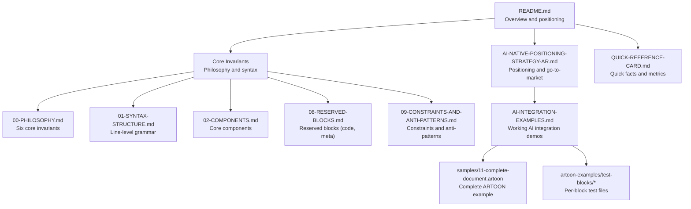
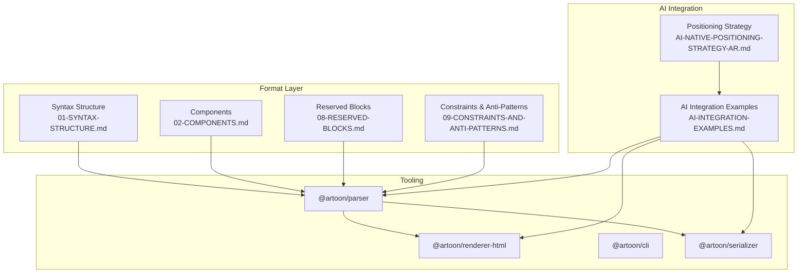
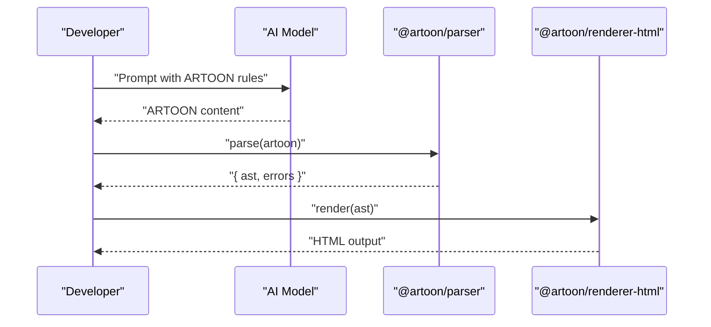
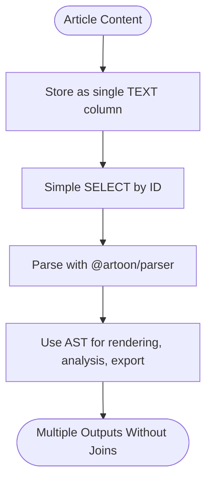
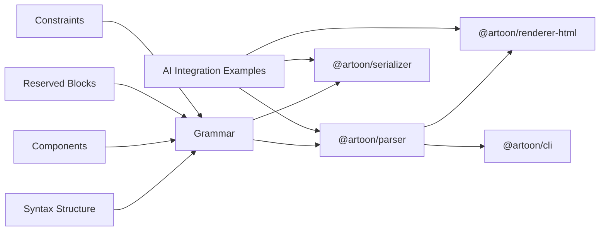

# Philosophy and Strategic Positioning

<cite>
**Referenced Files in This Document**
- [README.md](file://README.md)
- [Core Invariants/00-PHILOSOPHY.md](file://Core Invariants/00-PHILOSOPHY.md)
- [AI-NATIVE-POSITIONING-STRATEGY-AR.md](file://AI-NATIVE-POSITIONING-STRATEGY-AR.md)
- [Core Invariants/01-SYNTAX-STRUCTURE.md](file://Core Invariants/01-SYNTAX-STRUCTURE.md)
- [Core Invariants/02-COMPONENTS.md](file://Core Invariants/02-COMPONENTS.md)
- [Core Invariants/08-RESERVED-BLOCKS.md](file://Core Invariants/08-RESERVED-BLOCKS.md)
- [Core Invariants/09-CONSTRAINTS-AND-ANTI-PATTERNS.md](file://Core Invariants/09-CONSTRAINTS-AND-ANTI-PATTERNS.md)
- [AI-INTEGRATION-EXAMPLES.md](file://AI-INTEGRATION-EXAMPLES.md)
- [QUICK-REFERENCE-CARD.md](file://QUICK-REFERENCE-CARD.md)
- [samples/11-complete-document.artoon](file://samples/11-complete-document.artoon)
- [artoon-examples/test-blocks/00-README.md](file://artoon-examples/test-blocks/00-README.md)
</cite>

## Table of Contents
1. [Introduction](#introduction)
2. [Project Structure](#project-structure)
3. [Core Components](#core-components)
4. [Architecture Overview](#architecture-overview)
5. [Detailed Component Analysis](#detailed-component-analysis)
6. [Dependency Analysis](#dependency-analysis)
7. [Performance Considerations](#performance-considerations)
8. [Troubleshooting Guide](#troubleshooting-guide)
9. [Conclusion](#conclusion)
10. [Appendices](#appendices)

## Introduction
ARTOON is positioned as an AI-native structured article format built on the principle “Structured for machines, readable for humans.” Its strategic mission is to solve the real-world problem of unstructured content that is difficult for AI to parse reliably, while enabling database optimization through single-table storage and universal language support. This document explains ARTOON’s philosophy, technical advantages, target audiences, and competitive differentiation, with concrete examples drawn from the repository.

## Project Structure
At a high level, the repository organizes ARTOON’s philosophy, syntax, components, and practical examples across dedicated folders and documents. The README provides a concise overview and quick-start, while the Core Invariants define the grammar and constraints. AI integration examples and sample documents demonstrate real-world usage.

**Diagram sources**
- [README.md:1-247](file://README.md#L1-L247)
- [Core Invariants/00-PHILOSOPHY.md:1-154](file://Core Invariants/00-PHILOSOPHY.md#L1-L154)
- [Core Invariants/01-SYNTAX-STRUCTURE.md:1-214](file://Core Invariants/01-SYNTAX-STRUCTURE.md#L1-L214)
- [Core Invariants/02-COMPONENTS.md:1-315](file://Core Invariants/02-COMPONENTS.md#L1-L315)
- [Core Invariants/08-RESERVED-BLOCKS.md:1-318](file://Core Invariants/08-RESERVED-BLOCKS.md#L1-L318)
- [Core Invariants/09-CONSTRAINTS-AND-ANTI-PATTERNS.md:1-474](file://Core Invariants/09-CONSTRAINTS-AND-ANTI-PATTERNS.md#L1-L474)
- [AI-NATIVE-POSITIONING-STRATEGY-AR.md:1-737](file://AI-NATIVE-POSITIONING-STRATEGY-AR.md#L1-L737)
- [AI-INTEGRATION-EXAMPLES.md:1-766](file://AI-INTEGRATION-EXAMPLES.md#L1-L766)
- [QUICK-REFERENCE-CARD.md:1-208](file://QUICK-REFERENCE-CARD.md#L1-L208)
- [samples/11-complete-document.artoon:1-87](file://samples/11-complete-document.artoon#L1-L87)
- [artoon-examples/test-blocks/00-README.md:1-83](file://artoon-examples/test-blocks/00-README.md#L1-L83)

**Section sources**
- [README.md:1-247](file://README.md#L1-L247)
- [AI-NATIVE-POSITIONING-STRATEGY-AR.md:1-737](file://AI-NATIVE-POSITIONING-STRATEGY-AR.md#L1-L737)

## Core Components
ARTOON’s core philosophy and syntax underpin a clean, semantic structure optimized for AI and database simplicity. The six core invariants define:
- Every line is a single semantic unit
- Meaning precedes appearance
- Context implicitly opens/closes; explicit closing only for blocks/code
- Non-text content is represented as typed links
- Direction-awareness embedded in the format
- Pure storage invariants—no derived or redundant data

These invariants ensure unambiguous parsing, strong semantic clarity, and future-proof stability.

**Section sources**
- [Core Invariants/00-PHILOSOPHY.md:51-117](file://Core Invariants/00-PHILOSOPHY.md#L51-L117)

## Architecture Overview
The ARTOON ecosystem centers on a compact, deterministic grammar and a small set of reserved blocks that enable structured content generation and analysis. The architecture supports:
- AI-first generation and validation via deterministic syntax
- Database optimization through single-table storage
- Rich component model with reserved blocks for metadata and code
- Strict separation of content semantics from presentation and behavior

**Diagram sources**
- [Core Invariants/01-SYNTAX-STRUCTURE.md:1-214](file://Core Invariants/01-SYNTAX-STRUCTURE.md#L1-L214)
- [Core Invariants/02-COMPONENTS.md:1-315](file://Core Invariants/02-COMPONENTS.md#L1-L315)
- [Core Invariants/08-RESERVED-BLOCKS.md:1-318](file://Core Invariants/08-RESERVED-BLOCKS.md#L1-L318)
- [Core Invariants/09-CONSTRAINTS-AND-ANTI-PATTERNS.md:1-474](file://Core Invariants/09-CONSTRAINTS-AND-ANTI-PATTERNS.md#L1-L474)
- [AI-INTEGRATION-EXAMPLES.md:1-766](file://AI-INTEGRATION-EXAMPLES.md#L1-L766)
- [AI-NATIVE-POSITIONING-STRATEGY-AR.md:1-737](file://AI-NATIVE-POSITIONING-STRATEGY-AR.md#L1-L737)

## Detailed Component Analysis

### Philosophy and Positioning
ARTOON positions itself as AI-native, distinct from Markdown, emphasizing:
- AI-friendly structure with 98.8% generation success rate
- Database optimization with single-table storage
- Semantic clarity and direction-awareness
- Universal language support

Target audiences:
- AI developers building content tools
- CMS platforms seeking simpler schemas
- Content platforms and enterprises managing large-scale content

Competitive differentiation:
- Deterministic, unambiguous syntax
- Embedded metadata via reserved meta block
- Single-table persistence model
- Strong separation of concerns (content semantics, not presentation or behavior)

**Section sources**
- [README.md:9-74](file://README.md#L9-L74)
- [AI-NATIVE-POSITIONING-STRATEGY-AR.md:13-47](file://AI-NATIVE-POSITIONING-STRATEGY-AR.md#L13-L47)
- [QUICK-REFERENCE-CARD.md:35-53](file://QUICK-REFERENCE-CARD.md#L35-L53)

### Syntax and Grammar
The syntax enforces:
- Direction markers per line (RTL/LTR)
- Explicit component declarations with safe separators
- Optional multiple values and indentation levels
- Comments and empty lines for formatting only
- Implicit closing semantics except for blocks and code

This grammar underpins reliable AI parsing and predictable transformations.

**Section sources**
- [Core Invariants/01-SYNTAX-STRUCTURE.md:7-214](file://Core Invariants/01-SYNTAX-STRUCTURE.md#L7-L214)

### Core Components and Reserved Blocks
Core components include textual elements (paragraphs, headings, quotes, preformatted text), typed links (a, img, video, audio, file), structural separators (br, hr, wbr), and code constructs (inline c and block code). Two reserved blocks are central:
- meta: hidden metadata container for document-level fields
- code: preserves verbatim content with optional language hint

These reserved blocks enable embedding metadata and code without interfering with ARTOON’s semantic parsing.

**Section sources**
- [Core Invariants/02-COMPONENTS.md:7-315](file://Core Invariants/02-COMPONENTS.md#L7-L315)
- [Core Invariants/08-RESERVED-BLOCKS.md:7-318](file://Core Invariants/08-RESERVED-BLOCKS.md#L7-L318)

### Constraints and Anti-Patterns
ARTOON deliberately forbids presentation and behavior concerns in content:
- No colors, dimensions, fonts, layouts, positions, transforms, opacity
- No events, animations, autoplay, validation, state toggles
- No programming constructs (conditionals, loops, variables, templates)

It also restricts compound components to a minimal set and prohibits simulating HTML or adding features for the sake of convenience. These constraints protect ARTOON from sliding toward presentation or behavior concerns.

**Section sources**
- [Core Invariants/09-CONSTRAINTS-AND-ANTI-PATTERNS.md:85-124](file://Core Invariants/09-CONSTRAINTS-AND-ANTI-PATTERNS.md#L85-L124)
- [Core Invariants/09-CONSTRAINTS-AND-ANTI-PATTERNS.md:171-209](file://Core Invariants/09-CONSTRAINTS-AND-ANTI-PATTERNS.md#L171-L209)

### AI Integration Examples
The repository includes comprehensive, working examples demonstrating ARTOON’s AI-native strengths:
- Reliable content generation with explicit system prompts
- Structured extraction for analysis and SEO optimization
- Preservation of structure during translation
- End-to-end pipelines integrating parser, serializer, and renderer

These examples quantify ARTOON’s advantage: higher success rates and easier parsing compared to Markdown.

**Diagram sources**
- [AI-INTEGRATION-EXAMPLES.md:65-156](file://AI-INTEGRATION-EXAMPLES.md#L65-L156)
- [AI-INTEGRATION-EXAMPLES.md:189-276](file://AI-INTEGRATION-EXAMPLES.md#L189-L276)
- [AI-INTEGRATION-EXAMPLES.md:280-370](file://AI-INTEGRATION-EXAMPLES.md#L280-L370)
- [AI-INTEGRATION-EXAMPLES.md:449-582](file://AI-INTEGRATION-EXAMPLES.md#L449-L582)

**Section sources**
- [AI-INTEGRATION-EXAMPLES.md:19-766](file://AI-INTEGRATION-EXAMPLES.md#L19-L766)

### Database Optimization and Single-Table Storage
ARTOON’s reserved meta block and flat structure enable storing entire articles in a single database column. This eliminates multi-table schemas, complex joins, and metadata fragmentation. The strategy document demonstrates how a single TEXT column can replace 5–10 tables, simplifying queries, backups, and migrations.

**Diagram sources**
- [AI-NATIVE-POSITIONING-STRATEGY-AR.md:90-141](file://AI-NATIVE-POSITIONING-STRATEGY-AR.md#L90-L141)
- [Core Invariants/08-RESERVED-BLOCKS.md:110-201](file://Core Invariants/08-RESERVED-BLOCKS.md#L110-L201)

**Section sources**
- [AI-NATIVE-POSITIONING-STRATEGY-AR.md:90-141](file://AI-NATIVE-POSITIONING-STRATEGY-AR.md#L90-L141)
- [Core Invariants/08-RESERVED-BLOCKS.md:110-201](file://Core Invariants/08-RESERVED-BLOCKS.md#L110-L201)

### Practical Demonstrations
- Complete ARTOON example: [samples/11-complete-document.artoon:1-87](file://samples/11-complete-document.artoon#L1-L87)
- Per-block testing: [artoon-examples/test-blocks/00-README.md:1-83](file://artoon-examples/test-blocks/00-README.md#L1-L83)
- Quick facts and metrics: [QUICK-REFERENCE-CARD.md:12-100](file://QUICK-REFERENCE-CARD.md#L12-L100)

**Section sources**
- [samples/11-complete-document.artoon:1-87](file://samples/11-complete-document.artoon#L1-L87)
- [artoon-examples/test-blocks/00-README.md:27-77](file://artoon-examples/test-blocks/00-README.md#L27-L77)
- [QUICK-REFERENCE-CARD.md:12-100](file://QUICK-REFERENCE-CARD.md#L12-L100)

## Dependency Analysis
The ARTOON ecosystem depends on a tight coupling between syntax, components, and reserved blocks, enforced by constraints. Tooling (parser, serializer, renderer, CLI) consumes the canonical grammar and produces predictable outputs. AI integration relies on deterministic parsing and serialization.

**Diagram sources**
- [Core Invariants/01-SYNTAX-STRUCTURE.md:1-214](file://Core Invariants/01-SYNTAX-STRUCTURE.md#L1-L214)
- [Core Invariants/02-COMPONENTS.md:1-315](file://Core Invariants/02-COMPONENTS.md#L1-L315)
- [Core Invariants/08-RESERVED-BLOCKS.md:1-318](file://Core Invariants/08-RESERVED-BLOCKS.md#L1-L318)
- [Core Invariants/09-CONSTRAINTS-AND-ANTI-PATTERNS.md:1-474](file://Core Invariants/09-CONSTRAINTS-AND-ANTI-PATTERNS.md#L1-L474)
- [AI-INTEGRATION-EXAMPLES.md:1-766](file://AI-INTEGRATION-EXAMPLES.md#L1-L766)

**Section sources**
- [Core Invariants/01-SYNTAX-STRUCTURE.md:1-214](file://Core Invariants/01-SYNTAX-STRUCTURE.md#L1-L214)
- [Core Invariants/02-COMPONENTS.md:1-315](file://Core Invariants/02-COMPONENTS.md#L1-L315)
- [Core Invariants/08-RESERVED-BLOCKS.md:1-318](file://Core Invariants/08-RESERVED-BLOCKS.md#L1-L318)
- [Core Invariants/09-CONSTRAINTS-AND-ANTI-PATTERNS.md:1-474](file://Core Invariants/09-CONSTRAINTS-AND-ANTI-PATTERNS.md#L1-L474)
- [AI-INTEGRATION-EXAMPLES.md:1-766](file://AI-INTEGRATION-EXAMPLES.md#L1-L766)

## Performance Considerations
- Parsing reliability: AI integration examples compare ARTOON to Markdown, showing higher success rates and fewer parsing errors.
- Simpler toolchains: Single-table storage reduces join complexity and improves query performance.
- Reduced maintenance: Minimal reserved blocks and strict constraints simplify parser and renderer logic.

[No sources needed since this section provides general guidance]

## Troubleshooting Guide
Common issues and resolutions grounded in ARTOON’s constraints:
- Mixed or ambiguous syntax: Ensure direction markers, safe separators, and explicit component declarations are used consistently.
- Misplaced metadata: Place only hidden fields inside the meta block; avoid mixing visible child elements with hidden fields outside meta.
- Overuse of presentation or behavior: Keep content semantics focused; avoid adding layout, styling, or interactive attributes.
- Unsupported nesting: Some custom blocks are not yet nestable; use simple blocks or wait for future phases.

**Section sources**
- [Core Invariants/09-CONSTRAINTS-AND-ANTI-PATTERNS.md:24-82](file://Core Invariants/09-CONSTRAINTS-AND-ANTI-PATTERNS.md#L24-L82)
- [Core Invariants/08-RESERVED-BLOCKS.md:131-162](file://Core Invariants/08-RESERVED-BLOCKS.md#L131-L162)

## Conclusion
ARTOON’s “structured for machines, readable for humans” philosophy, combined with deterministic syntax, reserved blocks, and strict constraints, creates a robust, AI-native format. Its competitive advantages—higher AI generation success, simplified database storage, and universal language support—align with growing demand for reliable, semantic content. The repository provides practical examples, a complete reference, and a clear go-to-market strategy to accelerate adoption among AI developers, CMS platforms, content platforms, and enterprises.

[No sources needed since this section summarizes without analyzing specific files]

## Appendices

### Mission Statement and Positioning
- Mission: Provide a semantic, AI-friendly article format optimized for reliable generation, analysis, and storage.
- Positioning: AI-Native Structured Article Format.
- Core value: Structured for machines, readable for humans.

**Section sources**
- [README.md:3-6](file://README.md#L3-L6)
- [AI-NATIVE-POSITIONING-STRATEGY-AR.md:36-47](file://AI-NATIVE-POSITIONING-STRATEGY-AR.md#L36-L47)

### Target Audiences
- AI developers building content tools
- CMS platforms seeking simplified schemas
- Content platforms and enterprises managing large-scale content

**Section sources**
- [AI-NATIVE-POSITIONING-STRATEGY-AR.md:203-263](file://AI-NATIVE-POSITIONING-STRATEGY-AR.md#L203-L263)
- [QUICK-REFERENCE-CARD.md:35-53](file://QUICK-REFERENCE-CARD.md#L35-L53)

### Competitive Differentiation
- Deterministic, unambiguous syntax
- Embedded metadata via meta block
- Single-table storage model
- Strong separation of semantics from presentation and behavior

**Section sources**
- [Core Invariants/00-PHILOSOPHY.md:51-117](file://Core Invariants/00-PHILOSOPHY.md#L51-L117)
- [Core Invariants/08-RESERVED-BLOCKS.md:110-201](file://Core Invariants/08-RESERVED-BLOCKS.md#L110-L201)
- [AI-NATIVE-POSITIONING-STRATEGY-AR.md:50-141](file://AI-NATIVE-POSITIONING-STRATEGY-AR.md#L50-L141)