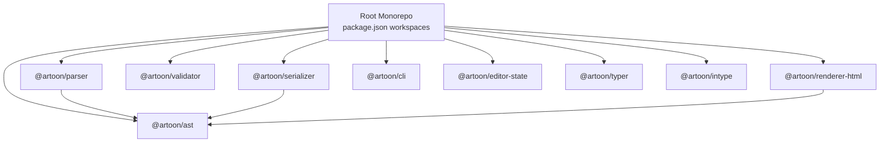
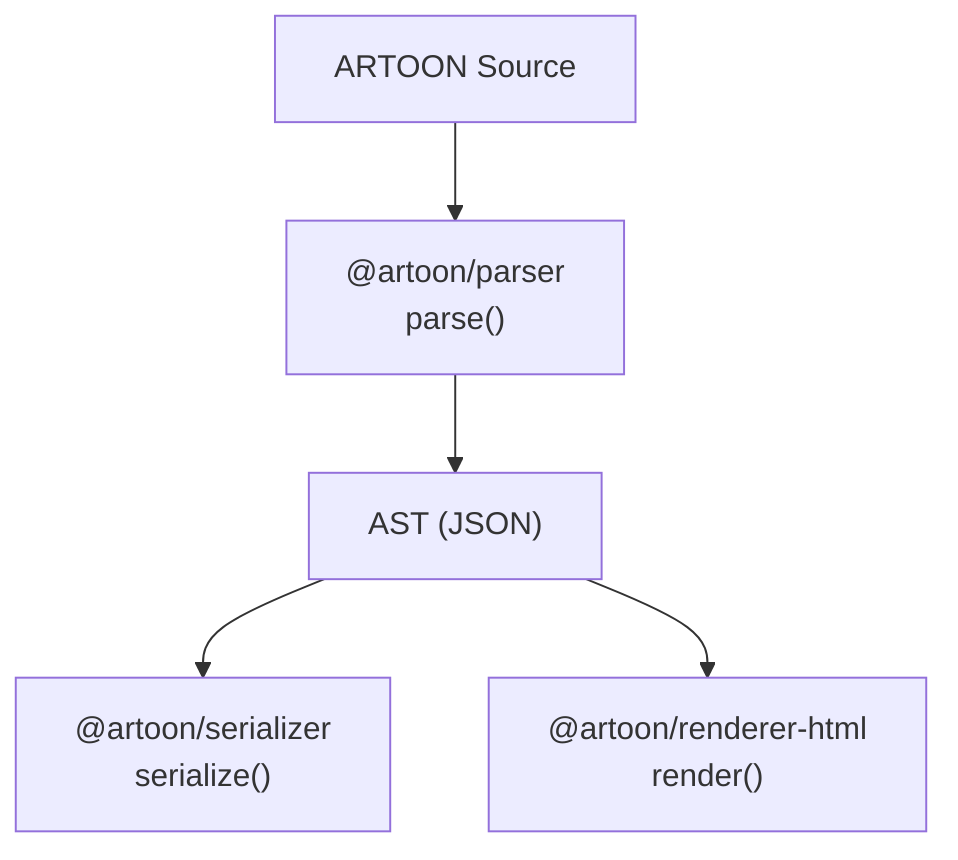
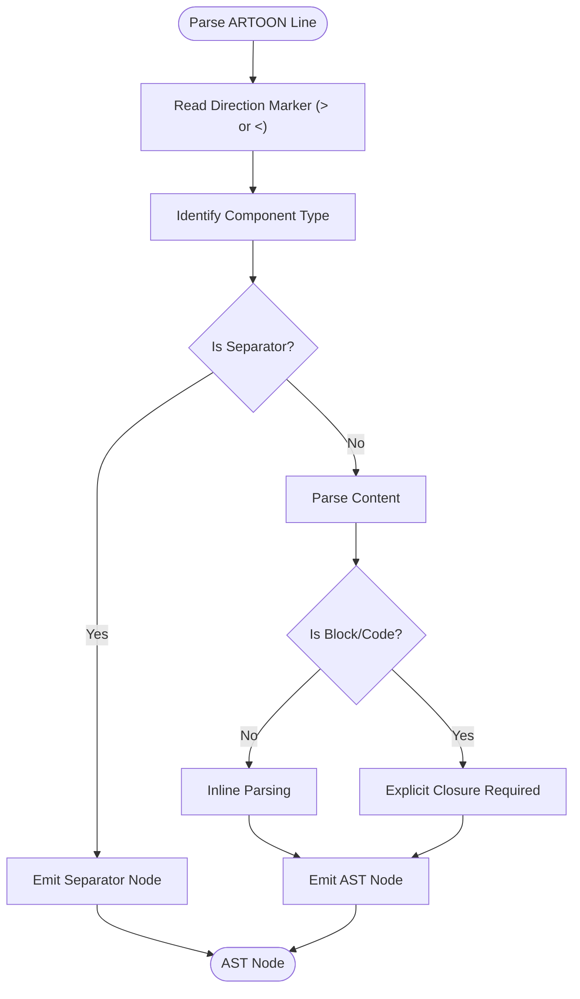
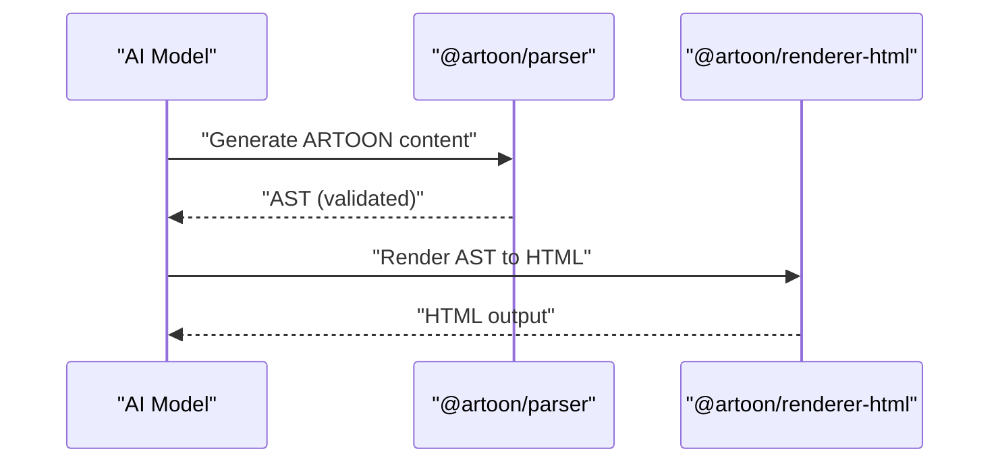
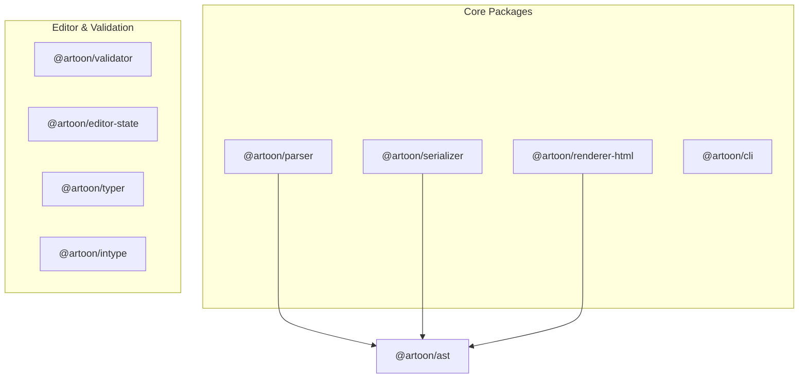
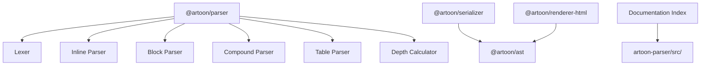

# Project Overview

<cite>
**Referenced Files in This Document**
- [README.md](file://README.md)
- [package.json](file://package.json)
- [QUICK-REFERENCE-CARD.md](file://QUICK-REFERENCE-CARD.md)
- [Core Invariants/00-PHILOSOPHY.md](file://Core%20Invariants/00-PHILOSOPHY.md)
- [docs/01-OVERVIEW.md](file://docs/01-OVERVIEW.md)
- [docs/03-SYNTAX-REFERENCE.md](file://docs/03-SYNTAX-REFERENCE.md)
- [artoon-documentation/00-INDEX.md](file://artoon-documentation/00-INDEX.md)
- [artoon-examples/test-blocks/00-README.md](file://artoon-examples/test-blocks/00-README.md)
- [samples/11-complete-document.artoon](file://samples/11-complete-document.artoon)
- [AI-INTEGRATION-EXAMPLES.md](file://AI-INTEGRATION-EXAMPLES.md)
- [artoon-parser/package.json](file://artoon-parser/package.json)
- [artoon-serializer/package.json](file://artoon-serializer/package.json)
- [artoon-renderer-html/package.json](file://artoon-renderer-html/package.json)
</cite>

## Table of Contents
1. [Introduction](#introduction)
2. [Project Structure](#project-structure)
3. [Core Components](#core-components)
4. [Architecture Overview](#architecture-overview)
5. [Detailed Component Analysis](#detailed-component-analysis)
6. [Dependency Analysis](#dependency-analysis)
7. [Performance Considerations](#performance-considerations)
8. [Troubleshooting Guide](#troubleshooting-guide)
9. [Conclusion](#conclusion)
10. [Appendices](#appendices)

## Introduction
ARTOON 2.0 is an AI-native structured content format designed to be “structured for machines, readable for humans.” Its purpose is to enable reliable AI content generation and analysis by providing a clear, semantic, and unambiguous syntax. The format emphasizes direction-awareness (supporting both RTL and LTR), pure semantic structure, and minimal redundancy—ensuring that content remains stable, portable, and easy to parse across tools and languages.

Key strategic positioning highlights:
- AI-friendly generation with a demonstrated 98.8% success rate versus Markdown’s 87.3%
- Database optimization via single-table storage with embedded metadata
- Universal language support and direction awareness
- Strong developer ergonomics with a comprehensive toolchain

Current status indicates production readiness for core packages, with all tests passing and documentation comprehensive. The project is preparing for NPM publishing with a 7-day launch plan.

**Section sources**
- [README.md:11-16](file://README.md#L11-L16)
- [README.md:46-56](file://README.md#L46-L56)
- [README.md:108-133](file://README.md#L108-L133)
- [QUICK-REFERENCE-CARD.md:12-21](file://QUICK-REFERENCE-CARD.md#L12-L21)
- [QUICK-REFERENCE-CARD.md:91-100](file://QUICK-REFERENCE-CARD.md#L91-L100)

## Project Structure
The ARTOON 2.0 repository is organized as a monorepo containing nine specialized packages, each focused on a distinct aspect of parsing, serializing, rendering, validating, and editing ARTOON content. Workspaces are defined in the root package manifest, enabling coordinated builds and tests across packages.



**Diagram sources**
- [package.json:6-16](file://package.json#L6-L16)

**Section sources**
- [package.json:1-39](file://package.json#L1-L39)

## Core Components
ARTOON’s core philosophy centers on six immutable principles: unitary meaning per line, semantics before style, context over closure, dereferenced links as primitives, direction-awareness, and data purity. These principles guide the syntax and tooling to keep content predictable, portable, and AI-friendly.

- Unitary meaning per line: Each line expresses a single semantic unit (except code blocks).
- Semantics before style: Visual/layout/behavior attributes are excluded from the core format.
- Context over closure: Implicit scoping reduces verbosity; explicit closures apply to blocks and code.
- Dereferenced links: Non-text content is represented as typed links (e.g., images, videos).
- Direction-awareness: Every line begins with a directional marker (> for RTL, < for LTR).
- Data purity: Only essential facts are stored; derived information is omitted.

These invariants are documented in the Core Philosophy and underpin the syntax reference and toolchain design.

**Section sources**
- [Core Invariants/00-PHILOSOPHY.md:51-117](file://Core%20Invariants/00-PHILOSOPHY.md#L51-L117)
- [docs/01-OVERVIEW.md:27-51](file://docs/01-OVERVIEW.md#L27-L51)
- [docs/03-SYNTAX-REFERENCE.md:5-16](file://docs/03-SYNTAX-REFERENCE.md#L5-L16)

## Architecture Overview
ARTOON’s toolchain transforms ARTOON source into structured data and renders it into various output formats. The primary pipeline is:
- Parse ARTOON source into an AST
- Serialize AST back to ARTOON text
- Render AST to HTML (and potentially other formats)



**Diagram sources**
- [README.md:20-44](file://README.md#L20-L44)
- [artoon-parser/package.json:1-23](file://artoon-parser/package.json#L1-L23)
- [artoon-serializer/package.json:1-26](file://artoon-serializer/package.json#L1-L26)
- [artoon-renderer-html/package.json:1-27](file://artoon-renderer-html/package.json#L1-L27)

## Detailed Component Analysis

### Philosophy and Syntax Foundations
ARTOON’s syntax follows a concise, direction-aware pattern: {direction}.{type}::{content}, with implicit scoping and explicit closures for blocks and code. The syntax reference enumerates textual components (headings, paragraphs, quotes, preformatted text), separators, lists, tables, media, compound components, blocks (meta, code), and inline modifiers and components.



**Diagram sources**
- [docs/03-SYNTAX-REFERENCE.md:5-16](file://docs/03-SYNTAX-REFERENCE.md#L5-L16)
- [docs/03-SYNTAX-REFERENCE.md:149-223](file://docs/03-SYNTAX-REFERENCE.md#L149-L223)

**Section sources**
- [docs/03-SYNTAX-REFERENCE.md:1-310](file://docs/03-SYNTAX-REFERENCE.md#L1-L310)
- [docs/01-OVERVIEW.md:35-96](file://docs/01-OVERVIEW.md#L35-L96)

### Practical Examples Demonstrating Capabilities
- AI content generation: Demonstrated with OpenAI chat completions generating valid ARTOON, followed by parsing and HTML rendering.
- Content analysis: Extracting metadata, headings, paragraphs, lists, and code blocks from ARTOON AST for downstream AI analysis.
- Translation: Translating text content while preserving structure and updating direction markers.
- SEO optimization: Analyzing metadata, headings, and content characteristics to generate actionable SEO recommendations.
- End-to-end pipeline: Outlining, generating, validating, and exporting ARTOON to multiple formats.



**Diagram sources**
- [AI-INTEGRATION-EXAMPLES.md:65-156](file://AI-INTEGRATION-EXAMPLES.md#L65-L156)
- [AI-INTEGRATION-EXAMPLES.md:189-276](file://AI-INTEGRATION-EXAMPLES.md#L189-L276)
- [AI-INTEGRATION-EXAMPLES.md:280-370](file://AI-INTEGRATION-EXAMPLES.md#L280-L370)
- [AI-INTEGRATION-EXAMPLES.md:373-445](file://AI-INTEGRATION-EXAMPLES.md#L373-L445)
- [AI-INTEGRATION-EXAMPLES.md:449-582](file://AI-INTEGRATION-EXAMPLES.md#L449-L582)

**Section sources**
- [AI-INTEGRATION-EXAMPLES.md:13-766](file://AI-INTEGRATION-EXAMPLES.md#L13-L766)

### Monorepo Packages and Roles
The monorepo includes nine packages, with core packages ready for production and others in progress. The core packages include:
- @artoon/parser: Parses ARTOON to AST
- @artoon/serializer: Serializes AST back to ARTOON text
- @artoon/renderer-html: Renders AST to HTML
- @artoon/cli: Command-line utilities
- @artoon/validator: Content validation (in progress)
- @artoon/editor-state: Editor state management (in progress)
- @artoon/typer: Visual editor (in progress)
- @artoon/intype: Additional editor-related package



**Diagram sources**
- [README.md:77-89](file://README.md#L77-L89)
- [QUICK-REFERENCE-CARD.md:56-66](file://QUICK-REFERENCE-CARD.md#L56-L66)

**Section sources**
- [README.md:77-89](file://README.md#L77-L89)
- [QUICK-REFERENCE-CARD.md:56-66](file://QUICK-REFERENCE-CARD.md#L56-L66)

### Differences from Markdown and Other Formats
ARTOON differs from Markdown and similar formats by embedding direction markers, enforcing explicit closures for blocks/code, separating metadata into dedicated blocks, and avoiding style/layout attributes in the core format. This leads to clearer semantics, easier parsing, and better AI generation reliability.

```mermaid
classDiagram
class ARTOON_Syntax {
"+{direction}.{type} : : {content}"
"+Implicit scoping"
"+Explicit closures for blocks/code"
"+Direction-aware"
"+Separate meta block"
}
class Markdown_Syntax {
"+Ambiguous parsing"
"+Style/layout in text"
"+No direction markers"
"+Mixed metadata"
}
ARTOON_Syntax .. Markdown_Syntax : "More structured and unambiguous"
```

**Diagram sources**
- [docs/03-SYNTAX-REFERENCE.md:5-16](file://docs/03-SYNTAX-REFERENCE.md#L5-L16)
- [docs/01-OVERVIEW.md:97-106](file://docs/01-OVERVIEW.md#L97-L106)

**Section sources**
- [docs/01-OVERVIEW.md:97-106](file://docs/01-OVERVIEW.md#L97-L106)

## Dependency Analysis
The core packages depend on @artoon/ast for shared types and structures. The parser consumes the lexer and inline/table/block subsystems to produce AST nodes. The serializer and renderer consume AST to emit ARTOON text and HTML respectively.



**Diagram sources**
- [artoon-documentation/00-INDEX.md:27-41](file://artoon-documentation/00-INDEX.md#L27-L41)

**Section sources**
- [artoon-documentation/00-INDEX.md:27-41](file://artoon-documentation/00-INDEX.md#L27-L41)

## Performance Considerations
- AI generation reliability: ARTOON achieves a 98.8% success rate compared to Markdown’s 87.3%, reducing retries and validation overhead.
- Parsing simplicity: Unambiguous structure and explicit semantics minimize parsing errors and speed up processing.
- Database optimization: Single-table storage with embedded metadata eliminates complex joins and simplifies queries.
- Portability: One-file-per-article format improves caching, transport, and archival.

**Section sources**
- [README.md:13](file://README.md#L13)
- [README.md:65-69](file://README.md#L65-L69)
- [README.md:155-166](file://README.md#L155-L166)

## Troubleshooting Guide
Common issues and mitigations:
- Nested custom blocks: Currently unsupported; use simple blocks without nesting until full nesting support is available in Phase 2 (Q2 2026).
- Validation failures: Use the ARTOON CLI validate command and the validator package to identify and fix structural issues.
- Direction mismatches: Ensure each line starts with the correct direction marker (> for RTL, < for LTR) to avoid rendering inconsistencies.
- Testing blocks: Use the dedicated test-blocks directory to isolate and verify individual block behaviors.

**Section sources**
- [README.md:190-210](file://README.md#L190-L210)
- [artoon-examples/test-blocks/00-README.md:1-83](file://artoon-examples/test-blocks/00-README.md#L1-L83)

## Conclusion
ARTOON 2.0 delivers a robust, AI-native structured content format optimized for reliable generation, parsing, and analysis. Its monorepo architecture provides modular tooling, while its philosophy and syntax ensure clarity, portability, and direction-awareness. With production-ready core packages, comprehensive documentation, and a clear 7-day launch plan, ARTOON is positioned to serve AI developers, CMS platforms, and enterprise content creators seeking a semantic, database-efficient, and universally readable format.

**Section sources**
- [README.md:46-56](file://README.md#L46-L56)
- [README.md:108-133](file://README.md#L108-L133)
- [QUICK-REFERENCE-CARD.md:174-183](file://QUICK-REFERENCE-CARD.md#L174-L183)

## Appendices

### Practical Examples Index
- AI integration examples: Demonstrations of generation, analysis, translation, SEO optimization, and end-to-end pipelines.
- Syntax reference: Complete guide to ARTOON’s component types, blocks, inline modifiers, and compound structures.
- Sample documents: A complete ARTOON document showcasing meta blocks, headings, lists, tables, figures, and inline components.

**Section sources**
- [AI-INTEGRATION-EXAMPLES.md:13-766](file://AI-INTEGRATION-EXAMPLES.md#L13-L766)
- [docs/03-SYNTAX-REFERENCE.md:1-310](file://docs/03-SYNTAX-REFERENCE.md#L1-L310)
- [samples/11-complete-document.artoon:1-87](file://samples/11-complete-document.artoon#L1-L87)