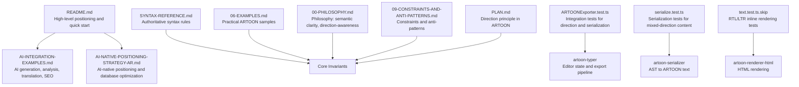
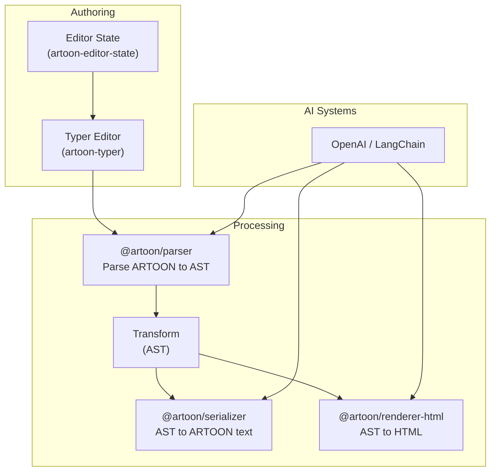
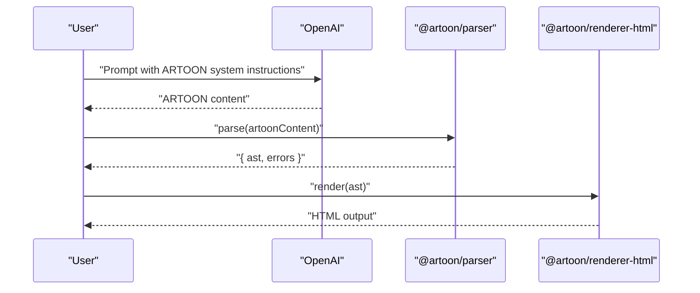
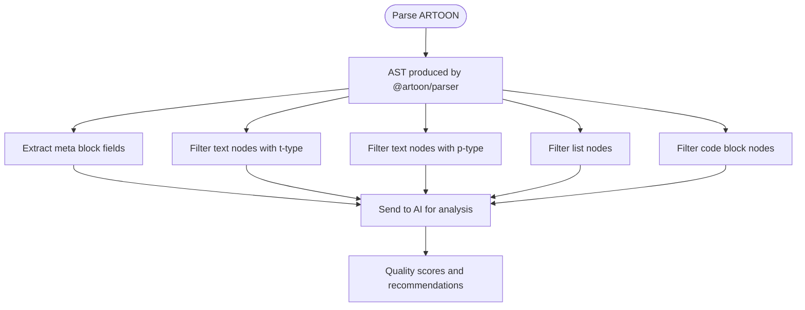
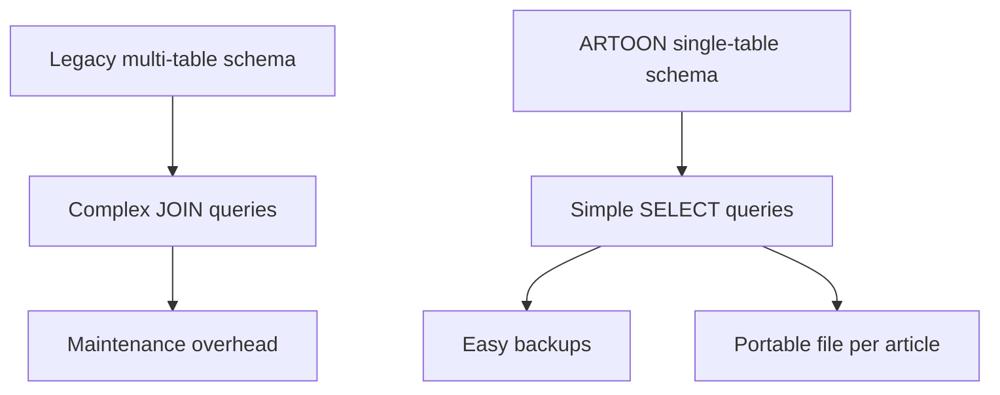
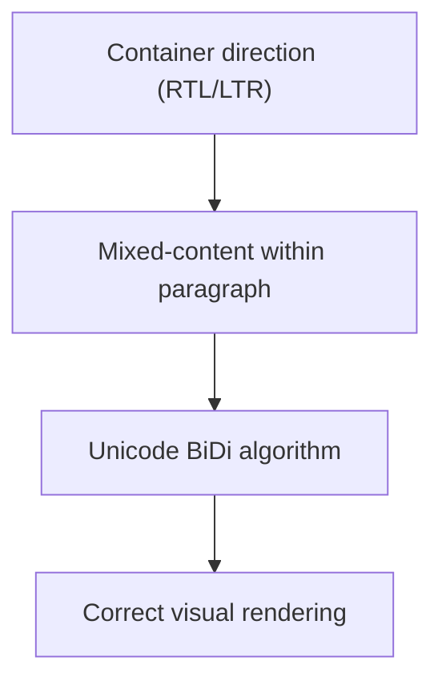
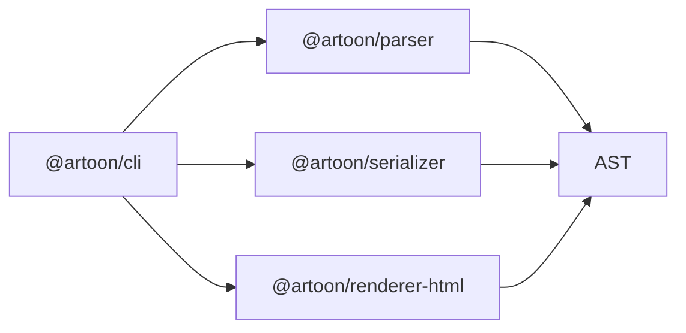

# Use Cases and Key Benefits

<cite>
**Referenced Files in This Document**
- [README.md](file://README.md)
- [AI-INTEGRATION-EXAMPLES.md](file://AI-INTEGRATION-EXAMPLES.md)
- [AI-NATIVE-POSITIONING-STRATEGY-AR.md](file://AI-NATIVE-POSITIONING-STRATEGY-AR.md)
- [SYNTAX-REFERENCE.md](file://Core Invariants/SYNTAX-REFERENCE.md)
- [06-EXAMPLES.md](file://docs/06-EXAMPLES.md)
- [00-PHILOSOPHY.md](file://Core Invariants/00-PHILOSOPHY.md)
- [09-CONSTRAINTS-AND-ANTI-PATTERNS.md](file://Core Invariants/09-CONSTRAINTS-AND-ANTI-PATTERNS.md)
- [ARTOONExporter.test.ts](file://artoon-typer/tests/integration/ARTOONExporter.test.ts)
- [serialize.test.ts](file://artoon-serializer/tests/serialize.test.ts)
- [text.test.ts](file://artoon-renderer-html/tests/text.test.ts.skip)
- [PLAN.md](file://artoon-serializer/PLAN.md)
</cite>

## Table of Contents
1. [Introduction](#introduction)
2. [Project Structure](#project-structure)
3. [Core Components](#core-components)
4. [Architecture Overview](#architecture-overview)
5. [Detailed Component Analysis](#detailed-component-analysis)
6. [Dependency Analysis](#dependency-analysis)
7. [Performance Considerations](#performance-considerations)
8. [Troubleshooting Guide](#troubleshooting-guide)
9. [Conclusion](#conclusion)
10. [Appendices](#appendices)

## Introduction
This document presents ARTOON’s use cases and key benefits grounded in the repository’s authoritative documentation and working examples. It focuses on three primary categories:
- AI content generation: Demonstrated by reliable AI generation workflows and a measured success rate versus Markdown.
- Content analysis: Shown via structured metadata extraction and downstream AI analysis pipelines.
- Database storage: Illustrated by single-table storage advantages and simplified SQL queries.

It also documents universal language support and multilingual capabilities, and provides concrete scenarios, performance comparisons, and practical implementation guidance.

## Project Structure
The repository organizes ARTOON’s capabilities across authoritative syntax references, AI integration examples, strategic positioning, and robust test coverage validating direction-aware rendering and serialization.

**Diagram sources**
- [README.md:13-16](file://README.md#L13-L16)
- [AI-INTEGRATION-EXAMPLES.md:13-61](file://AI-INTEGRATION-EXAMPLES.md#L13-L61)
- [AI-NATIVE-POSITIONING-STRATEGY-AR.md:90-140](file://AI-NATIVE-POSITIONING-STRATEGY-AR.md#L90-L140)
- [SYNTAX-REFERENCE.md:45-72](file://Core Invariants/SYNTAX-REFERENCE.md#L45-L72)
- [06-EXAMPLES.md:112-153](file://docs/06-EXAMPLES.md#L112-L153)
- [00-PHILOSOPHY.md:96-107](file://Core Invariants/00-PHILOSOPHY.md#L96-L107)
- [09-CONSTRAINTS-AND-ANTI-PATTERNS.md:28-82](file://Core Invariants/09-CONSTRAINTS-AND-ANTI-PATTERNS.md#L28-L82)
- [ARTOONExporter.test.ts:57-121](file://artoon-typer/tests/integration/ARTOONExporter.test.ts#L57-L121)
- [serialize.test.ts:206-230](file://artoon-serializer/tests/serialize.test.ts#L206-L230)
- [text.test.ts.skip:171-197](file://artoon-renderer-html/tests/text.test.ts.skip#L171-L197)
- [PLAN.md:64-99](file://artoon-serializer/PLAN.md#L64-L99)

**Section sources**
- [README.md:13-16](file://README.md#L13-L16)
- [AI-INTEGRATION-EXAMPLES.md:13-61](file://AI-INTEGRATION-EXAMPLES.md#L13-L61)
- [AI-NATIVE-POSITIONING-STRATEGY-AR.md:90-140](file://AI-NATIVE-POSITIONING-STRATEGY-AR.md#L90-L140)
- [SYNTAX-REFERENCE.md:45-72](file://Core Invariants/SYNTAX-REFERENCE.md#L45-L72)
- [06-EXAMPLES.md:112-153](file://docs/06-EXAMPLES.md#L112-L153)
- [00-PHILOSOPHY.md:96-107](file://Core Invariants/00-PHILOSOPHY.md#L96-L107)
- [09-CONSTRAINTS-AND-ANTI-PATTERNS.md:28-82](file://Core Invariants/09-CONSTRAINTS-AND-ANTI-PATTERNS.md#L28-L82)
- [ARTOONExporter.test.ts:57-121](file://artoon-typer/tests/integration/ARTOONExporter.test.ts#L57-L121)
- [serialize.test.ts:206-230](file://artoon-serializer/tests/serialize.test.ts#L206-L230)
- [text.test.ts.skip:171-197](file://artoon-renderer-html/tests/text.test.ts.skip#L171-L197)
- [PLAN.md:64-99](file://artoon-serializer/PLAN.md#L64-L99)

## Core Components
- AI content generation: ARTOON’s structured, unambiguous syntax enables reliable AI generation and parsing. The repository demonstrates higher success rates versus Markdown and provides end-to-end pipelines integrating OpenAI and LangChain.
- Content analysis: The AST-based parsing allows straightforward extraction of metadata, headings, paragraphs, lists, and code blocks for downstream AI analysis.
- Database storage: ARTOON’s single-table storage model eliminates multi-table schemas and complex JOINs, enabling simple queries and portable file-based articles.

**Section sources**
- [README.md:13-16](file://README.md#L13-L16)
- [AI-INTEGRATION-EXAMPLES.md:65-156](file://AI-INTEGRATION-EXAMPLES.md#L65-L156)
- [AI-INTEGRATION-EXAMPLES.md:189-276](file://AI-INTEGRATION-EXAMPLES.md#L189-L276)
- [AI-NATIVE-POSITIONING-STRATEGY-AR.md:90-140](file://AI-NATIVE-POSITIONING-STRATEGY-AR.md#L90-L140)

## Architecture Overview
The ARTOON ecosystem centers on a clear separation of concerns:
- Authoring and editing: Editor state and UI components manage content creation with direction awareness.
- Parsing and transformation: The parser converts ARTOON text into a canonical AST, while serializers and renderers transform the AST into ARTOON text or HTML.
- AI integration: AI systems consume ARTOON’s structured output for generation and analysis tasks.

**Diagram sources**
- [README.md:77-88](file://README.md#L77-L88)
- [AI-INTEGRATION-EXAMPLES.md:69-104](file://AI-INTEGRATION-EXAMPLES.md#L69-L104)
- [AI-INTEGRATION-EXAMPLES.md:589-656](file://AI-INTEGRATION-EXAMPLES.md#L589-L656)

## Detailed Component Analysis

### AI Content Generation
- Reliable generation: ARTOON’s explicit syntax and semantic structure yield a higher success rate than Markdown when generating content with AI.
- Practical examples: The repository includes end-to-end examples for OpenAI content generation, content analysis, translation, and SEO optimization.
- Performance comparison: A benchmark compares Markdown and ARTOON parsing reliability, reporting success rates that support ARTOON’s claims.

**Diagram sources**
- [AI-INTEGRATION-EXAMPLES.md:78-104](file://AI-INTEGRATION-EXAMPLES.md#L78-L104)
- [AI-INTEGRATION-EXAMPLES.md:108-155](file://AI-INTEGRATION-EXAMPLES.md#L108-L155)
- [AI-INTEGRATION-EXAMPLES.md:660-720](file://AI-INTEGRATION-EXAMPLES.md#L660-L720)

**Section sources**
- [README.md:13](file://README.md#L13)
- [AI-INTEGRATION-EXAMPLES.md:19-61](file://AI-INTEGRATION-EXAMPLES.md#L19-L61)
- [AI-INTEGRATION-EXAMPLES.md:660-720](file://AI-INTEGRATION-EXAMPLES.md#L660-L720)

### Content Analysis
- Structured extraction: The AST enables straightforward extraction of metadata, headings, paragraphs, lists, and code blocks.
- AI-assisted analysis: The repository demonstrates sending extracted structures to AI for quality scoring, readability assessment, and SEO recommendations.

**Diagram sources**
- [AI-INTEGRATION-EXAMPLES.md:197-270](file://AI-INTEGRATION-EXAMPLES.md#L197-L270)

**Section sources**
- [AI-INTEGRATION-EXAMPLES.md:189-276](file://AI-INTEGRATION-EXAMPLES.md#L189-L276)

### Database Storage Optimization
- Single-table model: ARTOON enables storing complete articles in a single table, embedding the full ARTOON content as a portable file-equivalent.
- Simplified queries: Retrieving content requires only a simple SELECT statement without complex JOINs.
- Migration benefits: The strategy document outlines moving from multi-table schemas to a streamlined single-table approach.

**Diagram sources**
- [AI-NATIVE-POSITIONING-STRATEGY-AR.md:92-134](file://AI-NATIVE-POSITIONING-STRATEGY-AR.md#L92-L134)

**Section sources**
- [README.md:14](file://README.md#L14)
- [AI-NATIVE-POSITIONING-STRATEGY-AR.md:90-140](file://AI-NATIVE-POSITIONING-STRATEGY-AR.md#L90-L140)

### Universal Language Support and Multilingual Capabilities
- Direction-awareness: ARTOON integrates direction at the container level (RTL/LTR), supporting mixed-content within paragraphs and preserving Unicode bidirectional behavior.
- Practical examples: The repository includes bilingual samples and tests demonstrating RTL and LTR inline rendering.
- Consistency: The serializer and renderer tests confirm correct handling of mixed-direction content.

**Diagram sources**
- [PLAN.md:64-99](file://artoon-serializer/PLAN.md#L64-L99)
- [06-EXAMPLES.md:112-153](file://docs/06-EXAMPLES.md#L112-L153)
- [serialize.test.ts:206-230](file://artoon-serializer/tests/serialize.test.ts#L206-L230)
- [text.test.ts.skip:171-197](file://artoon-renderer-html/tests/text.test.ts.skip#L171-L197)
- [ARTOONExporter.test.ts:57-121](file://artoon-typer/tests/integration/ARTOONExporter.test.ts#L57-L121)

**Section sources**
- [00-PHILOSOPHY.md:96-107](file://Core Invariants/00-PHILOSOPHY.md#L96-L107)
- [SYNTAX-REFERENCE.md:45-72](file://Core Invariants/SYNTAX-REFERENCE.md#L45-L72)
- [06-EXAMPLES.md:112-153](file://docs/06-EXAMPLES.md#L112-L153)
- [PLAN.md:64-99](file://artoon-serializer/PLAN.md#L64-L99)
- [serialize.test.ts:206-230](file://artoon-serializer/tests/serialize.test.ts#L206-L230)
- [text.test.ts.skip:171-197](file://artoon-renderer-html/tests/text.test.ts.skip#L171-L197)
- [ARTOONExporter.test.ts:57-121](file://artoon-typer/tests/integration/ARTOONExporter.test.ts#L57-L121)

## Dependency Analysis
The ARTOON ecosystem relies on a small set of focused packages:
- @artoon/parser: Parses ARTOON text into a canonical AST.
- @artoon/serializer: Serializes AST back to ARTOON text.
- @artoon/renderer-html: Renders AST to HTML.
- @artoon/cli: Command-line utilities.
- Editor and validator packages under development.

**Diagram sources**
- [README.md:77-88](file://README.md#L77-L88)

**Section sources**
- [README.md:77-88](file://README.md#L77-L88)

## Performance Considerations
- Parsing reliability: Benchmarking demonstrates ARTOON’s higher success rate versus Markdown, reducing retries and error handling overhead.
- Simpler transformations: The canonical AST simplifies downstream transformations and AI processing.
- Reduced database complexity: Single-table storage minimizes I/O and indexing overhead.

**Section sources**
- [AI-INTEGRATION-EXAMPLES.md:660-720](file://AI-INTEGRATION-EXAMPLES.md#L660-L720)
- [AI-NATIVE-POSITIONING-STRATEGY-AR.md:90-140](file://AI-NATIVE-POSITIONING-STRATEGY-AR.md#L90-L140)

## Troubleshooting Guide
- Validation and constraints: The repository enforces design constraints to prevent ambiguous constructs and unsupported nested blocks. Tests validate correct behavior for meta blocks, hidden fields, and direction handling.
- Direction issues: Ensure container direction markers are applied consistently; mixed content follows Unicode BiDi rules.
- Serialization correctness: Verify serialized output matches expected direction and content order.

**Section sources**
- [09-CONSTRAINTS-AND-ANTI-PATTERNS.md:28-82](file://Core Invariants/09-CONSTRAINTS-AND-ANTI-PATTERNS.md#L28-L82)
- [serialize.test.ts:206-230](file://artoon-serializer/tests/serialize.test.ts#L206-L230)
- [text.test.ts.skip:171-197](file://artoon-renderer-html/tests/text.test.ts.skip#L171-L197)

## Conclusion
ARTOON delivers measurable benefits across AI content generation, content analysis, and database storage. Its structured, direction-aware syntax improves AI reliability, simplifies analysis, and streamlines database design. The repository provides authoritative syntax references, working AI integration examples, and test coverage validating multilingual and direction-aware rendering.

## Appendices
- Quick start and packages: See the repository’s README for installation and package references.
- Syntax reference: Consult the authoritative syntax guide for precise rules and examples.
- AI integration examples: Explore end-to-end examples for generation, analysis, translation, and SEO.

**Section sources**
- [README.md:20-56](file://README.md#L20-L56)
- [SYNTAX-REFERENCE.md:1-493](file://Core Invariants/SYNTAX-REFERENCE.md#L1-L493)
- [AI-INTEGRATION-EXAMPLES.md:1-766](file://AI-INTEGRATION-EXAMPLES.md#L1-L766)