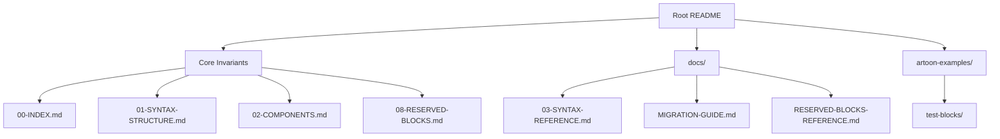
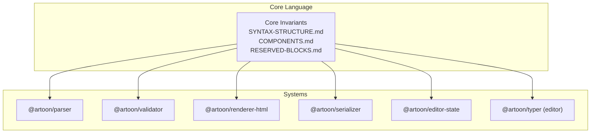
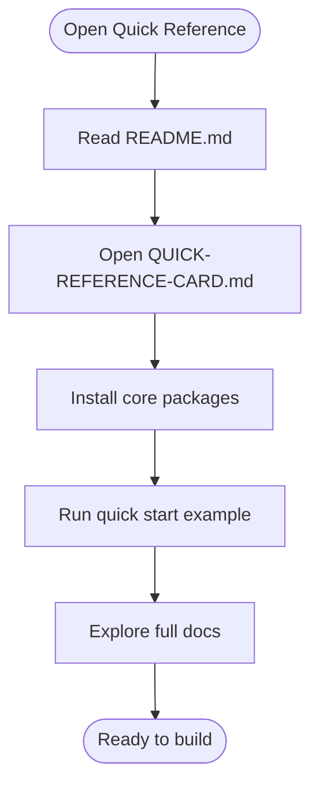
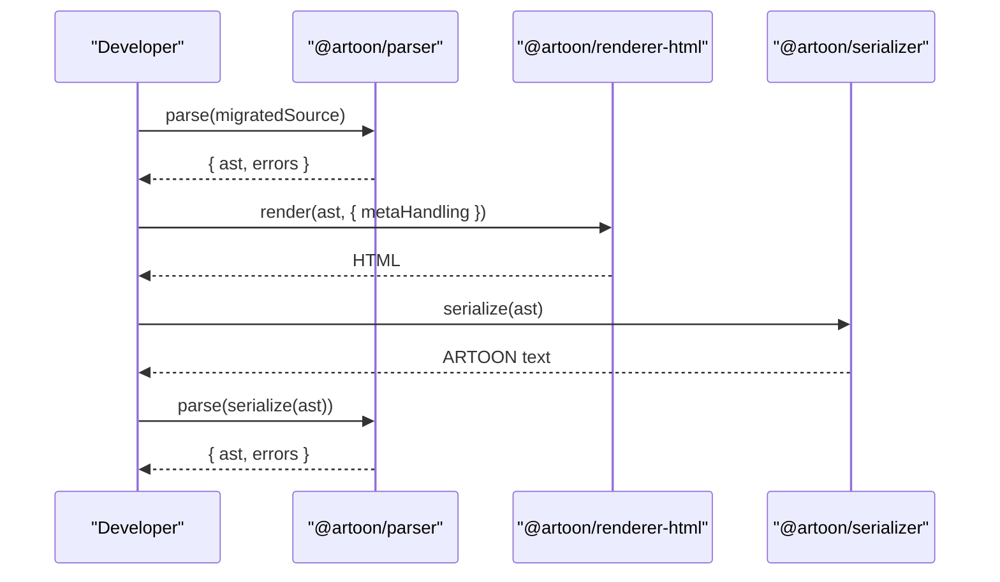
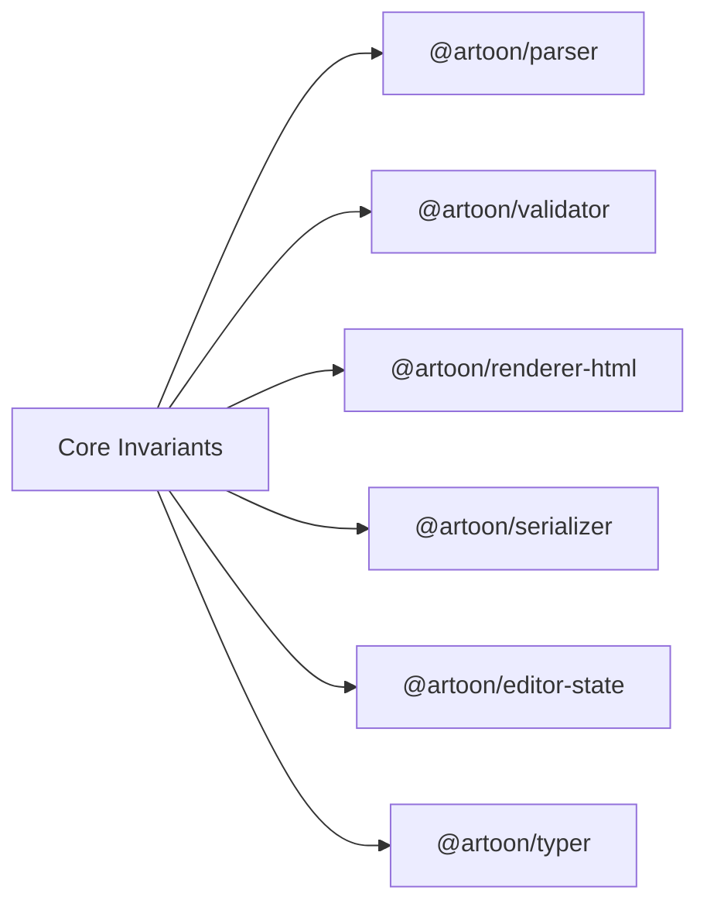

# Reference Materials

<cite>
**Referenced Files in This Document**
- [README.md](file://README.md)
- [QUICK-REFERENCE-CARD.md](file://QUICK-REFERENCE-CARD.md)
- [docs/03-SYNTAX-REFERENCE.md](file://docs/03-SYNTAX-REFERENCE.md)
- [Core Invariants/00-INDEX.md](file://Core Invariants/00-INDEX.md)
- [Core Invariants/01-SYNTAX-STRUCTURE.md](file://Core Invariants/01-SYNTAX-STRUCTURE.md)
- [Core Invariants/02-COMPONENTS.md](file://Core Invariants/02-COMPONENTS.md)
- [Core Invariants/08-RESERVED-BLOCKS.md](file://Core Invariants/08-RESERVED-BLOCKS.md)
- [docs/MIGRATION-GUIDE.md](file://docs/MIGRATION-GUIDE.md)
- [docs/RESERVED-BLOCKS-REFERENCE.md](file://docs/RESERVED-BLOCKS-REFERENCE.md)
- [artoon-examples/test-blocks/00-README.md](file://artoon-examples/test-blocks/00-README.md)
</cite>

## Table of Contents
1. [Introduction](#introduction)
2. [Project Structure](#project-structure)
3. [Core Components](#core-components)
4. [Architecture Overview](#architecture-overview)
5. [Detailed Component Analysis](#detailed-component-analysis)
6. [Dependency Analysis](#dependency-analysis)
7. [Performance Considerations](#performance-considerations)
8. [Troubleshooting Guide](#troubleshooting-guide)
9. [Conclusion](#conclusion)
10. [Appendices](#appendices)

## Introduction
This document consolidates ARTOON 2.0 reference materials to serve as a quick-start guide, migration resource, and authoritative component inventory. It covers:
- A syntax quick reference card for rapid orientation
- Migration guidance from ARTOON 1.x to 2.0, including parser, renderer, serializer, and editor changes
- A complete component inventory of supported blocks, inline elements, and reserved blocks
- Reserved blocks reference with behaviors and constraints
- Glossary of terms and acronyms
- Licensing and legal information
- Version compatibility and deprecation notes

## Project Structure
The repository organizes ARTOON 2.0 documentation and artifacts across several top-level areas:
- Core language specification and invariants
- Developer-focused documentation and quick references
- Example sets and test files
- Package-level documentation and inventory references

**Diagram sources**
- [README.md:1-247](file://README.md#L1-L247)
- [Core Invariants/00-INDEX.md:1-294](file://Core Invariants/00-INDEX.md#L1-L294)
- [docs/03-SYNTAX-REFERENCE.md:1-310](file://docs/03-SYNTAX-REFERENCE.md#L1-L310)
- [docs/MIGRATION-GUIDE.md:1-437](file://docs/MIGRATION-GUIDE.md#L1-L437)
- [docs/RESERVED-BLOCKS-REFERENCE.md:1-579](file://docs/RESERVED-BLOCKS-REFERENCE.md#L1-L579)
- [artoon-examples/test-blocks/00-README.md:1-83](file://artoon-examples/test-blocks/00-README.md#L1-L83)

**Section sources**
- [README.md:1-247](file://README.md#L1-L247)
- [Core Invariants/00-INDEX.md:1-294](file://Core Invariants/00-INDEX.md#L1-L294)

## Core Components
This section enumerates ARTOON’s fixed components and inline elements, along with reserved blocks and constraints.

- Fixed components (33):
  - Text: p, t1–t6, q, pre, time, abbr
  - Media: a, img, video, audio, file
  - Separators: br, hr, wbr
  - Lists: ul, ol, dl, li, dt, dd
  - Tables: table, th, tr
  - Compound: figure, details
  - Code: c (inline), code (block)
  - Comment: ::: (single-line or multi-line)
- Inline modifiers (7): s, e, u, d, mark, sub, sup
- Inline components (8): a, img, c, abbr, time, audio, video, file
- Reserved blocks (1): code
- Custom blocks: unlimited, including meta (reserved for metadata)

Constraints and anti-patterns include:
- No visual or behavioral attributes in core syntax
- Direction is structural (>, <) and mandatory per line
- Safe delimiter :: prevents conflicts with structural symbols
- Comments are ignored and continue until a new declared component appears

**Section sources**
- [Core Invariants/00-INDEX.md:129-161](file://Core Invariants/00-INDEX.md#L129-L161)
- [Core Invariants/02-COMPONENTS.md:1-315](file://Core Invariants/02-COMPONENTS.md#L1-L315)
- [Core Invariants/08-RESERVED-BLOCKS.md:1-318](file://Core Invariants/08-RESERVED-BLOCKS.md#L1-L318)
- [Core Invariants/01-SYNTAX-STRUCTURE.md:159-214](file://Core Invariants/01-SYNTAX-STRUCTURE.md#L159-L214)

## Architecture Overview
The ARTOON ecosystem comprises parsing, validation, rendering, serialization, and optional editor state management. The Core Invariants define language semantics; systems implement parsing, AST representation, validation, rendering, and serialization.

**Diagram sources**
- [Core Invariants/00-INDEX.md:231-253](file://Core Invariants/00-INDEX.md#L231-L253)

**Section sources**
- [Core Invariants/00-INDEX.md:231-253](file://Core Invariants/00-INDEX.md#L231-L253)

## Detailed Component Analysis

### Syntax Quick Reference Card
A concise, bilingual quick reference for ARTOON 2.0 covering:
- Core value propositions
- Target markets
- Core packages
- Quick start example
- Launch plan highlights
- Key metrics and success factors

**Diagram sources**
- [README.md:20-56](file://README.md#L20-L56)
- [QUICK-REFERENCE-CARD.md:69-87](file://QUICK-REFERENCE-CARD.md#L69-L87)

**Section sources**
- [README.md:20-56](file://README.md#L20-L56)
- [QUICK-REFERENCE-CARD.md:1-208](file://QUICK-REFERENCE-CARD.md#L1-L208)

### Migration Guide: From ARTOON 1.x to 2.0
Major breaking change: META block reservation and hidden field restrictions.

Key migration steps:
- Identify META blocks and convert content to hidden fields (only inside <meta>)
- Move non-metadata content to custom blocks
- Update AST access to read document.meta instead of scanning children
- Choose META handling mode in renderer (hide/tags/json-ld)
- Validate and roundtrip documents after migration

**Diagram sources**
- [docs/MIGRATION-GUIDE.md:154-245](file://docs/MIGRATION-GUIDE.md#L154-L245)

**Section sources**
- [docs/MIGRATION-GUIDE.md:11-437](file://docs/MIGRATION-GUIDE.md#L1-L437)

### Reserved Blocks Reference
- code: Reserved block; content is not parsed as ARTOON; supports optional language for syntax highlighting; requires explicit closing
- meta: Reserved block; contains only hidden fields; hidden in HTML by default; special editor UI; stored in document.meta
- All other blocks: Custom blocks; can contain child elements; hidden fields disallowed except in meta

Common pitfalls and corrections:
- Hidden fields outside meta: move to meta or convert to child elements
- Non-metadata content in meta: move to custom blocks
- Using child elements in code: not allowed

**Section sources**
- [docs/RESERVED-BLOCKS-REFERENCE.md:1-579](file://docs/RESERVED-BLOCKS-REFERENCE.md#L1-L579)
- [Core Invariants/08-RESERVED-BLOCKS.md:1-318](file://Core Invariants/08-RESERVED-BLOCKS.md#L1-L318)

### Component Inventory and Usage Patterns
- Text components: paragraphs, headings, quotes, preformatted text, time, abbreviation
- Media links: generic link, image, video, audio, downloadable file
- Separators: line break, horizontal rule, word break
- Lists: unordered, ordered, definition lists with nested items
- Tables: table header rows, table data rows
- Compound components: figure, details
- Inline modifiers and components: strong, emphasis, underline, delete, highlight, sub/superscript, links, images, inline code, abbreviations, time, audio, video, file
- Code: inline c and block code with optional language
- Comments: ignored content spanning single or multiple lines

Usage examples and testing:
- Example files demonstrate each block type and can be used for validation and rendering checks
- Use the test-blocks README to systematically validate rendering and behavior

**Section sources**
- [Core Invariants/02-COMPONENTS.md:1-315](file://Core Invariants/02-COMPONENTS.md#L1-L315)
- [docs/03-SYNTAX-REFERENCE.md:1-310](file://docs/03-SYNTAX-REFERENCE.md#L1-L310)
- [artoon-examples/test-blocks/00-README.md:1-83](file://artoon-examples/test-blocks/00-README.md#L1-L83)

### Syntax Quick Reference Cards by Use Case
- Beginner: Focus on basic components (p, t1–t6, lists, tables, media)
- Intermediate: Add inline modifiers, comments, compound components
- Advanced: Reserved blocks (code, meta), hidden fields, custom blocks, and advanced nesting patterns

Reference materials:
- Core Invariants for syntax rules and constraints
- Syntax reference for comprehensive examples
- Reserved blocks reference for reserved block behaviors

**Section sources**
- [Core Invariants/01-SYNTAX-STRUCTURE.md:1-214](file://Core Invariants/01-SYNTAX-STRUCTURE.md#L1-L214)
- [docs/03-SYNTAX-REFERENCE.md:1-310](file://docs/03-SYNTAX-REFERENCE.md#L1-L310)
- [docs/RESERVED-BLOCKS-REFERENCE.md:1-579](file://docs/RESERVED-BLOCKS-REFERENCE.md#L1-L579)

## Dependency Analysis
Relationship between Core Invariants and Systems:
- Core Invariants define WHAT ARTOON is (syntax, semantics, constraints)
- Systems implement HOW to parse, validate, render, serialize, and manage editor state

**Diagram sources**
- [Core Invariants/00-INDEX.md:231-253](file://Core Invariants/00-INDEX.md#L231-L253)

**Section sources**
- [Core Invariants/00-INDEX.md:231-253](file://Core Invariants/00-INDEX.md#L231-L253)

## Performance Considerations
- ARTOON’s safe delimiter and strict syntax reduce parsing ambiguity and improve reliability
- Single-table storage model simplifies database operations and reduces joins
- Inline modifiers and components keep content semantic and lightweight
- Reserved blocks minimize parsing overhead for specialized constructs

[No sources needed since this section provides general guidance]

## Troubleshooting Guide
Common issues and resolutions:
- Hidden field syntax outside meta: move to meta or convert to child element
- Non-metadata content in meta: move to a custom block
- Mixed content in meta: split into metadata (meta) and content (custom block)
- Roundtrip verification: parse → serialize → parse and compare ASTs
- Renderer meta handling: choose hide/tags/json-ld depending on desired output

**Section sources**
- [docs/MIGRATION-GUIDE.md:312-356](file://docs/MIGRATION-GUIDE.md#L312-L356)
- [docs/RESERVED-BLOCKS-REFERENCE.md:480-534](file://docs/RESERVED-BLOCKS-REFERENCE.md#L480-L534)

## Conclusion
ARTOON 2.0 provides a robust, AI-native structured format with a clear syntax, reserved blocks for specialized use cases, and a comprehensive component set. The migration guide and reference materials enable smooth upgrades and consistent authoring across diverse content types.

[No sources needed since this section summarizes without analyzing specific files]

## Appendices

### Glossary
- AST: Abstract Syntax Tree
- CLI: Command-Line Interface
- HTML: Hypertext Markup Language
- JSON-LD: JSON for Linked Data
- META: Reserved metadata block
- Parser: Converts ARTOON text to AST
- Renderer: Produces HTML from AST
- Serializer: Converts AST back to ARTOON text
- Reserved block: A block with special semantics and syntax
- Safe delimiter: :: used to separate directive from content
- Direction markers: > (RTL), < (LTR)

**Section sources**
- [Core Invariants/00-INDEX.md:98-125](file://Core Invariants/00-INDEX.md#L98-L125)

### Licensing and Legal Information
- License: MIT
- Details: See repository LICENSE file

**Section sources**
- [README.md:234-237](file://README.md#L234-L237)

### Version Compatibility and Deprecation Notes
- ARTOON 2.0 introduces META block reservation and hidden field restrictions
- Breaking changes require migration of existing documents
- Reserved blocks: code (content unparsed), meta (metadata only)
- Custom blocks remain fully extensible

**Section sources**
- [docs/MIGRATION-GUIDE.md:11-15](file://docs/MIGRATION-GUIDE.md#L11-L15)
- [Core Invariants/08-RESERVED-BLOCKS.md:7-28](file://Core Invariants/08-RESERVED-BLOCKS.md#L7-L28)