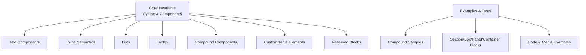
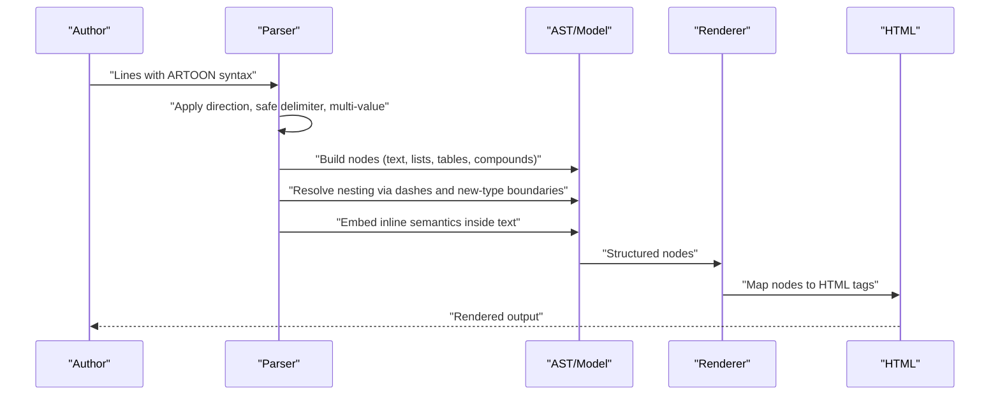
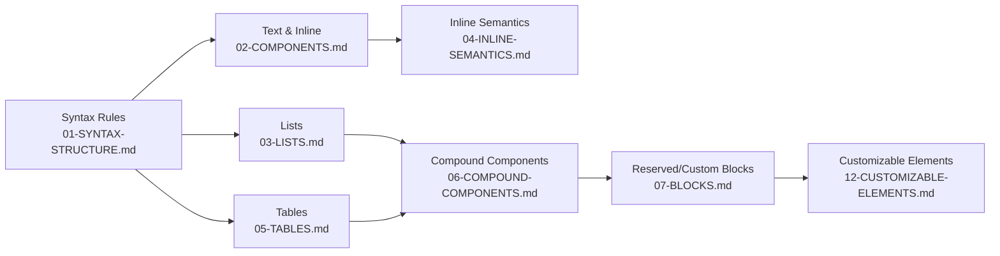

# Component Types and Properties

<cite>
**Referenced Files in This Document**
- [01-SYNTAX-STRUCTURE.md](file://Core Invariants/01-SYNTAX-STRUCTURE.md)
- [02-COMPONENTS.md](file://Core Invariants/02-COMPONENTS.md)
- [03-LISTS.md](file://Core Invariants/03-LISTS.md)
- [04-INLINE-SEMANTICS.md](file://Core Invariants/04-INLINE-SEMANTICS.md)
- [05-TABLES.md](file://Core Invariants/05-TABLES.md)
- [06-COMPOUND-COMPONENTS.md](file://Core Invariants/06-COMPOUND-COMPONENTS.md)
- [07-BLOCKS.md](file://Core Invariants/07-BLOCKS.md)
- [12-CUSTOMIZABLE-ELEMENTS.md](file://Core Invariants/12-CUSTOMIZABLE-ELEMENTS.md)
- [09-compound-components.artoon](file://samples/09-compound-components.artoon)
- [test-compound-blocks.artoon](file://artoon-examples/test-compound-blocks/test-compound-blocks.artoon)
- [12-section-block.artoon](file://artoon-examples/test-blocks/12-section-block.artoon)
- [13-box-block.artoon](file://artoon-examples/test-blocks/13-box-block.artoon)
- [14-panel-block.artoon](file://artoon-examples/test-blocks/14-panel-block.artoon)
- [15-container-block.artoon](file://artoon-examples/test-blocks/15-container-block.artoon)
- [00-INDEX.md](file://COMPOUND-BLOCKS-FIX/00-INDEX-AR.md)
- [01-PROBLEM-ANALYSIS-AR.md](file://COMPOUND-BLOCKS-FIX/01-PROBLEM-ANALYSIS-AR.md)
- [02-CURRENT-STATE-AR.md](file://COMPOUND-BLOCKS-FIX/02-CURRENT-STATE-AR.md)
- [03-ROOT-CAUSE-AR.md](file://COMPOUND-BLOCKS-FIX/03-ROOT-CAUSE-AR.md)
- [04-SOLUTION-OVERVIEW-AR.md](file://COMPOUND-BLOCKS-FIX/04-SOLUTION-OVERVIEW-AR.md)
- [05-IMPLEMENTATION-STEPS-AR.md](file://COMPOUND-BLOCKS-FIX/05-IMPLEMENTATION-STEPS-AR.md)
- [12-EXECUTION-LOG-AR.md](file://COMPOUND-BLOCKS-FIX/12-EXECUTION-LOG-AR.md)
- [13-FINAL-REPORT-AR.md](file://COMPOUND-BLOCKS-FIX/13-FINAL-REPORT-AR.md)
- [README-AR.md](file://COMPOUND-BLOCKS-FIX/README-AR.md)
- [START-HERE-AR.md](file://COMPOUND-BLOCKS-FIX/START-HERE-AR.md)
</cite>

## Table of Contents
1. [Introduction](#introduction)
2. [Project Structure](#project-structure)
3. [Core Components](#core-components)
4. [Architecture Overview](#architecture-overview)
5. [Detailed Component Analysis](#detailed-component-analysis)
6. [Dependency Analysis](#dependency-analysis)
7. [Performance Considerations](#performance-considerations)
8. [Troubleshooting Guide](#troubleshooting-guide)
9. [Conclusion](#conclusion)
10. [Appendices](#appendices)

## Introduction
This document catalogs ARTOON component types and their properties across text, media, structural, code, and compound categories. It defines syntax formats, property semantics, value constraints, nesting rules, inheritance patterns, defaults, and customization options. It also provides best practices and examples drawn from the repository’s core invariants and examples.

## Project Structure
The component model is defined in the Core Invariants and illustrated via examples and test files:
- Syntax structure and parsing rules
- Text, inline semantics, lists, tables, and compound components
- Customizable elements and reserved blocks
- Examples and test suites demonstrating nesting and composition

[No sources needed since this diagram shows conceptual workflow, not actual code structure]

## Core Components
This section summarizes the canonical component families and their roles.

- Text components: paragraphs, headings, quotes, preformatted text, time, abbreviations
- Inline semantic types: strong, emphasis, underline, deleted, mark, subscript, superscript
- Links/media: generic links, images, videos, audio, generic files
- Structural separators: line break, horizontal rule, word break
- Code: inline code and block code
- Compound components: figures, details, and custom blocks
- Reserved/customizable elements: custom blocks, hidden fields, comments

**Section sources**
- [02-COMPONENTS.md: Text components:9-106](file://Core Invariants/02-COMPONENTS.md#L9-L106)
- [02-COMPONENTS.md: Links/media:111-190](file://Core Invariants/02-COMPONENTS.md#L111-L190)
- [02-COMPONENTS.md: Separators:195-217](file://Core Invariants/02-COMPONENTS.md#L195-L217)
- [02-COMPONENTS.md: Code:222-290](file://Core Invariants/02-COMPONENTS.md#L222-L290)
- [04-INLINE-SEMANTICS.md: Inline semantics summary:231-258](file://Core Invariants/04-INLINE-SEMANTICS.md#L231-L258)
- [06-COMPOUND-COMPONENTS.md: Compound components](file://Core Invariants/06-COMPOUND-COMPONENTS.md)
- [07-BLOCKS.md: Reserved/customizable blocks](file://Core Invariants/07-BLOCKS.md)
- [12-CUSTOMIZABLE-ELEMENTS.md: Customizable elements:26-97](file://Core Invariants/12-CUSTOMIZABLE-ELEMENTS.md#L26-L97)

## Architecture Overview
The ARTOON pipeline parses lines into components, applies directionality, resolves nested contexts (lists, tables, compound blocks), and renders to HTML. Inline semantics are embedded within text components.

[No sources needed since this diagram shows conceptual workflow, not actual code structure]

## Detailed Component Analysis

### Text Components
- Paragraph (p): block-level text container
- Headings (t1–t6): hierarchical headings mapped to h1–h6
- Quote (q): blockquote-like quotation
- Preformatted (pre): preserves whitespace/layout without syntax highlighting
- Time (time): semantic datetime with optional readable label
- Abbreviation (abbr): abbreviation with expansion

Properties and constraints:
- Direction-aware: lines start with > (RTL) or < (LTR); direction affects reading, not semantics
- Safe delimiter (::) separates type from content; mandatory space after ::
- Multi-value fields use semicolon (;) separator with fixed order per type
- Inline semantics integrate inside text components

Best practices:
- Prefer headings for hierarchy; avoid skipping levels
- Use pre only for preserved formatting, not code highlighting
- Provide readable labels for time when appropriate

**Section sources**
- [02-COMPONENTS.md: Paragraph:9-21](file://Core Invariants/02-COMPONENTS.md#L9-L21)
- [02-COMPONENTS.md: Headings:24-43](file://Core Invariants/02-COMPONENTS.md#L24-L43)
- [02-COMPONENTS.md: Quote:46-57](file://Core Invariants/02-COMPONENTS.md#L46-L57)
- [02-COMPONENTS.md: Preformatted:60-72](file://Core Invariants/02-COMPONENTS.md#L60-L72)
- [02-COMPONENTS.md: Time:76-89](file://Core Invariants/02-COMPONENTS.md#L76-L89)
- [02-COMPONENTS.md: Abbreviation:92-104](file://Core Invariants/02-COMPONENTS.md#L92-L104)
- [01-SYNTAX-STRUCTURE.md: Direction and delimiter:7-35](file://Core Invariants/01-SYNTAX-STRUCTURE.md#L7-L35)
- [01-SYNTAX-STRUCTURE.md: Multi-value ordering:77-94](file://Core Invariants/01-SYNTAX-STRUCTURE.md#L77-L94)

### Inline Semantics
Inline modifiers (s, e, u, d, mark, sub, sup) apply local formatting within text. Types (time, abbr, a, img, audio, video, file, c) embed semantic content. Modifiers and types compose as [mods+type:: content].

Constraints:
- No nesting of inline expressions
- Order: modifiers first, then type
- Type-only expressions inherit direction from containing component

Examples of composition:
- Strong emphasis around a link
- Marked time with readable label
- Subscript/superscript in formulas

**Section sources**
- [04-INLINE-SEMANTICS.md: Concepts:7-16](file://Core Invariants/04-INLINE-SEMANTICS.md#L7-L16)
- [04-INLINE-SEMANTICS.md: Modifiers:44-57](file://Core Invariants/04-INLINE-SEMANTICS.md#L44-L57)
- [04-INLINE-SEMANTICS.md: Types:60-84](file://Core Invariants/04-INLINE-SEMANTICS.md#L60-L84)
- [04-INLINE-SEMANTICS.md: Examples:88-228](file://Core Invariants/04-INLINE-SEMANTICS.md#L88-L228)

### Links and Media
- Generic link (a): URL plus optional display text
- Image (img): path with optional alt and title
- Video (video): path with optional title
- Audio (audio): path with optional title
- Generic file (file): path with optional label

Value constraints:
- Fixed field order per type
- Optional fields are supported where documented

**Section sources**
- [02-COMPONENTS.md: Links/media:111-190](file://Core Invariants/02-COMPONENTS.md#L111-L190)
- [01-SYNTAX-STRUCTURE.md: Multi-value ordering:77-94](file://Core Invariants/01-SYNTAX-STRUCTURE.md#L77-L94)

### Structural Separators
- Line break (br): newline
- Horizontal rule (hr): thematic break
- Word break opportunity (wbr): soft hyphen-like hint

Usage:
- No :: required; they are direction-aware markers without content

**Section sources**
- [02-COMPONENTS.md: Separators:195-217](file://Core Invariants/02-COMPONENTS.md#L195-L217)
- [01-SYNTAX-STRUCTURE.md: Direction and empty-content markers:103-129](file://Core Invariants/01-SYNTAX-STRUCTURE.md#L103-L129)

### Code Components
- Inline code (c): short code fragments inside text; optional language hint
- Block code (<code:lang>... .<code>): multi-line code with language class

Rules:
- Do not mix inline and block forms for the same role
- Block form requires explicit closing

**Section sources**
- [02-COMPONENTS.md: Inline code:222-240](file://Core Invariants/02-COMPONENTS.md#L222-L240)
- [02-COMPONENTS.md: Block code:241-272](file://Core Invariants/02-COMPONENTS.md#L241-L272)
- [02-COMPONENTS.md: Distinction note:273-289](file://Core Invariants/02-COMPONENTS.md#L273-L289)

### Lists
- Unordered (ul), ordered (ol), definition (dl)
- Elements: li, dt/dd
- Nesting via leading dashes; direction inherited from parent container

Behavior:
- Implicit close on level decrease or new component start
- Explicit declaration required for each nested list type

**Section sources**
- [03-LISTS.md: Types and examples:7-68](file://Core Invariants/03-LISTS.md#L7-L68)
- [03-LISTS.md: Nesting rules:71-90](file://Core Invariants/03-LISTS.md#L71-L90)
- [03-LISTS.md: Mixed lists:118-184](file://Core Invariants/03-LISTS.md#L118-L184)
- [03-LISTS.md: Closing rules:188-207](file://Core Invariants/03-LISTS.md#L188-L207)
- [03-LISTS.md: Parsing algorithm:211-225](file://Core Invariants/03-LISTS.md#L211-L225)

### Tables
- Container: table
- Rows: tr (body) and th (head)
- Cells: semicolon-separated values
- Implicit close on new component or EOF

Direction:
- Cells inherit direction from parent table

**Section sources**
- [05-TABLES.md: Concept and syntax:7-57](file://Core Invariants/05-TABLES.md#L7-L57)
- [05-TABLES.md: Elements and mapping:86-93](file://Core Invariants/05-TABLES.md#L86-L93)
- [05-TABLES.md: Closing rules:96-112](file://Core Invariants/05-TABLES.md#L96-L112)

### Compound Components
- Figure: grouping of media with a caption; supports img/video/audio and captions
- Details: collapsible content with summary; supports arbitrary nested components
- Custom blocks: open-ended containers named by the author; rendered with customizable tags/classes

Nesting and composition:
- Figures can wrap images, videos, or audios and optionally include captions
- Details can contain headings, paragraphs, lists, tables, and code blocks
- Custom blocks can nest other custom blocks and standard components

Examples:
- Compound samples demonstrate figure with image/video/audio and captions
- Details with headings, paragraphs, lists, tables, and code
- Section/Box/Panel/Container blocks illustrate custom block usage

**Section sources**
- [06-COMPOUND-COMPONENTS.md: Compound components](file://Core Invariants/06-COMPOUND-COMPONENTS.md)
- [09-compound-components.artoon: Figure and Details examples:15-71](file://samples/09-compound-components.artoon#L15-L71)
- [test-compound-blocks.artoon: Figure/Details tests:9-83](file://artoon-examples/test-compound-blocks/test-compound-blocks.artoon#L9-L83)
- [12-section-block.artoon: Section block:16-41](file://artoon-examples/test-blocks/12-section-block.artoon#L16-L41)
- [13-box-block.artoon: Box block:16-31](file://artoon-examples/test-blocks/13-box-block.artoon#L16-L31)
- [14-panel-block.artoon: Panel block:16-35](file://artoon-examples/test-blocks/14-panel-block.artoon#L16-L35)
- [15-container-block.artoon: Container block:16-35](file://artoon-examples/test-blocks/15-container-block.artoon#L16-L35)

### Reserved and Customizable Elements
- Custom block: <name>. ... .<name>; default class is {name}; default tag is div; visible by default
- Hidden field: >.-:field: value; default class is {field}; hidden by default
- Comment: >.::: text; default class is comment; hidden by default

Customization:
- Renderers/plugins choose any HTML tag
- Presentation can be tailored via CSS/JS/plugins
- File content remains unchanged regardless of presentation

**Section sources**
- [12-CUSTOMIZABLE-ELEMENTS.md: Elements and mapping:26-97](file://Core Invariants/12-CUSTOMIZABLE-ELEMENTS.md#L26-L97)
- [12-CUSTOMIZABLE-ELEMENTS.md: Examples and capabilities:107-176](file://Core Invariants/12-CUSTOMIZABLE-ELEMENTS.md#L107-L176)
- [07-BLOCKS.md: Reserved blocks](file://Core Invariants/07-BLOCKS.md)

## Dependency Analysis
Component relationships and parsing dependencies:

**Diagram sources**
- [01-SYNTAX-STRUCTURE.md:1-214](file://Core Invariants/01-SYNTAX-STRUCTURE.md#L1-L214)
- [02-COMPONENTS.md:1-315](file://Core Invariants/02-COMPONENTS.md#L1-L315)
- [03-LISTS.md:1-249](file://Core Invariants/03-LISTS.md#L1-L249)
- [04-INLINE-SEMANTICS.md:1-263](file://Core Invariants/04-INLINE-SEMANTICS.md#L1-L263)
- [05-TABLES.md:1-135](file://Core Invariants/05-TABLES.md#L1-L135)
- [06-COMPOUND-COMPONENTS.md](file://Core Invariants/06-COMPOUND-COMPONENTS.md)
- [07-BLOCKS.md](file://Core Invariants/07-BLOCKS.md)
- [12-CUSTOMIZABLE-ELEMENTS.md:1-237](file://Core Invariants/12-CUSTOMIZABLE-ELEMENTS.md#L1-L237)

## Performance Considerations
- Prefer concise inline semantics to reduce nesting complexity
- Use block code for long listings to avoid heavy inline markup
- Limit deeply nested compound components to improve readability and rendering performance
- Keep comments minimal; they are ignored during parsing but increase file size

[No sources needed since this section provides general guidance]

## Troubleshooting Guide
Common issues and resolutions:
- Missing space after ::: Ensure a space after the delimiter
- Mixing inline and block code: stick to one form per code role
- Incorrect multi-value order: adhere to documented field order per type
- Improper list/table closure: ensure implicit closure on level change or new component start
- Misplaced direction: remember direction affects reading, not semantics

**Section sources**
- [01-SYNTAX-STRUCTURE.md: Safe delimiter and spacing:57-75](file://Core Invariants/01-SYNTAX-STRUCTURE.md#L57-L75)
- [02-COMPONENTS.md: Inline vs block code distinction:273-289](file://Core Invariants/02-COMPONENTS.md#L273-L289)
- [01-SYNTAX-STRUCTURE.md: Multi-value ordering:77-94](file://Core Invariants/01-SYNTAX-STRUCTURE.md#L77-L94)
- [03-LISTS.md: Closing rules:188-207](file://Core Invariants/03-LISTS.md#L188-L207)
- [05-TABLES.md: Closing rules:96-112](file://Core Invariants/05-TABLES.md#L96-L112)

## Conclusion
ARTOON’s component model balances expressiveness with simplicity. Canonical components cover text, inline semantics, lists, tables, code, and compound structures. Direction-aware syntax, safe delimiters, and explicit nesting rules ensure robust parsing. Customizable elements and reserved blocks enable flexible rendering while preserving content fidelity.

[No sources needed since this section summarizes without analyzing specific files]

## Appendices

### A. Syntax Quick Reference
- Direction: > (RTL), < (LTR)
- Delimiter: :: with mandatory space
- Multi-value: semicolon-separated fields
- Nesting: leading dashes indicate depth
- Comments: >.::: or <.:::

**Section sources**
- [01-SYNTAX-STRUCTURE.md: Structure summary:187-210](file://Core Invariants/01-SYNTAX-STRUCTURE.md#L187-L210)

### B. Component Inventory
- Text: p, t1–t6, q, pre, time, abbr
- Inline: s, e, u, d, mark, sub, sup, time, abbr, a, img, audio, video, file, c
- Lists: ul, ol, dl with li/dt/dd
- Tables: table with th/tr
- Separators: br, hr, wbr
- Code: c (inline), <code:lang>... .<code> (block)
- Compound: figure, details, custom blocks
- Reserved: hidden fields, comments

**Section sources**
- [02-COMPONENTS.md: Summary:292-310](file://Core Invariants/02-COMPONENTS.md#L292-L310)
- [03-LISTS.md: Summary:229-244](file://Core Invariants/03-LISTS.md#L229-L244)
- [05-TABLES.md: Summary:116-131](file://Core Invariants/05-TABLES.md#L116-L131)
- [04-INLINE-SEMANTICS.md: Summary:231-258](file://Core Invariants/04-INLINE-SEMANTICS.md#L231-L258)
- [06-COMPOUND-COMPONENTS.md: Compound summary](file://Core Invariants/06-COMPOUND-COMPONENTS.md)
- [12-CUSTOMIZABLE-ELEMENTS.md: Summary:202-230](file://Core Invariants/12-CUSTOMIZABLE-ELEMENTS.md#L202-L230)

### C. Examples Index
- Compound samples: [09-compound-components.artoon:1-100](file://samples/09-compound-components.artoon#L1-L100)
- Compound tests: [test-compound-blocks.artoon:1-110](file://artoon-examples/test-compound-blocks/test-compound-blocks.artoon#L1-L110)
- Custom blocks: [12-section-block.artoon:1-58](file://artoon-examples/test-blocks/12-section-block.artoon#L1-L58), [13-box-block.artoon:1-46](file://artoon-examples/test-blocks/13-box-block.artoon#L1-L46), [14-panel-block.artoon:1-50](file://artoon-examples/test-blocks/14-panel-block.artoon#L1-L50), [15-container-block.artoon:1-61](file://artoon-examples/test-blocks/15-container-block.artoon#L1-L61)

**Section sources**
- [09-compound-components.artoon: Lines 1-L100:1-100](file://samples/09-compound-components.artoon#L1-L100)
- [test-compound-blocks.artoon: Lines 1-L110:1-110](file://artoon-examples/test-compound-blocks/test-compound-blocks.artoon#L1-L110)
- [12-section-block.artoon: Lines 1-L58:1-58](file://artoon-examples/test-blocks/12-section-block.artoon#L1-L58)
- [13-box-block.artoon: Lines 1-L46:1-46](file://artoon-examples/test-blocks/13-box-block.artoon#L1-L46)
- [14-panel-block.artoon: Lines 1-L50:1-50](file://artoon-examples/test-blocks/14-panel-block.artoon#L1-L50)
- [15-container-block.artoon: Lines 1-L61:1-61](file://artoon-examples/test-blocks/15-container-block.artoon#L1-L61)

### D. Compound Blocks Fix Execution Reports
- Problem analysis, current state, root cause, solution overview, implementation steps, execution log, final report, and related documents provide historical context for compound block stability and fixes.

**Section sources**
- [01-PROBLEM-ANALYSIS-AR.md](file://COMPOUND-BLOCKS-FIX/01-PROBLEM-ANALYSIS-AR.md)
- [02-CURRENT-STATE-AR.md](file://COMPOUND-BLOCKS-FIX/02-CURRENT-STATE-AR.md)
- [03-ROOT-CAUSE-AR.md](file://COMPOUND-BLOCKS-FIX/03-ROOT-CAUSE-AR.md)
- [04-SOLUTION-OVERVIEW-AR.md](file://COMPOUND-BLOCKS-FIX/04-SOLUTION-OVERVIEW-AR.md)
- [05-IMPLEMENTATION-STEPS-AR.md](file://COMPOUND-BLOCKS-FIX/05-IMPLEMENTATION-STEPS-AR.md)
- [12-EXECUTION-LOG-AR.md](file://COMPOUND-BLOCKS-FIX/12-EXECUTION-LOG-AR.md)
- [13-FINAL-REPORT-AR.md](file://COMPOUND-BLOCKS-FIX/13-FINAL-REPORT-AR.md)
- [README-AR.md](file://COMPOUND-BLOCKS-FIX/README-AR.md)
- [START-HERE-AR.md](file://COMPOUND-BLOCKS-FIX/START-HERE-AR.md)