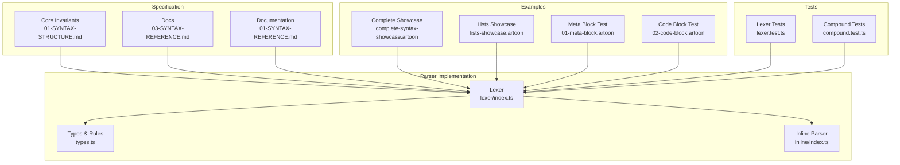
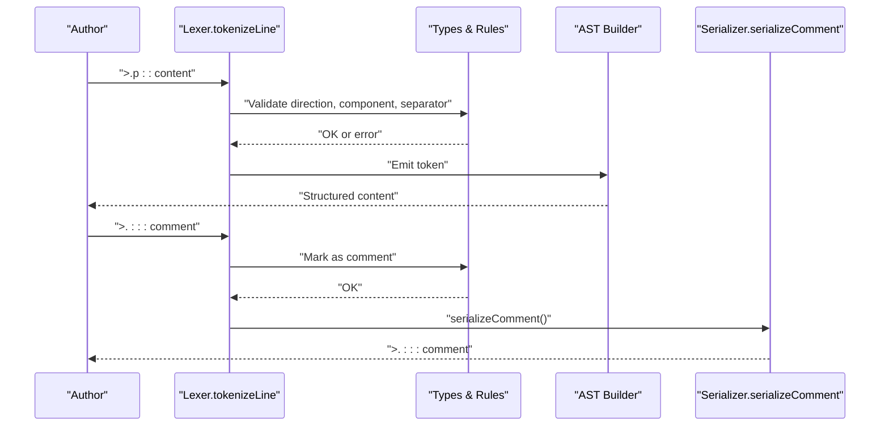
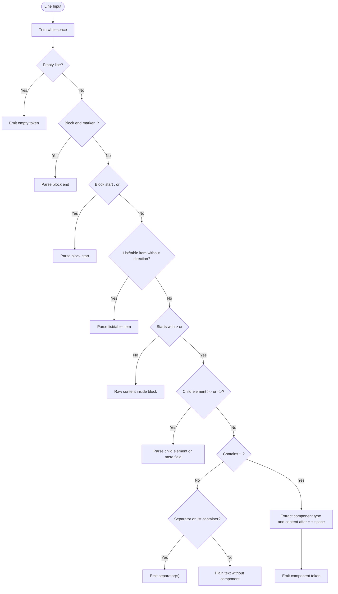
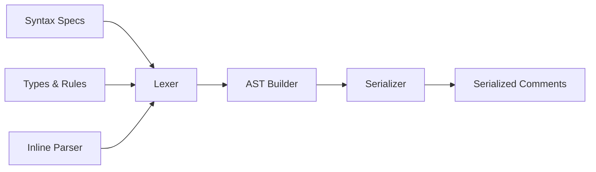

# Core Syntax Structure

<cite>
**Referenced Files in This Document**
- [01-SYNTAX-STRUCTURE.md](file://Core%20Invariants/01-SYNTAX-STRUCTURE.md)
- [03-SYNTAX-REFERENCE.md](file://docs/03-SYNTAX-REFERENCE.md)
- [01-SYNTAX-REFERENCE.md](file://artoon-documentation/01-SYNTAX-REFERENCE.md)
- [index.ts](file://artoon-parser/src/lexer/index.ts)
- [types.ts](file://artoon-parser/src/types.ts)
- [index.ts](file://artoon-parser/src/inline/index.ts)
- [comment.ts](file://artoon-serializer/src/nodes/comment.ts)
- [complete-syntax-showcase.artoon](file://artoon-examples/complete-syntax-showcase.artoon)
- [lists-showcase.artoon](file://artoon-examples/lists-showcase.artoon)
- [01-meta-block.artoon](file://artoon-examples/test-blocks/01-meta-block.artoon)
- [02-code-block.artoon](file://artoon-examples/test-blocks/02-code-block.artoon)
- [lexer.test.ts](file://artoon-parser/tests/lexer.test.ts)
- [compound.test.ts](file://artoon-parser/tests/compound.test.ts)
</cite>

## Table of Contents
1. [Introduction](#introduction)
2. [Project Structure](#project-structure)
3. [Core Components](#core-components)
4. [Architecture Overview](#architecture-overview)
5. [Detailed Component Analysis](#detailed-component-analysis)
6. [Dependency Analysis](#dependency-analysis)
7. [Performance Considerations](#performance-considerations)
8. [Troubleshooting Guide](#troubleshooting-guide)
9. [Conclusion](#conclusion)

## Introduction
This document defines ARTOON’s core syntax structure with a focus on the fundamental line construction, directional markers, component declarations, safe separator semantics, multi-value attributes, nesting via hyphen depth, comments, and behavioral rules such as line continuation, empty lines, and implicit closing. It synthesizes authoritative specification documents and validates behavior against the parser implementation and examples.

## Project Structure
The syntax is defined across:
- Specification documents detailing the grammar and semantics
- Parser implementation enforcing the syntax
- Examples demonstrating correct usage and edge cases
- Tests validating parsing behavior

**Diagram sources**
- [01-SYNTAX-STRUCTURE.md:1-214](file://Core%20Invariants/01-SYNTAX-STRUCTURE.md#L1-L214)
- [03-SYNTAX-REFERENCE.md:1-310](file://docs/03-SYNTAX-REFERENCE.md#L1-L310)
- [01-SYNTAX-REFERENCE.md:1-622](file://artoon-documentation/01-SYNTAX-REFERENCE.md#L1-L622)
- [index.ts:1-483](file://artoon-parser/src/lexer/index.ts#L1-L483)
- [types.ts:1-123](file://artoon-parser/src/types.ts#L1-L123)
- [index.ts:104-156](file://artoon-parser/src/inline/index.ts#L104-L156)
- [complete-syntax-showcase.artoon:1-477](file://artoon-examples/complete-syntax-showcase.artoon#L1-L477)
- [lists-showcase.artoon:1-457](file://artoon-examples/lists-showcase.artoon#L1-L457)
- [01-meta-block.artoon:1-61](file://artoon-examples/test-blocks/01-meta-block.artoon#L1-L61)
- [02-code-block.artoon:1-100](file://artoon-examples/test-blocks/02-code-block.artoon#L1-L100)
- [lexer.test.ts:44-82](file://artoon-parser/tests/lexer.test.ts#L44-L82)
- [compound.test.ts:96-212](file://artoon-parser/tests/compound.test.ts#L96-L212)

**Section sources**
- [01-SYNTAX-STRUCTURE.md:1-214](file://Core%20Invariants/01-SYNTAX-STRUCTURE.md#L1-L214)
- [03-SYNTAX-REFERENCE.md:1-310](file://docs/03-SYNTAX-REFERENCE.md#L1-L310)
- [01-SYNTAX-REFERENCE.md:1-622](file://artoon-documentation/01-SYNTAX-REFERENCE.md#L1-L622)

## Core Components
- Direction markers: > (RTL) and < (LTR) at the start of every line carrying semantic content.
- Component declaration: . indicates a component line; optional in some contexts (e.g., child elements).
- Safe separator: :: followed by a mandatory space separates type from content.
- Multi-value attributes: semicolon-separated values within content.
- Nesting depth: leading hyphens (-) indicate nesting levels for list items and child elements.
- Comments: >.::: or <.::: introduce comments that are ignored during parsing.
- Behavioral rules: lines can be arbitrarily long; empty lines are allowed for formatting; opening a new component implicitly closes the previous one; blocks require explicit closing except for special cases noted below.

**Section sources**
- [01-SYNTAX-STRUCTURE.md:14-35](file://Core%20Invariants/01-SYNTAX-STRUCTURE.md#L14-L35)
- [03-SYNTAX-REFERENCE.md:3-18](file://docs/03-SYNTAX-REFERENCE.md#L3-L18)
- [01-SYNTAX-REFERENCE.md:19-32](file://artoon-documentation/01-SYNTAX-REFERENCE.md#L19-L32)
- [index.ts:166-184](file://artoon-parser/src/lexer/index.ts#L166-L184)

## Architecture Overview
The syntax is tokenized by the lexer into structured tokens, validated by type rules, and transformed into an internal AST. Comments are serialized back into the safe separator form with direction markers.

**Diagram sources**
- [index.ts:10-77](file://artoon-parser/src/lexer/index.ts#L10-L77)
- [types.ts:1-123](file://artoon-parser/src/types.ts#L1-L123)
- [comment.ts:1-14](file://artoon-serializer/src/nodes/comment.ts#L1-L14)

## Detailed Component Analysis

### Fundamental Line Structure
- Required parts: direction marker, optional component dot, type, optional depth hyphens, safe separator, mandatory space, content.
- Optional parts: child element prefix >.- or <.-, meta field syntax >.-:field:, and combined separators without ::.

**Diagram sources**
- [index.ts:10-77](file://artoon-parser/src/lexer/index.ts#L10-L77)
- [index.ts:82-277](file://artoon-parser/src/lexer/index.ts#L82-L277)
- [index.ts:400-483](file://artoon-parser/src/lexer/index.ts#L400-L483)

**Section sources**
- [01-SYNTAX-STRUCTURE.md:14-35](file://Core%20Invariants/01-SYNTAX-STRUCTURE.md#L14-L35)
- [03-SYNTAX-REFERENCE.md:3-18](file://docs/03-SYNTAX-REFERENCE.md#L3-L18)
- [index.ts:10-77](file://artoon-parser/src/lexer/index.ts#L10-L77)

### Directional Symbols and Inheritance
- Every semantic line starts with > (RTL) or < (LTR).
- List items and table rows inherit direction from their containers when using short forms.
- Child elements specify their own direction independently.

Practical examples:
- Mixed-direction paragraphs and headings in the complete showcase.
- LTR list items in the lists showcase.

**Section sources**
- [01-SYNTAX-STRUCTURE.md:38-53](file://Core%20Invariants/01-SYNTAX-STRUCTURE.md#L38-L53)
- [03-SYNTAX-REFERENCE.md:20-53](file://docs/03-SYNTAX-REFERENCE.md#L20-L53)
- [lists-showcase.artoon:398-410](file://artoon-examples/lists-showcase.artoon#L398-L410)
- [index.ts:422-448](file://artoon-parser/src/lexer/index.ts#L422-L448)

### Component Declaration Symbols and Type Declarations
- The dot (.) marks a component line; it is optional for child elements and certain contexts.
- Type follows immediately after the dot or after depth hyphens.
- Valid component types are enumerated in the parser types.

**Section sources**
- [01-SYNTAX-STRUCTURE.md:20-22](file://Core%20Invariants/01-SYNTAX-STRUCTURE.md#L20-L22)
- [03-SYNTAX-REFERENCE.md:9-16](file://docs/03-SYNTAX-REFERENCE.md#L9-L16)
- [types.ts:58-123](file://artoon-parser/src/types.ts#L58-L123)

### Safe Separator and Mandatory Space
- The :: separator ensures content does not conflict with structural symbols.
- A mandatory space must follow :: before content begins.
- Combined separators (e.g., br;hr;br) are supported without ::.

Validation evidence:
- Tests confirm separator parsing and combined separator handling.
- Inline parser splits attributes by semicolon after ::.

**Section sources**
- [01-SYNTAX-STRUCTURE.md:57-74](file://Core%20Invariants/01-SYNTAX-STRUCTURE.md#L57-L74)
- [03-SYNTAX-REFERENCE.md:56-64](file://docs/03-SYNTAX-REFERENCE.md#L56-L64)
- [01-SYNTAX-REFERENCE.md:520-541](file://artoon-documentation/01-SYNTAX-REFERENCE.md#L520-L541)
- [lexer.test.ts:47-57](file://artoon-parser/tests/lexer.test.ts#L47-L57)
- [index.ts:132-134](file://artoon-parser/src/inline/index.ts#L132-L134)

### Multi-Value Syntax and Attribute Separators
- Within content, multiple attributes are separated by semicolon followed by a space.
- Examples include links (URL; text), images (path; alt; title), and tables (column values).

**Section sources**
- [03-SYNTAX-REFERENCE.md:114-122](file://docs/03-SYNTAX-REFERENCE.md#L114-L122)
- [01-SYNTAX-REFERENCE.md:532-541](file://artoon-documentation/01-SYNTAX-REFERENCE.md#L532-L541)
- [complete-syntax-showcase.artoon:159-160](file://artoon-examples/complete-syntax-showcase.artoon#L159-L160)

### Nesting Level Indicators with Hyphens
- Leading hyphens indicate nesting depth for list items and child elements.
- Depth increases with each additional hyphen; list items inherit direction from their parent list.

Behavioral rules:
- Depth parsing for list items and child elements.
- Implicit closing when encountering a new component at the same nesting level.

**Section sources**
- [01-SYNTAX-STRUCTURE.md:103-128](file://Core%20Invariants/01-SYNTAX-STRUCTURE.md#L103-L128)
- [03-SYNTAX-REFERENCE.md:67-98](file://docs/03-SYNTAX-REFERENCE.md#L67-L98)
- [lexer.test.ts:59-67](file://artoon-parser/tests/lexer.test.ts#L59-L67)
- [index.ts:422-448](file://artoon-parser/src/lexer/index.ts#L422-L448)

### Comment Syntax with Triple Colons
- Comments start with >.::: or <.::: and are ignored during parsing.
- They can span multiple lines until a new declared component appears.

Serialization:
- Comments are emitted back using the same pattern with direction markers.

**Section sources**
- [01-SYNTAX-STRUCTURE.md:132-157](file://Core%20Invariants/01-SYNTAX-STRUCTURE.md#L132-L157)
- [03-SYNTAX-REFERENCE.md:268-274](file://docs/03-SYNTAX-REFERENCE.md#L268-L274)
- [comment.ts:1-14](file://artoon-serializer/src/nodes/comment.ts#L1-L14)

### Behavioral Rules: Continuation, Empty Lines, and Automatic Closure
- Line continuation: lines can be arbitrarily long; newline is for formatting only.
- Empty lines: allowed for visual separation; carry no semantic value.
- Automatic closure: opening a new component (e.g., >.type::) implicitly closes the previous component; blocks require explicit closing except for special cases (e.g., code blocks with correct end markers).

Evidence:
- Tests demonstrate closing detection for compounds and block end handling.
- Parser logic enforces block end checks and implicit closures.

**Section sources**
- [01-SYNTAX-STRUCTURE.md:159-183](file://Core%20Invariants/01-SYNTAX-STRUCTURE.md#L159-L183)
- [compound.test.ts:147-212](file://artoon-parser/tests/compound.test.ts#L147-L212)
- [index.ts:297-325](file://artoon-parser/src/ast/index.ts#L297-L325)

### Practical Examples and Anti-Patterns
- Correct usage:
  - Direction + dot + type + :: + space + content
  - Child elements with >.- or <.- and optional depth
  - Combined separators without :: (e.g., br;hr;br)
- Common mistakes to avoid:
  - Missing mandatory space after ::
  - Incorrectly mixing meta fields outside <meta> blocks
  - Misusing child element syntax outside compound blocks
  - Omitting block end markers for blocks

Examples:
- Complete syntax showcase demonstrates extensive usage patterns.
- Lists showcase shows deep nesting and mixed-direction lists.
- Meta and code block tests illustrate reserved block behavior.

**Section sources**
- [complete-syntax-showcase.artoon:1-477](file://artoon-examples/complete-syntax-showcase.artoon#L1-L477)
- [lists-showcase.artoon:1-457](file://artoon-examples/lists-showcase.artoon#L1-L457)
- [01-meta-block.artoon:1-61](file://artoon-examples/test-blocks/01-meta-block.artoon#L1-L61)
- [02-code-block.artoon:1-100](file://artoon-examples/test-blocks/02-code-block.artoon#L1-L100)

## Dependency Analysis
The syntax depends on:
- Lexer to recognize direction markers, separators, child elements, and comments
- Types module to validate component categories and modifiers
- Inline parser to handle attributes and multi-value syntax
- Serializer to emit comments consistently

**Diagram sources**
- [index.ts:1-483](file://artoon-parser/src/lexer/index.ts#L1-L483)
- [types.ts:1-123](file://artoon-parser/src/types.ts#L1-L123)
- [index.ts:104-156](file://artoon-parser/src/inline/index.ts#L104-L156)
- [comment.ts:1-14](file://artoon-serializer/src/nodes/comment.ts#L1-L14)

**Section sources**
- [index.ts:1-483](file://artoon-parser/src/lexer/index.ts#L1-L483)
- [types.ts:1-123](file://artoon-parser/src/types.ts#L1-L123)
- [index.ts:104-156](file://artoon-parser/src/inline/index.ts#L104-L156)
- [comment.ts:1-14](file://artoon-serializer/src/nodes/comment.ts#L1-L14)

## Performance Considerations
- Prefer compact multi-value attributes separated by ; to reduce line count.
- Avoid excessive nesting levels to maintain readability and parsing efficiency.
- Use combined separators where applicable to minimize :: overhead.

## Troubleshooting Guide
Common issues and resolutions:
- Missing space after :::
  - Symptom: Parser treats content as part of type or fails to split attributes.
  - Fix: Insert a mandatory space after ::.
- Incorrect child element syntax:
  - Symptom: Child element not recognized or misinterpreted.
  - Fix: Use >.- or <.- with proper depth and :: content.
- Comment not appearing:
  - Symptom: Expecting visible comment.
  - Fix: Comments are intentionally ignored; verify serialization output.
- Block not closing:
  - Symptom: Parser reports unclosed block.
  - Fix: Ensure correct end marker .<name> matches the start.

Validation references:
- Combined separator parsing and depth handling tests.
- Compound close detection tests.
- Comment serialization behavior.

**Section sources**
- [lexer.test.ts:47-67](file://artoon-parser/tests/lexer.test.ts#L47-L67)
- [compound.test.ts:147-212](file://artoon-parser/tests/compound.test.ts#L147-L212)
- [comment.ts:1-14](file://artoon-serializer/src/nodes/comment.ts#L1-L14)

## Conclusion
ARTOON’s syntax is designed for clarity and unambiguity: direction markers define reading order, the safe separator :: prevents conflicts, multi-value attributes use semicolons, nesting uses hyphens, and comments are clearly delineated. The parser enforces these rules rigorously, and examples demonstrate correct usage across diverse scenarios.