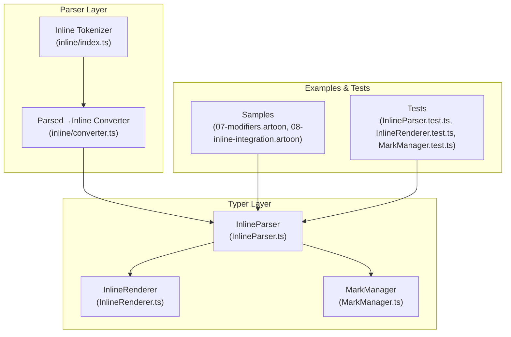
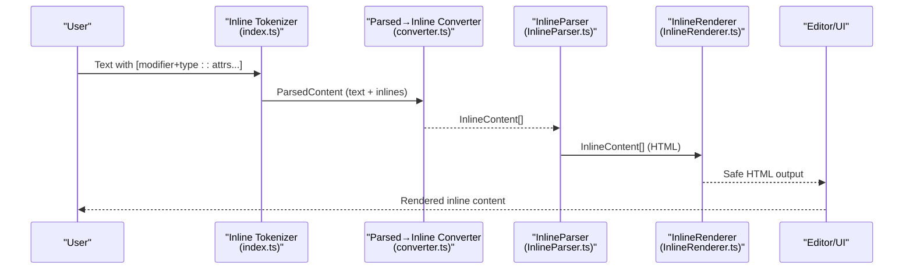
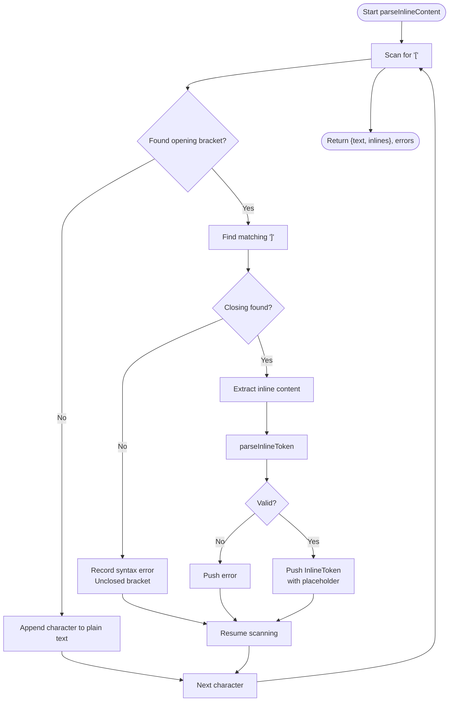
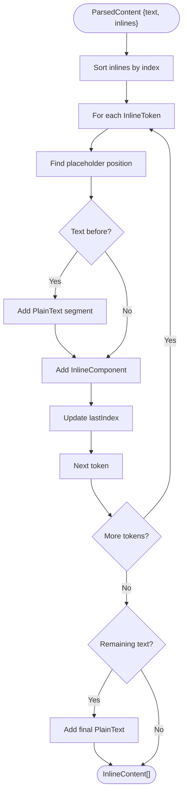
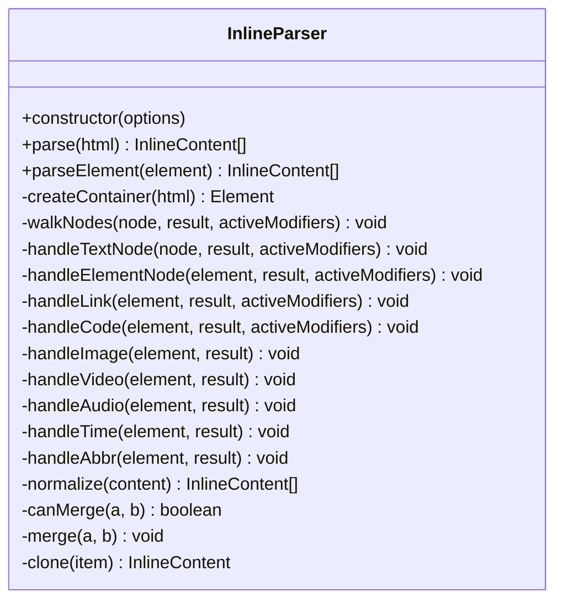
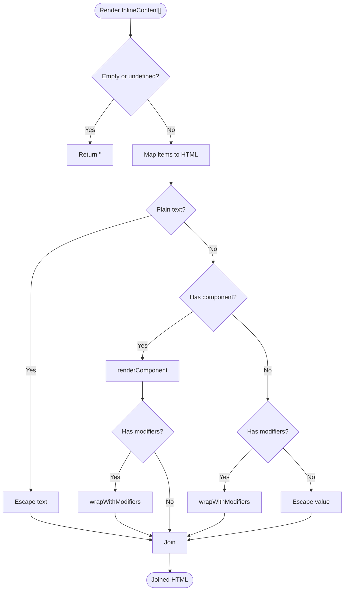
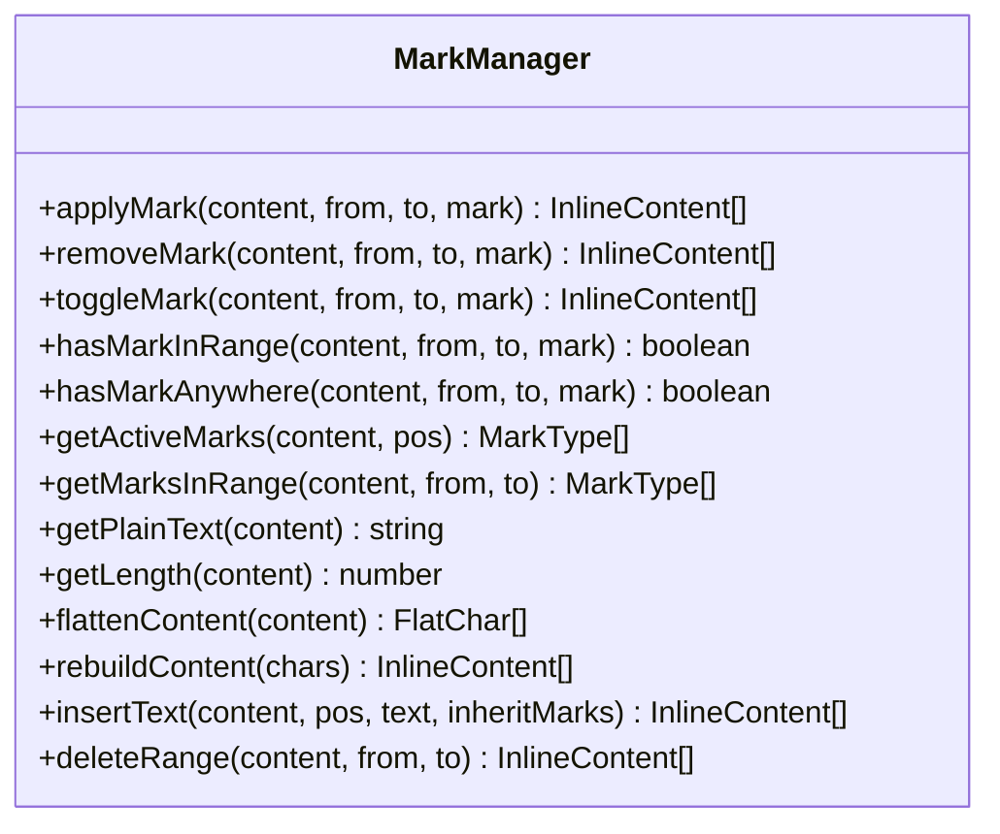
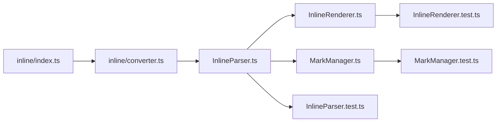

# Inline Formatting and Links

<cite>
**Referenced Files in This Document**
- [Core Invariants/04-INLINE-SEMANTICS.md](file://Core%20Invariants/04-INLINE-SEMANTICS.md)
- [Core Invariants/10-INLINE-INTEGRATION.md](file://Core%20Invariants/10-INLINE-INTEGRATION.md)
- [artoon-parser/src/inline/index.ts](file://artoon-parser/src/inline/index.ts)
- [artoon-parser/src/inline/converter.ts](file://artoon-parser/src/inline/converter.ts)
- [artoon-typer/src/inline/InlineParser.ts](file://artoon-typer/src/inline/InlineParser.ts)
- [artoon-typer/src/inline/InlineRenderer.ts](file://artoon-typer/src/inline/InlineRenderer.ts)
- [artoon-typer/src/inline/MarkManager.ts](file://artoon-typer/src/inline/MarkManager.ts)
- [artoon-typer/tests/inline/InlineParser.test.ts](file://artoon-typer/tests/inline/InlineParser.test.ts)
- [artoon-typer/tests/inline/InlineRenderer.test.ts](file://artoon-typer/tests/inline/InlineRenderer.test.ts)
- [artoon-typer/tests/inline/MarkManager.test.ts](file://artoon-typer/tests/inline/MarkManager.test.ts)
- [samples/07-modifiers.artoon](file://samples/07-modifiers.artoon)
- [samples/08-inline-integration.artoon](file://samples/08-inline-integration.artoon)
</cite>

## Table of Contents
1. [Introduction](#introduction)
2. [Project Structure](#project-structure)
3. [Core Components](#core-components)
4. [Architecture Overview](#architecture-overview)
5. [Detailed Component Analysis](#detailed-component-analysis)
6. [Dependency Analysis](#dependency-analysis)
7. [Performance Considerations](#performance-considerations)
8. [Troubleshooting Guide](#troubleshooting-guide)
9. [Conclusion](#conclusion)
10. [Appendices](#appendices)

## Introduction
This document explains ARTOON’s inline formatting and linking capabilities. It covers text modifiers, emphasis styles, strikethrough, code spans, and hyperlink syntax. It also documents inline component integration for images, audio/video, files, and code, including how the inline parser handles nesting, escaping, and special character encoding. Practical examples demonstrate complex inline formatting, link variations, and integration patterns within block-level contexts. Finally, it provides guidelines for readability and accessibility in inline content.

## Project Structure
Inline formatting in ARTOON is implemented across three layers:
- Parser layer: tokenizes inline expressions and converts them into a normalized AST-ready form.
- Typer layer: manages HTML-to-AST conversion, rendering, and mark application/manipulation.
- Samples and tests: provide real-world examples and validation of behavior.

**Diagram sources**
- [artoon-parser/src/inline/index.ts:1-197](file://artoon-parser/src/inline/index.ts#L1-L197)
- [artoon-parser/src/inline/converter.ts:1-314](file://artoon-parser/src/inline/converter.ts#L1-L314)
- [artoon-typer/src/inline/InlineParser.ts:1-468](file://artoon-typer/src/inline/InlineParser.ts#L1-L468)
- [artoon-typer/src/inline/InlineRenderer.ts:1-295](file://artoon-typer/src/inline/InlineRenderer.ts#L1-L295)
- [artoon-typer/src/inline/MarkManager.ts:1-384](file://artoon-typer/src/inline/MarkManager.ts#L1-L384)
- [samples/07-modifiers.artoon:1-81](file://samples/07-modifiers.artoon#L1-L81)
- [samples/08-inline-integration.artoon:1-55](file://samples/08-inline-integration.artoon#L1-L55)

**Section sources**
- [artoon-parser/src/inline/index.ts:1-197](file://artoon-parser/src/inline/index.ts#L1-L197)
- [artoon-parser/src/inline/converter.ts:1-314](file://artoon-parser/src/inline/converter.ts#L1-L314)
- [artoon-typer/src/inline/InlineParser.ts:1-468](file://artoon-typer/src/inline/InlineParser.ts#L1-L468)
- [artoon-typer/src/inline/InlineRenderer.ts:1-295](file://artoon-typer/src/inline/InlineRenderer.ts#L1-L295)
- [artoon-typer/src/inline/MarkManager.ts:1-384](file://artoon-typer/src/inline/MarkManager.ts#L1-L384)
- [samples/07-modifiers.artoon:1-81](file://samples/07-modifiers.artoon#L1-L81)
- [samples/08-inline-integration.artoon:1-55](file://samples/08-inline-integration.artoon#L1-L55)

## Core Components
- Inline tokenizer: Scans text for bracket-delimited inline expressions and validates syntax.
- Parsed→Inline converter: Translates internal parsed tokens into AST InlineContent arrays.
- InlineParser: Converts HTML into InlineContent for editor consumption.
- InlineRenderer: Renders InlineContent to HTML with proper escaping and optional attributes.
- MarkManager: Applies, removes, toggles, and queries formatting marks across character ranges.

Key capabilities:
- Modifiers: strong, emphasis, underline, strikethrough, highlight, subscript, superscript.
- Inline components: links, images, audio/video, files, abbreviations, time, code spans.
- Nesting and ordering rules enforced by the tokenizer and converter.
- HTML normalization and escaping handled by the renderer.

**Section sources**
- [artoon-parser/src/inline/index.ts:10-197](file://artoon-parser/src/inline/index.ts#L10-L197)
- [artoon-parser/src/inline/converter.ts:37-210](file://artoon-parser/src/inline/converter.ts#L37-L210)
- [artoon-typer/src/inline/InlineParser.ts:50-450](file://artoon-typer/src/inline/InlineParser.ts#L50-L450)
- [artoon-typer/src/inline/InlineRenderer.ts:35-277](file://artoon-typer/src/inline/InlineRenderer.ts#L35-L277)
- [artoon-typer/src/inline/MarkManager.ts:30-384](file://artoon-typer/src/inline/MarkManager.ts#L30-L384)

## Architecture Overview
The inline pipeline transforms user input into a structured, safe representation and back to HTML for rendering.

**Diagram sources**
- [artoon-parser/src/inline/index.ts:10-64](file://artoon-parser/src/inline/index.ts#L10-L64)
- [artoon-parser/src/inline/converter.ts:37-84](file://artoon-parser/src/inline/converter.ts#L37-L84)
- [artoon-typer/src/inline/InlineParser.ts:60-92](file://artoon-typer/src/inline/InlineParser.ts#L60-L92)
- [artoon-typer/src/inline/InlineRenderer.ts:45-51](file://artoon-typer/src/inline/InlineRenderer.ts#L45-L51)

## Detailed Component Analysis

### Inline Syntax and Semantics
- General form: [modifiers+type:: attributes...].
- Modifiers precede type; multiple modifiers separated by +.
- Attribute separation: semicolon-delimited; semantics depend on type.
- Modifiers apply to textual content; certain components (images/audio/video/file/code) do not accept modifiers.

Examples and rules are documented in the core invariants.

**Section sources**
- [Core Invariants/04-INLINE-SEMANTICS.md:19-258](file://Core%20Invariants/04-INLINE-SEMANTICS.md#L19-L258)
- [Core Invariants/10-INLINE-INTEGRATION.md:71-354](file://Core%20Invariants/10-INLINE-INTEGRATION.md#L71-L354)

### Inline Tokenizer
Responsibilities:
- Detect bracketed inline constructs.
- Validate presence of the :: separator.
- Parse prefix into modifiers and/or component type.
- Enforce modifier restrictions per component type.
- Track placeholder positions for later reconstruction.

Behavior highlights:
- Nested brackets are supported via depth counting.
- Errors recorded for malformed constructs.
- Attributes parsed into ordered arrays; semantics resolved during conversion.

**Diagram sources**
- [artoon-parser/src/inline/index.ts:10-64](file://artoon-parser/src/inline/index.ts#L10-L64)
- [artoon-parser/src/inline/index.ts:85-145](file://artoon-parser/src/inline/index.ts#L85-L145)

**Section sources**
- [artoon-parser/src/inline/index.ts:10-197](file://artoon-parser/src/inline/index.ts#L10-L197)

### Parsed→Inline Converter
Responsibilities:
- Convert internal placeholders into InlineContent segments.
- Build PlainText and InlineComponent nodes.
- Map attributes to typed records depending on component type.
- Preserve order and reconstruct original text positions.

Highlights:
- Links: first attribute is URL; second is optional display text.
- Images/media/abbr/time/code: map positional attributes to named keys.
- Unknown types support key=value pairs appended after the first attribute.

**Diagram sources**
- [artoon-parser/src/inline/converter.ts:37-84](file://artoon-parser/src/inline/converter.ts#L37-L84)
- [artoon-parser/src/inline/converter.ts:109-210](file://artoon-parser/src/inline/converter.ts#L109-L210)

**Section sources**
- [artoon-parser/src/inline/converter.ts:37-210](file://artoon-parser/src/inline/converter.ts#L37-L210)

### InlineParser (HTML→InlineContent)
Responsibilities:
- Parse HTML strings or DOM elements into InlineContent arrays.
- Map HTML tags to modifiers (strong/b → s; em/i → e; u → u; del/s/strike → d; mark → mark; sub → sub; sup → sup).
- Recognize inline components: a, code, img, video, audio, time, abbr.
- Support nested tags; maintain active modifier stack.
- Normalize content by merging adjacent same-format segments.

**Diagram sources**
- [artoon-typer/src/inline/InlineParser.ts:50-450](file://artoon-typer/src/inline/InlineParser.ts#L50-L450)

**Section sources**
- [artoon-typer/src/inline/InlineParser.ts:50-450](file://artoon-typer/src/inline/InlineParser.ts#L50-L450)

### InlineRenderer (InlineContent→HTML)
Responsibilities:
- Render InlineContent to HTML with proper escaping.
- Apply modifiers by wrapping inner content in appropriate tags.
- Render inline components with correct attributes and semantics.
- Optional: add data attributes and custom class prefixes.

**Diagram sources**
- [artoon-typer/src/inline/InlineRenderer.ts:45-133](file://artoon-typer/src/inline/InlineRenderer.ts#L45-L133)
- [artoon-typer/src/inline/InlineRenderer.ts:182-246](file://artoon-typer/src/inline/InlineRenderer.ts#L182-L246)

**Section sources**
- [artoon-typer/src/inline/InlineRenderer.ts:35-277](file://artoon-typer/src/inline/InlineRenderer.ts#L35-L277)

### MarkManager (Formatting Marks)
Responsibilities:
- Apply/remove/toggle marks across character ranges.
- Query active marks at a position or across a range.
- Flatten/rebuild content to manipulate marks precisely.
- Insert/delete text while inheriting or clearing marks.

**Diagram sources**
- [artoon-typer/src/inline/MarkManager.ts:30-384](file://artoon-typer/src/inline/MarkManager.ts#L30-L384)

**Section sources**
- [artoon-typer/src/inline/MarkManager.ts:30-384](file://artoon-typer/src/inline/MarkManager.ts#L30-L384)

### Examples and Patterns
- Modifiers and combinations: see comprehensive examples in the modifiers sample.
- Inline integration within paragraphs, lists, and tables: see the inline integration sample.
- Complex nested formatting and link variations validated by tests.

**Section sources**
- [samples/07-modifiers.artoon:15-81](file://samples/07-modifiers.artoon#L15-L81)
- [samples/08-inline-integration.artoon:15-55](file://samples/08-inline-integration.artoon#L15-L55)
- [artoon-typer/tests/inline/InlineParser.test.ts:109-117](file://artoon-typer/tests/inline/InlineParser.test.ts#L109-L117)
- [artoon-typer/tests/inline/InlineRenderer.test.ts:106-116](file://artoon-typer/tests/inline/InlineRenderer.test.ts#L106-L116)
- [artoon-typer/tests/inline/MarkManager.test.ts:51-104](file://artoon-typer/tests/inline/MarkManager.test.ts#L51-L104)

## Dependency Analysis
- Parser layer depends on AST types and produces a normalized structure consumed by downstream layers.
- Converter bridges internal parsing and AST-ready InlineContent.
- Typer layer consumes InlineContent to render HTML and manage formatting marks.
- Tests validate behavior across parser, renderer, and mark manager.

**Diagram sources**
- [artoon-parser/src/inline/index.ts:1-197](file://artoon-parser/src/inline/index.ts#L1-L197)
- [artoon-parser/src/inline/converter.ts:1-314](file://artoon-parser/src/inline/converter.ts#L1-L314)
- [artoon-typer/src/inline/InlineParser.ts:1-468](file://artoon-typer/src/inline/InlineParser.ts#L1-L468)
- [artoon-typer/src/inline/InlineRenderer.ts:1-295](file://artoon-typer/src/inline/InlineRenderer.ts#L1-L295)
- [artoon-typer/src/inline/MarkManager.ts:1-384](file://artoon-typer/src/inline/MarkManager.ts#L1-L384)
- [artoon-typer/tests/inline/InlineParser.test.ts:1-361](file://artoon-typer/tests/inline/InlineParser.test.ts#L1-L361)
- [artoon-typer/tests/inline/InlineRenderer.test.ts:1-395](file://artoon-typer/tests/inline/InlineRenderer.test.ts#L1-L395)
- [artoon-typer/tests/inline/MarkManager.test.ts:1-359](file://artoon-typer/tests/inline/MarkManager.test.ts#L1-L359)

**Section sources**
- [artoon-parser/src/inline/index.ts:1-197](file://artoon-parser/src/inline/index.ts#L1-L197)
- [artoon-parser/src/inline/converter.ts:1-314](file://artoon-parser/src/inline/converter.ts#L1-L314)
- [artoon-typer/src/inline/InlineParser.ts:1-468](file://artoon-typer/src/inline/InlineParser.ts#L1-L468)
- [artoon-typer/src/inline/InlineRenderer.ts:1-295](file://artoon-typer/src/inline/InlineRenderer.ts#L1-L295)
- [artoon-typer/src/inline/MarkManager.ts:1-384](file://artoon-typer/src/inline/MarkManager.ts#L1-L384)

## Performance Considerations
- Tokenization complexity: linear in input length with bracket scanning and attribute parsing.
- Conversion cost: proportional to number of inline tokens plus text segments.
- Rendering: O(n) over InlineContent items; modifier wrapping adds constant overhead per level.
- Normalization: merging adjacent segments reduces DOM nodes and improves rendering performance.
- Recommendations:
  - Enable normalization to reduce redundant nodes.
  - Avoid excessive nested components in a single paragraph.
  - Prefer concise attribute lists to minimize parsing overhead.

[No sources needed since this section provides general guidance]

## Troubleshooting Guide
Common issues and resolutions:
- Unclosed brackets: The tokenizer reports syntax errors and continues parsing. Ensure balanced brackets.
- Missing :: separator: Tokenizer flags missing separators; add :: between prefix and attributes.
- Modifiers on disallowed components: Converter rejects modifiers on non-text components (e.g., img, audio, video, file, code).
- Unexpected nesting: Modifiers cannot nest within themselves; use combined modifiers instead.
- HTML injection risks: Renderer escapes HTML by default; disable only when fully trusted.
- Mixed content normalization: Adjacent plain or same-formatted text is merged; disable merging if you need separate nodes.

Validation references:
- Tokenizer error reporting and attribute parsing.
- Converter validation of modifiers and component types.
- Renderer escaping and component rendering.
- MarkManager flattening and rebuilding behavior.

**Section sources**
- [artoon-parser/src/inline/index.ts:26-45](file://artoon-parser/src/inline/index.ts#L26-L45)
- [artoon-parser/src/inline/index.ts:98-106](file://artoon-parser/src/inline/index.ts#L98-L106)
- [artoon-parser/src/inline/index.ts:118-130](file://artoon-parser/src/inline/index.ts#L118-L130)
- [artoon-parser/src/inline/converter.ts:143-210](file://artoon-parser/src/inline/converter.ts#L143-L210)
- [artoon-typer/src/inline/InlineRenderer.ts:255-276](file://artoon-typer/src/inline/InlineRenderer.ts#L255-L276)
- [artoon-typer/src/inline/MarkManager.ts:253-340](file://artoon-typer/src/inline/MarkManager.ts#L253-L340)

## Conclusion
ARTOON’s inline system cleanly separates syntax parsing, AST conversion, and rendering while enforcing strict rules for modifiers and component usage. The tokenizer and converter ensure robust parsing and validation, while the renderer guarantees safe HTML output. The MarkManager enables precise formatting operations across text ranges. Together, these components support rich inline formatting and seamless integration within block-level structures.

[No sources needed since this section summarizes without analyzing specific files]

## Appendices

### Inline Syntax Reference
- General form: [modifiers+type:: attributes...]
- Modifiers: s, e, u, d, mark, sub, sup
- Types: a (link), img (image), audio, video, file, abbr (abbreviation), time (datetime), c (code)
- Attribute order and semantics are enforced by the converter.

**Section sources**
- [Core Invariants/04-INLINE-SEMANTICS.md:19-258](file://Core%20Invariants/04-INLINE-SEMANTICS.md#L19-L258)
- [Core Invariants/10-INLINE-INTEGRATION.md:358-385](file://Core%20Invariants/10-INLINE-INTEGRATION.md#L358-L385)

### Accessibility and Readability Guidelines
- Prefer meaningful link text over bare URLs.
- Provide alt text for images; keep descriptions concise but informative.
- Use abbreviations with full expansions for clarity.
- Avoid excessive nested formatting; prefer clearer sentence structure.
- Ensure sufficient color contrast and readable font sizes in rendered output.

[No sources needed since this section provides general guidance]