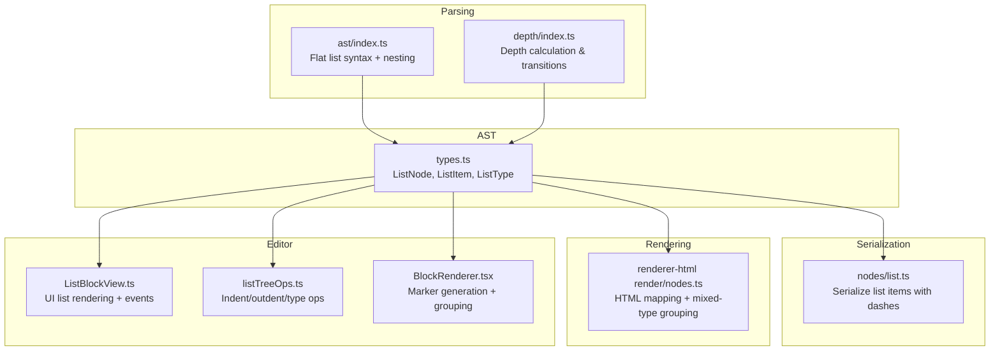
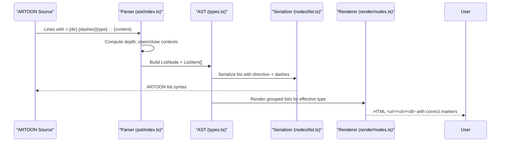
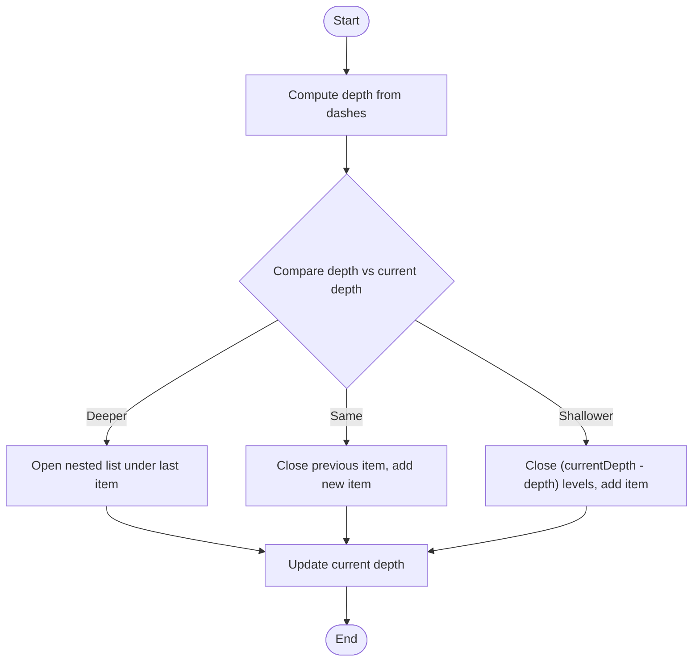
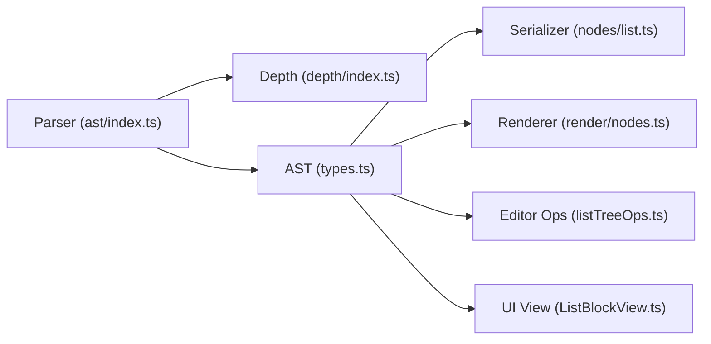
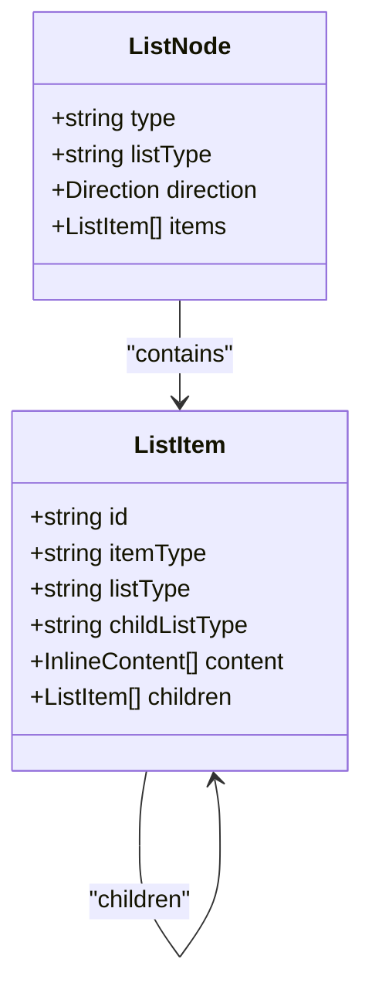

# List Structures

<cite>
**Referenced Files in This Document**
- [Core Invariants/03-LISTS.md](file://Core Invariants/03-LISTS.md)
- [artoon-examples/lists-showcase.artoon](file://artoon-examples/lists-showcase.artoon)
- [artoon-parser/src/ast/index.ts](file://artoon-parser/src/ast/index.ts)
- [artoon-parser/src/depth/index.ts](file://artoon-parser/src/depth/index.ts)
- [artoon-serializer/src/nodes/list.ts](file://artoon-serializer/src/nodes/list.ts)
- [artoon-serializer/tests/list.test.ts](file://artoon-serializer/tests/list.test.ts)
- [artoon-ast/src/types.ts](file://artoon-ast/src/types.ts)
- [artoon-typer/src/ui/helpers/listTreeOps.ts](file://artoon-typer/src/ui/helpers/listTreeOps.ts)
- [artoon-typer/src/blocks/views/ListBlockView.ts](file://artoon-typer/src/blocks/views/ListBlockView.ts)
- [artoon-typer/src/ui/components/BlockRenderer.tsx](file://artoon-typer/src/ui/components/BlockRenderer.tsx)
- [artoon-renderer-html/src/render/nodes.ts](file://artoon-renderer-html/src/render/nodes.ts)
- [tests/contracts/ast-contract.test.ts](file://tests/contracts/ast-contract.test.ts)
</cite>

## Table of Contents
1. [Introduction](#introduction)
2. [Project Structure](#project-structure)
3. [Core Components](#core-components)
4. [Architecture Overview](#architecture-overview)
5. [Detailed Component Analysis](#detailed-component-analysis)
6. [Dependency Analysis](#dependency-analysis)
7. [Performance Considerations](#performance-considerations)
8. [Troubleshooting Guide](#troubleshooting-guide)
9. [Conclusion](#conclusion)
10. [Appendices](#appendices)

## Introduction
This document describes ARTOON’s list structures comprehensively: ordered lists, unordered lists, definition lists, and nested hierarchies. It explains list item syntax, marker types, indentation patterns, nesting rules, continuation mechanisms, mixed list types at the same level, and list item properties. It also covers styling options, integration with inline components, and semantic differences among list types.

## Project Structure
The list system spans parsing, AST modeling, serialization, rendering, and editor-side helpers:
- Parsing: Converts ARTOON list syntax into a typed AST with proper nesting and direction.
- AST: Defines canonical list and list item types, including optional per-item list types and nested children arrays.
- Serialization: Outputs ARTOON list syntax with direction markers and dashes indicating nesting.
- Rendering: Produces HTML with correct list semantics and supports mixed-type groups.
- Editor helpers: Provide tree operations for indent/outdent, type changes, and content updates.

**Diagram sources**
- [artoon-parser/src/ast/index.ts:188-222](file://artoon-parser/src/ast/index.ts#L188-L222)
- [artoon-parser/src/depth/index.ts:50-98](file://artoon-parser/src/depth/index.ts#L50-L98)
- [artoon-ast/src/types.ts:171-216](file://artoon-ast/src/types.ts#L171-L216)
- [artoon-serializer/src/nodes/list.ts:17-58](file://artoon-serializer/src/nodes/list.ts#L17-L58)
- [artoon-renderer-html/src/render/nodes.ts:159-192](file://artoon-renderer-html/src/render/nodes.ts#L159-L192)
- [artoon-typer/src/blocks/views/ListBlockView.ts:83-162](file://artoon-typer/src/blocks/views/ListBlockView.ts#L83-L162)
- [artoon-typer/src/ui/helpers/listTreeOps.ts:118-170](file://artoon-typer/src/ui/helpers/listTreeOps.ts#L118-L170)
- [artoon-typer/src/ui/components/BlockRenderer.tsx:621-650](file://artoon-typer/src/ui/components/BlockRenderer.tsx#L621-L650)

**Section sources**
- [Core Invariants/03-LISTS.md:1-249](file://Core Invariants/03-LISTS.md#L1-L249)
- [artoon-examples/lists-showcase.artoon:1-457](file://artoon-examples/lists-showcase.artoon#L1-L457)

## Core Components
- List types and items
  - List types: ul (unordered), ol (ordered), dl (definition).
  - Item types: li (list item), dt (definition term), dd (definition description).
- Nesting and indentation
  - Each leading dash corresponds to one nesting level.
  - Direction markers apply to the entire list and are inherited by items.
- Flat list syntax
  - Container lines with content are treated as implicit list items with an explicit list type attached.
- Mixed-type lists
  - Items can override their list type locally, enabling mixed-type groups at the same nesting level.
- Editor integration
  - Tree operations support indent/outdent, changing child list type, and promoting/removing items.

**Section sources**
- [artoon-ast/src/types.ts:39-46](file://artoon-ast/src/types.ts#L39-L46)
- [artoon-ast/src/types.ts:178-206](file://artoon-ast/src/types.ts#L178-L206)
- [artoon-parser/src/ast/index.ts:190-222](file://artoon-parser/src/ast/index.ts#L190-L222)
- [artoon-serializer/src/nodes/list.ts:17-58](file://artoon-serializer/src/nodes/list.ts#L17-L58)
- [artoon-renderer-html/src/render/nodes.ts:159-192](file://artoon-renderer-html/src/render/nodes.ts#L159-L192)
- [artoon-typer/src/ui/helpers/listTreeOps.ts:174-230](file://artoon-typer/src/ui/helpers/listTreeOps.ts#L174-L230)

## Architecture Overview
The list pipeline transforms ARTOON source into a typed AST, serializes it back to ARTOON syntax, and renders HTML while preserving semantics and mixed-type grouping.

**Diagram sources**
- [artoon-parser/src/ast/index.ts:188-222](file://artoon-parser/src/ast/index.ts#L188-L222)
- [artoon-ast/src/types.ts:171-216](file://artoon-ast/src/types.ts#L171-L216)
- [artoon-serializer/src/nodes/list.ts:17-58](file://artoon-serializer/src/nodes/list.ts#L17-L58)
- [artoon-renderer-html/src/render/nodes.ts:159-192](file://artoon-renderer-html/src/render/nodes.ts#L159-L192)

## Detailed Component Analysis

### Syntax and Semantics
- Marker types and item roles
  - ul: bullet-style markers; item type li.
  - ol: numbered markers; item type li.
  - dl: definition lists; item types dt (term) and dd (description).
- Direction and inheritance
  - Direction markers apply to the list container; items inherit direction from their parent list.
- Flat list syntax
  - Container lines with content are treated as implicit items and carry the requested list type.
- Mixed-type lists
  - Items can specify their own listType, allowing adjacent items to switch types within a group.

**Section sources**
- [Core Invariants/03-LISTS.md:9-67](file://Core Invariants/03-LISTS.md#L9-L67)
- [artoon-parser/src/ast/index.ts:190-222](file://artoon-parser/src/ast/index.ts#L190-L222)
- [artoon-ast/src/types.ts:178-206](file://artoon-ast/src/types.ts#L178-L206)

### Nesting Rules and Continuation
- Depth computation
  - Leading dashes define nesting depth; deeper depth opens nested items under the last sibling.
- Continuation and closure
  - Lists close implicitly when descending to shallower depth, encountering a new list container, or reaching end-of-file.
- Example patterns
  - Single dash increases nesting by one level; multiple dashes increase further.
  - Direction markers propagate to nested items.

**Section sources**
- [Core Invariants/03-LISTS.md:71-114](file://Core Invariants/03-LISTS.md#L71-L114)
- [Core Invariants/03-LISTS.md:188-225](file://Core Invariants/03-LISTS.md#L188-L225)
- [artoon-parser/src/depth/index.ts:50-98](file://artoon-parser/src/depth/index.ts#L50-L98)
- [artoon-parser/src/ast/index.ts:618-642](file://artoon-parser/src/ast/index.ts#L618-L642)

### Serialization and Output Format
- Output pattern
  - Each item emits as {dir}.{dashes}{listType}:: {content}.
  - Nested items use increasing dash counts; direction markers reflect the list’s direction.
- Mixed-type handling
  - When items override listType, serialization preserves per-item types.

**Section sources**
- [artoon-serializer/src/nodes/list.ts:17-58](file://artoon-serializer/src/nodes/list.ts#L17-L58)
- [artoon-serializer/tests/list.test.ts:64-121](file://artoon-serializer/tests/list.test.ts#L64-L121)

### Rendering and Mixed-Type Groups
- HTML mapping
  - Renders ul/ol/dl based on listType; supports mixed-type groups by splitting items into separate containers.
- Marker behavior
  - Ordered lists restart numbering per group; unordered bullets vary by nesting depth.

**Section sources**
- [artoon-renderer-html/src/render/nodes.ts:159-192](file://artoon-renderer-html/src/render/nodes.ts#L159-L192)
- [artoon-typer/src/ui/components/BlockRenderer.tsx:621-650](file://artoon-typer/src/ui/components/BlockRenderer.tsx#L621-L650)

### Editor Operations and Tree Manipulation
- Indent/outdent
  - Move an item to become the last child of the previous sibling (indent) or move it after its former parent (outdent).
- Change child list type
  - Set the intended list type for a parent’s children; descendants inherit accordingly.
- Safe content updates
  - Editor helpers protect rich inline content and only allow plaintext-only edits to be overwritten safely.

**Section sources**
- [artoon-typer/src/ui/helpers/listTreeOps.ts:118-170](file://artoon-typer/src/ui/helpers/listTreeOps.ts#L118-L170)
- [artoon-typer/src/ui/helpers/listTreeOps.ts:174-230](file://artoon-typer/src/ui/helpers/listTreeOps.ts#L174-L230)
- [artoon-typer/src/ui/helpers/listTreeOps.ts:20-40](file://artoon-typer/src/ui/helpers/listTreeOps.ts#L20-L40)
- [artoon-typer/src/blocks/views/ListBlockView.ts:334-395](file://artoon-typer/src/blocks/views/ListBlockView.ts#L334-L395)

### Examples and Use Cases
- Comprehensive showcase
  - Demonstrates nested lists up to four levels, mixed-language content, inline components within items, and complex structures.
- Practical scenarios
  - Step-by-step procedures (ol), ingredient lists (ul), glossaries and definitions (dl), and hierarchical project outlines.

**Section sources**
- [artoon-examples/lists-showcase.artoon:16-457](file://artoon-examples/lists-showcase.artoon#L16-L457)

### Algorithmic Behavior

**Diagram sources**
- [artoon-parser/src/ast/index.ts:618-642](file://artoon-parser/src/ast/index.ts#L618-L642)
- [artoon-parser/src/depth/index.ts:50-98](file://artoon-parser/src/depth/index.ts#L50-L98)

## Dependency Analysis
- Parser depends on depth calculation to manage list contexts.
- AST defines canonical list and item shapes; serializer and renderer consume these shapes.
- Editor helpers operate on the same AST model to manipulate list trees.
- HTML renderer groups items by effective list type to support mixed-type lists.

**Diagram sources**
- [artoon-parser/src/ast/index.ts:188-222](file://artoon-parser/src/ast/index.ts#L188-L222)
- [artoon-parser/src/depth/index.ts:50-98](file://artoon-parser/src/depth/index.ts#L50-L98)
- [artoon-ast/src/types.ts:171-216](file://artoon-ast/src/types.ts#L171-L216)
- [artoon-serializer/src/nodes/list.ts:17-58](file://artoon-serializer/src/nodes/list.ts#L17-L58)
- [artoon-renderer-html/src/render/nodes.ts:159-192](file://artoon-renderer-html/src/render/nodes.ts#L159-L192)
- [artoon-typer/src/ui/helpers/listTreeOps.ts:118-170](file://artoon-typer/src/ui/helpers/listTreeOps.ts#L118-L170)
- [artoon-typer/src/blocks/views/ListBlockView.ts:83-162](file://artoon-typer/src/blocks/views/ListBlockView.ts#L83-L162)

**Section sources**
- [artoon-parser/src/ast/index.ts:188-222](file://artoon-parser/src/ast/index.ts#L188-L222)
- [artoon-ast/src/types.ts:171-216](file://artoon-ast/src/types.ts#L171-L216)
- [artoon-serializer/src/nodes/list.ts:17-58](file://artoon-serializer/src/nodes/list.ts#L17-L58)
- [artoon-renderer-html/src/render/nodes.ts:159-192](file://artoon-renderer-html/src/render/nodes.ts#L159-L192)
- [artoon-typer/src/ui/helpers/listTreeOps.ts:118-170](file://artoon-typer/src/ui/helpers/listTreeOps.ts#L118-L170)

## Performance Considerations
- Serialization and rendering
  - Grouping mixed-type items avoids redundant container tags and improves readability.
- Tree operations
  - Indent/outdent traverse the list tree; keep nesting levels reasonable to avoid deep recursion overhead.
- Inline content
  - Rendering and editing rely on inline parsers; minimize unnecessary re-parsing by batching updates.

[No sources needed since this section provides general guidance]

## Troubleshooting Guide
- Unexpected closing of nested lists
  - Verify indentation dashes and ensure consistent depth transitions.
- Mixed-type list not rendering as expected
  - Confirm items specify listType when overriding the parent’s type.
- Serialization produces unexpected markers
  - Check direction markers and dashes alignment; ensure listType is correctly set on items.
- Editor indent/outdent not working
  - Ensure the target item exists and is not the first item (indent requires a previous sibling).

**Section sources**
- [Core Invariants/03-LISTS.md:188-225](file://Core Invariants/03-LISTS.md#L188-L225)
- [artoon-serializer/src/nodes/list.ts:17-58](file://artoon-serializer/src/nodes/list.ts#L17-L58)
- [artoon-renderer-html/src/render/nodes.ts:159-192](file://artoon-renderer-html/src/render/nodes.ts#L159-L192)
- [artoon-typer/src/ui/helpers/listTreeOps.ts:118-170](file://artoon-typer/src/ui/helpers/listTreeOps.ts#L118-L170)

## Conclusion
ARTOON’s list system combines a concise, directional syntax with a robust AST and flexible rendering pipeline. Its support for nested lists, mixed-type groups, and editor-friendly tree operations enables expressive and maintainable document structures across languages and use cases.

[No sources needed since this section summarizes without analyzing specific files]

## Appendices

### Syntax Reference
- Container lines with content: >.{dir}.{type}:: {content}
- Item lines: {dir}.{dashes}{type}:: {content}
- Direction markers: > for RTL, < for LTR
- Nesting: One dash per level; multiple dashes for deeper nesting
- Item types: li for ul/ol, dt/dd for dl

**Section sources**
- [Core Invariants/03-LISTS.md:9-67](file://Core Invariants/03-LISTS.md#L9-L67)
- [artoon-examples/lists-showcase.artoon:18-118](file://artoon-examples/lists-showcase.artoon#L18-L118)

### Data Model

**Diagram sources**
- [artoon-ast/src/types.ts:171-216](file://artoon-ast/src/types.ts#L171-L216)

### Validation Contracts
- ListNode must have listType ∈ {ul, ol, dl} and items as an array of ListItem.
- ListItem must have itemType ∈ {li, dt, dd}, content as an array, and optional children as ListItem[].

**Section sources**
- [tests/contracts/ast-contract.test.ts:222-283](file://tests/contracts/ast-contract.test.ts#L222-L283)