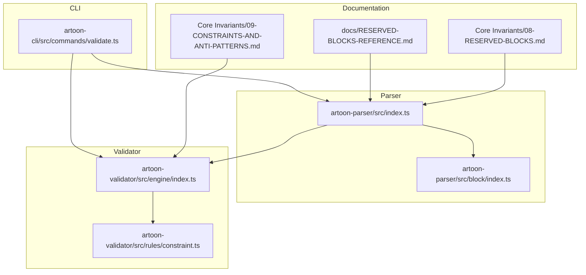
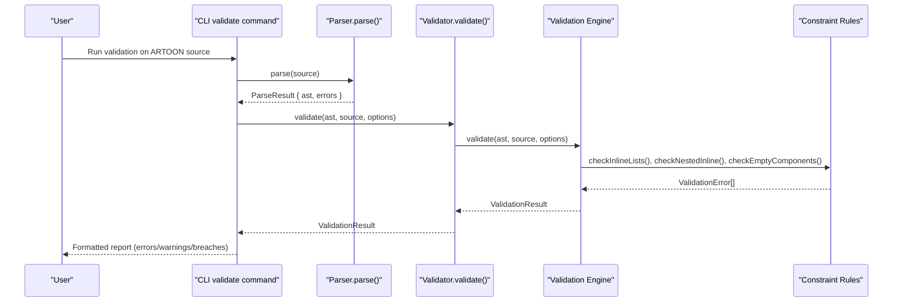
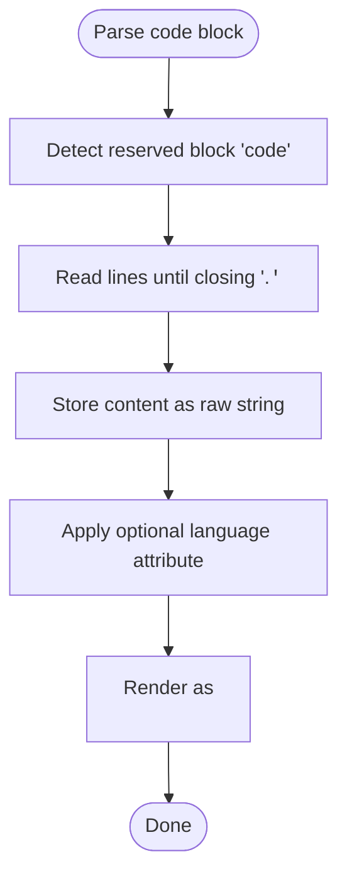
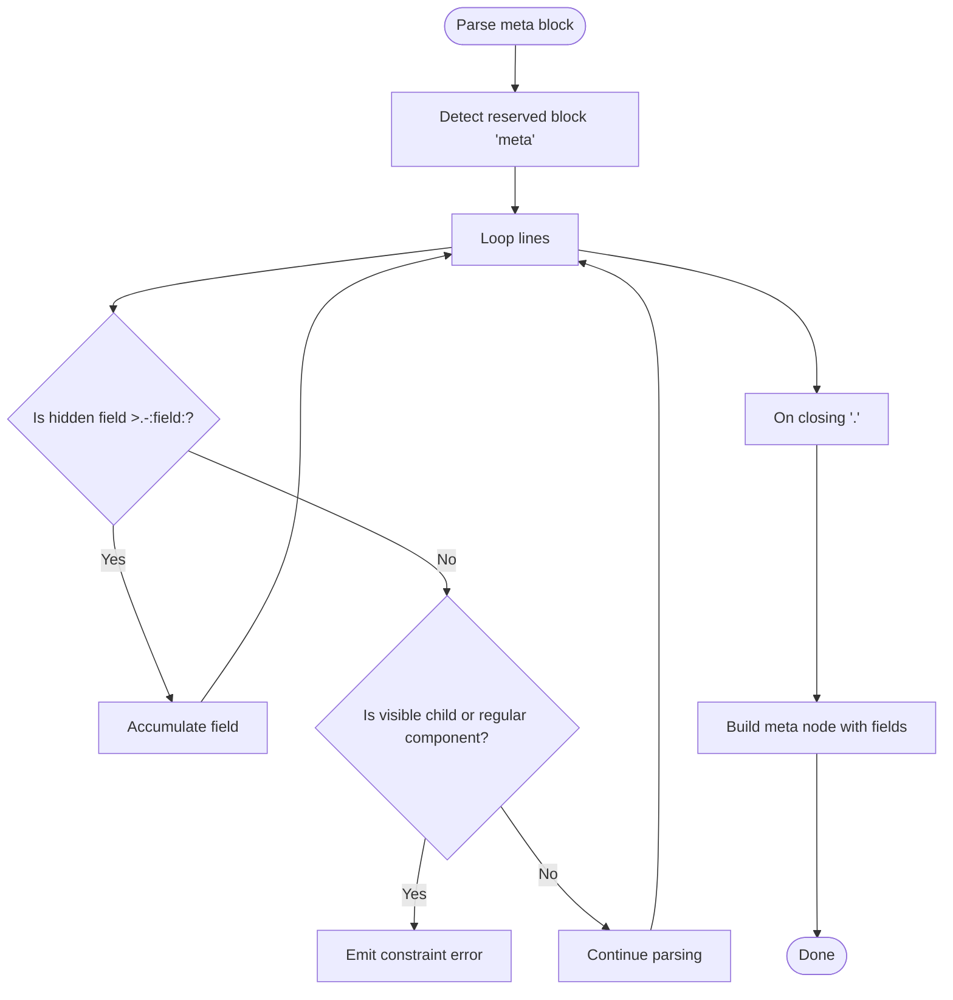
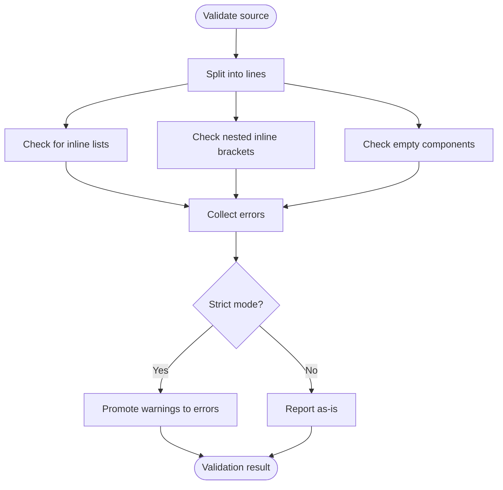
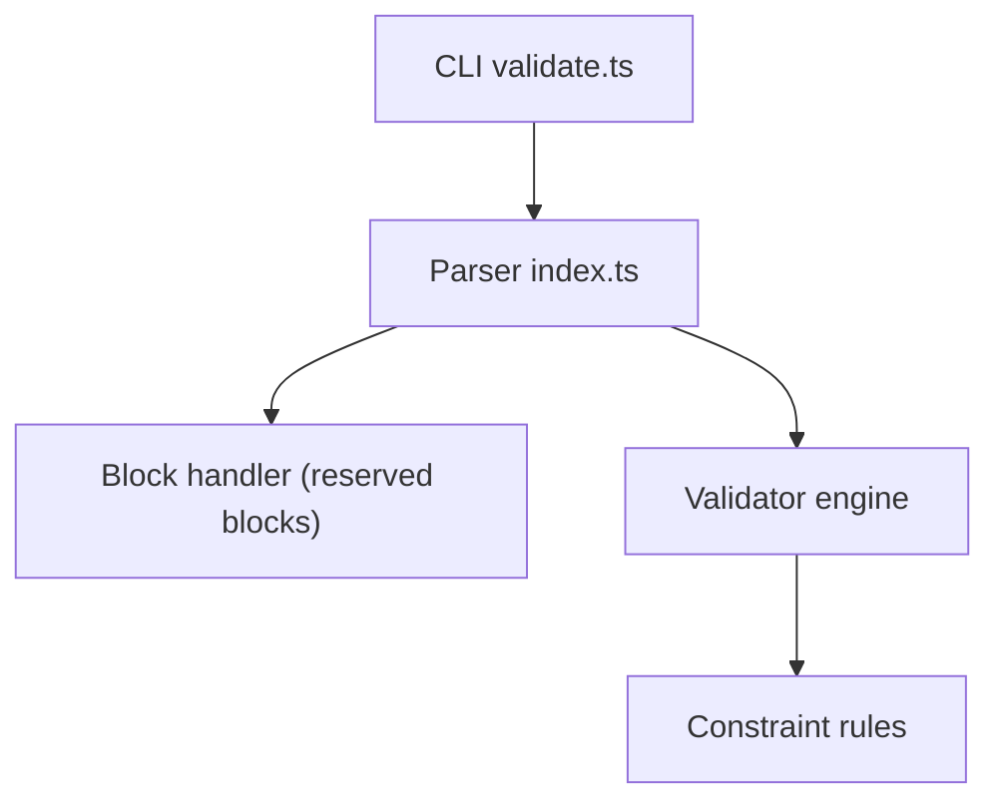

# Reserved Blocks and Constraints

<cite>
**Referenced Files in This Document**
- [Core Invariants/08-RESERVED-BLOCKS.md](file://Core%20Invariants/08-RESERVED-BLOCKS.md)
- [Core Invariants/09-CONSTRAINTS-AND-ANTI-PATTERNS.md](file://Core%20Invariants/09-CONSTRAINTS-AND-ANTI-PATTERNS.md)
- [docs/RESERVED-BLOCKS-REFERENCE.md](file://docs/RESERVED-BLOCKS-REFERENCE.md)
- [artoon-parser/src/block/index.ts](file://artoon-parser/src/block/index.ts)
- [artoon-parser/src/index.ts](file://artoon-parser/src/index.ts)
- [artoon-validator/src/engine/index.ts](file://artoon-validator/src/engine/index.ts)
- [artoon-validator/src/rules/constraint.ts](file://artoon-validator/src/rules/constraint.ts)
- [artoon-cli/src/commands/validate.ts](file://artoon-cli/src/commands/validate.ts)
- [artoon-parser/tests/meta-parsing.test.ts](file://artoon-parser/tests/meta-parsing.test.ts)
</cite>

## Table of Contents
1. [Introduction](#introduction)
2. [Project Structure](#project-structure)
3. [Core Components](#core-components)
4. [Architecture Overview](#architecture-overview)
5. [Detailed Component Analysis](#detailed-component-analysis)
6. [Dependency Analysis](#dependency-analysis)
7. [Performance Considerations](#performance-considerations)
8. [Troubleshooting Guide](#troubleshooting-guide)
9. [Conclusion](#conclusion)

## Introduction
This document explains ARTOON’s reserved block system and constraint rules. It covers the two reserved blocks (code and meta), their special behaviors and usage limitations, and the broader design constraints that govern component placement, nesting, and structural integrity. It also documents validation rules, parser behavior for constraint violations, anti-patterns to avoid, and best practices for maintaining syntactic integrity.

## Project Structure
The reserved block system and constraints are defined in the Core Invariants documentation and enforced by the parser and validator subsystems. The CLI integrates parsing, transformation, and validation into a single workflow.

**Diagram sources**
- [artoon-parser/src/index.ts:56-90](file://artoon-parser/src/index.ts#L56-L90)
- [artoon-parser/src/block/index.ts:7-14](file://artoon-parser/src/block/index.ts#L7-L14)
- [artoon-validator/src/engine/index.ts:27-100](file://artoon-validator/src/engine/index.ts#L27-L100)
- [artoon-validator/src/rules/constraint.ts:1-117](file://artoon-validator/src/rules/constraint.ts#L1-L117)
- [artoon-cli/src/commands/validate.ts:49-92](file://artoon-cli/src/commands/validate.ts#L49-L92)

**Section sources**
- [artoon-parser/src/index.ts:56-90](file://artoon-parser/src/index.ts#L56-L90)
- [artoon-validator/src/engine/index.ts:27-100](file://artoon-validator/src/engine/index.ts#L27-L100)
- [artoon-cli/src/commands/validate.ts:49-92](file://artoon-cli/src/commands/validate.ts#L49-L92)

## Core Components
- Reserved blocks: code and meta are the only reserved blocks. All other blocks are treated as custom blocks.
- Special behaviors:
  - code: Content is stored raw and not parsed as ARTOON; supports optional language specification for syntax highlighting.
  - meta: Accepts only hidden fields (syntax >.-:field:) and is hidden from HTML output by default (with configurable handling).
- Constraint rules:
  - Absolute constraints prohibit visual styling, interactivity, and programmatic logic.
  - Inline integration constraints limit what can be embedded inside inline constructs.
  - Temporary limitations currently disallow nested custom blocks.

**Section sources**
- [Core Invariants/08-RESERVED-BLOCKS.md:9-318](file://Core%20Invariants/08-RESERVED-BLOCKS.md#L9-L318)
- [docs/RESERVED-BLOCKS-REFERENCE.md:11-371](file://docs/RESERVED-BLOCKS-REFERENCE.md#L11-L371)
- [Core Invariants/09-CONSTRAINTS-AND-ANTI-PATTERNS.md:85-474](file://Core%20Invariants/09-CONSTRAINTS-AND-ANTI-PATTERNS.md#L85-L474)

## Architecture Overview
The ARTOON pipeline parses source text into an AST, then validates it against a set of rule categories including constraints and philosophy. The CLI orchestrates parsing, transformation, and validation, surfacing errors and warnings.

**Diagram sources**
- [artoon-cli/src/commands/validate.ts:49-92](file://artoon-cli/src/commands/validate.ts#L49-L92)
- [artoon-parser/src/index.ts:56-90](file://artoon-parser/src/index.ts#L56-L90)
- [artoon-validator/src/engine/index.ts:27-100](file://artoon-validator/src/engine/index.ts#L27-L100)
- [artoon-validator/src/rules/constraint.ts:8-117](file://artoon-validator/src/rules/constraint.ts#L8-L117)

## Detailed Component Analysis

### Reserved Blocks: code
- Purpose: Preserve raw code content without ARTOON parsing; optional language for syntax highlighting.
- Syntax and behavior:
  - Start/end delimiters define a block; closing delimiter is mandatory.
  - Content is stored verbatim; no ARTOON parsing occurs.
  - Language specifier is optional and influences downstream rendering.
- HTML output: Renders as preformatted code with language class.
- Parser enforcement:
  - Reserved block detection marks code blocks distinctly.
  - No child elements or hidden fields are permitted inside code blocks.
- Validation:
  - Enforces closing delimiter and prohibits child elements or hidden fields.

**Diagram sources**
- [artoon-parser/src/block/index.ts:69-86](file://artoon-parser/src/block/index.ts#L69-L86)
- [artoon-parser/src/block/index.ts:180-193](file://artoon-parser/src/block/index.ts#L180-L193)

**Section sources**
- [Core Invariants/08-RESERVED-BLOCKS.md:32-107](file://Core%20Invariants/08-RESERVED-BLOCKS.md#L32-L107)
- [docs/RESERVED-BLOCKS-REFERENCE.md:28-108](file://docs/RESERVED-BLOCKS-REFERENCE.md#L28-L108)
- [artoon-parser/src/block/index.ts:69-86](file://artoon-parser/src/block/index.ts#L69-L86)
- [artoon-parser/src/block/index.ts:180-193](file://artoon-parser/src/block/index.ts#L180-L193)

### Reserved Blocks: meta
- Purpose: Metadata container; hidden from HTML by default with configurable output modes.
- Syntax and behavior:
  - Accepts only hidden fields using >.-:field: syntax.
  - No visible child elements or regular content are allowed inside meta.
  - Common metadata categories are recognized for convenience.
- Parser enforcement:
  - Reserved block detection identifies meta blocks.
  - Hidden field syntax is validated to occur only within meta.
  - Regular components and visible child elements inside meta produce errors.
- Validation:
  - Enforces exclusive use of hidden fields inside meta.
  - Prevents misuse of hidden fields outside meta.

**Diagram sources**
- [artoon-parser/src/block/index.ts:77-86](file://artoon-parser/src/block/index.ts#L77-L86)
- [artoon-parser/src/block/index.ts:258-316](file://artoon-parser/src/block/index.ts#L258-L316)

**Section sources**
- [Core Invariants/08-RESERVED-BLOCKS.md:110-201](file://Core%20Invariants/08-RESERVED-BLOCKS.md#L110-L201)
- [docs/RESERVED-BLOCKS-REFERENCE.md:111-266](file://docs/RESERVED-BLOCKS-REFERENCE.md#L111-L266)
- [artoon-parser/src/block/index.ts:258-316](file://artoon-parser/src/block/index.ts#L258-L316)

### Custom Blocks (non-reserved)
- Definition: All blocks other than code and meta are treated as custom blocks.
- Behavior:
  - Content is parsed as ARTOON.
  - Support for child elements >.-element:: syntax.
  - Hidden fields >.-:field: are not allowed inside custom blocks.
- Examples and usage:
  - Cards, figures, headers, and other semantic containers.
- Parser enforcement:
  - Reserved block detection excludes custom blocks.
  - Hidden field usage outside meta is flagged as an error.

**Section sources**
- [Core Invariants/08-RESERVED-BLOCKS.md:204-312](file://Core%20Invariants/08-RESERVED-BLOCKS.md#L204-L312)
- [docs/RESERVED-BLOCKS-REFERENCE.md:269-347](file://docs/RESERVED-BLOCKS-REFERENCE.md#L269-L347)
- [artoon-parser/src/block/index.ts:69-86](file://artoon-parser/src/block/index.ts#L69-L86)
- [artoon-parser/src/block/index.ts:258-278](file://artoon-parser/src/block/index.ts#L258-L278)

### Constraint Rules and Anti-Patterns
- Absolute constraints:
  - Prohibit visual styling, layout, positioning, and interactivity.
  - Prohibit programmatic constructs (conditions, loops, variables, templates).
- Inline integration constraints:
  - Inline declarations do not create structure; only explicit structural components do.
  - Visible structural elements (lists, tables, compound components, blocks) are forbidden inside inline contexts.
- Temporary limitations:
  - Nested custom blocks are not supported yet and will be addressed in future phases.
- Validation coverage:
  - Inline lists inside inline contexts are rejected.
  - Nested inline components are rejected.
  - Empty components (except allowed separators) are warned.
- Philosophy alignment:
  - Validation reports philosophy breaches separately and can escalate warnings to errors in strict mode.

**Diagram sources**
- [artoon-validator/src/rules/constraint.ts:8-117](file://artoon-validator/src/rules/constraint.ts#L8-L117)
- [artoon-validator/src/engine/index.ts:79-100](file://artoon-validator/src/engine/index.ts#L79-L100)

**Section sources**
- [Core Invariants/09-CONSTRAINTS-AND-ANTI-PATTERNS.md:85-474](file://Core%20Invariants/09-CONSTRAINTS-AND-ANTI-PATTERNS.md#L85-L474)
- [artoon-validator/src/rules/constraint.ts:8-117](file://artoon-validator/src/rules/constraint.ts#L8-L117)
- [artoon-validator/src/engine/index.ts:27-100](file://artoon-validator/src/engine/index.ts#L27-L100)

### Parser Behavior for Constraint Violations
- Reserved block detection:
  - Parser recognizes code and meta as reserved via dedicated checks.
  - Custom blocks are treated as generic blocks.
- Hidden field validation:
  - Hidden fields are only accepted inside meta blocks; otherwise, a constraint error is produced.
- Meta content validation:
  - Meta blocks must contain only hidden fields; any visible child or regular component yields a constraint error.
- Block end validation:
  - Mismatched closing delimiters produce structured errors with suggestions.

**Section sources**
- [artoon-parser/src/block/index.ts:69-86](file://artoon-parser/src/block/index.ts#L69-L86)
- [artoon-parser/src/block/index.ts:258-316](file://artoon-parser/src/block/index.ts#L258-L316)
- [artoon-parser/src/block/index.ts:198-216](file://artoon-parser/src/block/index.ts#L198-L216)
- [artoon-parser/tests/meta-parsing.test.ts:173-203](file://artoon-parser/tests/meta-parsing.test.ts#L173-L203)

### Best Practices and Examples
- Use code blocks for verbatim code; avoid embedding ARTOON constructs inside code blocks.
- Use meta blocks exclusively for metadata with >.-:field: syntax; keep content hidden from HTML unless configured otherwise.
- Prefer child elements >.-element:: inside custom blocks for content composition.
- Avoid inline lists, nested inline components, and empty components (except allowed separators).
- In strict mode, address warnings immediately to maintain syntactic integrity.

**Section sources**
- [docs/RESERVED-BLOCKS-REFERENCE.md:446-535](file://docs/RESERVED-BLOCKS-REFERENCE.md#L446-L535)
- [artoon-validator/src/engine/index.ts:18-22](file://artoon-validator/src/engine/index.ts#L18-L22)

## Dependency Analysis
The CLI coordinates parsing, transformation, and validation. The parser exposes reserved block detection and validation helpers. The validator aggregates rule outputs and categorizes issues.

**Diagram sources**
- [artoon-cli/src/commands/validate.ts:49-92](file://artoon-cli/src/commands/validate.ts#L49-L92)
- [artoon-parser/src/index.ts:56-90](file://artoon-parser/src/index.ts#L56-L90)
- [artoon-parser/src/block/index.ts:7-14](file://artoon-parser/src/block/index.ts#L7-L14)
- [artoon-validator/src/engine/index.ts:27-100](file://artoon-validator/src/engine/index.ts#L27-L100)
- [artoon-validator/src/rules/constraint.ts:1-117](file://artoon-validator/src/rules/constraint.ts#L1-L117)

**Section sources**
- [artoon-cli/src/commands/validate.ts:49-92](file://artoon-cli/src/commands/validate.ts#L49-L92)
- [artoon-parser/src/index.ts:56-90](file://artoon-parser/src/index.ts#L56-L90)
- [artoon-validator/src/engine/index.ts:27-100](file://artoon-validator/src/engine/index.ts#L27-L100)

## Performance Considerations
- Parsing and validation operate line-by-line for constraint checks, keeping memory usage predictable.
- Reserved block handling is constant-time per block start/end.
- Strict mode increases verbosity but does not alter core parsing performance.

## Troubleshooting Guide
- Hidden field outside meta:
  - Symptom: Constraint error indicating hidden field syntax is only allowed inside meta.
  - Fix: Move the line inside a meta block or replace with a visible child element.
- Content inside meta:
  - Symptom: Error stating only hidden fields are allowed inside meta.
  - Fix: Remove or relocate the content outside meta, or convert to hidden fields.
- Closing delimiter mismatch:
  - Symptom: Error indicating block end does not match start.
  - Fix: Use the correct closing delimiter for the block name.
- Inline lists or nested inline components:
  - Symptom: Errors for inline lists and nested inline brackets.
  - Fix: Use standalone structural components and avoid nesting inline constructs.
- Empty components:
  - Symptom: Warning for empty components (unless allowed).
  - Fix: Add content or remove the line.

**Section sources**
- [artoon-parser/src/block/index.ts:198-216](file://artoon-parser/src/block/index.ts#L198-L216)
- [artoon-parser/src/block/index.ts:258-316](file://artoon-parser/src/block/index.ts#L258-L316)
- [artoon-validator/src/rules/constraint.ts:8-117](file://artoon-validator/src/rules/constraint.ts#L8-L117)
- [artoon-validator/src/engine/index.ts:79-100](file://artoon-validator/src/engine/index.ts#L79-L100)

## Conclusion
ARTOON’s reserved block system centers on two special blocks—code and meta—each with distinct semantics and constraints. The broader constraint framework ensures ARTOON remains a semantic, non-visual, non-programmatic markup language. The parser and validator enforce these rules consistently, while the CLI provides a unified validation workflow. By adhering to these guidelines and avoiding anti-patterns, authors can maintain syntactic integrity and long-term compatibility.