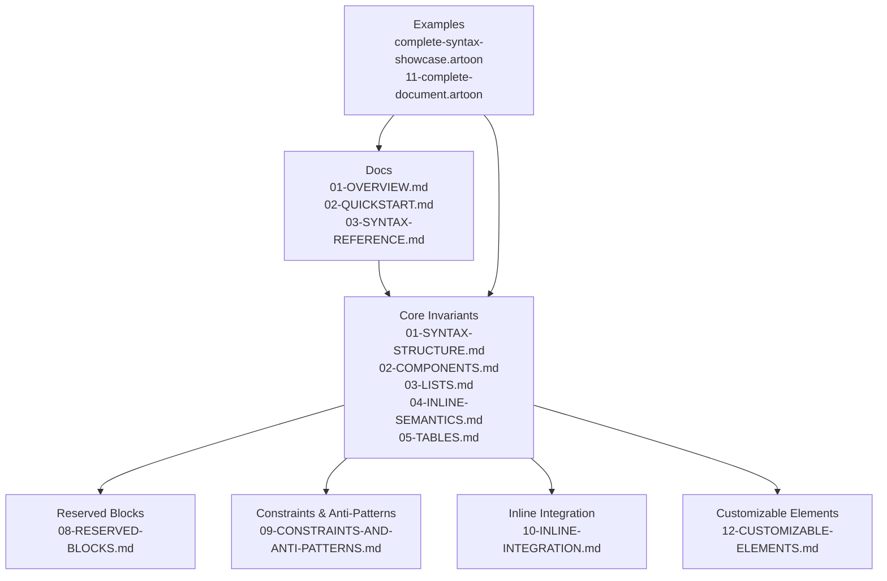
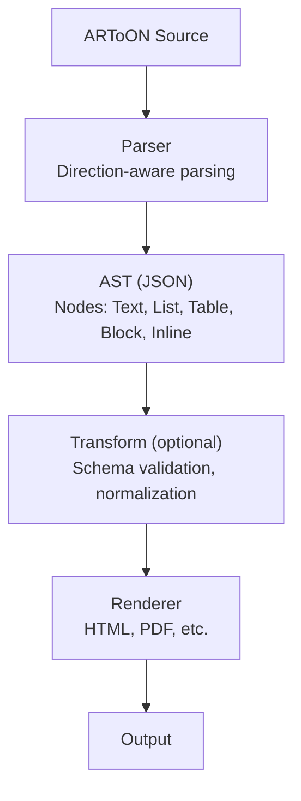
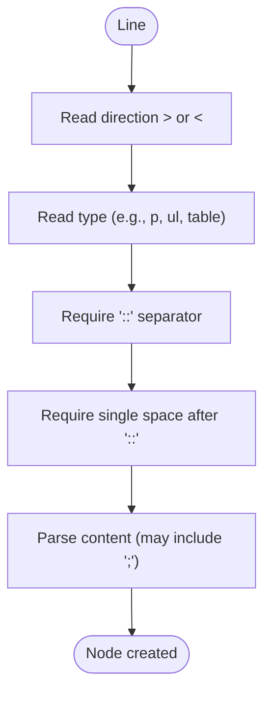
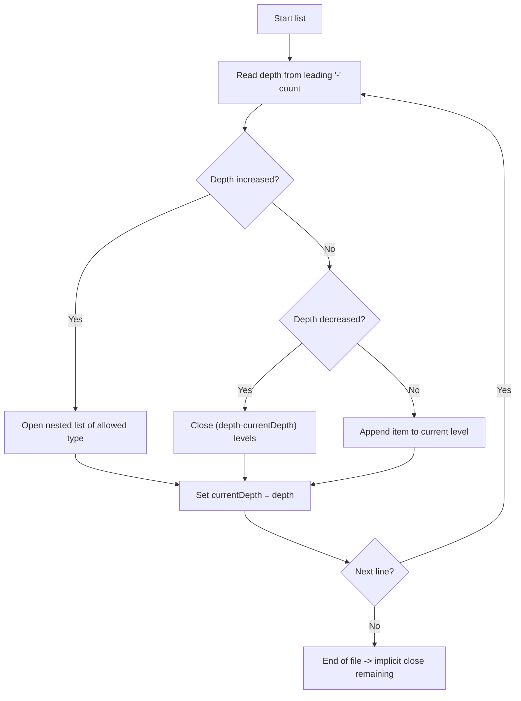
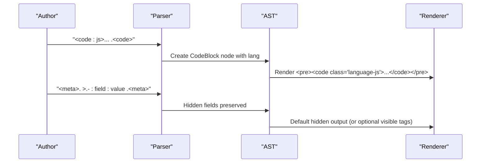
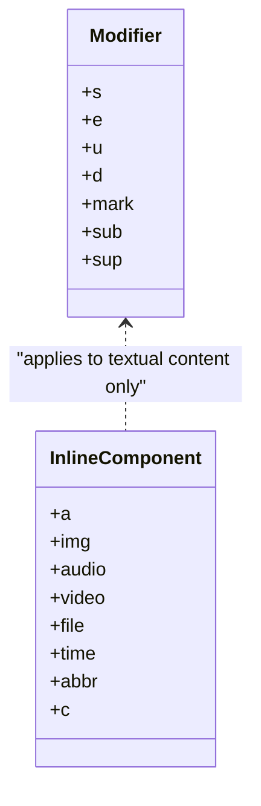
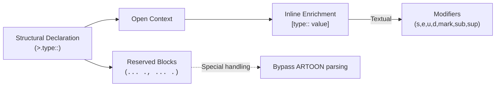

# Syntax Reference

<cite>
**Referenced Files in This Document**
- [01-SYNTAX-STRUCTURE.md](file://Core%20Invariants/01-SYNTAX-STRUCTURE.md)
- [02-COMPONENTS.md](file://Core%20Invariants/02-COMPONENTS.md)
- [03-LISTS.md](file://Core%20Invariants/03-LISTS.md)
- [04-INLINE-SEMANTICS.md](file://Core%20Invariants/04-INLINE-SEMANTICS.md)
- [05-TABLES.md](file://Core%20Invariants/05-TABLES.md)
- [08-RESERVED-BLOCKS.md](file://Core%20Invariants/08-RESERVED-BLOCKS.md)
- [09-CONSTRAINTS-AND-ANTI-PATTERNS.md](file://Core%20Invariants/09-CONSTRAINTS-AND-ANTI-PATTERNS.md)
- [10-INLINE-INTEGRATION.md](file://Core%20Invariants/10-INLINE-INTEGRATION.md)
- [12-CUSTOMIZABLE-ELEMENTS.md](file://Core%20Invariants/12-CUSTOMIZABLE-ELEMENTS.md)
- [03-SYNTAX-REFERENCE.md](file://docs/03-SYNTAX-REFERENCE.md)
- [01-OVERVIEW.md](file://docs/01-OVERVIEW.md)
- [02-QUICKSTART.md](file://docs/02-QUICKSTART.md)
- [06-EXAMPLES.md](file://docs/06-EXAMPLES.md)
- [07-FAQ.md](file://docs/07-FAQ.md)
- [complete-syntax-showcase.artoon](file://artoon-examples/complete-syntax-showcase.artoon)
- [11-complete-document.artoon](file://samples/11-complete-document.artoon)
</cite>

## Table of Contents
1. [Introduction](#introduction)
2. [Project Structure](#project-structure)
3. [Core Components](#core-components)
4. [Architecture Overview](#architecture-overview)
5. [Detailed Component Analysis](#detailed-component-analysis)
6. [Dependency Analysis](#dependency-analysis)
7. [Performance Considerations](#performance-considerations)
8. [Troubleshooting Guide](#troubleshooting-guide)
9. [Conclusion](#conclusion)
10. [Appendices](#appendices)

## Introduction
This Syntax Reference documents the complete ARTOON 2.0 syntax for building bidirectional, semantically rich content. It covers block syntax, inline formatting, component properties, reserved blocks, and direction-aware text processing for RTL/LTR languages. It also explains hierarchical content organization, metadata handling, and integration patterns, with examples and best practices to ensure maintainable ARTOON content.

## Project Structure
The ARTOON syntax is defined across core invariant documents and practical examples:
- Syntax structure and directionality
- Core component types (text, lists, tables, media, advanced blocks)
- Inline semantics and integration rules
- Reserved blocks (code, meta)
- Constraints and anti-patterns
- Customizable elements and presentation separation

**Diagram sources**
- [01-OVERVIEW.md:1-117](file://docs/01-OVERVIEW.md#L1-L117)
- [02-QUICKSTART.md:1-136](file://docs/02-QUICKSTART.md#L1-L136)
- [03-SYNTAX-REFERENCE.md:1-310](file://docs/03-SYNTAX-REFERENCE.md#L1-L310)
- [01-SYNTAX-STRUCTURE.md:1-214](file://Core%20Invariants/01-SYNTAX-STRUCTURE.md#L1-L214)
- [02-COMPONENTS.md:1-315](file://Core%20Invariants/02-COMPONENTS.md#L1-L315)
- [03-LISTS.md:1-249](file://Core%20Invariants/03-LISTS.md#L1-L249)
- [04-INLINE-SEMANTICS.md:1-263](file://Core%20Invariants/04-INLINE-SEMANTICS.md#L1-L263)
- [05-TABLES.md:1-135](file://Core%20Invariants/05-TABLES.md#L1-L135)
- [08-RESERVED-BLOCKS.md:1-318](file://Core%20Invariants/08-RESERVED-BLOCKS.md#L1-L318)
- [09-CONSTRAINTS-AND-ANTI-PATTERNS.md:1-474](file://Core%20Invariants/09-CONSTRAINTS-AND-ANTI-PATTERNS.md#L1-L474)
- [10-INLINE-INTEGRATION.md:1-389](file://Core%20Invariants/10-INLINE-INTEGRATION.md#L1-L389)
- [12-CUSTOMIZABLE-ELEMENTS.md:1-237](file://Core%20Invariants/12-CUSTOMIZABLE-ELEMENTS.md#L1-L237)
- [complete-syntax-showcase.artoon:1-477](file://artoon-examples/complete-syntax-showcase.artoon#L1-L477)
- [11-complete-document.artoon:1-87](file://samples/11-complete-document.artoon#L1-L87)

**Section sources**
- [01-OVERVIEW.md:1-117](file://docs/01-OVERVIEW.md#L1-L117)
- [02-QUICKSTART.md:1-136](file://docs/02-QUICKSTART.md#L1-L136)
- [03-SYNTAX-REFERENCE.md:1-310](file://docs/03-SYNTAX-REFERENCE.md#L1-L310)

## Core Components
This section enumerates ARTOON’s core component families and their roles.

- Text blocks: paragraphs, headings, quotes, preformatted text
- Structural separators: line break, horizontal rule, word break
- Lists: unordered, ordered, definition lists with nesting via leading hyphens
- Tables: table container with header rows and data rows
- Links and media: generic link, images, videos, audio, files
- Advanced blocks: code blocks, time, abbreviation, meta, link-as-block, details, figures, and custom blocks
- Inline elements: seven modifiers and five inline component types integrated within text

Key properties and behaviors are documented in the Core Invariants.

**Section sources**
- [02-COMPONENTS.md:1-315](file://Core%20Invariants/02-COMPONENTS.md#L1-L315)
- [03-LISTS.md:1-249](file://Core%20Invariants/03-LISTS.md#L1-L249)
- [05-TABLES.md:1-135](file://Core%20Invariants/05-TABLES.md#L1-L135)
- [04-INLINE-SEMANTICS.md:1-263](file://Core%20Invariants/04-INLINE-SEMANTICS.md#L1-L263)
- [08-RESERVED-BLOCKS.md:1-318](file://Core%20Invariants/08-RESERVED-BLOCKS.md#L1-L318)
- [10-INLINE-INTEGRATION.md:1-389](file://Core%20Invariants/10-INLINE-INTEGRATION.md#L1-L389)

## Architecture Overview
The ARTOON pipeline transforms source text into an AST and renders to various outputs (HTML, etc.). Direction is declared per line; content is parsed into semantic nodes; inline elements enrich text without introducing structural nesting.

**Diagram sources**
- [01-OVERVIEW.md:37-43](file://docs/01-OVERVIEW.md#L37-L43)
- [02-QUICKSTART.md:44-74](file://docs/02-QUICKSTART.md#L44-L74)
- [01-SYNTAX-STRUCTURE.md:38-46](file://Core%20Invariants/01-SYNTAX-STRUCTURE.md#L38-L46)

**Section sources**
- [01-OVERVIEW.md:37-43](file://docs/01-OVERVIEW.md#L37-L43)
- [02-QUICKSTART.md:44-74](file://docs/02-QUICKSTART.md#L44-L74)

## Detailed Component Analysis

### Direction and Line Structure
- Every line starts with a directional marker: > for RTL, < for LTR.
- Standard line form: {direction}.{type}:: {content}
- Safe content separator :: prevents conflicts with internal punctuation.
- Multiple values separated by ; are supported where applicable.
- Hyphen prefixes indicate nesting depth within lists and similar contexts.

**Diagram sources**
- [01-SYNTAX-STRUCTURE.md:7-34](file://Core%20Invariants/01-SYNTAX-STRUCTURE.md#L7-L34)
- [01-SYNTAX-STRUCTURE.md:57-74](file://Core%20Invariants/01-SYNTAX-STRUCTURE.md#L57-L74)

**Section sources**
- [01-SYNTAX-STRUCTURE.md:7-34](file://Core%20Invariants/01-SYNTAX-STRUCTURE.md#L7-L34)
- [01-SYNTAX-STRUCTURE.md:57-74](file://Core%20Invariants/01-SYNTAX-STRUCTURE.md#L57-L74)

### Text Blocks
- Paragraphs, headings (t1–t6), quotes, preformatted text
- Properties and HTML mapping documented in Core Components

**Section sources**
- [02-COMPONENTS.md:9-72](file://Core%20Invariants/02-COMPONENTS.md#L9-L72)

### Structural Separators
- br (line break), hr (horizontal rule), wbr (word break)
- No :: required since they carry no content

**Section sources**
- [02-COMPONENTS.md:193-217](file://Core%20Invariants/02-COMPONENTS.md#L193-L217)

### Lists
- ul (unordered), ol (ordered), dl (definition)
- Nesting via leading hyphens; each level increments depth
- Implicit closing on level reduction or new block start
- Direction inherited by list items from container

**Diagram sources**
- [03-LISTS.md:211-225](file://Core%20Invariants/03-LISTS.md#L211-L225)

**Section sources**
- [03-LISTS.md:7-114](file://Core%20Invariants/03-LISTS.md#L7-L114)
- [03-LISTS.md:117-184](file://Core%20Invariants/03-LISTS.md#L117-L184)
- [03-LISTS.md:187-207](file://Core%20Invariants/03-LISTS.md#L187-L207)

### Tables
- table container with optional header rows (th) and data rows (tr)
- Cell values separated by ; (semicolon + space)
- Implicit closing on new block start or end-of-file

**Section sources**
- [05-TABLES.md:20-82](file://Core%20Invariants/05-TABLES.md#L20-L82)
- [05-TABLES.md:86-102](file://Core%20Invariants/05-TABLES.md#L86-L102)

### Links and Media
- Generic link (a), images (img), video (video), audio (audio), file (file)
- Optional parameters separated by ; where supported
- Inline equivalents available for embedding within text

**Section sources**
- [02-COMPONENTS.md:109-190](file://Core%20Invariants/02-COMPONENTS.md#L109-L190)
- [04-INLINE-SEMANTICS.md:60-84](file://Core%20Invariants/04-INLINE-SEMANTICS.md#L60-L84)

### Advanced Blocks
- Code blocks (<code>….<code>) with optional language
- Time and abbreviation blocks
- Meta block for hidden metadata fields
- Link-as-block (a)
- Details (summary + content)
- Figures (media + caption)
- Custom blocks (<name>….<name>)

**Diagram sources**
- [08-RESERVED-BLOCKS.md:32-106](file://Core%20Invariants/08-RESERVED-BLOCKS.md#L32-L106)
- [08-RESERVED-BLOCKS.md:110-201](file://Core%20Invariants/08-RESERVED-BLOCKS.md#L110-L201)

**Section sources**
- [08-RESERVED-BLOCKS.md:32-106](file://Core%20Invariants/08-RESERVED-BLOCKS.md#L32-L106)
- [08-RESERVED-BLOCKS.md:110-201](file://Core%20Invariants/08-RESERVED-BLOCKS.md#L110-L201)
- [02-COMPONENTS.md:220-288](file://Core%20Invariants/02-COMPONENTS.md#L220-L288)

### Inline Formatting and Integration
- Seven modifiers: strong (s), emphasis (e), underline (u), deleted (d), mark (highlight), sub (subscript), sup (superscript)
- Inline components: a, img, audio, video, file, time, abbr, c
- Modifiers apply only to textual content; most inline components are non-textual and do not accept modifiers
- Composition order: modifiers before type; no nesting of inline declarations

**Diagram sources**
- [04-INLINE-SEMANTICS.md:44-56](file://Core%20Invariants/04-INLINE-SEMANTICS.md#L44-L56)
- [04-INLINE-SEMANTICS.md:60-84](file://Core%20Invariants/04-INLINE-SEMANTICS.md#L60-L84)
- [10-INLINE-INTEGRATION.md:143-185](file://Core%20Invariants/10-INLINE-INTEGRATION.md#L143-L185)

**Section sources**
- [04-INLINE-SEMANTICS.md:44-84](file://Core%20Invariants/04-INLINE-SEMANTICS.md#L44-L84)
- [10-INLINE-INTEGRATION.md:143-185](file://Core%20Invariants/10-INLINE-INTEGRATION.md#L143-L185)

### Comments
- Lines starting with >.::: or <.::: are comments and are ignored during parsing
- Multiline comments continue until a new declared component appears

**Section sources**
- [01-SYNTAX-STRUCTURE.md:132-157](file://Core%20Invariants/01-SYNTAX-STRUCTURE.md#L132-L157)

### Bidirectional Text Processing
- Direction markers define reading direction per line
- Mixed-direction text is supported within paragraphs
- Inline components inherit direction from their containing block

**Section sources**
- [01-OVERVIEW.md:29-46](file://docs/01-OVERVIEW.md#L29-L46)
- [03-SYNTAX-REFERENCE.md:3-16](file://docs/03-SYNTAX-REFERENCE.md#L3-L16)

### Metadata Handling
- Meta block stores hidden fields prefixed with >.-:field:
- Common fields include title, description, author, date, tags, language, direction, license, etc.
- Hidden fields are invisible by default in HTML output but can be exposed via configuration

**Section sources**
- [08-RESERVED-BLOCKS.md:110-201](file://Core%20Invariants/08-RESERVED-BLOCKS.md#L110-L201)
- [08-RESERVED-BLOCKS.md:175-186](file://Core%20Invariants/08-RESERVED-BLOCKS.md#L175-L186)

### Customizable Elements and Presentation
- Custom blocks, hidden fields, and comments are preserved with their names
- Default rendering maps names to class names; tag choice is fully customizable
- Presentation differences across environments (editor, website, app) are achieved via CSS/JS/plugins

**Section sources**
- [12-CUSTOMIZABLE-ELEMENTS.md:26-96](file://Core%20Invariants/12-CUSTOMIZABLE-ELEMENTS.md#L26-L96)
- [12-CUSTOMIZABLE-ELEMENTS.md:98-104](file://Core%20Invariants/12-CUSTOMIZABLE-ELEMENTS.md#L98-L104)

## Dependency Analysis
The syntax enforces clear separation between structural declarations and inline enrichments:
- Structural declarations open contexts and can host inline enrichments
- Inline declarations do not introduce structural nesting
- Reserved blocks (code, meta) bypass normal ARTOON parsing rules

**Diagram sources**
- [10-INLINE-INTEGRATION.md:33-82](file://Core%20Invariants/10-INLINE-INTEGRATION.md#L33-L82)
- [08-RESERVED-BLOCKS.md:7-28](file://Core%20Invariants/08-RESERVED-BLOCKS.md#L7-L28)

**Section sources**
- [10-INLINE-INTEGRATION.md:33-82](file://Core%20Invariants/10-INLINE-INTEGRATION.md#L33-L82)
- [08-RESERVED-BLOCKS.md:7-28](file://Core%20Invariants/08-RESERVED-BLOCKS.md#L7-L28)

## Performance Considerations
- Prefer structural separators (br/hr/wbr) over empty lines for clarity and minimal overhead
- Keep inline declarations concise; avoid excessive nesting or long parameter lists
- Use reserved blocks for large code segments to prevent ARTOON parsing overhead
- Leverage custom blocks for reusable structures to reduce repetition

## Troubleshooting Guide
Common issues and resolutions:
- Missing space after ::: Ensure exactly one space after the separator
- Misplaced hyphens: Verify nesting depth matches intended hierarchy
- Confusing inline vs structural: Remember inline does not create contexts
- Reserved block misuse: Only code and meta blocks support special handling
- Mixed direction: Place direction marker at the start of each line requiring direction change

**Section sources**
- [01-SYNTAX-STRUCTURE.md:27-34](file://Core%20Invariants/01-SYNTAX-STRUCTURE.md#L27-L34)
- [09-CONSTRAINTS-AND-ANTI-PATTERNS.md:129-145](file://Core%20Invariants/09-CONSTRAINTS-AND-ANTI-PATTERNS.md#L129-L145)
- [08-RESERVED-BLOCKS.md:70-77](file://Core%20Invariants/08-RESERVED-BLOCKS.md#L70-L77)

## Conclusion
ARTOON 2.0 provides a robust, direction-aware syntax for semantic-rich content. By adhering to structural/inline distinctions, respecting reserved blocks, and following constraints, authors can produce maintainable, portable documents that render consistently across environments.

## Appendices

### Quick Syntax Cheatsheet
- Text: >.type:: content
- Separator: >.type
- List: >.ul:: li:: item
- Table: >.table:: th:: a;b;… tr:: 1;2;…
- Media: >.img:: path; alt; title
- Compound: >.figure:: >.-img:: … >.-caption:: …
- Block: <name>. … .<name>
- Inline: [mod:: text], [type:: params]
- Comment: >.:::

**Section sources**
- [03-SYNTAX-REFERENCE.md:277-303](file://docs/03-SYNTAX-REFERENCE.md#L277-L303)

### Examples Index
- Complete showcase: [complete-syntax-showcase.artoon:1-477](file://artoon-examples/complete-syntax-showcase.artoon#L1-L477)
- Full document sample: [11-complete-document.artoon:1-87](file://samples/11-complete-document.artoon#L1-L87)
- Practical examples: [06-EXAMPLES.md:1-257](file://docs/06-EXAMPLES.md#L1-L257)

**Section sources**
- [complete-syntax-showcase.artoon:1-477](file://artoon-examples/complete-syntax-showcase.artoon#L1-L477)
- [11-complete-document.artoon:1-87](file://samples/11-complete-document.artoon#L1-L87)
- [06-EXAMPLES.md:1-257](file://docs/06-EXAMPLES.md#L1-L257)