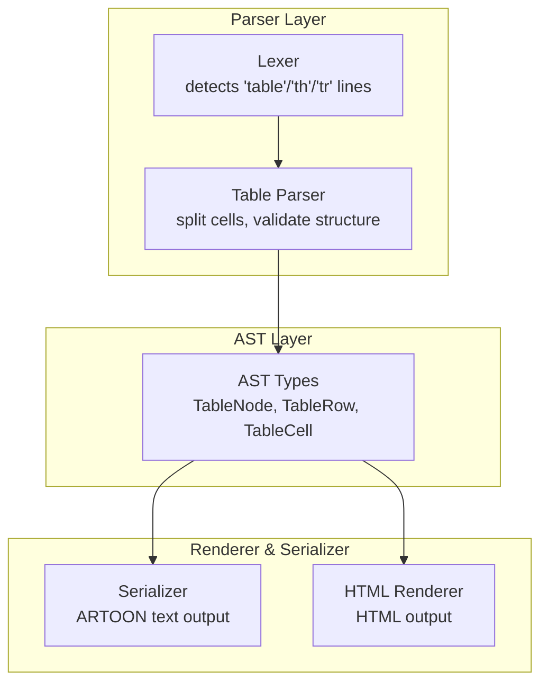
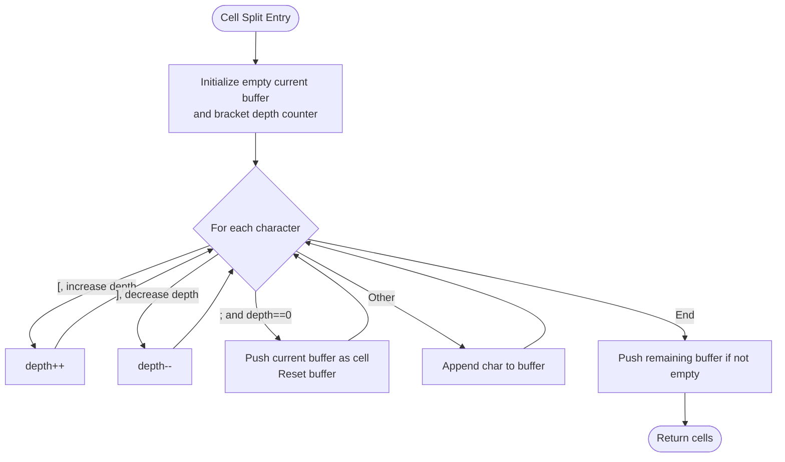
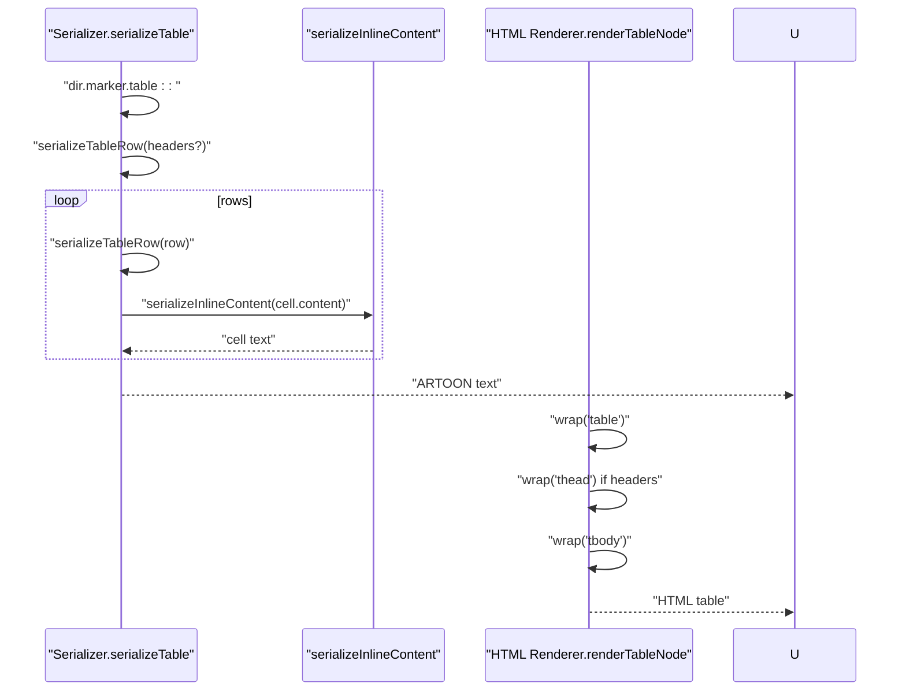
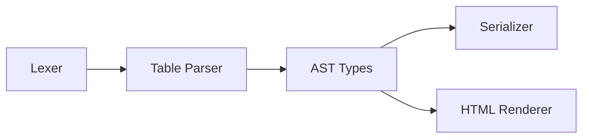

# Table Syntax and Structure

<cite>
**Referenced Files in This Document**
- [05-TABLES.md](file://Core%20Invariants/05-TABLES.md)
- [06-tables.artoon](file://samples/06-tables.artoon)
- [index.ts](file://artoon-parser/src/table/index.ts)
- [index.ts](file://artoon-parser/src/lexer/index.ts)
- [nodes.ts](file://artoon-renderer-html/src/render/nodes.ts)
- [table.ts](file://artoon-serializer/src/nodes/table.ts)
- [content.ts](file://artoon-serializer/src/inline/content.ts)
- [types.ts](file://artoon-ast/src/types.ts)
- [table.ts](file://artoon-editor-state/src/commands/table.ts)
- [table.test.ts](file://artoon-parser/tests/table.test.ts)
- [table.test.ts](file://artoon-serializer/tests/table.test.ts)
</cite>

## Table of Contents
1. [Introduction](#introduction)
2. [Project Structure](#project-structure)
3. [Core Components](#core-components)
4. [Architecture Overview](#architecture-overview)
5. [Detailed Component Analysis](#detailed-component-analysis)
6. [Dependency Analysis](#dependency-analysis)
7. [Performance Considerations](#performance-considerations)
8. [Troubleshooting Guide](#troubleshooting-guide)
9. [Conclusion](#conclusion)
10. [Appendices](#appendices)

## Introduction
This document specifies the ARTOON table syntax and structure, covering cell types, row definitions, header marking, and alignment semantics. It explains how tables are parsed, serialized, and rendered, along with validation rules, cell content restrictions, formatting via inline components, nesting considerations, accessibility notes, and best practices for readable table markup.

## Project Structure
The ARTOON table system spans three layers:
- Parser: recognizes table containers, rows, and cells; validates structure and builds a canonical AST node.
- AST: defines the canonical table node shape with typed rows and cells.
- Renderer and Serializer: convert AST nodes to HTML and ARTOON text respectively.



**Diagram sources**
- [index.ts:1-169](file://artoon-parser/src/table/index.ts#L1-L169)
- [types.ts:224-245](file://artoon-ast/src/types.ts#L224-L245)
- [table.ts:16-55](file://artoon-serializer/src/nodes/table.ts#L16-L55)
- [nodes.ts:264-345](file://artoon-renderer-html/src/render/nodes.ts#L264-L345)

**Section sources**
- [05-TABLES.md:1-135](file://Core%20Invariants/05-TABLES.md#L1-L135)
- [index.ts:1-169](file://artoon-parser/src/table/index.ts#L1-L169)
- [types.ts:224-245](file://artoon-ast/src/types.ts#L224-L245)
- [table.ts:1-56](file://artoon-serializer/src/nodes/table.ts#L1-L56)
- [nodes.ts:264-345](file://artoon-renderer-html/src/render/nodes.ts#L264-L345)

## Core Components
- Table container: identified by a dedicated component type and directive-like syntax.
- Rows: header rows (th) and data rows (tr).
- Cells: separated by a semicolon delimiter; supports inline components and plain text.
- Direction markers: optional direction indicators on the container line.
- Implicit closure: tables close when encountering a new block or end-of-file.

**Section sources**
- [05-TABLES.md:20-114](file://Core%20Invariants/05-TABLES.md#L20-L114)
- [index.ts:100-127](file://artoon-parser/src/table/index.ts#L100-L127)
- [types.ts:240-245](file://artoon-ast/src/types.ts#L240-L245)

## Architecture Overview
The table pipeline follows a predictable flow from text to AST and back to text or HTML.

```mermaid
sequenceDiagram
participant U as "User"
participant L as "Lexer"
participant P as "Table Parser"
participant A as "AST"
participant S as "Serializer"
participant R as "HTML Renderer"
U->>L : ">.table : : " + rows
L-->>P : Tokens for "table"/"th"/"tr"
P->>P : "splitTableCells"; validate headers/rows
P->>A : Build TableNode
A->>S : serializeTable
A->>R : renderTableNode
S-->>U : ARTOON text
R-->>U : HTML table
```

**Diagram sources**
- [index.ts:454-482](file://artoon-parser/src/lexer/index.ts#L454-L482)
- [index.ts:34-94](file://artoon-parser/src/table/index.ts#L34-L94)
- [types.ts:240-245](file://artoon-ast/src/types.ts#L240-L245)
- [table.ts:16-55](file://artoon-serializer/src/nodes/table.ts#L16-L55)
- [nodes.ts:264-345](file://artoon-renderer-html/src/render/nodes.ts#L264-L345)

## Detailed Component Analysis

### Table Syntax and Structure
- Container: the table container is recognized by a specific component type and directive-like line pattern. Direction markers precede the container line when needed.
- Rows:
  - Header row: th:: marks the header row; only one header row is permitted.
  - Data rows: tr:: marks subsequent rows.
- Cells: separated by a semicolon; semicolons inside inline components are safely ignored during cell splitting.
- Closure: implicit; tables close upon encountering a new block or end-of-file.

Examples of supported structures are demonstrated in the samples.

**Section sources**
- [05-TABLES.md:20-114](file://Core%20Invariants/05-TABLES.md#L20-L114)
- [06-tables.artoon:15-60](file://samples/06-tables.artoon#L15-L60)
- [index.ts:34-94](file://artoon-parser/src/table/index.ts#L34-L94)

### Cell Types and Content
- Cell content is typed as inline content arrays, allowing:
  - Plain text
  - Inline components (e.g., links, abbreviations, time, media, code)
- Cell splitting respects nested inline brackets so that semicolons inside inline constructs are not treated as cell delimiters.



**Diagram sources**
- [index.ts:100-127](file://artoon-parser/src/table/index.ts#L100-L127)

**Section sources**
- [index.ts:100-127](file://artoon-parser/src/table/index.ts#L100-L127)
- [content.ts:8-21](file://artoon-serializer/src/inline/content.ts#L8-L21)

### Row Definitions and Alignment Semantics
- Row types:
  - th: header row; appears once at the top.
  - tr: data row; may appear zero or more times.
- Alignment:
  - Tables do not define explicit per-cell alignment directives in the syntax.
  - Direction is inherited from the container and applied to the HTML table element when rendering.

**Section sources**
- [05-TABLES.md:86-102](file://Core%20Invariants/05-TABLES.md#L86-L102)
- [nodes.ts:269-270](file://artoon-renderer-html/src/render/nodes.ts#L269-L270)

### Table Nesting Capabilities
- Tables are block-level constructs. They close implicitly when a new block begins, preventing nested table blocks.
- Inline nesting inside cells is supported via inline components; however, nested brackets are not allowed at the cell level (see validation rules).

**Section sources**
- [05-TABLES.md:96-114](file://Core%20Invariants/05-TABLES.md#L96-L114)
- [constraint.ts:48-72](file://artoon-validator/src/rules/constraint.ts#L48-L72)

### Cell Content Restrictions and Formatting Options
- Allowed:
  - Plain text
  - Inline components with supported attributes per component type
- Not allowed:
  - Nested inline brackets inside a single cell (e.g., [s:: [e:: text]] is invalid)
- Formatting via inline modifiers is supported within cells.

**Section sources**
- [constraint.ts:48-72](file://artoon-validator/src/rules/constraint.ts#L48-L72)
- [content.ts:53-114](file://artoon-serializer/src/inline/content.ts#L53-L114)

### Examples of Complex Table Structures
- Basic table without headers
- Table with headers in Arabic and English
- Table with inline components inside cells (links, abbreviations, emphasis)

These examples demonstrate practical usage patterns and are available in the samples.

**Section sources**
- [06-tables.artoon:15-60](file://samples/06-tables.artoon#L15-L60)

### Serialization and Rendering
- Serializer writes the table container line, followed by header and data rows, joining cells with semicolons and preserving inline content.
- HTML renderer emits a semantic HTML table with thead/tbody and th/td elements, applying direction attributes when needed.



**Diagram sources**
- [table.ts:16-55](file://artoon-serializer/src/nodes/table.ts#L16-L55)
- [content.ts:8-21](file://artoon-serializer/src/inline/content.ts#L8-L21)
- [nodes.ts:264-345](file://artoon-renderer-html/src/render/nodes.ts#L264-L345)

**Section sources**
- [table.ts:16-55](file://artoon-serializer/src/nodes/table.ts#L16-L55)
- [nodes.ts:264-345](file://artoon-renderer-html/src/render/nodes.ts#L264-L345)

### Editor Integration and Commands
- The editor provides commands to insert tables and manipulate rows/columns.
- These commands operate on the AST table node shape and maintain consistent row/column counts.

**Section sources**
- [table.ts:15-57](file://artoon-editor-state/src/commands/table.ts#L15-L57)
- [table.ts:62-99](file://artoon-editor-state/src/commands/table.ts#L62-L99)
- [table.ts:126-160](file://artoon-editor-state/src/commands/table.ts#L126-L160)
- [table.ts:299-337](file://artoon-editor-state/src/commands/table.ts#L299-L337)

## Dependency Analysis
The table system depends on:
- Lexer for recognizing table-related tokens
- Parser for validating structure and building AST
- AST types for canonical representation
- Serializer and Renderer for output generation



**Diagram sources**
- [index.ts:454-482](file://artoon-parser/src/lexer/index.ts#L454-L482)
- [index.ts:1-169](file://artoon-parser/src/table/index.ts#L1-L169)
- [types.ts:224-245](file://artoon-ast/src/types.ts#L224-L245)
- [table.ts:1-56](file://artoon-serializer/src/nodes/table.ts#L1-L56)
- [nodes.ts:264-345](file://artoon-renderer-html/src/render/nodes.ts#L264-L345)

**Section sources**
- [index.ts:454-482](file://artoon-parser/src/lexer/index.ts#L454-L482)
- [index.ts:1-169](file://artoon-parser/src/table/index.ts#L1-L169)
- [types.ts:224-245](file://artoon-ast/src/types.ts#L224-L245)
- [table.ts:1-56](file://artoon-serializer/src/nodes/table.ts#L1-L56)
- [nodes.ts:264-345](file://artoon-renderer-html/src/render/nodes.ts#L264-L345)

## Performance Considerations
- Cell splitting scans each row linearly; complexity is O(n) per row with respect to the number of characters.
- Column count validation ensures early failure on mismatched rows, avoiding unnecessary processing.
- Rendering and serialization operate over the canonical AST, minimizing repeated parsing work.

[No sources needed since this section provides general guidance]

## Troubleshooting Guide
Common issues and resolutions:
- Duplicate headers: only one header row is allowed; subsequent headers produce a structure error.
- Mismatched column counts: rows must match the header count or the first data row’s cell count.
- Nested inline brackets: not allowed inside a single cell; use combined modifiers instead.
- Implicit closure: ensure no new block appears before the table ends if you intend to keep content inside the table.

Validation and error reporting are handled by the parser and validator modules.

**Section sources**
- [table.test.ts:52-60](file://artoon-parser/tests/table.test.ts#L52-L60)
- [table.test.ts:77-86](file://artoon-parser/tests/table.test.ts#L77-L86)
- [constraint.ts:48-72](file://artoon-validator/src/rules/constraint.ts#L48-L72)

## Conclusion
ARTOON tables provide a concise, bracket-aware syntax for structured tabular data. With implicit closure, robust cell splitting, and strong AST typing, the system supports readable markup and reliable rendering. Adhering to validation rules and best practices ensures predictable output and maintainable documents.

[No sources needed since this section summarizes without analyzing specific files]

## Appendices

### Syntax Reference
- Container: directional marker followed by the table component and directive.
- Header row: th:: followed by semicolon-separated cell values.
- Data rows: tr:: followed by semicolon-separated cell values.
- Direction: optional direction indicator on the container line.

**Section sources**
- [05-TABLES.md:20-114](file://Core%20Invariants/05-TABLES.md#L20-L114)

### Accessibility Considerations
- Use th for header cells to convey structural semantics.
- Keep cell content concise and meaningful.
- Prefer plain text or inline components for readability; avoid complex nested constructs inside cells.

**Section sources**
- [nodes.ts:278-297](file://artoon-renderer-html/src/render/nodes.ts#L278-L297)

### Best Practices for Readable Table Markup
- Place headers immediately after the container line.
- Align rows consistently; ensure each row has the same number of cells.
- Use inline components sparingly and combine modifiers when appropriate.
- Keep direction markers consistent with surrounding content.

**Section sources**
- [06-tables.artoon:15-60](file://samples/06-tables.artoon#L15-L60)
- [table.test.ts:71-105](file://artoon-serializer/tests/table.test.ts#L71-L105)