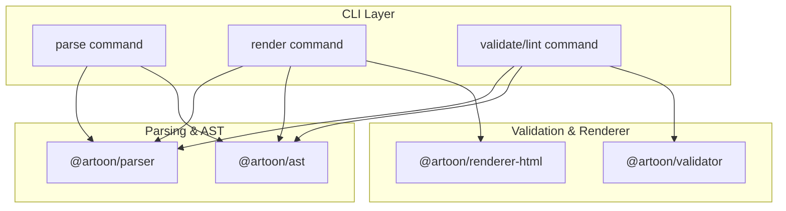
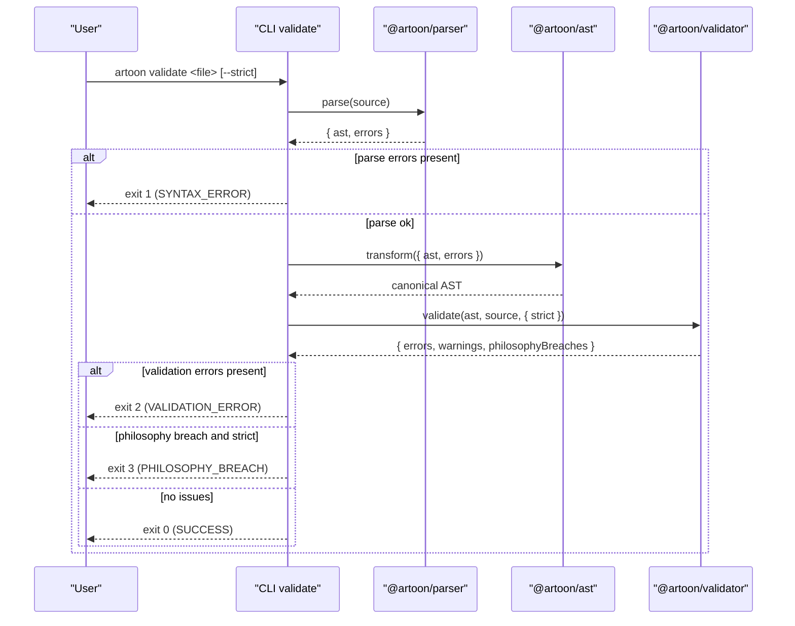
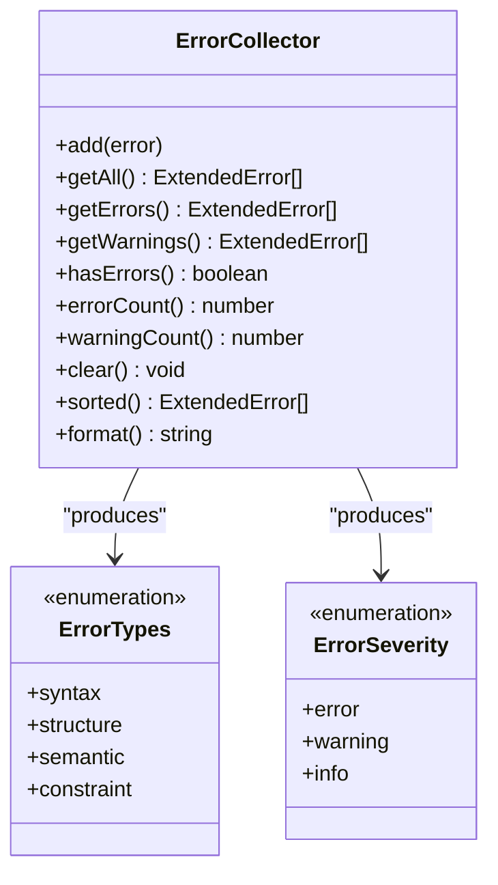
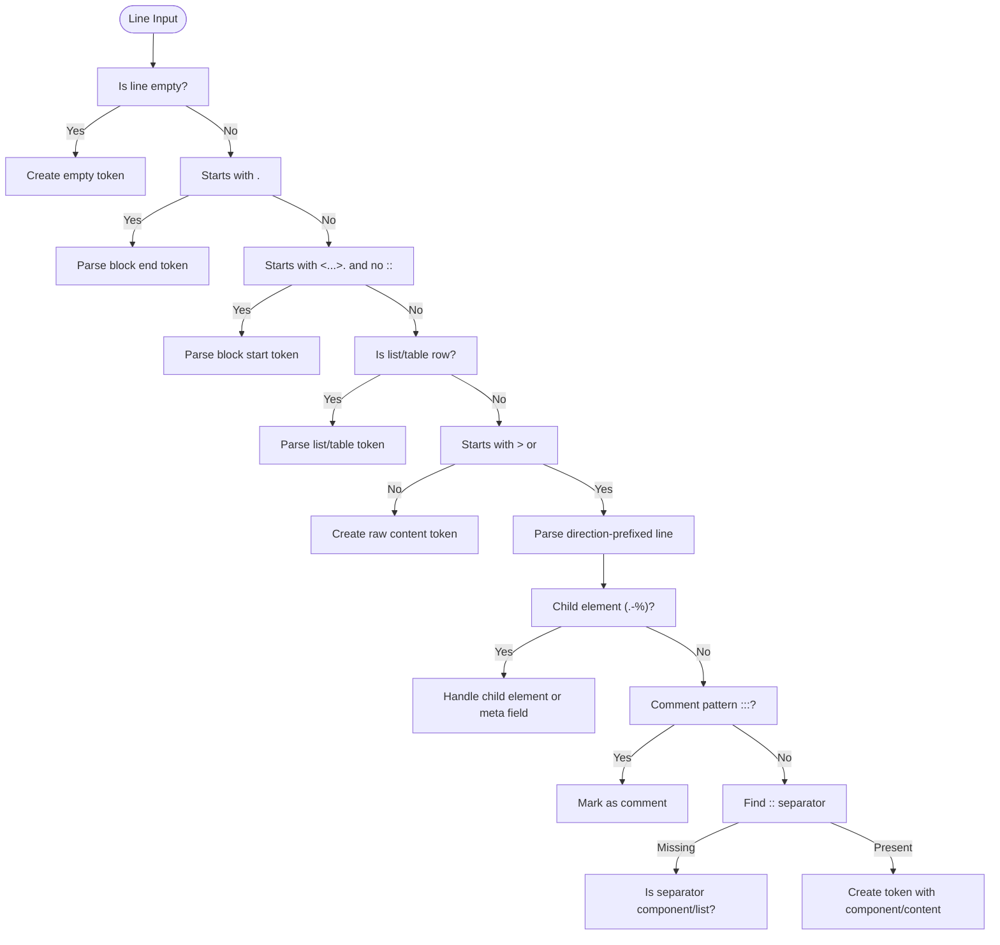
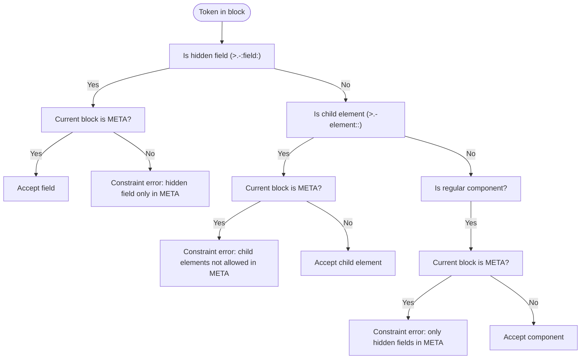
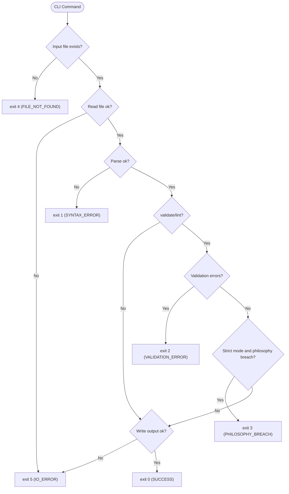
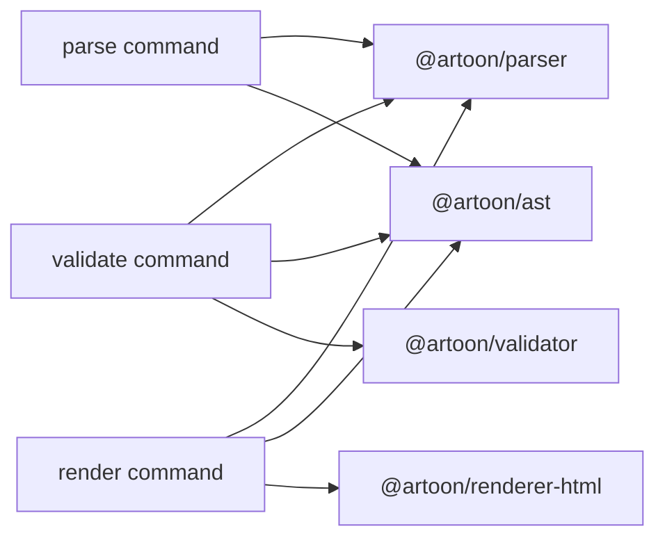
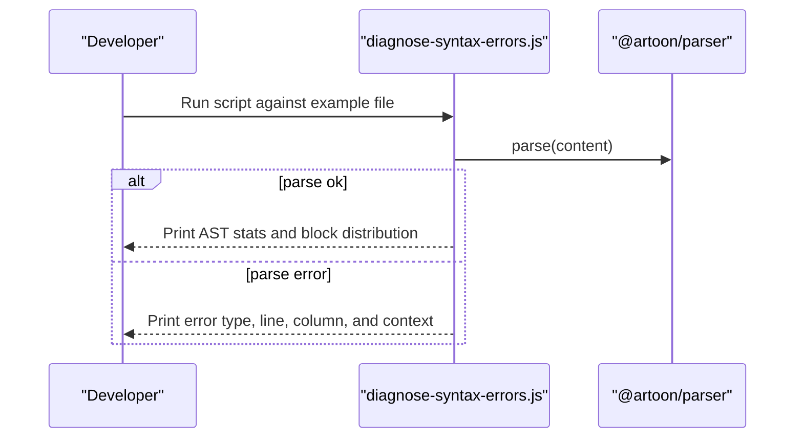

# Troubleshooting and FAQ

<cite>
**Referenced Files in This Document**
- [docs/07-FAQ.md](file://docs/07-FAQ.md)
- [docs/MIGRATION-GUIDE.md](file://docs/MIGRATION-GUIDE.md)
- [docs/05-DEVELOPER-GUIDE.md](file://docs/05-DEVELOPER-GUIDE.md)
- [artoon-cli/inventory_artoon_cli/05-EXIT-CODES.md](file://artoon-cli/inventory_artoon_cli/05-EXIT-CODES.md)
- [artoon-parser/src/errors/index.ts](file://artoon-parser/src/errors/index.ts)
- [artoon-validator/src/errors/index.ts](file://artoon-validator/src/errors/index.ts)
- [artoon-parser/src/lexer/index.ts](file://artoon-parser/src/lexer/index.ts)
- [artoon-parser/src/block/index.ts](file://artoon-parser/src/block/index.ts)
- [artoon-cli/src/commands/parse.ts](file://artoon-cli/src/commands/parse.ts)
- [artoon-cli/src/commands/render.ts](file://artoon-cli/src/commands/render.ts)
- [artoon-cli/src/commands/validate.ts](file://artoon-cli/src/commands/validate.ts)
- [scripts/diagnose-syntax-errors.js](file://scripts/diagnose-syntax-errors.js)
</cite>

## Table of Contents
1. [Introduction](#introduction)
2. [Project Structure](#project-structure)
3. [Core Components](#core-components)
4. [Architecture Overview](#architecture-overview)
5. [Detailed Component Analysis](#detailed-component-analysis)
6. [Dependency Analysis](#dependency-analysis)
7. [Performance Considerations](#performance-considerations)
8. [Troubleshooting Guide](#troubleshooting-guide)
9. [Conclusion](#conclusion)
10. [Appendices](#appendices)

## Introduction
This document provides comprehensive troubleshooting and FAQ guidance for ARTOON 2.0. It covers parsing errors, validation failures, rendering problems, migration issues, environment-specific concerns, and operational best practices. It also includes systematic debugging approaches, error message references, diagnostic tools, logging strategies, and guidance for reporting issues and requesting features.

## Project Structure
The ARTOON ecosystem is organized around modular packages that handle parsing, AST transformation, validation, serialization, rendering, and CLI orchestration. The CLI integrates these packages and exposes standardized exit codes for automation and CI/CD.

**Diagram sources**
- [artoon-cli/src/commands/parse.ts:1-66](file://artoon-cli/src/commands/parse.ts#L1-L66)
- [artoon-cli/src/commands/render.ts:1-63](file://artoon-cli/src/commands/render.ts#L1-L63)
- [artoon-cli/src/commands/validate.ts:1-150](file://artoon-cli/src/commands/validate.ts#L1-L150)

**Section sources**
- [docs/05-DEVELOPER-GUIDE.md:1-266](file://docs/05-DEVELOPER-GUIDE.md#L1-L266)

## Core Components
- Parser: Tokenizes input, detects syntax and structural issues, and produces an AST plus errors.
- Validator: Enforces semantic and philosophy rules, categorizing issues as errors, warnings, or philosophy breaches.
- Renderer: Translates the canonical AST into HTML with configurable meta handling modes.
- CLI: Orchestrates parse, transform, validate, and render operations with standardized exit codes.

**Section sources**
- [artoon-parser/src/errors/index.ts:1-265](file://artoon-parser/src/errors/index.ts#L1-L265)
- [artoon-validator/src/errors/index.ts:1-80](file://artoon-validator/src/errors/index.ts#L1-L80)
- [artoon-cli/inventory_artoon_cli/05-EXIT-CODES.md:1-239](file://artoon-cli/inventory_artoon_cli/05-EXIT-CODES.md#L1-L239)

## Architecture Overview
The CLI commands coordinate the pipeline: parse → transform → validate/render. Errors are collected and surfaced with structured messages and suggestions. Exit codes ensure deterministic automation outcomes.

**Diagram sources**
- [artoon-cli/src/commands/validate.ts:22-149](file://artoon-cli/src/commands/validate.ts#L22-L149)
- [artoon-parser/src/errors/index.ts:53-132](file://artoon-parser/src/errors/index.ts#L53-L132)
- [artoon-validator/src/errors/index.ts:8-28](file://artoon-validator/src/errors/index.ts#L8-L28)

## Detailed Component Analysis

### Parser Error Model and Classification
The parser defines error categories and severity, and provides helpers to collect and format errors. Common error families include syntax, structure, semantic, and constraint violations.

**Diagram sources**
- [artoon-parser/src/errors/index.ts:156-247](file://artoon-parser/src/errors/index.ts#L156-L247)

**Section sources**
- [artoon-parser/src/errors/index.ts:27-48](file://artoon-parser/src/errors/index.ts#L27-L48)
- [artoon-parser/src/errors/index.ts:53-132](file://artoon-parser/src/errors/index.ts#L53-L132)

### Lexer and Tokenization Rules
The lexer converts each line into a token, enforcing direction markers, separators, block start/end, comments, and child element formats. It also recognizes list and table row patterns.

**Diagram sources**
- [artoon-parser/src/lexer/index.ts:10-277](file://artoon-parser/src/lexer/index.ts#L10-L277)

**Section sources**
- [artoon-parser/src/lexer/index.ts:10-277](file://artoon-parser/src/lexer/index.ts#L10-L277)

### Block Handling and META Constraints
Blocks are handled with reserved names and special semantics. META blocks accept only hidden fields and are stored separately in the AST. CODE blocks preserve raw content. Validators enforce META-only-hidden-fields and hidden-field-inside-META constraints.

**Diagram sources**
- [artoon-parser/src/block/index.ts:241-316](file://artoon-parser/src/block/index.ts#L241-L316)

**Section sources**
- [artoon-parser/src/block/index.ts:12-14](file://artoon-parser/src/block/index.ts#L12-L14)
- [artoon-parser/src/block/index.ts:258-316](file://artoon-parser/src/block/index.ts#L258-L316)

### CLI Exit Codes Contract
The CLI defines a stable contract for exit codes across commands, enabling robust automation and CI/CD integration.

**Diagram sources**
- [artoon-cli/inventory_artoon_cli/05-EXIT-CODES.md:78-134](file://artoon-cli/inventory_artoon_cli/05-EXIT-CODES.md#L78-L134)

**Section sources**
- [artoon-cli/inventory_artoon_cli/05-EXIT-CODES.md:16-25](file://artoon-cli/inventory_artoon_cli/05-EXIT-CODES.md#L16-L25)
- [artoon-cli/inventory_artoon_cli/05-EXIT-CODES.md:46-73](file://artoon-cli/inventory_artoon_cli/05-EXIT-CODES.md#L46-L73)

## Dependency Analysis
- CLI depends on parser, AST transformer, validator, and renderer.
- Parser depends on lexer and error utilities.
- Validator depends on error templates and codes.
- Renderer depends on AST structure and HTML mapping.

**Diagram sources**
- [artoon-cli/src/commands/validate.ts:1-150](file://artoon-cli/src/commands/validate.ts#L1-L150)
- [artoon-cli/src/commands/parse.ts:1-66](file://artoon-cli/src/commands/parse.ts#L1-L66)
- [artoon-cli/src/commands/render.ts:1-63](file://artoon-cli/src/commands/render.ts#L1-L63)

**Section sources**
- [artoon-cli/src/commands/validate.ts:1-150](file://artoon-cli/src/commands/validate.ts#L1-L150)
- [artoon-cli/src/commands/parse.ts:1-66](file://artoon-cli/src/commands/parse.ts#L1-L66)
- [artoon-cli/src/commands/render.ts:1-63](file://artoon-cli/src/commands/render.ts#L1-L63)

## Performance Considerations
- Prefer streaming or chunked processing for very large documents.
- Minimize repeated parsing by caching intermediate results when feasible.
- Use compact JSON output in CLI for reduced I/O overhead.
- Avoid unnecessary transformations when only validating.

[No sources needed since this section provides general guidance]

## Troubleshooting Guide

### Systematic Debugging Approaches
- Parse-first diagnostics: Use the CLI parse command to detect syntax errors and report line numbers.
- Roundtrip testing: Parse → Serialize → Parse to verify fidelity.
- Scripted diagnosis: Use the provided diagnostic script to analyze a file and show contextual lines around errors.

**Diagram sources**
- [scripts/diagnose-syntax-errors.js:31-96](file://scripts/diagnose-syntax-errors.js#L31-L96)

**Section sources**
- [scripts/diagnose-syntax-errors.js:1-97](file://scripts/diagnose-syntax-errors.js#L1-L97)
- [docs/05-DEVELOPER-GUIDE.md:190-201](file://docs/05-DEVELOPER-GUIDE.md#L190-L201)

### Error Message Reference and Resolution Steps
- Parser error types and severity: Use the error collector to sort and format errors for display.
- Validation error templates: Use predefined templates keyed by error codes to explain “what,” “why,” and suggested actions.
- CLI exit code mapping: Interpret exit codes to quickly diagnose failure domains.

Resolution steps:
- Syntax errors: Fix missing spaces after separators, unclosed brackets, mismatched block endings, invalid direction markers, or invalid modifiers.
- Structural errors: Ensure proper nesting and matching block ends.
- Semantic errors: Remove modifiers on unsupported components (e.g., media).
- Constraint errors: Restrict hidden fields to META blocks and ensure META blocks contain only hidden fields.

**Section sources**
- [artoon-parser/src/errors/index.ts:252-265](file://artoon-parser/src/errors/index.ts#L252-L265)
- [artoon-validator/src/errors/index.ts:33-79](file://artoon-validator/src/errors/index.ts#L33-L79)
- [artoon-cli/inventory_artoon_cli/05-EXIT-CODES.md:16-25](file://artoon-cli/inventory_artoon_cli/05-EXIT-CODES.md#L16-L25)

### Migration Issues and Compatibility
- META block reservation: META blocks now store only hidden fields and are accessed via document.meta.
- Hidden fields restriction: Hidden fields (>.-:field:) are allowed only inside META blocks.
- Renderer modes: Choose hide/tags/comment modes for META handling.
- CLI validation strictness: Philosophy breaches produce exit code 3 only under strict mode.

Migration checklist:
- Identify META blocks and convert content to hidden fields.
- Move non-metadata content to custom blocks or regular child elements.
- Update AST access to use document.meta.
- Test with parse, validate, and roundtrip checks.
- Adjust renderer options if needed.

**Section sources**
- [docs/MIGRATION-GUIDE.md:15-175](file://docs/MIGRATION-GUIDE.md#L15-L175)
- [docs/MIGRATION-GUIDE.md:178-244](file://docs/MIGRATION-GUIDE.md#L178-L244)
- [docs/MIGRATION-GUIDE.md:312-357](file://docs/MIGRATION-GUIDE.md#L312-L357)
- [docs/MIGRATION-GUIDE.md:360-377](file://docs/MIGRATION-GUIDE.md#L360-L377)

### Environment-Specific Issues and Build Problems
- Development setup: Install dependencies per package and build in order.
- Testing: Run unit and integration tests for targeted modules.
- Editor integration: Use the VS Code extension for syntax highlighting and language configuration.

**Section sources**
- [docs/05-DEVELOPER-GUIDE.md:5-34](file://docs/05-DEVELOPER-GUIDE.md#L5-L34)
- [docs/05-DEVELOPER-GUIDE.md:158-201](file://docs/05-DEVELOPER-GUIDE.md#L158-L201)

### Logging Strategies and Monitoring
- CLI human-readable output: Use validate with JSON output for machine parsing.
- Exit code contracts: Integrate exit codes in shell scripts and CI/CD pipelines.
- Developer utilities: Print AST and tokens for deep inspection.

**Section sources**
- [artoon-cli/src/commands/validate.ts:111-139](file://artoon-cli/src/commands/validate.ts#L111-L139)
- [artoon-cli/inventory_artoon_cli/05-EXIT-CODES.md:138-218](file://artoon-cli/inventory_artoon_cli/05-EXIT-CODES.md#L138-L218)
- [docs/05-DEVELOPER-GUIDE.md:244-253](file://docs/05-DEVELOPER-GUIDE.md#L244-L253)

### Frequently Asked Questions
- What is ARTOON and why use it over Markdown?
- How do `>` and `<` differ?
- Why use `::` instead of `:`?
- What is the difference between `pre` and `code`?
- How to write comments?
- How to compose modifiers?
- How to convert ARTOON to HTML?
- How to validate ARTOON files?
- Can I add custom components?
- How to handle errors?
- How to run the editor locally?
- Does the editor support shortcuts?
- How to open existing files?

**Section sources**
- [docs/07-FAQ.md:1-203](file://docs/07-FAQ.md#L1-L203)

### Reporting Bugs and Feature Requests
- Provide a minimal reproduction case.
- Include expected vs. actual behavior.
- Attach relevant code and environment details.
- Use GitHub issues with clear labels.

**Section sources**
- [docs/07-FAQ.md:181-196](file://docs/07-FAQ.md#L181-L196)

## Conclusion
By leveraging the parser’s error model, the validator’s templates, the CLI’s exit code contract, and the diagnostic script, most ARTOON 2.0 issues can be systematically identified and resolved. Follow the migration guide for META-related changes, adopt the recommended logging and CI/CD patterns, and consult the FAQ for common syntax and feature questions.

[No sources needed since this section summarizes without analyzing specific files]

## Appendices

### Appendix A: CLI Commands and Exit Codes
- parse: Exits with success, syntax error, file not found, or I/O error.
- render: Exits with success, syntax error, file not found, or I/O error.
- validate/lint: Exits with success, syntax error, validation error, philosophy breach (strict), file not found, or I/O error.

**Section sources**
- [artoon-cli/src/commands/parse.ts:13-65](file://artoon-cli/src/commands/parse.ts#L13-L65)
- [artoon-cli/src/commands/render.ts:14-62](file://artoon-cli/src/commands/render.ts#L14-L62)
- [artoon-cli/src/commands/validate.ts:22-149](file://artoon-cli/src/commands/validate.ts#L22-L149)
- [artoon-cli/inventory_artoon_cli/05-EXIT-CODES.md:46-73](file://artoon-cli/inventory_artoon_cli/05-EXIT-CODES.md#L46-L73)