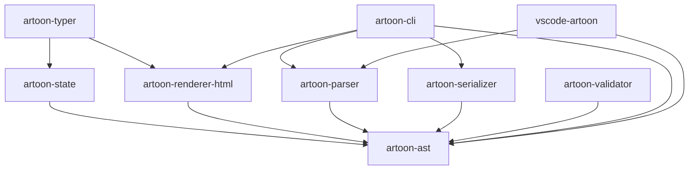

# ARTOON Repository Analysis (Phase 1)

## 1. Dependency Graph (Logical)

## 2. Package Relationships
- **artoon-ast:** The data hub. Shared types for all packages.
- **artoon-parser:** Converts source text to AST. High coupling with AST structure.
- **artoon-serializer:** Reciprocal to parser.
- **artoon-state:** ProseMirror-like state kernel. Central for any interactive editor.
- **artoon-typer:** React implementation of the state kernel.
- **artoon-renderer-html:** Consumption layer for the AST.

## 3. Data Flow (Text to Output)

### A. Parser Flow
1. `Source Text`
2. `Lexer (tokenizeLine)` -> `Token Stream`
3. `AST Builder (processToken)`
4. `Context Stack (nesting management)`
5. `Canonical AST (DocumentNode)`

### B. Rendering Flow
1. `Canonical AST`
2. `Renderer Registry` (Future)
3. `Node Renderers` (Heading, Paragraph, etc.)
4. `Inline Content Renderer` (Text, Links, Media)
5. `Final HTML Output`

### C. State Flow
1. `Canonical AST` -> `DocumentImpl` -> `FragmentImpl`
2. `EditorStateImpl`
3. `Transaction` (Step by Step updates)
4. `Updated AST` -> `Export`
